<h1 align="center">
    
    <br />
    Laboratory work with Kali Linux №10
</h1>

#### In this work, I will do lab #10, applying knowledge of Kali Linux. This work is created for the purpose of educational content, as an assignment for the discipline Operating Systems of the Kyiv College of Communications.

Topic: "Changing file ownership and permissions in Linux. Special directories and files in Linux"

Objectives:
1) Gaining practical skills in working with the Bash command shell.
2) Familiarity with basic actions when changing file owners, file access rights.
3) Introduction to special directories and files in Linux.

---

#### In this article, I'm going to answer questions about the Kali Linux operating system and simply Linux.


## Before we begin, let's consider the following question:

### Purpose of the `id` command:

The `id` command is a basic utility that displays unique user identification information: UID (User ID), GID (Group ID), and all groups to which this user belongs. If no username is specified, then the command displays information about the current user.

This command is used to check access to system resources, configure access rights, and for diagnostics in administration.

In Linux, UID and GID identifiers are stored in the `/etc/passwd` and `/etc/group` files, where `uid` is usually the third field, and `gid` is the fourth. UID values from 0 to 999 are reserved for system users, and from 1000 for regular accounts.

That is, if we need to display user identification information, we can use the following command: `id mayaenjoer`.

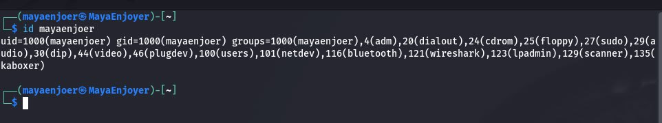

This output means that the user has a unique user identifier (UID) of 1000, and that his primary group is also named `mayaenjoer` and has a GID of 1000. In addition, this user is a member of sixteen additional groups, including `sudo` (which grants permissions to execute administrative commands), `audio` (for accessing sound devices), `video` (for accessing video devices), `plugdev` (for working with removable media), `bluetooth`, `wireshark` (for analyzing network traffic), and others.

Therefore, this command is very useful for checking the current access rights and group membership of a user, which is especially important when configuring permissions, network access, starting services, or setting restrictions, etc.

### Checking the access rights of the file owner:

To see what permissions the owner of a file has, we can use the `ls` command with the `-l` `(long format)` option, this command prints detailed information about a file or directory. So our command would look like this: `ls -l MyMacros.py`.

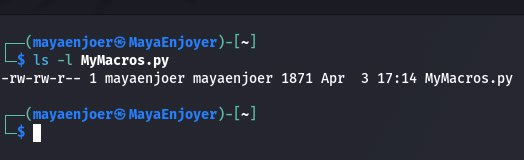

From this output we can see that the file has permissions
`-rw-rw-r--` — this means that:

🟣 The owner of the file `(mayaenjoer)` has the right to read and modify the file `(rw-)`;

🟣 The group `(mayaenjoer)` also has the right to read and modify `(rw-)`;

🟣 Other users can only read this file `(r--)`;

🟣 We can also see that the file was modified on April 3 at 17:14, its size is 1871 bytes, and the file name is `MyMacros.py`.

### Change group owner:

To change the group owner of a file or directory in Linux, we can use the following command: `chgrp <new_group> <file_or_directory>`

It is important to remember that the `chgrp` (change group) command only changes the group that has permissions on the file or directory. It does not change the user owner - that is done with the chown command.

And to view the changes, we can use the following command: `ls -l <file>`.

### View the current file type in the terminal:

To determine the type of a file, we can use the following command: `file <filename>`. This command analyzes the contents of the file, not just its extension, and outputs the actual type (even if the extension is incorrect or missing).

Usage examples:

🟣 To determine the type of a regular text file, we can use the following command: `file mynote.txt`.

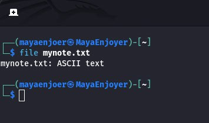

🟣 To determine the type of a Bash script, we can use the following command: `file greeting.sh`.

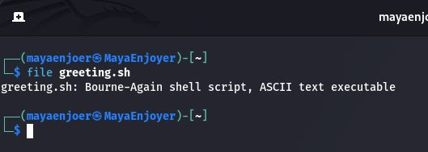

🟣 To determine the type of a binary executable file, we can use the following command: `file file /bin/ls`.

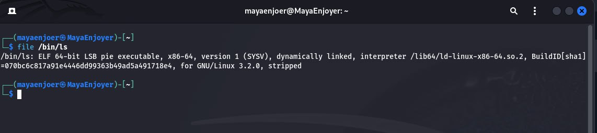

🟣 And to determine the type of image (for example, in my case, PNG), we can use the following command: `file image.png`.

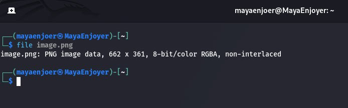

🟣 And to determine the type of a directory, we can use the following command: `file /etc`.

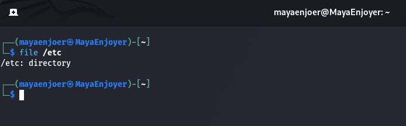

### What are `Setuid` and `Setgid` permissions used for:

In the Linux file system, there is a mechanism that allows access to files and directories based on the rights of the owner, group, and other users. But sometimes there is a need for a program executed by a regular user to work with the rights of an administrator or a member of a certain group. This is what special permissions `Setuid` and `Setgid` exist for.

`Setuid` is a special permission that allows you to run a file not with the rights of the user executing it, but with the rights of the file owner.

For example, let's imagine that we want to change our password. The password change operation involves updating an entry in the system file `/etc/shadow`, which is accessible only to the `root` user. But a regular user does not have such rights, so to allow a user to change only their own password — and not give them full access to all `root` rights, we will use `Setuid`.

`Setgid` is a similar mechanism, but it concerns group rights, and works differently depending on whether it is set on a file or a directory.

When `Setgid` is set on a directory, all files and folders created inside that directory automatically receive the group of that directory, regardless of the user's group. And if `Setgid` is set on an executable file, then when it is run, it is executed with the permissions of the group to which the file belongs.

### `Sticky bit`, and what it is for:

`Sticky Bit` is a special permission in systems that restricts the ability to delete or rename files in a shared directory, even if the user has write permissions to it. `Sticky Bit` provides protection against deletion by other users in directories where many users have write permissions (for example, `/tmp`).
Even if a user has write permission to such a directory, he will only be able to delete his own files, but not files of other users.

In order to use `Sticky Bit`, the first thing we need to do is install it, we can do this with the following commands:
```
sudo mkdir /shared
sudo chmod 1777 /shared
#OR
sudo chmod +t /shared
```

To verify the installation of `Sticky Bit`, we will use the following command: `ls -ld /shared`.

After that, we can use it, for example, we have a typical example `/tmp`, the `/tmp` directory on almost all Linux systems has an active `Sticky Bit`, so our command will look like this: `ls -ld /tmp`, this command allows all users to create files in this directory, but only the owner of the file or `root` can delete or rename it.

#### When is it appropriate to use `Sticky Bit`:

| **Directory**      | **Reason for using Sticky Bit**                                                |
|--------------------|--------------------------------------------------------------------------------|
| `/tmp`, `/var/tmp` | Providing isolation of temporary files of different users.                     |
| `/shared_uploads`  | Common folder for uploading documents/files, without the possibility of theft. |
| `/projects/common` | Teamwork - everyone has access, but cannot delete other people's work.         |

---

### Next, let's work through all the command examples presented in the labs of the NDG Linux Essentials course (Labs 17-18):

| **Command**                         | **Professional explanation**                                                            |
|:------------------------------------|:----------------------------------------------------------------------------------------|
| `chmod`                             | Changes the permissions of files or directories in symbolic or numeric format.          |
| `chown`                             | Changes the owner of a file or directory.                                               |
| `chgrp`                             | Changes the group to which a file or directory belongs.                                 |
| `cd /tmp`                           | Changes to the temporary system directory `/tmp`.                                       |
| `mkdir priv-dir pub-dir`            | Creates two directories: `priv-dir` (private) and `pub-dir` (public).                   |
| `touch priv-dir/priv-file`          | Creates an empty file `priv-file` in the `priv-dir` directory.                          |
| `touch pub-dir/pub-file`            | Creates an empty file `pub-file` in the `pub-dir` directory.                            |
| `ls -l priv-dir`                    | Prints detailed information about the contents of `priv-dir`.                           |
| `ls -l pub-dir`                     | Prints detailed information about the contents of `pub-dir`.                            |
| `ls -la`                            | Shows all files in the current directory, including hidden ones.                        |
| `ls -ld priv-dir/`                  | Shows the permissions of the `priv-dir` directory itself, not its contents.             |
| `chmod o-rx priv-dir/`              | Removes read and execute permissions for other users in `priv-dir`.                     |
| `ls -ld pub-dir/`                   | Shows the permissions for the `pub-dir` directory.                                      |
| `chmod a+w pub-dir/`                | Adds write permission for all user categories in `pub-dir`.                             |
| `chmod g-rw,o-r priv-dir/priv-file` | Removes read and write permissions for group and others in `priv-file`.                 |
| `chmod a-rw pub-dir/pub-file`       | Removes read and write permissions for everyone on `pub-file`.                          |
| `echo "date" > test.sh`             | Creates a file `test.sh` that stores the `date` command.                                |
| `./test.sh`                         | Runs the `test.sh` script.                                                              |
| `ls -1 test.sh`                     | Prints only the file names in a column.                                                 |
| `chmod u+x test.sh`                 | Grants the owner the right to execute the script.                                       |
| `stat test.sh`                      | Displays extended information about the `test.sh` file.                                 |
| `chmod 775 test.sh`                 | Sets `rwxrwxr-x` permissions on `test.sh`.                                              |
| `su -`                              | Switch to another user with full emulation of their environment.                        |
| `chown root:root pub-dir`           | Changes the owner and group of the `pub-dir` directory to `root`.                       |
| `chown bin pub-dir/pub-file`        | Changes the owner of `pub-file` to `bin`.                                               |
| `chgrp -R users priv-dir`           | Recursively changes the group inside `priv-dir` to `users`.                             |
| `ls -ld /tmp`                       | Prints the permissions of the temporary directory `/tmp`.                               |
| `ls -ld /var/tmp`                   | Prints the permissions of `/var/tmp`.                                                   |
| `ls -l /etc/shadow`                 | Prints the permissions of the system password file.                                     |
| `ls -l /usr/bin/passwd`             | Prints details of a password changer, often `setuid`.                                   |
| `ls -l /usr/bin/wall`               | Prints information about a utility for mass messaging users.                            |
| `echo "data" > source`              | Creates a file `source` with the text `data`.                                           |
| `ln -li source`                     | Prints the inode and link to the file (part of creating a hard link).                   |
| `ln source hardlink`                | Creates a hard link to `source`.                                                        |
| `ls -li source hardlink`            | Shows the inodes of both files, which will be the same.                                 |
| `ln hardlink hardlinktwo`           | Creates another hard link to the same file.                                             |
| `rm hardlinktwo`                    | Removes one of the links, but the file will not be deleted as long as the others exist. |
| `rm hardlink`                       | Removes another link, but the file is still not deleted.                                |
| `ls -li source`                     | Shows that the file exists and has fewer links.                                         |
| `ln -s source softlink`             | Creates a symbolic link to `source`.                                                    |
| `ls -li source softlink`            | Prints information about the indexes and target of a symbolic link.                     |
| `ln -s /proc crossdir`              | Creates a symbolic link to the system directory `/proc`.                                |
| `ls -l crossdir`                    | Shows the symbolic link and the target it points to.                                    |

### Next, let's work in the terminal and consolidate the studied material:

<h1 align="center">

    Practical tasks:

</h1>

### Creating three new users:

To create three new users, we need to use the following commands:
```
sudo useradd -m MayaEnjoyer_number_1
sudo useradd -m MayaEnjoyer_number_2
sudo useradd -m MayaEnjoyer_number_3
```

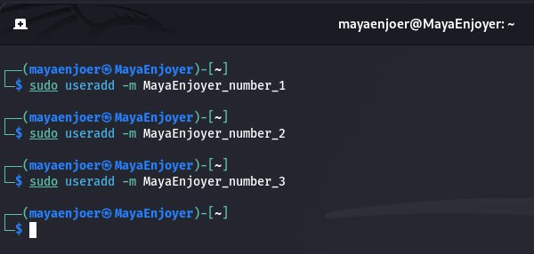

These commands create users, automatically add entries to `/etc/passwd`, and create home directories `/home/MayaEnjoyer_number_X`.

After we have created new users, we need to set user passwords for them, this can be done using the following commands:
```
sudo passwd MayaEnjoyer_number_1
sudo passwd MayaEnjoyer_number_2
sudo passwd MayaEnjoyer_number_3
```

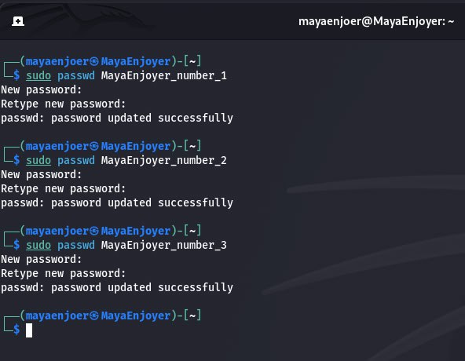

After that, we only have to check that the users have been added, this can be checked using the following command: `grep -E 'MayaEnjoyer_number_1|MayaEnjoyer_number_2|MayaEnjoyer_number_3' /etc/passwd`.

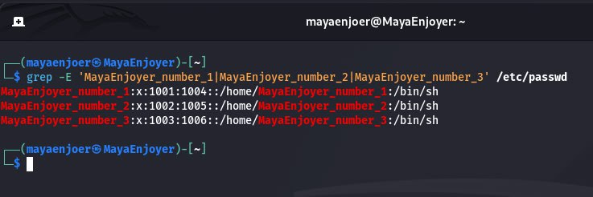

### Creating a new user group and adding users to it:

To create a new group, we will use the following command: `sudo groupadd users_fans`, this command will create a new group named `users_fans`. After executing it, an entry will appear in the `/etc/group` file.

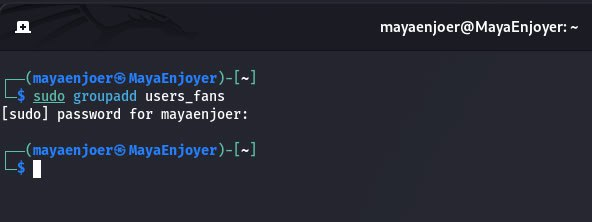

Next, to add two users to the group, we can use the following commands:
```
sudo usermod -aG users_fans MayaEnjoyer_number_1
sudo usermod -aG users_fans MayaEnjoyer_number_2
```

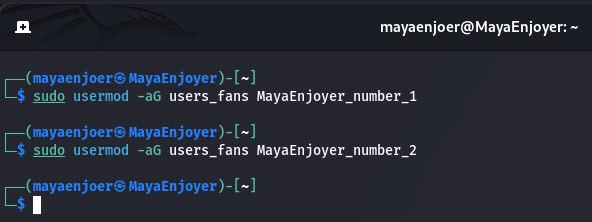

After that, we only have to check who is in the `users_fans` group, we can do this using the following command: `getent group users_fans`.

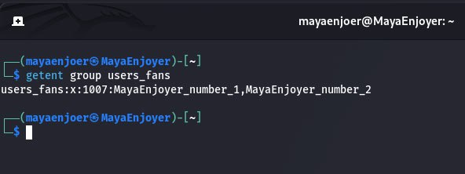

### Creating a new file that is readable, editable, and executable by the file owner:

The first thing we need to do is create a new file, we can do this for example with the following command: `nano wifi_audit.sh`, this command opens the `nano` text editor.

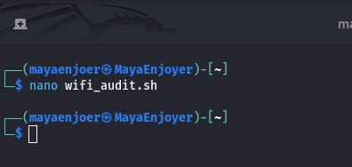

After that, we need to add a simple script inside, let the script be like this:
```
#!/bin/bash

echo "Стартує перевірка Wi-Fi мереж..."
echo

echo "Мережеві інтерфейси:"
nmcli device status
echo

echo "Увімкнення моніторингового режиму (airmon-ng)..."
sudo airmon-ng start wlan0
echo

echo "Запуск сканування Wi-Fi мереж (airodump-ng)..."
echo "Натисніть Ctrl+C через 10–20 секунд для зупинки"
sleep 2
sudo airodump-ng wlan0mon

echo
echo "Вимкнення моніторингового режиму..."
sudo airmon-ng stop wlan0mon
echo

echo "Перевірка завершена."
```

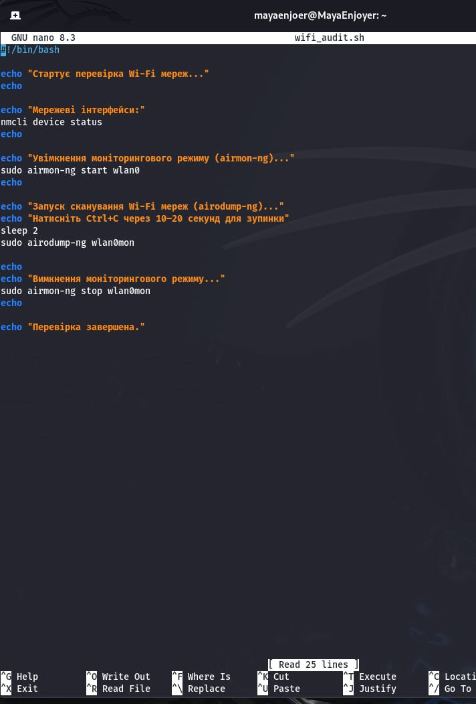

In order to save the file, you need to press `Ctrl + O → Enter`, then `Ctrl + X`.

After that, we need to grant access rights to the file owner, we can do this with the following command: `chmod +x wifi_audit.sh`, this command allows the owner to: read, write, execute the script.

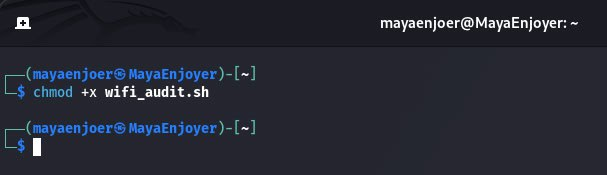

Then, we need to check the access rights, we can do this with the following command: `ls -l wifi_audit.sh`.

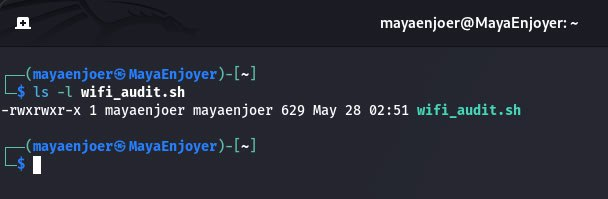

And finally, all we have to do is run the script, we can do this with the following command: `sudo ./wifi_audit.sh`.

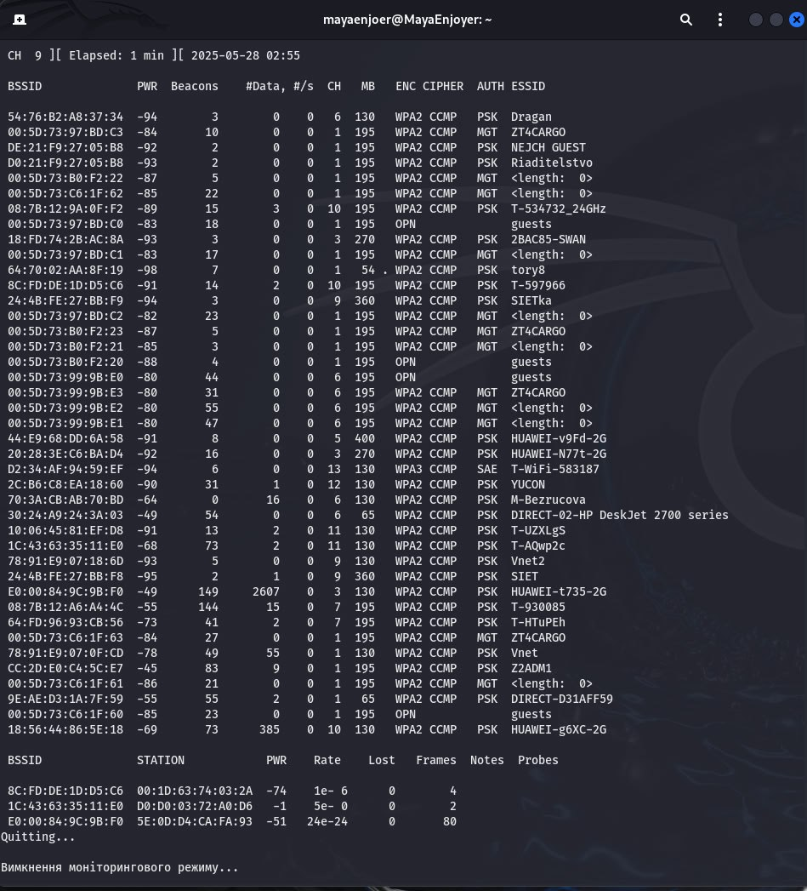

### Granting permission to view and execute (without permission to edit) a file:

In order to grant permission, the first thing we need to do is change the file group to `users_fans`, we can do this using the following command: `sudo chgrp users_fans wifi_audit.sh`, this command changes the group to which the file belongs.

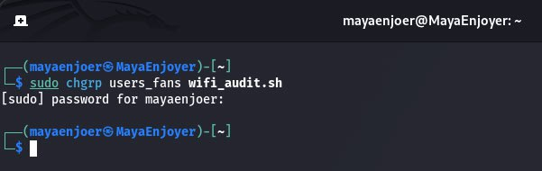

After changing the group, we need to check the result, this can be done using the following command: `ls -l wifi_audit.sh`.

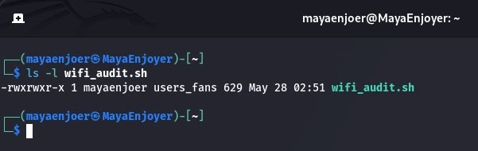

Next, we need to set the access rights, this can be done using the following command: `sudo chmod 750 wifi_audit.sh`, if we decipher the rights, we can see that:

🟣 `7` (owner): r + w + x → full access;

🟣 `5` (group): r + x → read and execute, but not edit;

🟣 `0` (others): no rights.

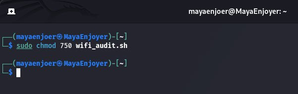

After that, we only need to check the result using the following command: `ls -l wifi_audit.sh`.

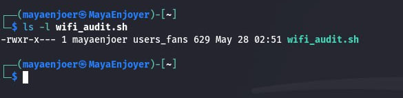

### File access denied:

In order to deny access to other users, we need to use the following command: `sudo chmod o= wifi_audit.sh`, the `o=` parameter is an explicit reset of rights for "others" (other users).

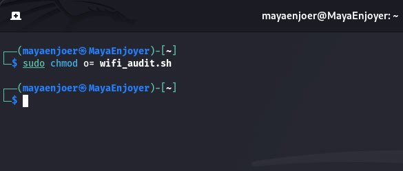

After that, we need to check the result using the following command: `ls -l wifi_audit.sh`.

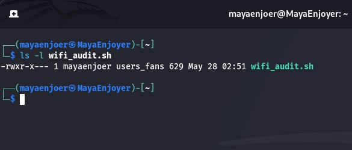

### Creating directories with access rights settings:

To create directories that are accessible to all three users, we can use the following commands:
```
sudo mkdir /home/shared_users_dir
sudo chown root:users_fans /home/shared_users_dir
sudo chmod 770 /home/shared_users_dir
```

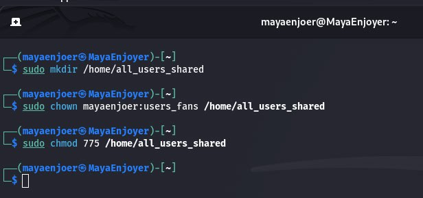

These commands give the owner full access, the group `users_fans` full access, and the user MayaEnjoyer_number_3 read/execute access.

Next, to create a directory that is only accessible to the owner, we can use the following commands:
```
sudo mkdir /home/owner_only
sudo chown mayaenjoer:mayaenjoer /home/owner_only
sudo chmod 700 /home/owner_only
```

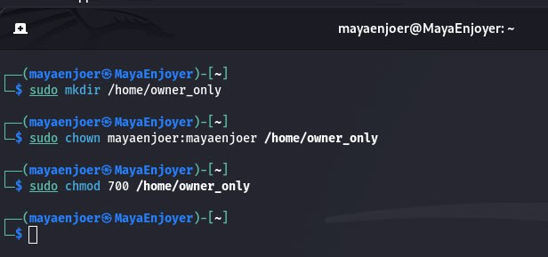

These commands allow the owner `mayaenjoer` to view, modify, or access this directory, and no other user (including users_fans) will have any access.

And to create a directory that can be viewed but not edited by group users, we can use the following commands:
```
sudo mkdir /home/group_readonly
sudo chown mayaenjoer:users_fans /home/group_readonly
sudo chmod 750 /home/group_readonly
```

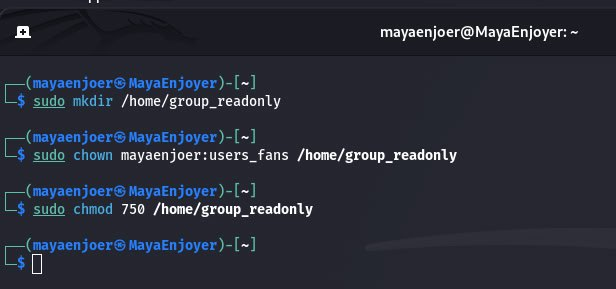

These commands give the owner full access, and the group users_fans can only read and execute.

To check the permissions, we can use the command: `ls -ld /home/*`, this command will show the permissions for each directory in `/home`.

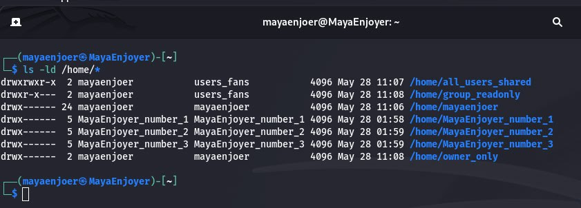

### Creating an empty file and working with it:

The first thing we will do is create a file and reset its permissions, we can do this with the following commands:
```
touch emptyfile
chmod 000 emptyfile
ls -l emptyfile
```

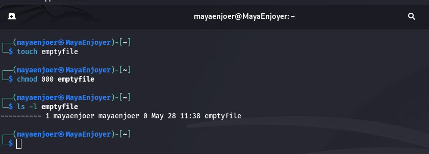

The output shows that no user (owner, group, others) has any permissions on the file.

To pass a single value for `chmod` in numeric mode, namely `chmod 4`, we can use the following commands in the terminal:
```
chmod 4 emptyfile
ls -l emptyfile
```

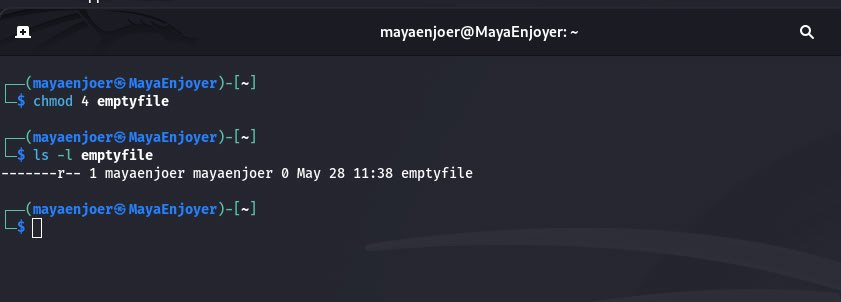

`chmod 4` — is interpreted as 004, i.e.:

🟣 Owner: 0 → no permissions;

🟣 Group: 0 → no permissions;

🟣 Others: 4 → read-only.

Thus, the single number on the left is interpreted as `--- --- X`, where `X` — permissions for "other users".

And to use two numbers, for example `chmod 44`, we can use the following commands:
```
chmod 44 emptyfile
ls -l emptyfile
```

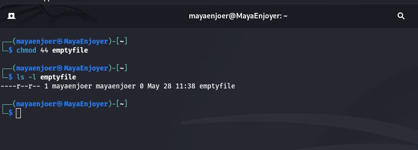

`chmod 44` → interpreted as 044, that is:

🟣 Owner: 0 → no rights;

🟣 Group: 4 → read only;

🟣 Others: 4 → read only.

#### How `chmod` reads numeric values:

| Input value   | Interpretation (`rwx`)   | Explanation                                      |
|---------------|--------------------------|--------------------------------------------------|
| `0`           | `000`                    | No permissions                                   |
| `4`           | `004`                    | Permission only for "others"                     |
| `44`          | `044`                    | Read permission for group and others             |
| `644`         | `rw-r--r--`              | Standard: owner has read+write, others read only |
| `755`         | `rwxr-xr-x`              | Owner: full rights; others read/execute only     |

From this, we can conclude that the `chmod` command in numeric mode works with a three-digit (sometimes four-digit) octal system (base 8). And each digit indicates the rights for:
1) Owner (owner)
2) Group (group)
3) Others (others)

Therefore, if you pass only one or two digits, `chmod` will assume that the missing digits = 0.

### Creating a directory where all files will automatically belong to the user group and can only be deleted by the user:

The first thing we need to do is create a directory, we can do this with the following command: `sudo mkdir /home/group_secure`.

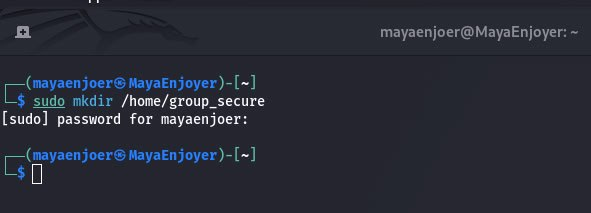

After creating a new directory, we need to set the group, in our case it will be the `users_fans` group, for this we will use the following command: `sudo chgrp users_fans /home/group_secure`, this command changes the group owner of the directory to `users_fans`.

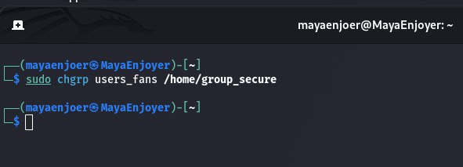

Next we enable `setgid` on the directory, using the following command: `sudo chmod g+s /home/group_secure`.

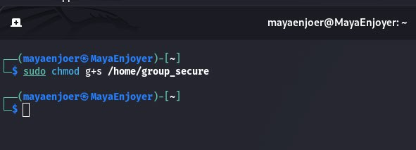

With `setgid (g+s`) - all new directories created inside `/home/group_secure` will automatically inherit the `users_fans` group (even if the user has a different default group).

After that, we need to turn on the "sticky bit", we can do this with the following command: `sudo chmod +t /home/group_secure`, this command allows only the user who created them to delete files, even if other users have write permissions to the directory.

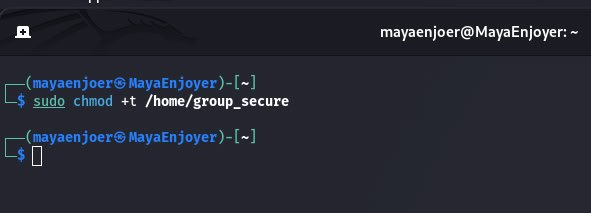

And finally, we are left with only the final value of the permissions, we can do this with the following command: `ls -ld /home/group_secure`.

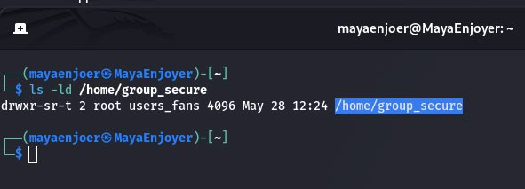

### Creating one new file under each user with a link to it:

In order to create a file under each user, we can use the following commands:
```
sudo -u MayaEnjoyer_number_1 touch /home/MayaEnjoyer_number_1/file1.txt
sudo -u MayaEnjoyer_number_2 touch /home/MayaEnjoyer_number_2/file2.txt
sudo -u MayaEnjoyer_number_3 touch /home/MayaEnjoyer_number_3/file3.txt
```

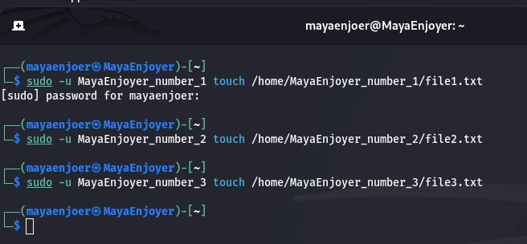

After that, we need to create a hard link, we can do this using the following commands:
```
ln /home/MayaEnjoyer_number_1/file1.txt /home/MayaEnjoyer_number_1/hardlink1
ln /home/MayaEnjoyer_number_2/file2.txt /home/MayaEnjoyer_number_2/hardlink2
ln /home/MayaEnjoyer_number_3/file3.txt /home/MayaEnjoyer_number_3/hardlink3
```


#### A hard link is an additional name for the same inode.

Next, we need to create a symbolic link, which we can do with the following commands:
```
ln -s /home/MayaEnjoyer_number_1/file1.txt /home/MayaEnjoyer_number_1/symlink1
ln -s /home/MayaEnjoyer_number_2/file2.txt /home/MayaEnjoyer_number_2/symlink2
ln -s /home/MayaEnjoyer_number_3/file3.txt /home/MayaEnjoyer_number_3/symlink3
```

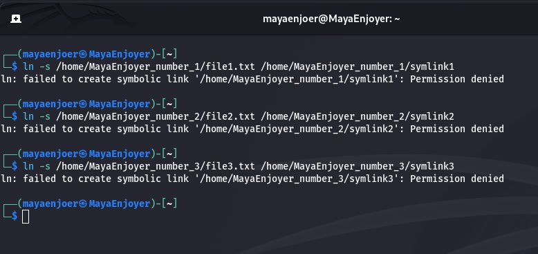

#### A symbolic link is a shortcut that points to the path to a file.

After that, we just have to check the results, and we can do this using the following commands:
```
ls -li /home/MayaEnjoyer_number_1/
ls -li /home/MayaEnjoyer_number_2/
ls -li /home/MayaEnjoyer_number_3/
```

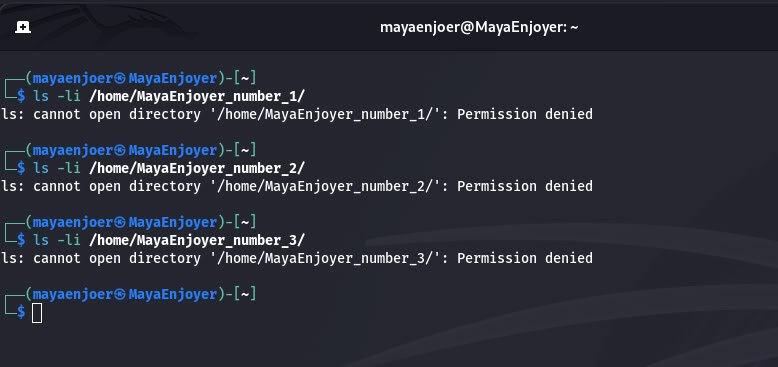

As a result, the file and the hard link will have the same `inode`, and the symbolic link will have its own `inode`, but will point to a different file.

### Attempts by other users to view these files:

To try to view another user's file, we will use the following commands:
```
su - MayaEnjoyer_number_2
cat /home/MayaEnjoyer_number_1/file1.txt
```

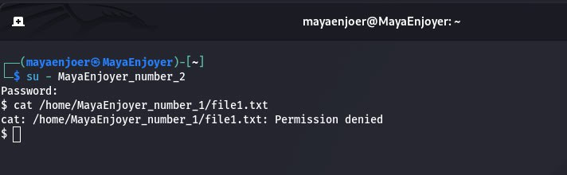

As a result, we will get `cat: Permission denied`, because the user's home directory has permissions 700 (which means that only the owner has access), so others cannot even enter it in the directory.

And to try to view a symbolic link, we can use the following command: `cat /home/all_users_shared/symlink_user1`, as a result, we will get `No such file or directory`, because the symbolic link leads to a closed directory, access to which is prohibited → the file remains inaccessible.

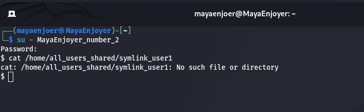

And to try to view a hard link, we can use the following command: `cat /home/all_users_shared/hardlink_user1`, and as a result, we will again get `No such file or directory`, because even though the file is in a public directory, the available permissions are still determined based on the permissions of the file owner. Because if the user does not have `r-permission`, he will not be able to read the file.

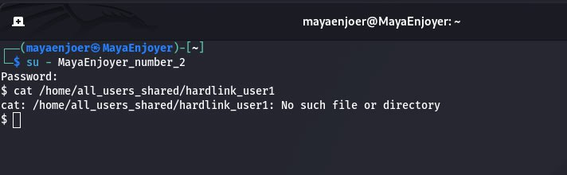

### Attempts by other users to delete these files:

To try to delete a hardlink, we will use the following commands:
```
su - MayaEnjoyer_number_2
rm /home/all_users_shared/hardlink_user1
```

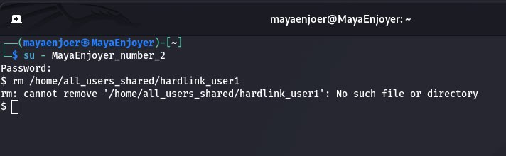

As a result, we will get `No such file or directory`, which means that the user does not have `(w)` write rights in the `/home/all_users_shared` directory, so the system does not allow changing its contents.

And to try to delete a symbolic link, we can use the following command: `rm /home/all_users_shared/symlink_user1`.


As a result, we will get `No such file or directory`, which means that there are no rights to change the directory in which the symbolic link is stored.

And to delete a file directly, we can use the following command: `rm /home/MayaEnjoyer_number_1/file1.txt`.

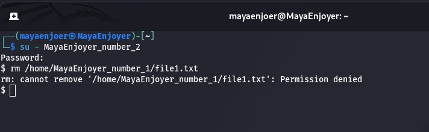

As a result, we will get `Permission denied`, because the system does not even allow us to “enter” this directory, so we cannot perform the deletion operation, regardless of the rights to the file itself.

#### As a result of attempts to delete files or links to them by other users, it was found that the operation ended in an error due to the lack of necessary permissions. This is explained by the fact that in Linux, file deletion is regulated not so much by the access rights to the file itself, but by the rights to the directory in which the file is stored. If a user does not have permission to write to the directory, then even if they have the rights to read or execute the file itself, they will not be able to delete it. This mechanism guarantees the security of files in a multi-user environment, protecting data from accidental or intentional deletion by other users.

---

## Answers to the control questions:

### 1) Give examples of changing access rights using the Symbolic Method?

Symbolic method is a convenient way to change permissions on files or directories using symbols that indicate the user type, action, and type of access.

The command format would look something like this: `chmod [who][operator][permission] file`, where:

#### [who] — the change is applied to:

🟣 u — user;

🟣 g — group;

🟣 o — others;

🟣 a — all users.

#### [operator] — action:

🟣 + — add permission;

🟣 - — remove permission;

🟣 = — set exact permissions.

#### [permission] — permission type:

🟣 r — read;

🟣 w — write;

🟣 x — execute.

#### Examples:

| Command                | Explanation                                                               |
|------------------------|---------------------------------------------------------------------------|
| `chmod u+x script.sh`  | Adds execute permission (`x`) to the **owner** of the file `script.sh`.   |
| `chmod g-w file.txt`   | Removes write permission (`w`) from the **group** of the file `file.txt`. |
| `chmod o=r file.txt`   | Sets **read-only** permission (`r`) for **other** users.                  |
| `chmod a+x file.sh`    | Adds execute permission to **all user categories** (u, g, o).             |
| `chmod ug=rw file.txt` | Sets **read-only** permission for **owner and group**.                    |


In order to change permissions symbolically, we will use the following commands:
```
touch example.txt
chmod u=rw,g=r,o= example.txt
ls -l example.txt
```

### 2) Give examples of changing access rights using the numeric method (numeric method, octal method)?

The numeric method is a way of assigning permissions to files and directories using three or four digits (octal numbers). This method is the fastest and most commonly used.

Each category of users (owner, group, others) gets a single digit that defines their permissions:

| Permission    | Value   |
|---------------|---------|
| `r` (read)    | 4       |
| `w` (write)   | 2       |
| `x` (execute) | 1       |

The sum of the permissions determines the value for each category:

🟣 7 = 4 + 2 + 1 → rwx (read + write + execute)

🟣 6 = 4 + 2 → rw- (read + write)

🟣 5 = 4 + 1 → r-x (read + execute)

🟣 0 = 0 → --- (no access)

And the command format will be as follows: `chmod XYZ file`, where:

- X — owner rights
- Y — group rights
- Z — others rights

#### Examples:

| Command                | Explanation                                                                |
|------------------------|----------------------------------------------------------------------------|
| `chmod 777 file.sh`    | Everyone has full permissions (`rwxrwxrwx`). **UNSAFE for scripts!**       |
| `chmod 755 file.sh`    | Owner has `rwx`, others have `r-x`. Ideal for executable scripts.          |
| `chmod 644 file.txt`   | Owner can read and write, others can only read. Typical for text files.    |
| `chmod 700 secret.txt` | Only the owner has full permissions. Others have no access.                |
| `chmod 600 config.ini` | Only the owner can read and write. Most often for private configs.         |
| `chmod 444 file.txt`   | Everyone can only read. No ability to modify.                              |
| `chmod 000 file.txt`   | The file is **fully private** to everyone (even the owner without `sudo`). |

To change the permissions numerically, we will use the following commands:
```
touch myfile.txt
chmod 640 myfile.txt
ls -l myfile.txt
```

### 3) Purpose of the `umask` command:

The `umask` command sets the file creation mode mask in the current shell environment to the value specified by the mode operand. This mask affects the initial value of the permission bits of all subsequently created files. The syntax of the `umask` command is `umask [-p] [-S] [mode]`. The user-defined file creation mode mask is set to the specified octal value. The three octal digits correspond to the read/write/execute permissions for the owner, group members, and others, respectively. The value of each digit specified in the mask is subtracted from the corresponding "digit" determined by the system when the file was created. For example, umask 022 removes write permissions for group members and others (for files created with mode 777, it becomes 755; and mode 666 becomes 644). If the mask is not specified, its current value is returned:
```
$ umask
0022
```

or the same in symbolic mode:

```
$ umask -S
u=rwx,g=rx,o=rx
```

### 4) Comparison of hard and symbolic links:

#### Comparison table:

| **Criteria**                                    | **Hard link**                                                                                                                 | **Symbolic link (symlink)**                                                                                                                 |
|-------------------------------------------------|-------------------------------------------------------------------------------------------------------------------------------|---------------------------------------------------------------------------------------------------------------------------------------------|
| **Target**                                      | An alternative name for a file that points directly to the same index descriptor (inode) in the file system.                  | A link to a path to another file or directory, implemented as a separate special file.                                                      |
| **Inode descriptor**                            | Shared with the original file. Each hard link uses the same inode, so it is a true "duplicate" of the file.                   | Has its own inode, which contains only the path to the target object. The source file itself is not part of the file structure of the link. |
| **Object type**                                 | Is considered a regular file. When viewed with `ls -l`, it is indistinguishable from the original file.                       | It has a special type, which can be recognized by the letter `l` at the beginning of the `ls -l` command output.                            |
| **Ability to cross file systems**               | It is not possible to create a hard link between files located on different file systems or partitions.                       | Can be created to a file located on a different partition or even on a network file system.                                                 |
| **Persistence when deleting the original file** | A hard link retains access to the data even if the source file is deleted (since the inode is still in use).                  | A symbolic link will become a "broken link" and point to a non-existent object if the target file is moved or deleted.                      |
| **Ability to create for directories**           | Creating hard links for directories is prohibited for regular users due to the risk of creating circular structures.          | You can create symbolic links to directories without restrictions.                                                                          |
| **Editing via link**                            | Any editing via a hard link actually changes the contents of the file, as it is the same inode.                               | If the symbolic link correctly points to the file, the changes also occur on the original file.                                             |
| **Removing a link**                             | Only the filename is removed. If there are other hard links to the same inode, the data remains accessible.                   | Only the file-link is removed. The underlying object is not removed or changed.                                                             |
| **Disk usage**                                  | Uses virtually no additional disk space, as only a new entry with the same inode is created.                                  | Uses disk space to store metadata (a separate file containing the path to the target).                                                      |
| **Create commands**                             | Created with `ln file1 hardlink`, where `file1` is the original file.                                                         | Created with `ln -s file1 symlink`, where `-s` means to create a symbolic link.                                                             |
| **Path recognition when moving a file**         | Since the link uses an inode, moving or renaming a file does not affect access through a hard link.                           | A symbolic link contains a path, so after moving a file or changing the path, the link may become unusable.                                 |
| **Appearance in `ls -l`**                       | Has the usual appearance: `-rw-r--r--`, identical to the original file.                                                       | Looks like `lrwxrwxrwx` and points to the target: `symlink -> file1`.                                                                       |
| **Possibility of creating a circular link**     | It is not possible to create a circle, since there is no support for directories and there is no indirect access to the path. | You can create a link that points to itself or creates a recursion, which can potentially lead to errors.                                   |
| **Use in backups and synchronization**          | Can be complicated, since one file can have multiple hard names (links) - risk of duplication during copying.                 | Usually safer because they are separate files. They are treated as symbolic pointers during backup.                                         |
| **Inode Link Count**                            | You can see the number of hard links to a file in the `links` column of the `ls -l` command.                                  | The inode count does not change because each symbolic link is a separate object.                                                            |

### 5) Is it possible to execute a file that has execute permissions but no read permissions (--x)?

Yes, in Linux it is possible to execute a file for which only execute permission (`--x`) is set, but not read permission (`r--`), and this works due to the peculiarities of the file system and the behavior of the kernel. In this case, the user cannot read the contents of the file — for example, using the `cat`, `less`, or `nano` commands, an access error will be displayed. However, if this file is executable — that is, it is either a compiled binary file or a script with a correctly specified interpreter (for example, `#!/bin/bash`) — then the kernel reads the file directly and passes it to the appropriate program or interpreter for execution. Thus, the file will be executed, despite the lack of read permission. This mechanism allows, in particular, to limit access to the source code of scripts, providing only the ability to execute them. This is often used as an element of security or security policy.

### 6) Changing access rights and permissions in the current session, and will they be saved in the next one?

If we change the permissions of files or directories using commands like `chmod`, `chown`, or `chgrp` in the current session, all these changes are permanent — they are independent of the user session, terminal, or session.

The Linux file system stores the permissions (`rwx`), owner, and group of each object in its metadata, so when we change these attributes — the changes are written directly to the file system. This means that, after a system reboot, or after the user logs out, or after logging back in or starting another terminal — the permissions remain the same until they are explicitly changed again.

### 7) Is there any template that the system uses regarding rights and access when creating new files?

Yes, in Linux there is a permission template that the system uses when creating new files and directories. This template is based on the default basic permissions:
That is, when a new file or directory is created, the system first assigns the maximum permissions, namely:

- For files: `666 → rw-rw-rw`- (read and write for everyone)

- For directories: `777 → rwxrwxrwx` (full access for everyone)

It should also be noted that these are the maximum permissions that can be granted before applying the `umask` mask.

And in order to change the default permissions, we need to change the `umask` mask value, since it determines which permissions will be automatically "cut" when creating new files and directories.

In order to change the permission mask for the current session only, we can use the following command: `umask 027`, after this command new files will receive `640` permissions, and directories - `750`.

And in order to change `umask` permanently for a single user, the first thing we need to do is open the user's shell configuration file and execute the following command: `nano ~/.bashrc`, after which we need to add the line `umask 027` and save using the following key combination: `Ctrl + O` and close using `Ctrl + X`. After which, we only need to apply the changes using the following command: `source ~/.bashrc`.

And in order to change `umask` permanently for all users of the system, we need to edit the global file, using the following command: `sudo nano /etc/profile`, after which, we need to add or replace the line with: `umask 027`. After which, we only need to save or restart the session or system.

#### `umask` values and what they mean:

| `umask`   | Owner   | Group   | Others   | Description                                                     |
|-----------|---------|---------|----------|-----------------------------------------------------------------|
| `022`     | `rw-`   | `r--`   | `r--`    | Default permissions: read by everyone, changeable only by owner |
| `027`     | `rw-`   | `r--`   | `---`    | Only owner and group can see the file                           |
| `077`     | `rw-`   | `---`   | `---`    | Full isolation: access only by owner                            |
| `002`     | `rw-`   | `rw-`   | `r--`    | Collaboration: group has entry                                  |


### 8) How can you create a hard link? And in what situations is it appropriate to use them?

In order to create a hard link, we can use the following commands:
```
touch original.txt
ln original.txt hardlink.txt
```
It is after these commands that `original.txt` and `hardlink.txt` will have the same `inode`, and deleting one of them will not affect the other, because as long as at least one link exists, the data remains on the disk.

In order to check the `inode` of both files, we can use the following command: `ls -li original.txt hardlink.txt`, after executing this command, we will see that both files have the same `inode` number, which confirms their hard linking.

It is also important to know that hard links can only be created on files (because ordinary users are not allowed on directories). Also, hard links work only within one file system and do not specify the path to the file, because it is directly associated with the `inode`.

#### When is it appropriate to use hard links:

| Usage Scenario                               | Explanation                                                        |
|----------------------------------------------|--------------------------------------------------------------------|
| **Backup or duplication without space cost** | Data is stored only once, but can be accessed with different names |
| **Critical files that should not be lost**   | Even if one link is deleted, the data remains accessible           |
| **File optimization**                        | Space saving and better performance when working with large files  |


### 9) How can you create a symbolic link? And in what situations is it appropriate to use them?

Symbolic links (or symlinks) are special files that store the path to another file or directory, rather than directly pointing to its contents. They have their own `inode` and can refer to both files and directories, including objects on other file systems or partitions. If the target file is moved or deleted, the symbolic link breaks and becomes invalid.

To create a symbolic link for a file, we can use the following command: `ln -s /home/user/document.txt shortcut_to_doc.txt`, and for a directory, we can use the following command: `ln -s /var/log logs_link`.

#### When is it appropriate to use symbolic links:

| Usage Scenario                           | Explanation                                                                                         |
|------------------------------------------|-----------------------------------------------------------------------------------------------------|
| **Improving System Organization**        | You can create more accessible paths to configurations, logs, or other important files              |
| **Shortening Paths**                     | For example, `/etc/nginx/sites-enabled/` contains links to files from `/etc/nginx/sites-available/` |
| **Masking File Location**                | A program can use one path, and a link can redirect to another                                      |
| **Multi-version Support**                | You can switch between different versions of the same resource (e.g. `pythоn -> python3.12`)        |
| **Accessing Files on Other Filesystems** | Unlike hard links, symlinks can point to other partitions or even network shares                    |


### 10) What is the correct directory to create a one-time temporary file that will never be needed again after the program is closed?

In this case, the correct directory to create a one-time temporary file is: `/tmp`.
The `/tmp` directory is a standard location in Unix-like operating systems for storing temporary files that are created during program execution and do not need to be saved after the program exits or after a system reboot.

Most distributions automatically clean up `/tmp` on every reboot or through system services (for example, `tmpfiles.d in systemd`).

All users have access to the `/tmp` directory, but each user can only work with their own files (thanks to the "sticky bit" being set).
However, if the temporary file needs to survive reboots but is still not permanent, then it is more appropriate to use `/var/tmp` instead of `/tmp`.

### 11) Two links are created for a file - a symbolic link and a hard link. What will happen to the other files if you delete: the original file, the symbolic link, and the hard link?

After deleting the original file, the symbolic link (symlink): becomes a broken link, because it contains a path to a non-existent object.
And the content of the link itself remains (i.e. the file-link exists), but when accessing it, an error will occur: `No such file or directory`.

Instead, a hard link will continue to work as a regular file, because it refers directly to the same `inode`. Therefore, the data remains accessible through this hard link.

If you delete a symbolic link, then the original file and the hard link will be unchanged, and the file remains accessible under different names.

And if you delete a hard link, then if the original file or other hard links exist, then the data is not lost, and the number of references to the `inode` is simply reduced by 1.

---

#### Conclusions: During lab #10, I gained practical skills in user and group administration in Kali Linux. I created user accounts, assigned them to groups, changed shell scripts, managed file and directory permissions, and used `chmod`, `chown`, `ln`, `umask`, `sticky bit`, `setuid`, and `setgid` mechanisms. I also created both hard and symbolic links, examined their behavior when the original file was deleted, and restricted access to files to a specific group.

AND, AS ALWAYS MY TRADITION, I WANT TO WISH YOU ALL A POSITIVE MOOD, GOOD HEALTH, TAKE CARE OF YOURSELF, AND ALSO WISH YOU SUCCESS IN LEARNING KALI LINUX. I LOVE YOU ALL AND SEE YOU SOON ;)


