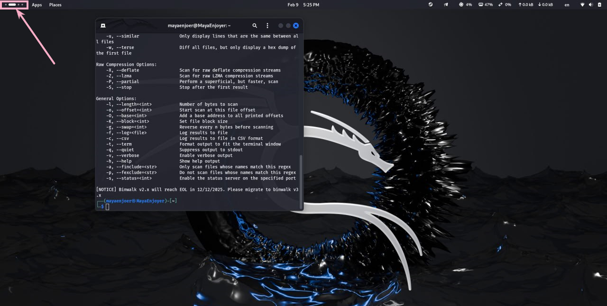
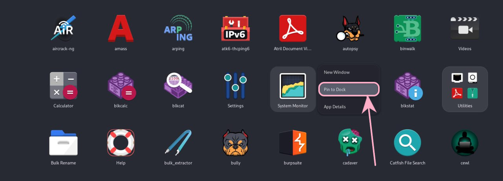
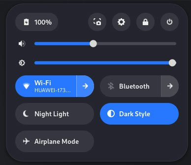
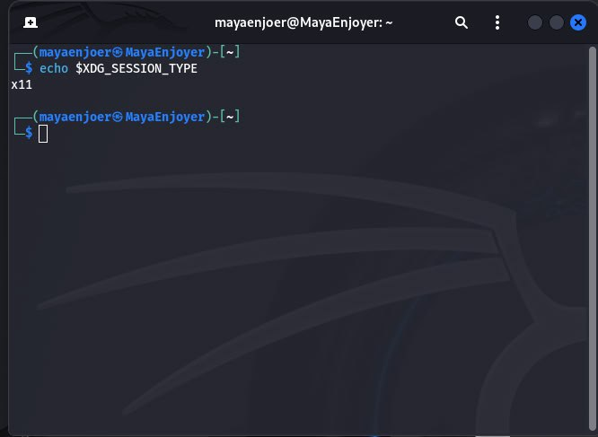
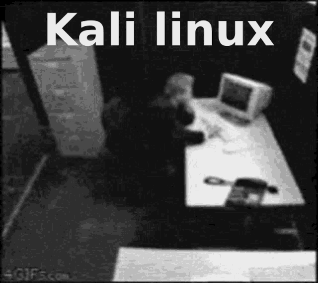

<h1 align="center">
    
    <br />
    Laboratory work with Kali Linux №2
</h1>

#### In this work, I will do lab #2, applying knowledge of Kali Linux. This work is created for the purpose of educational content, as an assignment for the discipline Operating Systems of the Kyiv College of Communications.

Topic of the work: “Introduction to the interface and capabilities of the Linux OS”

Objectives:
1. Introduction to the interfaces of the Linux OS.
2. Maintaining practical skills in working in Linux and mobile OS environments – their graphical program, logging in and out of the system, familiarizing yourself with the structure of the desktop, studying the basic actions and settings when working in the system.

---


#### In this article, I'm going to answer questions about the Kali Linux operating system and simply Linux.

## Before we get started, let's consider a question like CLI mode, GUI-based terminal, and virtual terminal?

Command Line Interface (CLI) is a software mechanism used to interact with an operating system using a keyboard. Another mechanism is the Graphical User Interface (GUI), which is common in all applications and software systems today. It can be used to visually navigate and perform actions by clicking icons and images. In Linux, examples of such terminals are GNOME Terminal, Konsole, Xfce Terminal, etc. They allow you to run the command line in a windowed mode.

However, the GUI is ineffective for system administration tasks, especially in a virtual or remote environment. In the command line interface, you can enter text commands to configure, navigate, or run programs on any server or computer system.

#### What are the main advantages of CLI?
The command line interface (CLI) offers the following benefits:

- Efficiency. Instead of wasting time searching for individual files and navigating between them, we can use the CLI to perform actions on multiple files using a single text command.

- Remote access. CLI applications often consume fewer network resources than graphical applications, making them suitable for use on systems with limited hardware capabilities or in remote server environments.

- Troubleshooting. For developers and system administrators, working with CLIs is a valuable skill that helps develop a deeper understanding of the underlying system. It can help you navigate various tools and utilities better, and improve error handling.

#### What is a virtual terminal?
A virtual terminal is a way to interact with an operating system through a text-based interface. It is like a window that displays the text output of commands and accepts input from the user.
Several such terminals are available in Linux, which can be switched between using the combinations `Ctrl + Alt + F1`, `Ctrl + Alt + F2` and so on up to `Ctrl + Alt + F6`. A virtual terminal is usually used for system administration, especially when a graphical interface is not available or is not used.

We can customize virtual terminals according to our needs. For example, we can change the font, color scheme, window size, add an *anime cat girl*, etc.

Using programs such as `SSH` (Secure Shell), we can connect to a virtual terminal on another computer over the network, providing the ability to execute commands and manage files on a remote machine.

Overall, a Linux virtual terminal is a powerful tool for managing and interacting with an operating system through a text-based interface. It allows us to perform many operations that would be available through a graphical interface, and also provides a fast and efficient way to manage our system.

---

## The next thing I would like to consider is working in graphical mode in Kali Linux.
#### I work with the Kali Linux operating system, which has the GNOME graphical interface installed.

#### 1) Launching programs via the Quick Launch bar:

In order to launch programs, through the quick launch bar, we need to click the "Activities" button in the upper left corner, or press the Super key. In the Activities Overview menu, we can see:
- a list of open windows.
- a list of desktops (Workspaces).
- a search bar.



In order to use Activities comfortably and quickly, we can use the following keyboard shortcuts:

- Super + A – opens a list of all installed programs.

- Super + Tab – helps to quickly switch between open programs.

- Super + Shift + Left/Right – allows you to mix windows between desktops.

#### 2) Launching programs via menu search / global menu:
#### Quick access panels are: Dash, Top Bar, System Tray.

1. Dash (Application Sidebar) is located at the bottom and contains pinned and running applications. It allows us to easily launch applications with one click. 


#### To add a new application, we need to open the application, then click `RMB → “Add to Favorites”`.



2. Top Bar is located on the right side of the Activities button, which opens the main menu.
In the center is a clock that displays the date, time, calendar events). To the right of the clock we have (System Monitor), which contains information about the processor, memory, etc. And at the very right end we have (System Tray), which contains indicators for Wi-Fi, Bluetooth, volume, battery charge.


3. System Tray provides access to quick settings (Wi-Fi, sound, power, Do Not Disturb mode). It is called by clicking in the upper right corner of the panel.

 

#### 3) Application Search:
GNOME Shell has a fairly powerful search system that allows you to quickly find the objects you need. To find an object, you need to press `Super` and start typing the name of the program you need, or you can use the key combination `Super + A` to open a list of all programs and search manually.

#### 4) Access to new desktops:
In order to open virtual desktops, we need to open the Activities menu, this can be done by pressing the `Super` key, after that at the top we will be able to see the virtual desktops, to switch between them, we can use the `Fn + Arrow` key combination or use a regular mouse.

---

## The next thing we'll look at is launching programs, and the different ways to do it.
#### In GNOME Shell in Kali Linux, there are three main ways to launch applications:

#### 1) Graphical launch of programs:
Dash, Favorites Bar, contains pinned and open programs that can be launched using the key combinations `Super + [program number]`, or simply by clicking on the icon.
We add/remove programs using `RMB → Add to Favorites` / `Remove from Favorites`.

Search in the global menu is done by calling `Super` or through `Activities`. Such a search allows you to search for programs, files, settings.
```
Quick combinations:
Super + A – list of all programs.
Super + [program name] – search.
```

Search through the menu of all programs (Application Grid) is done using the following key combinations `Super + A` or by manually opening it by clicking on `Apps` in the upper left corner, after which we will see all installed programs grouped by categories.

#### 2) Command-based program launch:
The launcher widget is used to quickly execute single commands without a terminal. To call the launcher widget, you need to use the following key combination `Alt + F2`, after which we need to enter the command and press Enter.

To perform a terminal search, we need to open the terminal, using `Ctrl + Alt + T` or through the search, and enter the command for the application we need, and press Enter.

#### 3) Automatic program launch:
To add an application to autostart, we need to open Startup Applications (`gnome-session-properties`). Then we need to add the command to start or the path to the executable file.

We can also use `.desktop files`.
Autostart applications are stored in `~/.config/autostart/`, so we can create a .desktop file for the application, for example a file of the following format:
```
[Desktop Entry]
Type=Application
Exec=love
Hidden=false
NoDisplay=false
X-GNOME-Autostart-enabled=true
Name=Love
```

---

## Next, I would like to cover logging out and shutting down in Kaki Linux.

#### 1) Changing user to root:
In order to change the user to root, we can use two methods:
1. We need to open "Settings", then select Users, then enable administrative access for root. After that, all we have to do is log out and log in as root.

2. For the second method, we will use the terminal, like all normal Linux users. To change the user to root, we need to use the following command in the terminal: `sudo su`, then all we have to do is enter the password and start working as root.

#### 2) System reboot:
In order to reboot the system, we can use two methods:
1. We need to open the System Menu, and select `Power Off / Log Out → Restart.`, and confirm the action with the password.

2. For the second method, we will use the terminal. In order to reboot the system, we need to use the following command `reboot`, or if we need to reboot the system after some time, we can use the following command: `shutdown -r + time in minutes`.

#### 3) System shutdown:
In order to turn off the system, we can use two methods:
1. We need to open the System Menu, and select `Power Off`, and confirm the action with the password.

2. For the second method, we will use the terminal. In order to turn off the system, we need to use the following command `poweroff`, or if we need to turn off the system after some time, we can use the following command: `poweroff -r + time in minutes`.

---

## The next thing I want to cover is working in a mobile OS environment.

#### 1) Main menu and graphical interface:
My phone runs on Android 14 with Samsung's One UI 6.1 skin. The graphical interface has a fairly modern design with smooth animations and good adaptation for a large display.

The main components of the main menu:

- Desktop - it contains application icons, widgets, a Google search bar, and an AI search bar.
- Application menu - opens with a swipe up and contains all my installed applications.
- Quick access panel - is called up with a swipe down from the top, the panel includes switches for Wi-Fi, Bluetooth, Do Not Disturb mode, Geolocation, etc.
- Navigation buttons - they are located at the bottom of the screen, thanks to them, we can select classic buttons (back, home, list of running applications).


#### 2) Mobile phone component settings menu:
My OS settings are available through the "Settings" menu, where there are such main sections as:

- Connections – responsible for managing Wi-Fi, mobile data, Bluetooth, NFC and access point.
- Sounds and vibration – responsible for setting ringtones, volume and sound systems.
- Screen – responsible for setting brightness, dark theme, display refresh rate, etc.
- Screen lock – responsible for changing the password, fingerprint scanner, face recognition.
- Battery and device maintenance – responsible for information about battery status, power saving modes, memory cleaning and safe charging.
- Applications – responsible for installed applications, managing application permissions.
- Accessibility – responsible for text magnification, voice commands, gesture settings, etc.

#### 3) Keyboard shortcuts for performing special actions:
- Screenshot - for this you need to press the power + volume down buttons simultaneously.
- Forced restart - for this you need to hold down the power + volume down buttons simultaneously (you need to hold for about 10 seconds).
- Enter Recovery Mode - for this you need to hold down the power + volume up buttons (you need to hold while turning on).
- Access Google Assistant or Bixby - for this you need to hold down the power buttons.
- BIOS setup - for this you need to hold down the power buttons + two volume buttons (you need to hold down while turning on).

#### 4) Logging in and shutting down the device:
- Unlock – with fingerprint and password
- Shutdown or reboot – power + volume down buttons and select the appropriate option.
- Quick Restart mode – allows you to automatically close all processes and optimize the system without completely shutting down.

#### 5) Features of battery power settings:
The Battery menu includes:

- Power saving mode – this option allows you to save energy and limits background processes.
- Battery protection – this option allows you to use safe charging of the device.
- Adaptive Battery – the system analyzes which applications are used less often and limits their consumption.
- Background usage limits – this option allows you to manage applications that can run in the background.
- Fast Charging – this option supports fast charging via USB-C.
- Battery information – this option allows you to view information about the battery.

---

## Answers to the control questions:

### Examples of Kali Linux server applications for database servers, messaging servers, and file sharing.
#### Kali Linux has a lot of server applications that can be used for databases, messaging, and file sharing. So I'll give you the most popular examples:

#### 1) Database servers:
- MySQL / MariaDB is one of the most popular relational database servers.
- PostgreSQL is a powerful relational DBMS with support for extensions and JSON.
- SQLite is a lightweight database that does not require a separate server.
- MongoDB is a NoSQL database for large amounts of data and flexible structures.

#### 2) Mailing Servers:
- Postfix is ​​an SMTP server for sending email.
- Exim is a popular mail server that is often used instead of Postfix.
- Dovecot is an IMAP/POP3 server for receiving mail.
- Sendmail is a classic SMTP server, although it is now used much less frequently.

#### 3) File Sharing Servers:
- ProFTPD is a powerful FTP server with secure connection support.
- vsftpd is a secure and easy-to-configure FTP server.
- Samba is a file sharing server between Windows and Linux.
- OpenSSH (SFTP) is a secure way to transfer files over SSH.

### Comparison of the Bourne shell, C, Bourne Again (Bash), the tcsh, the Korn shell (Ksh), and zsh.
Linux command-line shells (shells) are command interpreters and scripting environments. Each shell has its own unique capabilities, syntax, and features. So let's compare the following shells: Bourne shell (`sh`), C shell (`csh`), Bourne Again Shell (`bash`), TENEX C shell (`tcsh`), Korn shell (`ksh`), and Z shell (`zsh`).

| Characteristic            | `sh` (Bourne)     | `csh` (C)    | `bash` (Bourne Again)     | `tcsh` (TENEX C)   | `ksh` (Korn)  | `zsh` (Z shell) |
|---------------------------|-------------------|--------------|---------------------------|--------------------|---------------|-----------------|
| **Compatibility**         | POSIX             | Part         | POSIX, GNU                | Part               | POSIX         | POSIX           |
| **Autofill**              | None              | Limited      | Yes                       | Yes                | Yes           | Improved        |
| **Team history**          | None              | Yes          | Yes                       | Yes                | Yes           | Improved        |
| **Extended arrays**       | None              | None         | Yes                       | None               | Yes           | Yes             |
| **Script capabilities**   | Limited           | Basic        | Advanced                  | Basic              | Improved      | Powerful        |
| **Customization**         | Minimum           | Minimum      | Moderate                  | Moderate           | Moderate      | High            |
| **Productivity**          | High              | Medium       | High                      | Medium             | High          | High            |
| **Additional features**   | Minimum           | Minimum      | Advanced                  | Advanced           | Advanced      | The largest     |

#### Bourne shell (`sh`)
- The original Unix shell.
- No support for autocompletion and command history.
- Used for writing basic scripts.
- Very fast and lightweight.

#### C shell (`csh`)
- Syntax similar to C, making it easier for programmers to use.
- Has command history, but limited scripting support.
- Less popular due to instability in scripts.

#### Bourne Again Shell (`bash`)
- The most common shell in Linux.
- Full POSIX support, extended autocompletion, command history.
- Support for extended scripts, functions, and environment variables.
- Used by default in most Linux distributions.

#### TENEX C shell (`tcsh`)
- Improved version of `csh` with autocompletion and improved command history.
- Includes advanced command line editing capabilities.
- Less used for scripts, more for interactive work.

#### Korn shell (`ksh`)
- Combines the capabilities of `sh` and `csh`, supports high-level scripts.
- Improved performance and flexibility compared to `sh`.
- Used in commercial Unix systems.

#### Z shell (`zsh`)
- The most powerful shell with rich autocompletion and customization capabilities.
- Combines the features of `bash`, `ksh` and `tcsh`.
- Used by default on macOS.
- Ideal for advanced terminal configurations.

#### If we draw conclusions, the choice of shell depends entirely on the tasks at hand.
Therefore, if we need to be compatible with POSIX, we will use `sh` or `ksh`.
If for interactive work, we need to use `bash`, `zsh`, `tcsh`. For advanced features, we need to use `zsh`, and for commercial Unix systems, we need `ksh`.

#### But in my opinion, `bash` remains the most versatile choice, while `zsh` is ideal for customization and advanced use.

#### 4) What security features are used in Linux?
Kali Linux is a distribution focused on security testing and writing malware, so it contains not only standard Linux protection mechanisms, but also additional, more powerful tools for ensuring security or vice versa.

#### Here are the basic safety measures:

#### Access control and authentication:
- PAM (Pluggable Authentication Modules) – implements user authentication management.
- Shadow Passwords is used to store passwords in `/etc/shadow`, which protects them from being read by regular users.
- sudo implements access restrictions to privileged commands, replacing su.
- SSH (Secure Shell) provides secure remote access with support for key authentication.
- Fail2Ban protects against brute force attacks by blocking suspicious IP addresses.

#### Access Control Policies (MAC):
- SELinux (Security-Enhanced Linux) provides enhanced access control, although it is disabled by default, so be careful!
- AppArmor provides security profiles to restrict the capabilities of applications.

#### Kernel and memory protection:
- ASLR (Address Space Layout Randomization) randomizes memory locations to make exploits more difficult.
- NX (No Execute) / DEP (Data Execution Prevention) implements protection against code execution in certain memory segments.
- seccomp (Secure Computing Mode) provides system call restrictions for processes.

#### Data encryption and protection:
- LUKS (Linux Unified Key Setup) provides support for disk and partition encryption.
- eCryptfs provides file encryption for sensitive data.
- GPG (GNU Privacy Guard) provides file and email encryption.

#### Network protection:
- iptables/nftables is a firewall that filters traffic.
- TCP Wrappers controls access to network services via `/etc/hosts.allow` and `/etc/hosts.deny`.
- Snort/Suricata intrusion detection and prevention systems (IDS/IPS).

#### Monitoring and auditing:
- auditd is an audit system for recording security events.
- chkrootkit, rkhunter are tools for detecting rootkits.
- logwatch analyzes security system logs.

#### Additional tools I would recommend using:
- Tor & Proxychains are needed to anonymize traffic.
- Firejail implements sandboxing of applications to prevent exploitation of vulnerabilities.
- BeEF (Browser Exploitation Framework) allows you to check the security of browsers.

#### It is important to know that Kali Linux supports data transfer restrictions when charging via USB, this was done to prevent attacks such as USB Rubber Ducky or BadUSB.

#### 5) Why has the use of virtualization become relevant?
Because virtualization is one of the important technologies for modern programmers, as it allows for efficient use of hardware resources and increased security.

One of the main advantages of virtualization is resource optimization. Virtualization allows for much more efficient use of hardware, i.e. one physical server with virtualization can run multiple virtual machines (VMs), which reduces hardware costs. It also allows for server consolidation, which reduces power, cooling, and maintenance costs.

The next important aspect is flexibility and scalability. Thanks to virtualization, systems can be deployed in minutes. Virtualization also improves security and isolation, i.e. it provides application segmentation, isolating virtual environments and preventing vulnerabilities from spreading between systems.
Another significant advantage is the support of old and new software.
In addition, virtualization plays an important role in automation and DevOps. It is used in infrastructure-as-code (IaC) approaches (Terraform, Ansible) to simplify the management of virtual environments, as well as in CI/CD processes, where temporary virtual environments are created for testing before deployment to production.

#### 6) What is containerization?

Containerization is the deployment of software along with all the necessary components: code, libraries, frameworks, etc., in such a way that they are isolated in their own container.
Unlike traditional virtualization, where each virtual machine (VM) contains its own copy of the operating system, containers use the kernel of the host OS, which makes them lighter, faster, and more efficient.

#### 7) What are the advantages/disadvantages of using open source software?

Open source software is a type of software whose code can be viewed, modified, improved, and distributed without any restrictions. The basic idea behind open source is that free access to the application code contributes to more efficient and innovative technological development.

### Advantages of open source software:

#### Cost-effectiveness:
- This is one of the key advantages of open source. Such software is usually available for free for both personal and commercial purposes, which reduces the cost of the project. Open source applications can be downloaded, installed and used without paying any initial fees. Also, most of such software does not require additional payments for updates or its use on multiple devices.

#### Code adaptability:
- The flexibility and adaptability of open source is also of great importance to users. Developers of companies that use open software can make changes to the source code to adapt the program to the needs of their project. And since users have free access to the code, they can make changes without waiting for updates from the provider.

#### Software transparency:
- This is one of the fundamental principles of open source. Transparency means that the source code of the program is open and available to all users. Therefore, every user of the software can see what is happening inside the program and evaluate the quality of the code.
Transparency also helps increase trust in the application, as IT professionals can independently verify its security and reliability.

#### Large user community:
- Open source software is often supported by a large community that suggests and implements innovative methods. In addition, the community actively contributes to the identification and resolution of security issues, leading to timely responses and more reliable solutions.

### Disadvantages of open source solutions:

#### Compatibility issues:
- The open source environment consists of many different projects, frameworks, and libraries. Due to this diversity, compatibility issues can arise. Integrating different components can require additional effort to ensure that they work together smoothly.
Also, different open source products may have different levels of development, documentation, and community support.

#### License terms:
- Some open source applications are licensed under the GNU General Public License v2.0 and the GNU Lesser General Public License v3.0. These licenses state that derivative projects that use these programs must be released under the same license.

#### Security:
- Open source software is created by developers who primarily extend the functionality and improve the performance of the product. Therefore, when it comes to little-known open source programs, their developers may not take into account some aspects, not perform the required amount of testing, and not conduct a security audit of the project.

#### 8) How many active virtual consoles (terminals) can be running in Kali Linux by default?
In Kali Linux, as in most similar Linux distributions, by default only 6 active virtual consoles (terminals) in text mode and only one graphical session (X-server) are available.

In order to call and switch between virtual terminals, we need to use the following key combinations:
```
Ctrl + Alt + F1 → Graphical environment (GUI, GNOME)
Ctrl + Alt + F2 → First virtual console (tty2)
Ctrl + Alt + F3 → Second virtual console (tty3)
Ctrl + Alt + F4 → Third virtual console (tty4)
Ctrl + Alt + F5 → Fourth virtual console (tty5)
Ctrl + Alt + F6 → Fifth virtual console (tty6)
```

To return to the graphical interface (GNOME, X-server), we need to use the following key combination: `Ctrl + Alt + F1`.

#### 9) Which virtual console (terminal) functions as a graphical shell?
Kali Linux has a graphical shell (GUI, X-server, GNOME) that runs on the virtual console tty1. That is, `tty1` is responsible for launching the Graphical Display Manager, which manages the graphical login to the system, `tty2 - tty6` are text virtual consoles (terminals) that work independently of the GUI.

To check the active graphical console, we need to enter this command in the terminal: `echo $XDG_SESSION_TYPE`.

 

If the console displays "x11" or "wayland", it means that the system is running in graphical mode. We can also view the active graphical interface processes using the following command: `ps aux | grep -E 'Xorg|wayland'`, this will show us on which tty our graphical session is running.

#### 10) Is it possible to log in to Kali Linux multiple times under the same system name?
Yes, in Kali Linux, as in other Linux distributions, it is possible to log in to the system simultaneously under the same user. This can be done in the following ways:

#### Through virtual terminals (tty):
- As we have said before, we can do this using the key combination `Ctrl + Alt + F2` (tty2), Ctrl + Alt + F3 (tty3) and so on up to tty6, it is in virtual terminals that we can have several active text sessions under the same user.

#### Through SSH connections:
- We can simultaneously connect to the system via SSH from different clients or devices. For example, from two different computers or two terminal windows, this can be implemented using the following command: `ssh mayaenjoer@kali_machine`.

#### Through the graphical interface + terminals:
- We can work simultaneously in the GNOME graphical environment and have several terminal windows open GNOME Terminal, Konsole, Tilix, etc.

#### Via VNC or RDP:
Using VNC or RDP, we can have multiple remote connection sessions to Kali Linux.

### Advantages of multiple logins under one user in Kali Linux:

#### Parallel work:
- The first is to run different tests and scans in different sessions, for example, in one - `nmap`, in the second - `metasploit`, in the third - `Burp Suite`, etc.

#### Remote administration:
- Provides the ability to work simultaneously locally and via `SSH/VNC`, which is convenient for working with remote systems.

#### Monitoring and testing:
- One terminal can perform an open scanning process or intercept traffic, and the other - manage the system or analyze the results.

#### Effective use of GUI and CLI:
- Allows you to use GNOME and multiple CLI sessions simultaneously.

### Possible risks:
- Conflicts between processes may occur, some tools may not work correctly when used simultaneously in multiple sessions.
- Security vulnerability, because if multiple sessions are opened without control, an attacker can use them for unauthorized access, etc.
- System overload, running many resource-intensive programs in multiple sessions, for example, `Metasploit`, `Wireshark`, `John the Ripper` can significantly affect performance.

### Conclusions: So I finished doing lab work number 2, to be honest, I didn't learn anything new from this work, but I was still pleased to remember such moments as comparing different shells and describing my mobile OS.

AND AS ALWAYS MY TRADITION, I WISH YOU SUCCESS IN LEARNING KALI LINUX, AND DON'T FORGET TO REST AND ENJOY LIFE. I LOVE YOU ALL, AND SEE YOU AGAIN ;)




