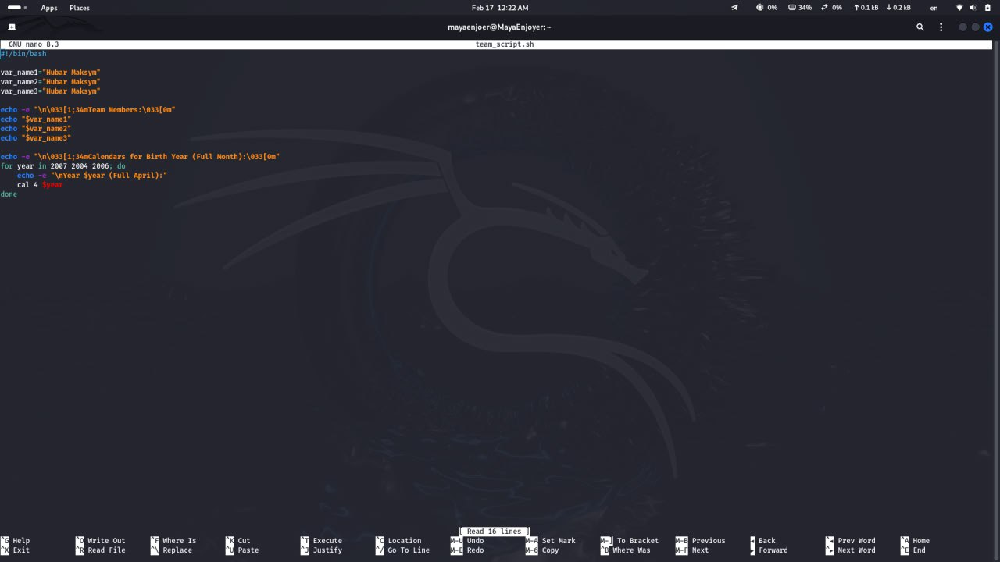

<h1 align="center">
    
    <br />
    Laboratory work with Kali Linux №3
</h1>

#### In this work, I will do lab #3, applying knowledge of Kali Linux. This work is created for the purpose of educational content, as an assignment for the discipline Operating Systems of the Kyiv College of Communications.

Topic: “Introduction to basic CLI commands in Linux”

Objectives:
1. Introduction to basic CLI commands in Linux.
2. Introduction to basic text commands in terminal mode in different OSes.

---

#### In this article, I'm going to answer questions about the Kali Linux operating system and simply Linux.


## Before we begin, let's consider a question such as a command interpreter, a shell, and a command?

A command interpreter is a computer program, part of an operating system, that provides basic computer control capabilities through interactive command entry via a command line interface or sequential execution of batch command files.

As a rule, its functions are reduced to providing the user with the ability to run other programs, may also contain some basic input-output commands and its own simple scripting programming language.
The most common command interpreter in Linux and FreeBSD is bash, in addition to which there is a large family of others.

As a rule, with low-level configuration of the OS, the user has the ability to change the command interpreter that is used by default.

The functions of the command line interpreter include:
```
Interaction with the user (editing the command line, command history).
Processing (expanding) name patterns ("*", "?", etc.).
Redirection of command input-output.
Task management.
```
Most often, the command line interpreter provides the ability to use loops, conditional and unconditional branching operators, and variables. It allows you to write both simple scripts for automating everyday tasks and quite complex programs.

### What is a shell in Linux?
A shell is not only a command interpreter that provides an interface between the user and the operating system kernel, but also a kind of programming language that includes such constructs as conditional branching operators, loops, variables, and much more.

The operating system launches a command shell for each user when they log in or open a terminal window. The first thing the user sees in the terminal window is a shell prompt — it usually consists of a `username` and a `hostname`, separated by an `@` symbol, followed by the path to the current working directory and one of two symbols: `$` or `#`.

If the user does not have special privileges, the `$` symbol will be displayed as a prompt for entering commands in the terminal. If the user is logged in as root , the `#` symbol will be displayed in the terminal.

### What is a command in Linux?
A command is an instruction that we enter into the command line to perform a specific action. Commands can be built into the shell or external programs.

Types of commands:

- Built-in – part of the shell (e.g. `cd`, `echo`, `pwd`, `exit`)

- External – separate executable files (e.g. `ls`, `nmap`, `ping`, `nano`)

Let's look at the following commands for example:
```
ls -l – List files in a directory
pwd – List current path
whoami – Identify user
```

---

## Next, let's consider the following questions:
### What basic information does the prompt line provide?
Prompt is a text message that the `shell` displays before the user enters a command. It provides key information about the current state of the system.

Whenever we open a terminal window, we see the command prompt of the shell:
`username@hostname:~$`

Let's look at it in more detail:
- `username` — the name of the currently logged-in user;
- `@` — the separator;
- `hostname` — the hostname of the system;
- `:` — the separator;
- `~` (tilde) — this symbol denotes the user's home directory `/home/<username>`;
- `$` — means that the user is a regular user (and the hash sign `#` denotes `root` users).

#### Prompt Statements bash contains 4 different prompt statements:
- PS1 is the main prompt that is displayed before every command, which is why it changes most often.
- PS2 is displayed when the command requires additional input (for example, when using multi-line commands).
- PS3 is displayed when the shell's built-in interactive menu command `select` is used.
- PS4 is used to run a shell script in debug mode.

But usually, we only work with PS1. Therefore, in most cases, we will only work with this statement and sometimes, perhaps, with PS2.

In order to see the current value of PS1, we need to use the following command: `echo $PS1`.

### Why does a command need parameters and arguments?
When we enter a command in Linux, it can perform different functions, depending on the parameters (options) and arguments passed to it.

- An argument is the input data that is passed to the command for processing. For example, the name of a file or directory.
- A parameter (option, flag, key) is additional settings of the command that change its behavior. They are indicated by one or two hyphens (`-` or `--`).

#### Examples of use:
- `ls` — is a command without parameters and arguments, which will list the files in the current directory.
- `ls Documents` — is a command with an argument (the `Documents` directory), which will list all the files in the `Documents` directory.
- `ls -l` — is a command with a parameter (`-l` – verbose list), which will list the files in the current directory in an expanded format.
- `ls -l /home/user` — a command with a parameter and an argument, which displays a detailed list of files in the `/home/user` directory.
- `ls -lh` — a command with several parameters, it displays a detailed file format, and their size in a convenient format (KB, MB).
- `ls --all --human-readable` — options in long format (`-- `instead of `-`), the command shows all files, including hidden ones, and displays the sizes in a clear format.

### What is the purpose of the ls command, what parameters and arguments can it have?
The `ls` command is one of the most commonly used Linux commands. It displays the contents of a directory, showing all the files and subdirectories contained within.

Without any parameters or arguments, `ls` will display the contents of the current working directory. We can pass the path to another directory to list the files and folders in the desired location.

#### The `ls` command parameters are:

| Parameter      | Description                                                                                                                                           |
|----------------|-------------------------------------------------------------------------------------------------------------------------------------------------------|
| `-l`           | Displays the result in long format, showing additional details such as permissions, ownership, size, and modification date of each file and directory |
| `-a`           | Show hidden files and directories starting with `.`, in addition to non-hidden objects                                                                |
| `-h`           | Displays file sizes in a user-friendly format (KB, MB)                                                                                                |
| `-r`           | Displays the list in reverse order                                                                                                                    |
| `-R`           | Recursively list the contents of all subdirectories, diving into child folders indefinitely                                                           |
| `-t`           | Sorts files by modification time                                                                                                                      |
| `-S`           | Sort results by file size, largest first                                                                                                              |
| `-d`           | Shows only directories without their contents                                                                                                         |
| `--color=auto` | Adds colored highlighting to files depending on type                                                                                                  |

- `ls` — is a command without parameters and arguments that will list the files in the current directory.
- `ls -la` — view files in the current directory (without parameters), the command will display all files (including hidden ones) in a detailed format.
- `ls -lh /var/log` — output files in a specific directory with sizes, this command shows files in the `/var/log` directory, indicating their size in a convenient format (KB, MB).


### How can you use command history, what benefits does it provide?
The `history` command in Linux allows you to view and repeat previous commands. This is quite convenient for quick access to frequently used commands and correcting errors.

##### Main ways to work with command history:

| Command      | Description                                                   |
|--------------|---------------------------------------------------------------|
| `history`    | Displays a list of previously executed commands               |
| `!n`         | Executes the command from the history with number `n`         |
| `!!`         | Repeats the last executed command                             |
| `!name`      | Executes the last command starting with `name`                |
| `Ctrl + R`   | Searches for a command by entered text in search history mode |
| `history -c` | Clears the command history for the current user               |

#### Advantages of using command history:
- Time saving – when using the `history` command, we do not need to re-enter long commands, which greatly slows down performance.
- Convenience in correcting errors – we can always quickly edit the command and re-execute it.
- Automation – using the `history` command, we can create scripts from frequently used commands.
- Action log – command history helps to track the operations performed, which is useful for administrators.


### What is the purpose of the `echo` command?
The `echo` command is used to output objects to the screen, as well as to move some data to a file. For example, if we want to add the line “I can't live without you!” to a file named love .txt, we would use the following command:
`$ echo "I can't live without you!" >> love.txt`.

#### Main features of the `echo` command:

| Option   | Description                                     |
|----------|-------------------------------------------------|
| `-n`     | Outputs text without a newline                  |
| `-e`     | Allows special characters such as `\n`, `\t`    |
| `-E`     | Disables special character processing (default) |


### What is a variable in the Bash shell?
Shell variables are variables that apply only to the current shell instance. Each shell, such as `bash` or `zsh`, has its own set of internal variables.

#### All variables have the following format:
```
KEY=value1
KEY="Some other value"
KEY=value1:value2
```

#### Bash Variable Types:

| Variable type                      | Description                                                                                                          |
|------------------------------------|----------------------------------------------------------------------------------------------------------------------|
| **Local variables**                | Valid only within the current session or script. Example: `myvar="Hello"`                                            |
| **Global variables (environment)** | Available to all processes of the current shell. Set via `export`, for example: `export PATH="/usr/local/bin:$PATH"` |
| **Positional parameter variables** | Used to process script arguments (`$1`, `$2`, … `$@`, `$*`).                                                         |
| **Special parameter variables**    | Contain service information, for example, `$?` (command exit code), `$$` (current process PID).                      |
| **Arrays**                         | Store a list of values. Example of creation: `arr=("one" "two" "three")`                                             |
| **Associative arrays**             | Store key-value pairs (must be enabled via `declare -A`).                                                            |


#### The most common shell variables are:

- `BASHOPTS` — a colon-separated list of shell options used.
- `BASH_VERSION` — the version of the bash shell being run.
- `COLUMNS` — the number of columns used to display output.
- `DIRSTACK` — the directory stack that can be used with pushd and popd.
- `HISTFILESIZE` — the maximum number of lines for the command history file.
- `HISTSIZE` — the number of lines from the command history file that can be stored in memory.
- `HOSTNAME` — the name of the current host.
- `IFS` — the internal field separator in the command line (the default is a space).
- `PS1` — determines the appearance of the prompt for entering new commands.
- `PS2` — the second prompt line.
- `SHELLOPTS` — shell options that can be set using the set command.
- `UID` — the current user ID.

### What is the purpose of the env, export, and unset commands?
- `env` command — allows you to run another program in the user's environment without changing the current environment. If used without an argument, it will list the current environment variables;
- `export` command — creates an environment variable;
- `unset` command — removes shell and environment variables.

### What are the commands to get help on commands in the terminal?
In Linux, there are several ways to get help information about commands. The main tools for this are the `man`, `info` commands and using the `--help` or `-h` options.

- The `man` command — helps to display detailed documentation on the use of commands and programs.
- The `info` command — provides us with information about commands and programs in a more extended format than `man`.
- The `--help` or `-h` options — quite a few commands support these options for quickly viewing a short help. For example, `ls --help` or `ls -h`, these commands will display a list of available options and a brief description of their use.

---

### Working through all the command examples from Lab 5-6:

| **Team name**                       | **Purpose and functionality**                                                                                                                                                                                                       |
|-------------------------------------|-------------------------------------------------------------------------------------------------------------------------------------------------------------------------------------------------------------------------------------|
| `ls`                                | Displays information about directories and files. By default, without arguments, displays information for the current directory                                                                                                     |
| `ls -l`                             | Using the `-l` option with the `ls` command allows you to display information about files located in the current working directory in a long format, which provides more extensive additional information                           |
| `ls -l /tmp`                        | Using the `/tmp` argument in combination with the `-l` option in the `ls` command allows you to display detailed information about files in the `/tmp` directory                                                                    |
| `pwd`                               | Displays the full path to the current working directory                                                                                                                                                                             |
| `cd`                                | Changes the current working directory to the specified one                                                                                                                                                                          |
| `echo`                              | Displays text or variable values on the screen                                                                                                                                                                                      |
| `man`                               | Opens the manual page for the specified command.                                                                                                                                                                                    |
| `man -k`                            | Searches the database for manual pages by keyword (equivalent to `apropos`)                                                                                                                                                         |
| `whatis`                            | Displays a short description of the specified command                                                                                                                                                                               |
| `info`                              | Shows detailed information about a command, often more extensive than `man`                                                                                                                                                         |
| `--help`                            | An option to a command that displays a brief help about using the command and its parameters                                                                                                                                        |
| `!n`                                | Executes the command from history at number `n`                                                                                                                                                                                     |
| `alias`                             | Displays a list of all set aliases in the current session                                                                                                                                                                           |
| `type vi`                           | Indicates whether `vi` is a shell builtin or an external executable                                                                                                                                                                 |
| `cd /bin`                           | Moves files to the `/bin` directory                                                                                                                                                                                                 |
| `date`                              | Uses command substitution to output the current date                                                                                                                                                                                |
| `echo D*`                           | Lists all files that start with "D"                                                                                                                                                                                                 |
| `man -k password`                   | Searches for all help pages that contain "password" in their description                                                                                                                                                            |
| `apropos password`                  | Similarly, `man -k` searches for man pages by keyword.                                                                                                                                                                              |
| `man -f passwd`                     | Displays a list of available manual page sections for `passwd`                                                                                                                                                                      |
| `locate crontab`                    | Searches for files and directories on our system that contain "crontab" in their path or name. It uses a database for fast lookups, so it should be much faster than a regular `find` search                                        |
| `ls /usr/share/doc`                 | Displays a list of documentation installed on the system                                                                                                                                                                            |
| `date --help`                       | Displays a brief help about the `date` command                                                                                                                                                                                      |
| `whatis passwd`                     | Prints a short description for `passwd`                                                                                                                                                                                             |
| `man 5 passwd`                      | Opens the man page for section 5 of the documentation, which deals with configuration files                                                                                                                                         |
| `info date`                         | Opens the information page for the `date` command, which contains detailed documentation about its usage, options, and formatting                                                                                                   |
| `locate -b "\crontab"`              | Searches for files and directories where "crontab" occurs only at the end of the file or directory name, using the `-b` option                                                                                                      |
| `whereis passwd`                    | Searches for files related to the `passwd` command or program and prints their location on the system. It typically searches for executables, man pages, source code, etc                                                           |
| `ls -l /home`                       | Prints a detailed list of files and directories in the `/home` directory. In `-l` format, each file or directory will be presented with additional information such as permissions, owner, group, size, and last modified date      |
| `whoami`                            | Displays the name of the current user executing the command in the terminal. It displays the account on the system                                                                                                                  |
| `uname`                             | Displays basic information about the operating system, including its kernel. By default, it displays the name of the operating system kernel                                                                                        |
| `uname -n`                          | Displays the operating system hostname, i.e. the name of the computer on the network                                                                                                                                                |
| `uname --nodename`                  | It is equivalent to the `uname -n` command and also prints the hostname of the operating system                                                                                                                                     |
| `history`                           | Displays a list of all commands executed in the current terminal session. This allows you to review previous commands and reuse them                                                                                                |
| `history 5`                         | Displays the last 5 commands from the command history that were executed in the terminal                                                                                                                                            |
| `echo $PATH`                        | Displays the value of the PATH environment variable, which contains a list of directories in which the system searches for executable files (programs)                                                                              |
| `which date`                        | Shows the path to the executable file of the `date` program, which the system uses to display the current date and time                                                                                                             |
| `type command`                      | Used to determine the type of command or program specified in the system. It indicates whether the command is a built-in, external program, or perhaps a function or alias                                                          |
| `which ls`                          | Prints the path to the executable file of the `ls` program, which is used to list files and directories on the system                                                                                                               |
| `type vlc`                          | Shows the type of program or `vlc` command that the system uses to play multimedia                                                                                                                                                  |
| `echo Today is 'date'`              | The command will print the text "Today is" along with the current date and time, obtained using the `date` command                                                                                                                  |
| `echo "D*"`                         | Will display the text literally: D*                                                                                                                                                                                                 |
| `echo This is the command \'date'\` |                                                                                                                                                                                                                                     |
| `echo Today is $(date)`             | Will print the text "Today is" along with the current date and time returned by the `date` command. This uses the `$(...)` syntax, which allows you to execute a command inside the parentheses and insert its result into a string |

---

### Next, let's work in the terminal and consolidate the studied material:

<h1 align="center">

    Practical tasks:
</h1>


### 1) Creating variables:
To use the script many times, I suggest creating a Bash script, this can be done using the following command: `nano team_script.sh`.
After that, we can enter our code into the open `nano` editor.

My task is to create variables that will contain the names and surnames of the students in my team, but since I work alone and I have problems with my head, I will distribute 3 roles between my personalities ;)

After that, I need to use the `echo` command to display the names and surnames of the students in my team, and use the `cal` command to automatically display the calendar of my year of birth.

#### Code for the task:
```
#!/bin/bash

team_member1="Hubar Maksym - Team Lead"
team_member2="Hubar Maksym - Lead Developer"
team_member3="Hubar Maksym - Data Analysis"

echo -e "\n\033[1;34mTeam Members:\033[0m"
echo "$team_member1"
echo "$team_member2"
echo "$team_member3"

echo -e "\n\033[1;34mCalendar for Birth Month (April 2007):\033[0m"
cal 4 2007
```


After finishing writing the code, we need to use the following key combination: `CTRL+X` then the interface will ask if we really want to save the changes, and we need to press: `Y`, after which we just have to press `Enter`.

Next, we need to grant execution rights, so to make our script executable we need to use the following command: `chmod +x team_script.sh`, after successfully granting rights, all we have to do is run our script using the following command: `./team_script.sh`.


---

### 2) Working with functions:

To use the script many times, as in the previous task, we will use a Bash script, we do this with the following command: `nano students_report.sh`.
After that, we can enter our code in the open `nano` editor.

My task is that I need to create a `students_report` function that will sequentially display first the first and last names of the students on my team, and then their years of birth.

#### Code for the task:
```
#!/bin/bash

student1_name="Hubar Maksym"
student1_birth="2007"

student2_name="Hubar Maksym"
student2_birth="2007"

student3_name="Hubar Maksym"
student3_birth="2007"

students_report() {
    echo -e "\n\033[1;34mStudents Report:\033[0m"
    echo "1. $student1_name - Birth Year: $student1_birth"
    echo "2. $student2_name - Birth Year: $student2_birth"
    echo "3. $student3_name - Birth Year: $student3_birth"
}

students_report
```


After finishing writing the code we need to use the following key combination: `CTRL+X`, then the interface will ask if we really want to save the changes, and we need to press: `Y`, after which we just need to press `Enter`.

Next we need to grant the execution rights, so to make our script executable we need to use the following command: `chmod +x students_report.sh`, after successfully granting the rights all we need to do is run our script using the following command: `./students_report.sh`.


---

### 3) Working with quotes:

To use the script many times, as in the previous tasks, we will use a Bash script, we do this with the following command: `nano buser_gpt_script.sh`.
After that, we can enter our code in the open `nano` editor.

My task is that I need to output the following sentences on the command line:
“We create such variables as `$var_name1`, `$var_name2`, `$var_name3`, which stored our names Name1, Name2, Name3” (in the sentence, first the names of the variables should be output, and then their contents)
“We create such Aliases as `mycal1`, `mycal2`, `mycal3`, which can show our calendars: Calendar1, Calendar2, Calendar3” (in the sentence, first the name of the alias command should be output, then the output of these commands).

#### Code for the task:

```
#!/bin/bash

TEAM_NAME="Abuser GPT"
var_name1="Hubar Maksym - Team Lead"
var_name2="Hubar Maksym - Lead Developer"
var_name3="Hubar Maksym - Head of Data Analysis"

echo -e "\n\033[1;34mTeam Name: \"$TEAM_NAME\"\033[0m"

echo -e "\n\033[1;34m\"We create such variables as \$var_name1, \$var_name2, \$var_name3, which stored our names:\"\033[0m"
echo -e "\$var_name1: \"$var_name1\""
echo -e "\$var_name2: \"$var_name2\""
echo -e "\$var_name3: \"$var_name3\""

echo -e "\n\033[1;34m\"We create such Aliases as mycal1, mycal2, mycal3, which can show our calendars:\"\033[0m"

echo -e "\n\033[1;32mAlias mycal1 (April 2007):\033[0m"
cal 4 2007

echo -e "\n\033[1;32mAlias mycal2 (April 2004):\033[0m"
cal 4 2004

echo -e "\n\033[1;32mAlias mycal3 (April 2006):\033[0m"
cal 4 2006
```


After finishing writing the code we need to use the following key combination: `CTRL+X`, then the interface will ask if we really want to save the changes, and we need to press: `Y`, after which we just need to press `Enter`.

Next we need to grant the execution rights, so to make our script executable we need to use the following command: `chmod +x abuser_gpt_script.sh`, after successfully granting the rights all we need to do is run our script using the following command: `./abuser_gpt_script.sh`.


---

### 4) Working with control instructions:
#### Tasks 1 and 2 without writing a separate function:
#### 1)
```
#!/bin/bash

var_name1="Hubar Maksym"
var_name2="Hubar Maksym"
var_name3="Hubar Maksym"

echo -e "\n\033[1;34mTeam Members:\033[0m"
echo "$var_name1"
echo "$var_name2"
echo "$var_name3"

echo -e "\n\033[1;34mCalendars for Birth Year (Full Month):\033[0m"
for year in 2007 2004 2006; do
    echo -e "\nYear $year (Full April):"
    cal 4 $year
done
```



#### 2)
```
#!/bin/bash

var_name1="Hubar Maksym"
var_name2="Hubar Maksym"
var_name3="Hubar Maksym"

echo -e "\n\033[1;34mTeam Members:\033[0m"
echo "$var_name1"
echo "$var_name2"
echo "$var_name3"

echo -e "\n\033[1;34mCalendars for Birth Year (16 April):\033[0m"
for year in 2007 2004 2006; do
    echo -e "\nCalendar for Year $year (16 April):"
    cal 4 $year
done
```


### 5) Working with control instructions:
To get help on the uname command in the terminal, you need to use the `man uname` command.
This will allow us to view the documentation for the uname command, where we will find details about its usage, available parameters, and other options.


#### 5 ways to use the uname command with different parameters:
1. `-a`: Prints all available information about the system (architecture, version, kernel, hostname, etc.):


2. `-s`: Prints the operating system kernel name:


3. `-n`: Prints the hostname (the name of the machine on the network):


4. `-r`: Prints the kernel version:


5. `-m`: Prints the processor architecture:


---

## Answers to the control questions:
### 1) What are the command types in the Bash shell?
#### Built-ins in bash:
🟣 `alias` – view and assign aliases to commands

🟣 `bg` – continue execution in the background of the current session process

🟣 `cd` – move to a directory [.. – one level up]

🟣 `command` – call a command (not a function or alias)

🟣 `declare` – set the value and type of a variable [-i – number; -a – array; -A – associative array; -r – read-only]

🟣 `disown` – detach the last tasks from the current terminal

🟣 `echo` – output text. “view variable values”

🟣 `enable` – enables/disables the use of built-in bash commands

🟣 `exec` – execute command in current pid, redirect output for current process

🟣 `exit` – exit shell [with specified error code]

🟣 `export` – set variable value marked “exported”

🟣 `fg` – switch to “foreground” of current session process

🟣 `for` – for loop [for i in 1 2 3;do echo $i; done]

🟣 `function` – define function in bash

🟣 `help` – help on built-in bash commands

🟣 `history` – command history

🟣 `if…` – run command upon successful execution of another command (often, checking expression via command “[“) [if COM1;then COM1; else COM3; fi]

🟣 `jobs` – list of processes in the current bash session

🟣 `let` – calculates the value of an expression with numbers

🟣 `read` – the simplest utility for requesting data from the user in the terminal (-p MSG – message, -t SEC – timeout, -n NUM – ​​number of characters) […| while read … – string parsing]

🟣 `select` – the simplest bash selection menu [select Name in WORDS … ; do COMMANDS; done]

🟣 `set` – view environment variables and function. switching bash modes

🟣 `source` – run script in current bash [analogous to .]

🟣 `test` – check the truth of an expression [-f – file exists, -lt – less than]

🟣 `trap` – configure command launch when signal is received

🟣 `type` – determines command type [builtin, alias, function]

🟣 `ulimit` – set [-a – output] resource limits for current bash session

🟣 `umask` – view-set permissions that will not be set when creating files/directories

🟣 `unset` – deletes variable (or function)

🟣 `wait` – waits for process to finish

🟣 `while …` – while loop [while COMM1; do COMM2; done]

🟣 `.` – run script in current bash [analogous to source]

### 2) What are environment variables?
Environment variables in operating systems are variables that contain text information used by other programs during startup. They usually include general system parameters for both graphical and command shells, user settings, location of certain files, etc. The values ​​of such variables are specified, for example, by numbers, symbols, paths to directories or files. This allows many applications to quickly access certain settings, and also allows the User to change or create new options.

#### Types of environment variables:

1. Global (system) variables: 
Available in all processes running in the system.
Example: `$PATH`, `$HOME`, `$USER`.

2. Local variables: 
Available only in the current terminal session or the current process.
Example: `MY_VAR="Hello"` (will be available only in the current shell).

3. Session variables:
Used to set the current session, for example `DISPLAY` in graphical environments.

4. Special shell variables:
Built-in variables that Bash uses to work.
Example: `$?` (command exit status), `$$` (PID of the current process), `$0` (script name).

In order to view environment variables in the terminal, we first need to display all environment variables, this can be done using the following commands:
```
printenv
Or
env
```
After which we need to view the value of a specific variable, we can implement this using the following commands:
```
echo $HOME
echo $PATH
```
Then we view all variables, including local ones, using the following command: `set`. The next step we need to do is check if the variable exists, we can do this using the commands:
```
printenv HOME
Or
echo $HOME
```
If our variable exists, the console will print its value.
After these actions, all we have to do is display the shell variables (built-in Bash variables), we will do this using the command: `declare -p`.

### 3) Description of the $PS1 variable, and how to view its contents in the terminal?
`$PS1` is an environment variable that defines the appearance of the main command prompt in the terminal. It contains a formatting string that is displayed before entering a command.

To view the value of `$PS1` in the terminal, we need to use the following command: `echo $PS1`, this command will display the format of our current command prompt.

The `$PS1` variable supports special characters that allow us to customize the appearance of the command prompt, so let's look at them in more detail:

| Code | Description                                           |
|------|-------------------------------------------------------|
| `\u` | Current user name                                     |
| `\h` | Host name (before the first period)                   |
| `\H` | Full host name                                        |
| `\w` | Current directory (full path)                         |
| `\W` | Current directory (last segment only)                 |
| `\d` | Current date (format: "Day Month Date")               |
| `\t` | Time in HH:MM:SS format                               |
| `\T` | Time in HH:MM:SS AM/PM format                         |
| `\@` | Time in 12-hour format                                |
| `\A` | Time in 24-hour format HH:MM                          |
| `\n` | Newline                                               |
| `\#` | Command number in history                             |
| `\!` | Command number in the current session                 |
| `\$` | The `$` symbol (for a regular user) or `#` (for root) |


### 4) How can I change the value of the $PS1 variable?

In order to change `$PS1` we can use the following command in the terminal: `PS1="[\u@\h \W]\$ "`.
After executing this command, our Bash prompt line (Prompt) will change. That is, let me show you an example of my system and my user. After using this command, our `bash` prompt line from `mayaenjoer@hostname:~$` turns into this:`[mayaenjoer@hostname ~]$ `.

In order to change the `$PS1` value permanently and save it after restarting the terminal or session, you need to add the `$PS1` change to the `~/.bashrc` file, this can be done using the following command: `echo 'PS1="[\u@\h \W]\$ "' >> ~/.bashrc`. After that, we can apply the changes without restarting the terminal, using the following command: `source ~/.bashrc`, after all these actions, our changes will always be applied when opening a new `Bash` session.

### 5) What are quotes used for in the Bash shell?
In the Bash shell, there are three different types of quotes, so let's take a look at them step by step:

1. Single quotes (`' '`), keep the text completely unchanged, i.e. all special characters (e.g. `$`, `\`) are interpreted literally.

2. Double quotes (`" "`), allow the use of variables and command execution, special characters such as `$`, `\`, and (`backticks`), are handled by Bash.

3. Backticks `$(command)`, takes the command and substitutes its result into a string, using `$(command)` is recommended instead of `command` due to better readability.

### 6) What are control instructions used for, what types of them do you know?

Control statements in Bash are usually used to control the flow of command execution, that is, they determine which commands are executed and in what sequence.

The main types of control statements are divided into the following types:
1. Conditional statements - used for decision-making:
- `if-else` - allows you to execute commands depending on the verification of a certain condition.
- `case` - an analogue of `if`, which is more convenient for checking many options.

2. Loops - allow you to repeat the execution of commands:
- `for` - iterates over a list of values and executes commands for each element.
- `while` - repeats commands while a certain condition is met.
- `until` - similar to while, but runs until the condition becomes true.

3. Execution control statements - change the behavior of scripts:
- `break` - stops the execution of a loop.
- `continue` - skips the current iteration of the loop and goes to the next one.
- `exit` - ends the execution of the script.

4. Conditional test operators (`test`, `[ ]`, `[[ ]]`) – used in conditions:
- `test` or `[` – tests conditions (`-eq`, `-lt`, `-gt`, `-f`, `-d`, etc.).
- `[[ ]]` – extended version of `test` with additional features (e.g. `&&` and `||`).

5. Error handling constructs – ensure script stability:
- `||` – executes a command only if the previous command fails.
- `&&` – executes a command only if the previous command succeeds.
- `trap` – intercepts signals and allows you to perform certain actions before the script completes.

### 8) What is the difference if the bash prompt line ends with a $ or # symbol?

- The `$` symbol means that we are working in normal (unprivileged) mode, that is, we will execute commands on behalf of a normal user.

- And the `#` symbol indicates that we will work on behalf of the superuser (root), who has full privileges to execute any commands, including changing system files and settings.

### 9) What is the purpose of the whereis and locate commands? What is the difference between them?
The `whereis` command is used to search for executable files, man pages, and source code for commands. This command is limited to certain system directories (`/bin`, `/sbin`, `/usr/bin`, etc.), making it fast and efficient for searching system programs and documentation. Example of use: `whereis passwd`.
The result will show all the places where the `passwd` command can be found, including the executable file and documentation.

The `locate` command is used to search for files in the file system by their name. The command works on the basis of a previously created database (`updatedb`), which allows you to get results faster than in the case of the `find` command, but these results may be outdated if the database has not been updated.
Example of use: `locate passwd`.

#### Comparison of `whereis` and `locate` commands:

| Command   | Purpose                                                             | Search method                                                   | Update information                                  | Speed                                                |
|-----------|---------------------------------------------------------------------|-----------------------------------------------------------------|-----------------------------------------------------|------------------------------------------------------|
| `whereis` | Searches for command executables, their man pages, and source codes | Searches system directories (`/bin`, `/usr/bin`, `/sbin`, etc.) | Always performs a real filesystem search            | Can be slower due to system directory scanning       |
| `locate`  | Searches for any file in the filesystem by name                     | Uses a pre-created database (`updatedb`)                        | Requires regular database updates (`sudo updatedb`) | Faster because it searches an already saved database |

#### Conclusions: So I have completed laboratory work No. 3, during the performance of this work we examined the main commands for working with the Bash command line, as well as methods for obtaining help information. We also got acquainted with the `ls`, `date`, `man`, `whatis`, `apropos`, `locate`, `whereis` commands and their parameters. We also learned how to view the documentation through `man` and `--help`, and search for information about commands by keywords (`man -k`). We also examined environment variables (`env`), in particular the `$PS1` variable, which is responsible for the appearance of the command prompt. To be honest, only 10-15 percent of the information was new to me.

AND AS IS ALWAYS MY TRADITION, I WISH EVERYONE TO BE HAPPIER AND NOT TO WORRY SO MUCH ABOUT ERRORS, BECAUSE WE ARE ALL HUMANS, NOT ROBOTS! SO I WISH YOU SUCCESS IN LEARNING KALI LINUX. I LOVE YOU ALL AND SEE YOU AGAIN ;)


