<h1 align="center">
    
    <br />
    Laboratory work with Kali Linux №4
</h1>

#### In this work, I will do lab #4, applying knowledge of Kali Linux. This work is created for the purpose of educational content, as an assignment for the discipline Operating Systems of the Kyiv College of Communications.

Topic: “Linux commands for managing processes”

Objectives:
1. Gaining practical skills in working with the Bash command shell.
2. Introduction to basic commands for process management.

---

#### In this article, I'm going to answer questions about the Kali Linux operating system and simply Linux.


## Before we begin, let's consider the following question:

### What status monitoring commands do we have, and how do we view their possible parameters?

| **Command**   | **Purpose and functionality**                                           | **Application example**   |
|---------------|-------------------------------------------------------------------------|---------------------------|
| `ps`          | Displays a list of active processes.                                    | `ps -ef`                  |
| `top`         | Dynamically displays information about running processes in real time.  | `top`                     |
| `htop`        | Improved version of top with a color interface (requires installation). | `htop`                    |
| `pgrep`       | Searches for processes by a given name and returns their PID.           | `pgrep apache2`           |
| `pidof`       | Finds the PID of a specific program.                                    | `pidof sshd`              |
| `kill`        | Terminates a process by a specified PID.                                | `kill 1234`               |
| `killall`     | Terminates all processes with a given name.                             | `killall firefox`         |
| `renice`      | Changes the priority of an already running process.                     | `renice +5 -p 1234`       |
| `free`        | Shows RAM usage.                                                        | `free -h`                 |
| `df`          | Shows disk space usage.                                                 | `df -h`                   |
| `uptime`      | Displays system uptime since last reboot and system load information.   | `uptime`                  |
| `vmstat`      | Provides detailed system status information (memory, processes, I/O).   | `vmstat 1`                |

From the above table, we can conclude that the `ps`, `top`, `htop`, `pgrep`, `pidof`, `kill`, `killall` and `renice` commands allow us to effectively monitor and manage processes in Kali Linux. And the `free`, `df`, `uptime` and `vmstat` commands provide monitoring of system resources such as RAM, disk space, uptime and overall system performance. Therefore, to view the possible parameters of each of these commands, you can use `man <command_name>` or `<command_name> --help`.

### Can the `ps` command monitor the status of processes in real time?
Unfortunately, the `ps` command cannot monitor processes in real time, it can only provide a snapshot of the current state of processes in the system. And for continuous monitoring of processes in real time, we can use slightly different commands: `top` or `htop`, these commands automatically update information about processes at a frequency specified by the user. However, to partially modify the behavior of `ps` and update its output at a certain interval, you can use a loop in Bash with the `watch` command, this will allow you to display the result of the `ps` command every second.

But for more and more accurate interactive monitoring, I would advise using the commands:
```
top
Or
htop
```

### By what parameters is it possible to sort processes in the top command? How to switch between them?

Let's first talk about what the `top` command is, the `top` command displays and updates sorted information about the current process (or processes). We use it to determine which processes are currently running and how much memory and resources these processes are consuming. It usually happens that when we run a program and it is not responding/not working, then in this case, we can check the corresponding `log file`, in which we can see what the error/problem is, we can do this with the following command:
```
$ tail myapp.log
Traceback (most recent call last):
MemoryError
```
But in order to confirm this guess, the `top` command comes into play, after which we look at how much CPU and memory resources the program is consuming.

To change the way `top` works, you can change the order in which processes are sorted using the keys. In my experience, the most commonly used criteria are:

| **Key**   | **Sort parameter**   | **Description**                                                              |
|-----------|----------------------|------------------------------------------------------------------------------|
| `P`       | %CPU                 | Sort processes by percentage CPU usage (top uses this parameter by default). |
| `M`       | %MEM                 | Sort processes by RAM usage.                                                 |
| `T`       | TIME+                | Sort processes by total CPU time (TIME+).                                    |
| `N`       | PID                  | Sort processes by process ID (PID) in ascending order.                       |

That is, to switch between sorting options in the `top` mode, we just need to press the corresponding key, and our display order will immediately change.

### What commands do we have to terminate processes?

#### We have 3 most common commands for killing processes in Kali Linux and just Linux:

- The `kill` command is used to force the process to end. To see all the signals that we can send to the process, we need to add the `-l` parameter to the command.
`SIGTERM` and `SIGKILL` are the most commonly used signals.

The `SIGTERM` signal allows the process to end its work on its own BEFORE it is forced to end.
The `SIGKILL` signal causes the process to end immediately.

- The `killall` command is used if we want to kill the controlling (parent) and all child processes. For example, to kill all instances of the apache2 process, we need to use the following command: `sudo killall apache2`.

- The `pkill` command is used if we want to kill processes by name or regular expression. This command has more options for filtering processes by parameters. To do this, we can use the following command: `pkill -f apache2`.

---

## Next, let's consider the following questions:
### How to display the contents of the /proc directory? Where is it located and what is it for?

In order to display the contents of the `/proc` directory, we need to use the following command: `ls /proc`.

The purpose of the `/proc` directory is that `/proc` does not contain real files, but is an interface to the internal structures of the kernel. It is through this directory that the kernel provides information about system resources, configuration, and the current state of processes.
For each running process, a separate directory is created with a name that corresponds to its PID. These directories contain information about the process: its memory, CPU usage, open files, status, etc.
Also in `/proc` are files that provide information about the system as a whole. For example:

🟣 `/proc/cpuinfo` – detailed information about the processor(s) (model, number of cores, clock speed, etc.).

🟣 `/proc/meminfo` – statistics on the use of RAM.

🟣 `/proc/uptime` – system uptime since the last boot.

🟣 `/proc/version` – kernel version and other information about the system compilation.

Directories with numerical names (such as `/proc/1`, `/proc/1234`) correspond to individual processes running on the system. Inside the directories are files that contain data about the process, for example:

🟣 `cmdline` – the command that started the process.

🟣 `stat` – statistical information (e.g., process status, CPU usage, memory usage).

🟣 `status` – more detailed information about the process (UID, GID, memory usage).

For files that do not belong to individual processes, but will contain information about the system, we can consider the following options:

🟣 `cpuinfo` – information about processors.

🟣 `meminfo` – details about memory usage.

🟣 `uptime` – system uptime.

🟣 `version` – information about the kernel version and its settings.

🟣 `mounts` – information about mounting file systems.

### How to display information about current user sessions. What command can be used to do this?
#### To display information about current user sessions, we can use the following commands:

- `who`, this command shows a list of users currently logged in, along with terminal information, login date and time.

- `w` command – provides extended information about current sessions, including user activity, system boot time, and idle time.

- And `users` command – displays only the names of logged-in users in a single line.

- Also, we can use the following command: `env`, this command allows you to display information about environment variables. It is also used to run a utility or command in the user's environment.

### What actions can be performed in the terminal using the `Ctrl + C`, `Ctrl + D` and `Ctrl + Z` combinations in Kali Linux?

The key combinations `Ctrl + C`, `Ctrl + D` and `Ctrl + Z` are often used in the terminal to exit a program running in the foreground and transfer control to Bash.

`Ctrl + C` terminates the process. Essentially, it kills it. `Ctrl + D` does the same. However, there is a difference between these two ways of exiting, and it lies in the internal mechanism.

- Pressing `Ctrl + C` makes the terminal send a `SIGINT` signal to the process that currently controls it. When a foreground program receives a `SIGINT` signal, it must terminate its work.

- Pressing `Ctrl + D` tells the terminal to register the so-called `EOF` (end of file), i.e. the input stream is finished. Bash interprets this as a desire to exit the program.

The key combination `Ctrl + Z` sends a signal to the process, which tells it to stop. This means that the process remains in the system, but is sort of frozen. Of course, it goes into the background. The `bg` command can be used to restart it, but leave it in the background. The `fg` command not only resumes a previously suspended process, but also brings it from the background to the foreground.

### What is the difference between a background process and a regular one? Where are they used?

Foreground processes (or interactive processes) are initiated and controlled by a terminal session. In other words, a prerequisite for such processes to run is that a user is logged in to the system; they are not started automatically as part of system functions/services. When a command/process runs in the foreground, it completely occupies the terminal that started it. You cannot use other commands because the shell prompt will not be available while the process is running in the foreground.

Background processes (or automatic processes) are processes that are not logged in to a terminal; they do not wait for user input. Thus, other processes can run in parallel with a process running in the background because they do not have to wait for it to complete.

#### Comparison table between foreground and background processes:

| **Aspect**           | **Foreground Process**                                                              | **Background Process**                                                      |
|----------------------|-------------------------------------------------------------------------------------|-----------------------------------------------------------------------------|
| **Terminal Control** | Occupies the controlling terminal, receives stdin, stdout                           | Does not occupy a terminal, usually does not interact with stdin            |
| **Interactivity**    | Requires active user interaction (data entry, response to requests)                 | Runs "silently" in the background, does not wait for user input             |
| **Control**          | Can be stopped (Ctrl+C, Ctrl+Z) and switched via job control (fg, bg)               | Runs with the `&` symbol, does not block the terminal                       |
| **Usage**            | Suitable for tasks that require direct interaction (editors, interactive utilities) | Used for long-running, resource-intensive tasks (server processes, scripts) |

If we consider in more detail the spheres used, we can see the following examples:

- The foreground is used in interactive tasks that require immediate user response, also with working with editors, launching programs where it is necessary to see the result immediately.

- The background process is used to launch long-running or resource-intensive operations so as not to block the working interface.
Automated tasks (for example, cron jobs, updates, backups). It is also used for server processes and daemon services that work without user interaction.

### Description of the `jobs`, `bg` and `fg` commands.

The `jobs` command is used to list all the jobs that have been started in the current shell in `job control` mode (i.e. processes that are running in the background or suspended). It shows information about the job number, status (e.g. Running or Stopped) and the command, in order to start it, we need to use the following command in the terminal: `jobs`.

The `bg` command puts a suspended process into the background, continuing its execution. This is quite convenient when we accidentally suspend a process (e.g. using the `Ctrl+Z` key combination, etc.) and after that, we want it to continue running without blocking the terminal. For example, to return process number 1, we need to use the following command: `bg %1`, after which the process number 1 will be moved to the background and continue execution.

The `fg` command moves the process from the background to the foreground, allowing us to interact with it directly through the terminal.
That is, if we have a process that is running in the background or suspended, we can return it to the foreground, for this we need to use the following command: `fg %1`.

### What command can be used to view information about background processes and tasks running on the system?
To view information about running processes, we need to use the command: `ps`. It provides a snapshot of the current state of processes on the system. To display all processes running on the system, we need to use the `ps` command with the `aux` options: `ps aux`.
This command will display a detailed list of all processes for all users, including those not bound to the terminal.

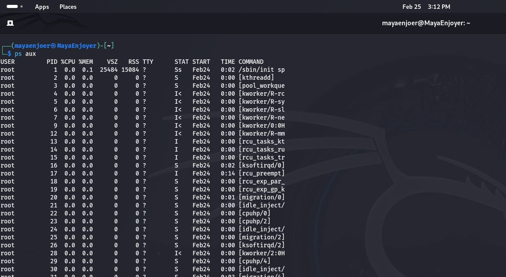

The output of the ps aux command contains the following columns:
```
USER → The user name from which the process was started.
PID → The process identifier.
%CPU → The percentage of processor usage.
%MEM → The percentage of RAM usage.
VSZ → The virtual size of the process in memory (in Kilobytes).
RSS → The size of the process's resident memory (in Kilobytes).
TTY → The terminal with which the process is associated.
STAT → The state of the process (for example, R - running, S - sleeping, Z - zombie).
START → The time the process started.
TIME → The time the process spent on the CPU.
COMMAND → The command that started the process.
```

Also, for a more detailed view of processes, we can use the `ps` command with the `-ef` option: `ps -ef`.
The `-e` option displays all processes, while `-f` provides a full output format with additional information such as the parent process identifier (PPID) and other details.

### How to pause a background process, then resume it and restart it if necessary?
In order to stop a background process, then resume it, and restart it if necessary, we need to apply the following steps:

1) To suspend the process, we need to press the key combination `Ctrl + Z`, this key combination suspends the current process, putting it in the stopped state and sending it to the background mode.

2) In order to view the background and suspended processes, we can use the `jobs` command, this command will display a list of current background and suspended processes in the current terminal session.

3) And in order to resume a suspended process, we can use the following command: `bg`, this command continues the execution of the suspended process in the background mode. But if we have several suspended processes, then we can specify the job number after the command, for example, `bg %1`.
So, we can use the `fg` command, it also brings a suspended or background process back to the foreground for further interaction. As with `bg`, we can also specify the task number, for example, `fg %1`.

4) But in order to restart a process, we need to know that if the process has been terminated and needs to be started again, then we need to enter the command to start that process again. For example, if it was the `nano` text editor,
then we just need to enter `nano` in the terminal.

---

### Next, let's work in the terminal and consolidate the studied material:

<h1 align="center">

    Practical tasks:
</h1>

### 1) Analysis of the `top` command, in practice:

To start real-time system monitoring, we need to use the following command in the terminal: `top`. After that, we will see a dynamic list of processes that will be constantly updated.

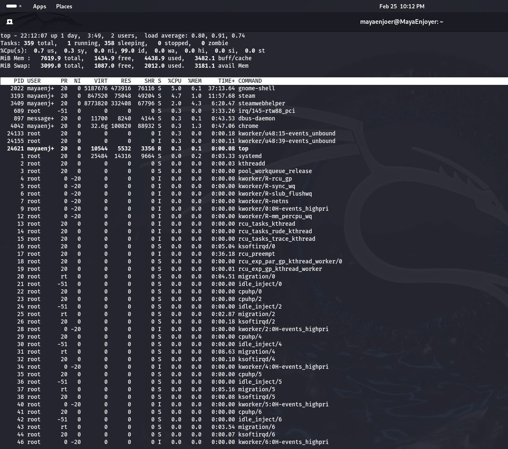

The top interface consists of two main parts: the header and the process table.

The header is located at the top, where general system information is displayed.

- System uptime (up): shows how much time has passed since the last reboot.

- Number of users: the number of active user sessions.

- Load average: three numbers that show the average number of processes waiting to be executed over the last 1, 5, and 15 minutes.

The process table, located in the main part of the output, contains information about each active process:

```
PID → unique process identifier.
USER → user who started the process.
PR (Priority) → process priority.
NI (Nice Value) → "nice" value that affects the priority.
VIRT → virtual memory used by the process.
RES → physical (resident) memory used by the process.
SHR → shared memory.
S (State) → the state of the process (for example, R - running, S - sleeping, Z - zombie, D - disk sleep, T - stopped ).R – running (running).
%CPU – percentage of CPU usage.
%MEM – percentage of RAM usage.
TIME+ – total process running time.
COMMAND – command that started the process.
```
For example, my OS has the following values: Uptime (22:12:07), Uptime (3:49), Number of users (2 users).
Average load `0.80, 0.91, 0.74` is the average number of processes waiting to be executed in the last `1`, `5` and `15` minutes.

Total number of tasks on my system - (Tasks: 359 total):

- 1 running – active process that is currently executing.

- 358 sleeping – processes that are in waiting mode.

- 0 stopped – stopped processes.

- 0 zombie – zombie processes.

CPU usage:

- 0.5% us – CPU usage by user processes.

- 0.0% sy – CPU usage by system processes.

- 0.0% ni – low priority processes.

- 99.5% id – CPU idle time.
- 0.0% wa – I/O wait.
- 0.0% hi, 0.0% si – hardware and program interrupts.

Memory usage (`MiB`,`Mem`, `Swap`):

- Total memory: 7619.1 MB.
- Free: 1343.9 MB.
- Used: 4448.9 MB.
- Caching: 3181.1 MB.

#### The most active processes in my Kali Linux OS are:
🟣 gnome-shell (PID 2022) – GNOME GUI shell process, uses 4.7% CPU and 7.9% RAM.

🟣 steam (PID 3139) – Steam process, uses 1.5% CPU and 9.6% RAM.

🟣 steamwebhelper (PID 3490) – Steam helper process, takes up 6.2% RAM.

🟣 chrome (PID 2480) – Google Chrome web browser.

---

### 2) Pause the `top` command:

To pause the execution of the `top` command, simply press the following key combination: `Ctrl + Z`.

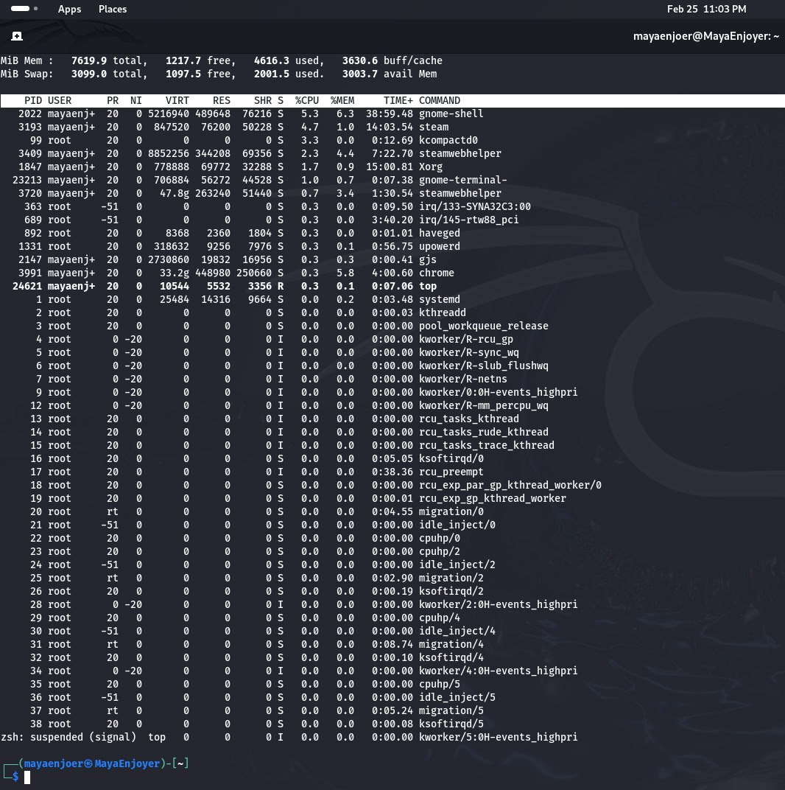

This key combination will send the `SIGTSTP` (Terminal Stop) signal to the process and put `top` in the suspended state. In order to bring it back to the background or foreground, we will need to use the following commands:
```
bg %task_number – continue execution in the background
fg %task_number – bring to foreground
```

---

### 3) Displaying information about processes using the `ps` command:

First, let's use the basic output command, which you can do by typing the following command into the terminal: `ps`.

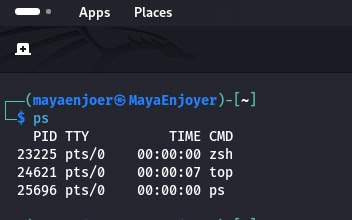

This command will list the processes running in the current terminal session, but usually the list is quite short, and mine is even shorter because I currently only have Telegram and the terminal open.

We can also output all processes for all users using the following command: `ps aux`.

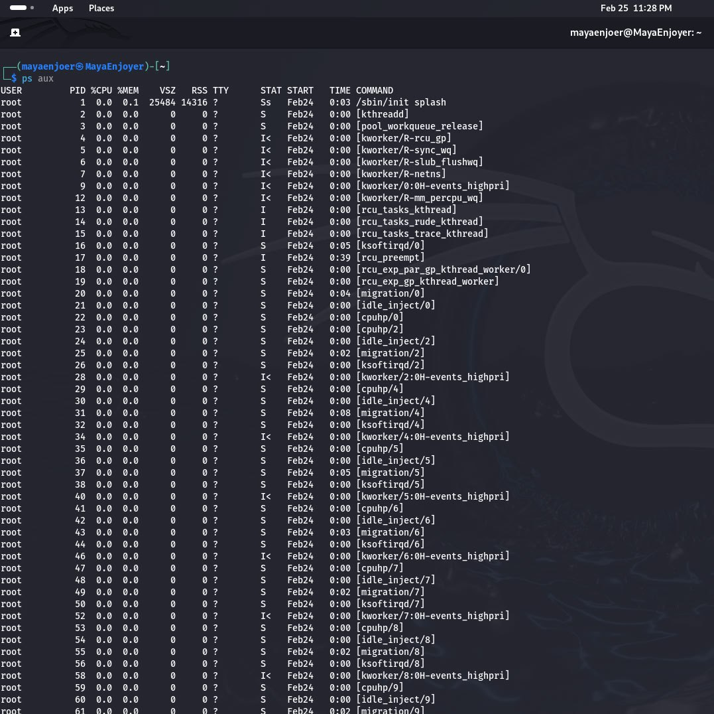

This command variant does not use hyphens before the parameters (i.e. `aux` instead of `-aux`), and prints a complete list of processes, including information about the user, PID, CPU and memory usage, uptime, and the command that started the process.

We can also use the extended output format, for this we need to use the following command in the terminal: `ps -ef`.

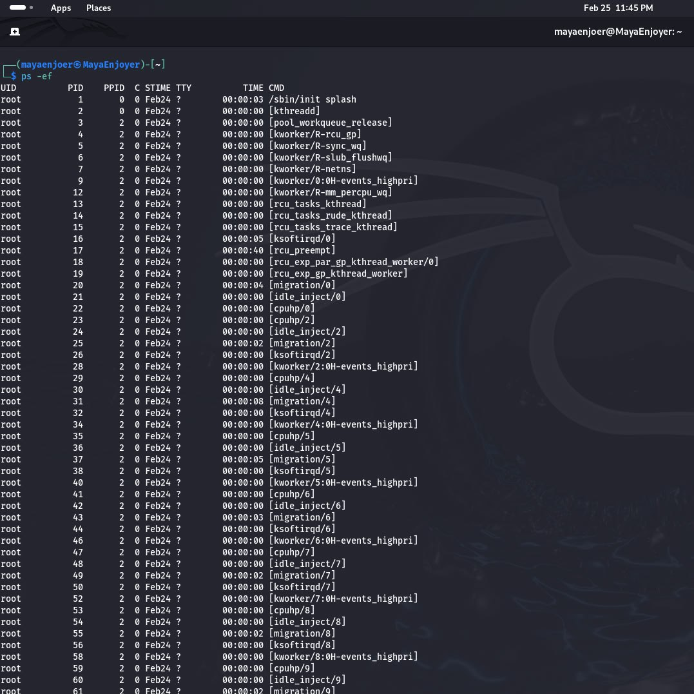

This option also shows all processes, but in a different format (columns: `UID`, `PID`, `PPID`, `C`, `STIME`, `TTY`, `TIME`, `CMD`).

!!!Need to know. In order to view all available parameters of the `ps` command, we can use the following commands:
```
man ps
OR
ps --help
```
Thus, the `ps` command allows you to obtain detailed information about the processes in the system, which is an important tool for diagnostics, monitoring and resource management.

### 4) 5 examples using different `ps` command parameters:

| **Command Example**                          | **Explanation**                                                                                                                                                                                                                                                                                                  |
|----------------------------------------------|------------------------------------------------------------------------------------------------------------------------------------------------------------------------------------------------------------------------------------------------------------------------------------------------------------------|
| `ps aux`                                     | `a` – shows processes of all users; `u` – displays information in a user-oriented format (name, CPU/memory usage, etc.); `x` – shows processes that do not have an associated terminal. Together they display a detailed list of all processes running on the system.                                            |
| `ps -u root`                                 | Lists all processes owned by the `root` user. This allows you to quickly identify system processes that typically run with elevated privileges.                                                                                                                                                                  |
| `ps -U sysadmin`                             | Lists processes owned by a specific user (in this example, `sysadmin`). This is useful when you want to track the activity of a specific user.                                                                                                                                                                   |
| `ps axjf`                                    | Used to display processes in a `tree format`, showing the hierarchy of processes (parent and child). `a` – shows processes from all users, `x` – includes processes without a terminal, `j` – displays additional information about process grouping, `f` – shows the hierarchy (forest).                        |
| `ps -eo pid,ppid,cmd,%cpu,%mem --sort=-%cpu` | Used to output selected fields: `pid` (process ID), `ppid` (parent process ID), `cmd` (command that started the process), `%cpu` and `%mem` (percentage of CPU and memory usage). The `--sort=-%cpu` option sorts processes by CPU usage in descending order to highlight the most resource-intensive processes. |


#### The `ps aux` command is used to get a complete list of processes on the system with detailed information about each process.


#### The `ps -u root` command allows us to quickly view only those processes that belong to the `root` user, this command is useful for monitoring system processes.

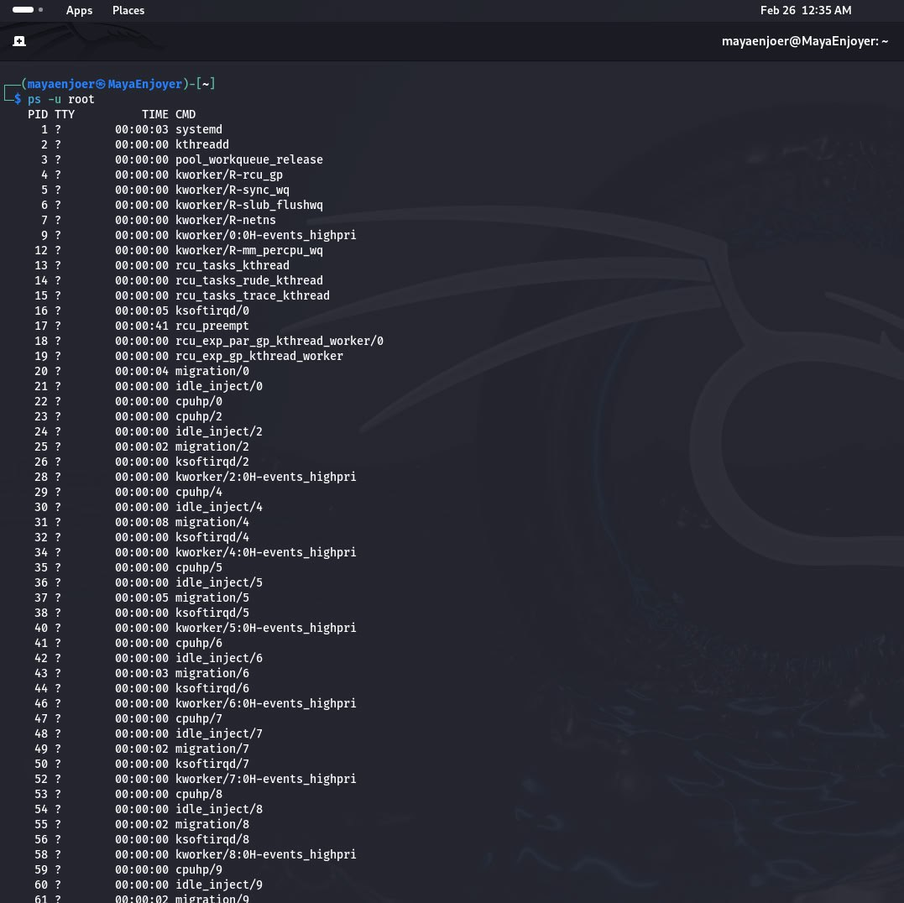

#### The `ps -U mayaenjoer` command displays processes for a specific user, which helps to localize the activity of a single user in the system.

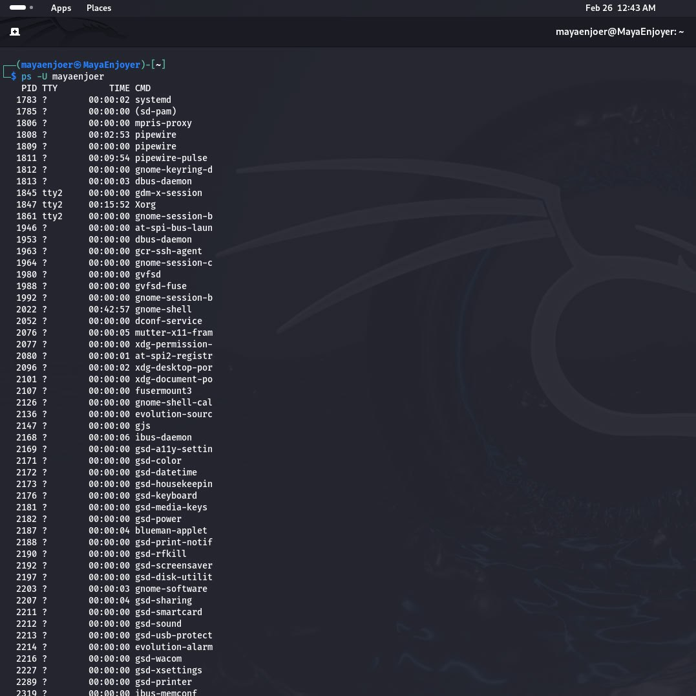

#### The `ps axjf` command displays processes in a tree view, which helps to understand the hierarchy of processes and the relationship between parent and child processes.

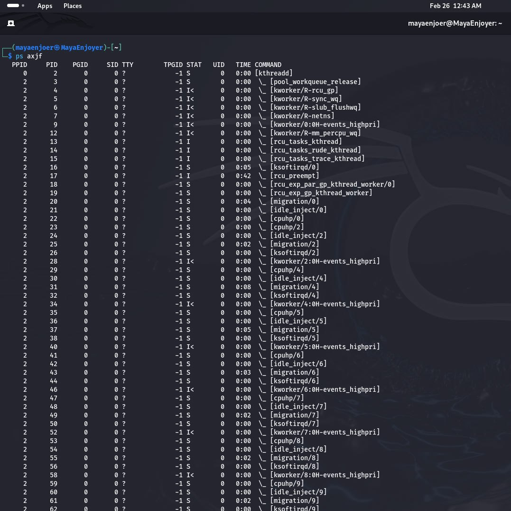

#### The command `ps -eo pid,ppid,cmd,%cpu,%mem --sort=-%cpu` displays selected fields of process information and sorts them by percentage CPU usage in descending order, allowing you to quickly identify the most resource-intensive processes.

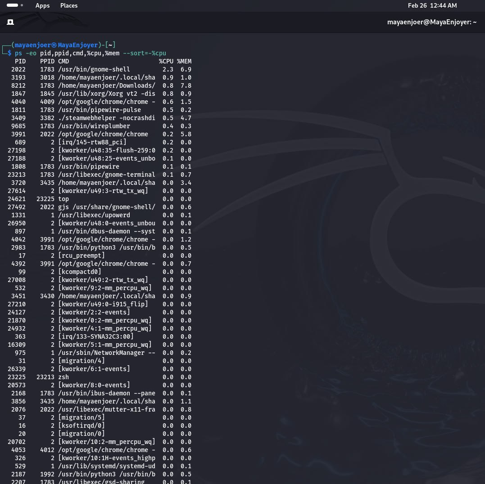

---

### 5) Check for running background processes:
To check if there are any running background processes, we can use the following command: `jobs`.


From the image, we can see that we have a suspended `top` process with PID 24621. This is because we previously ran the `top` command and then suspended it by pressing the `Ctrl + Z` key combination.

---

### 6) Resuming a suspended background process:
In order to bring a suspended process back to the foreground, we need to use the following command: `fg` with the task number, for us, it is the number 1: `fg %1`.

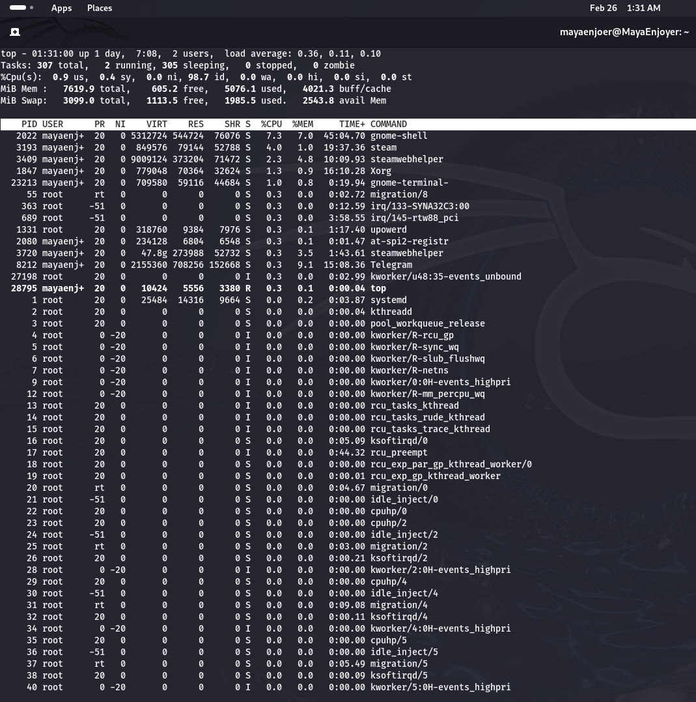

To pause the foreground process, we need to use the `Ctrl + Z` key combination again.

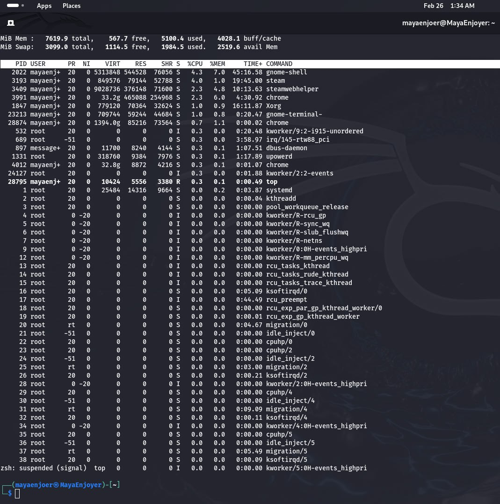

And in order to resume a suspended process in the background, we need to use the following command: `bg %1`.

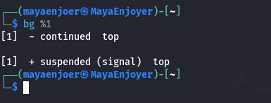

To terminate this background process, we need to use the `kill` command, but before using this command we need to determine the PID of the process, to determine the process, we can use the following command: `jobs -l`.

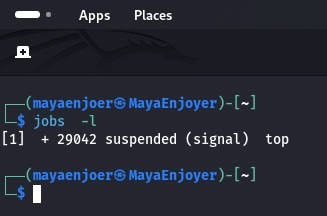

After that, we just need to terminate the process using the `kill` command, sending a process termination signal using its PID: `kill 29042`.

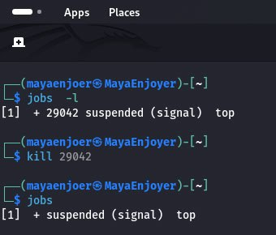

As we can see in the image, our command failed because our process is not responding to `SIGTERM`, but this problem can be solved by sending a `SIGKILL (9)` kill signal: `kill -9 29042`.

But I want to draw your attention that using `SIGKILL` is not recommended unless absolutely necessary, because the process will not be able to perform the termination operations.

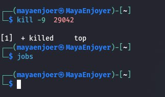

#### ❗❗❗ A small conclusion: The `kill` command works with the PID of the process, so it is important to first determine the correct PID using the `jobs -l` or `ps` command. However, use the `kill -9` command only in cases where the process does not terminate after the normal `kill` command, as forcing a termination may result in data loss or an incorrect system state.

---

## Answers to the control questions:
### 1) What is the purpose of the `/proc` directory in Kali Linux and just Linux systems? What information does it store?
`/proc` is not a real file system. It is virtual. Its main task is to obtain the state of the system and partially perform control actions.

The main purpose of `/proc` is that each running process has its own subdirectory, named after its PID. These subdirectories contain files that display various aspects of the process, such as memory usage, status, open file descriptors, etc. In addition to process data, `/proc` contains files and directories that provide information about the hardware and system settings.

#### Examples of useful files in `/proc`:

🟣 `/proc/cpuinfo`: Information about the central processor, including model, number of cores and clock speed.

🟣 `/proc/meminfo`: Statistics on the use of RAM.

🟣 `/proc/uptime`: System uptime since the last boot.

🟣 `/proc/loadavg`: Average load on the system for the last 1, 5 and 15 minutes.

🟣 `/proc/partitions`: Information about disk partitions recognized by the system.

🟣 `/proc/net/`: Directory containing information about network connections and interfaces.

Also, using the `cat` command, we can view the contents of these files. For example: `cat /proc/cpuinfo`.
This command will display detailed information about our processor.

### 2) How to dynamically determine which of any three processes is currently using the most memory? What percentage of the total memory does it consume?
In order to dynamically determine which of the three processes is currently using the most memory, we can use the `top` command with filtering by specific process PIDs.
To use the `top` commands with filtering by PID, we can use the following command: `top -p PID1 -p PID2 -p PID3`.
This command will open the `top` interface, which will display only the specified processes.

After that, we need to analyze our output and find the process with the highest value in the %MEM column, which will be the one consuming the largest percentage of memory.

If we press the M key in the `top` window, our processes will be sorted by memory usage in descending order.

Also, we can use the command `ps -p PID1,PID2,PID3 -o pid,%mem,rsz,cmd --sort=-%mem` to output the PID, the percentage of memory usage, the amount of resident memory, and the process sorted in descending order of memory usage.

### 3) How to get the hierarchy of parent processes in Linux systems?
To display the hierarchy, we can use the `pstree` command, which visualizes the process tree in a user-friendly format.
This command will display a process tree, with the `init` or `systemd` process at the root, and all child processes below it. Each level of indentation represents a new level of hierarchy.

```
systemd─┬─ModemManager───3*[{ModemManager}]
        ├─NetworkManager───3*[{NetworkManager}]
        ├─accounts-daemon───3*[{accounts-daemon}]
        ├─bluetoothd
        ├─colord───3*[{colord}]
        ├─cron
        ├─dbus-daemon
        ├─fwupd───3*[{fwupd}]
        ├─gdm3─┬─gdm-session-wor─┬─gdm-x-session─┬─Xorg───5*[{Xorg}]
        │      │                 │               ├─gnome-session-b───4*[{gnome-session-b}]
        │      │                 │               └─3*[{gdm-x-session}]
        │      │                 └─3*[{gdm-session-wor}]
        │      └─3*[{gdm3}]
        ├─haveged
        ├─polkitd───3*[{polkitd}]
        ├─rtkit-daemon───2*[{rtkit-daemon}]
        ├─smartd
        ├─systemd─┬─(sd-pam)
        │         ├─Telegram───58*[{Telegram}]
        │         ├─at-spi-bus-laun─┬─dbus-daemon
        │         │                 └─4*[{at-spi-bus-laun}]
        │         ├─at-spi2-registr───3*[{at-spi2-registr}]
        │         ├─blueman-tray───4*[{blueman-tray}]
        │         ├─chrome_crashpad───2*[{chrome_crashpad}]
        │         ├─chrome_crashpad───{chrome_crashpad}
        │         ├─dbus-daemon
        │         ├─dconf-service───3*[{dconf-service}]
        │         ├─evolution-addre───6*[{evolution-addre}]
        │         ├─evolution-calen───9*[{evolution-calen}]
        │         ├─evolution-sourc───4*[{evolution-sourc}]
        │         ├─gcr-ssh-agent───2*[{gcr-ssh-agent}]
        │         ├─2*[gjs───11*[{gjs}]]
        │         ├─gnome-keyring-d───4*[{gnome-keyring-d}]
        │         ├─gnome-session-b─┬─blueman-applet───4*[{blueman-applet}]
        │         │                 ├─evolution-alarm───7*[{evolution-alarm}]
        │         │                 ├─gnome-software───12*[{gnome-software}]
        │         │                 ├─gsd-disk-utilit───3*[{gsd-disk-utilit}]
        │         │                 └─4*[{gnome-session-b}]
        │         ├─gnome-session-c───{gnome-session-c}
        │         ├─gnome-shell─┬─bash───steam─┬─steam-runtime-l───2*[{steam-runtime-l}]
        │         │             │              ├─steam-runtime-s───srt-bwrap───pressure-vessel─┬─steamwebhelper─┬─steamwebhelper───steamwebhelper───22*[{steamwebhelper}]
        │         │             │              │                                               │                ├─steamwebhelper───steamwebhelper─┬─steamwebhelper───5*[{steamwebhelper}]
        │         │             │              │                                               │                │                                 └─2*[steamwebhelper───11*[{steamwebhelper}]]
        │         │             │              │                                               │                ├─steamwebhelper───9*[{steamwebhelper}]
        │         │             │              │                                               │                └─209*[{steamwebhelper}]
        │         │             │              │                                               └─steamwebhelper───2*[{steamwebhelper}]
        │         │             │              └─40*[{steam}]
        │         │             ├─chrome─┬─2*[cat]
        │         │             │        ├─chrome───chrome───17*[{chrome}]
        │         │             │        ├─chrome───chrome─┬─chrome───7*[{chrome}]
        │         │             │        │                 └─2*[chrome───9*[{chrome}]]
        │         │             │        ├─chrome───16*[{chrome}]
        │         │             │        ├─chrome───7*[{chrome}]
        │         │             │        └─37*[{chrome}]
        │         │             ├─gjs───12*[{gjs}]
        │         │             ├─mutter-x11-fram───9*[{mutter-x11-fram}]
        │         │             └─19*[{gnome-shell}]
        │         ├─gnome-shell-cal───6*[{gnome-shell-cal}]
        │         ├─gnome-terminal-─┬─zsh───pstree
        │         │                 └─5*[{gnome-terminal-}]
        │         ├─goa-daemon───4*[{goa-daemon}]
        │         ├─goa-identity-se───3*[{goa-identity-se}]
        │         ├─gsd-a11y-settin───4*[{gsd-a11y-settin}]
        │         ├─gsd-color───4*[{gsd-color}]
        │         ├─gsd-datetime───4*[{gsd-datetime}]
        │         ├─gsd-housekeepin───4*[{gsd-housekeepin}]
        │         ├─gsd-keyboard───4*[{gsd-keyboard}]
        │         ├─gsd-media-keys───5*[{gsd-media-keys}]
        │         ├─gsd-power───5*[{gsd-power}]
        │         ├─gsd-print-notif───3*[{gsd-print-notif}]
        │         ├─gsd-printer───3*[{gsd-printer}]
        │         ├─gsd-rfkill───3*[{gsd-rfkill}]
        │         ├─gsd-screensaver───3*[{gsd-screensaver}]
        │         ├─gsd-sharing───4*[{gsd-sharing}]
        │         ├─gsd-smartcard───4*[{gsd-smartcard}]
        │         ├─gsd-sound───4*[{gsd-sound}]
        │         ├─gsd-usb-protect───4*[{gsd-usb-protect}]
        │         ├─gsd-wacom───3*[{gsd-wacom}]
        │         ├─gsd-xsettings───4*[{gsd-xsettings}]
        │         ├─gvfs-afc-volume───4*[{gvfs-afc-vol
```

If we look at my description of the process hierarchy in Kali Linux, we can see that my process tree starts with `systemd`, which is the initialization process (PID 1) and controls all other processes in the system.

That is, `systemd` (PID 1) is the main process that manages the launch of system services and user processes.

`ModemManager`, `NetworkManager`, `dbus-daemon`, `polkitd`, `cron` and others are responsible for connecting to the network, managing access policies, sending messages between processes and scheduling tasks.

The graphical subsystem `gdm3 → gdm-session-worker → Xorg`

`gnome-session-b`, `gnome-shell`, `mutter-x11-fram` start the GNOME environment and provide the graphical interface.

User processes such as:
- `Telegram` is a messenger running in the background.

- `chrome_crashpad` — Chrome module for collecting errors.
- `gnome-terminal → zsh → pstree` — indicates that you are viewing the process tree in the terminal.
- `steam → steam-runtime → steamwebhelper` — Steam gaming platform and its helper processes.

Background services such as:

- `gsd-*` (GNOME Settings Daemon) — responsible for keyboard shortcuts, power, sound, printers and other settings of the GNOME environment.
- `evolution-*` — components of the Evolution email client.
- `blueman-*` — utilities for managing Bluetooth.

### 4) What is the difference between the `top` command and the `ps` command?

| **Criteria**           | **`top`**                                                                                                                                                     | **`ps`**                                                                                                                                                                                                                                 |
|------------------------|---------------------------------------------------------------------------------------------------------------------------------------------------------------|------------------------------------------------------------------------------------------------------------------------------------------------------------------------------------------------------------------------------------------|
| **Information Update** | Dynamic real-time update; by default, the interface is updated every 3 seconds, providing up-to-date data on the state of the system and processes.           | A one-time snapshot of the system state at the time of command execution; does not update automatically.                                                                                                                                 |
| **Interactivity**      | Interactive interface that allows the user to interact with the program while it is running: sort processes, change the display, terminate processes, etc.    | Non-interactive command; displays information and terminates without the possibility of interaction during execution.                                                                                                                    |
| **Resource Usage**     | Constantly consumes CPU resources while running due to regular screen refreshes.                                                                              | Uses minimal resources as it is run once and completes quickly.                                                                                                                                                                          |
| **Output Flexibility** | Limited flexibility; main focus is on interactive display of information. Some parameters can be changed while running, but overall customization is limited. | High flexibility; allows the user to choose which fields to display, filter processes by various criteria, sort output, and format it as needed. For example, you can display only processes of a specific user or sort by memory usage. |
| **Main purpose**       | Real-time system monitoring with the ability to interact; convenient for quick monitoring of the system status and process management.                        | Obtaining detailed information about processes at the time of command execution; useful for creating reports, scripts, and detailed analysis of the system status.                                                                       |

The choice between `top` and `ps` usually depends on your specific needs: `top` is better suited for continuous monitoring and interaction with processes, while `ps` is more convenient for obtaining static reports or using in scripts.

### 5) What additional features does `htop` implement compared to `top`?
The `top` and `htop` commands are designed to monitor processes, but `htop` provides additional features and an improved interface compared to `top`. For example, let's consider the following aspects:

1) `top` uses a simple text interface without color highlighting, effects, etc.
While `htop` offers a color interface with visual indicators that help you navigate faster and more comfortably.

2) `top` is controlled only by the keyboard, while `htop` supports both the keyboard and mouse for navigation.

3) `top` shows processes, usually sorted by CPU usage, without the ability to display a hierarchy, while `htop` can display processes in a tree view, showing the relationships between parent and child processes, which helps you better understand the structure of running tasks.

4) To end a process with the `top` command, you need to enter its PID after pressing the `k` key, while `htop` allows you to end processes directly through the interface by selecting the process using the keyboard or mouse and pressing `F9`.

5) `top` has limited customization options, changes require editing configuration files or using complex key combinations, while `htop` offers interactive customization through a built-in menu (`F2` key), which allows you to easily change the appearance and behavior of the program according to our needs.

Therefore, we can conclude that `htop` is much more convenient and better than `top`.

### 6) Mobile OS components for monitoring processes running in the system?
To monitor, we need to open "Settings", then we need to go to the "Device maintenance" section, and click
"RAM", after that we will be able to see a list of applications and processes that use memory in real time.

In order to view developer options, we need to open "Settings", then go to the "About phone" section, and click several times on "Build number" until a message appears about activating developer mode. After these actions, we can view running processes, for this we will need to return to "Settings", and go
to the newly created "Developer options" section, and select
"Running services" there information about processes, etc. will be displayed.

### 7) Does the mobile OS support terminal control of process operations?
Yes, my OS supports terminal process control thanks to its Linux kernel base.

We can do this only if we connect the phone to the computer via USB, and enable "USB debugging" in developer mode, after which we only have to open a terminal on the computer and enter the following commands:
```
adb shell
ps
top
kill <PID>
```

We can also use a terminal emulator on the phone itself. To do this, we need to install an application, for example, `Termux`, etc., and enter the following commands through it:
```
top
ps aux
kill -9 <PID>
```

### 8) Is it possible to install third-party software that allows you to organize the management and monitoring of process operations?

Of course, we can install third-party programs to monitor the operation of processes.

Here are some examples of such applications:

• Termux - a terminal emulator that allows you to run standard Linux commands (for example, `ps`, `top`, `kill`). Using Termux, you can access information about running processes.

• OS Monitor or SystemPanel 2 - applications with a convenient graphical interface that allow you to view running processes, resource usage statistics and, in some cases, terminate unwanted processes. But keep in mind that some functions may require `root access`.

These are the programs with which we can monitor the operation of the processor, etc.

---

#### Conclusions: So, I completed laboratory work No. 4, during which we examined the basic commands for managing processes and learned how to use them in the terminal.

AND AS ALWAYS IN MY TRADITION, I WISH EVERYONE TO BE HEALTHY AND FIND TRUE HAPPINESS IN THIS WORLD, BECAUSE REMEMBER, A MAN DIES AND GOES TO THE ENDLESSNESS WITHOUT A PURPOSE, LOVE AND HAPPINESS! SO I WISH YOU SUCCESS IN LEARNING KALI LINUX. I LOVE YOU ALL AND SEE YOU AGAIN ;)


