<h1 align="center">
    
    <br />
    Laboratory work with Kali Linux №5
</h1>

#### In this work, I will do lab #5, applying knowledge of Kali Linux. This work is created for the purpose of educational content, as an assignment for the discipline Operating Systems of the Kyiv College of Communications.

Topic: “Introducing file system navigation commands and managing files and directories”

Objectives:
1) Gain practical skills in working with the Bash shell.
2) Become familiar with basic commands for navigating the file system.
3) Become familiar with basic commands for managing files and directories.

---

#### In this article, I'm going to answer questions about the Kali Linux operating system and simply Linux.


## Before we begin, let's consider the following question:

### Comparison of the file structure of a Windows-like and Linux-like system:

#### Directory structure:
Kali Linux file systems do not have Windows, Program Files, or Users folders (although the `/home/` directory is very similar to the Users folder in Windows).

The Kali Linux directory structure doesn't just use different names for folders and files. It uses a different principle for their location. For example, an application on Windows might store all its files in `C:\Program Files\application_name`, while on Kali Linux those files would be split across multiple locations: binaries would be in `/usr/bin`, libraries in `/usr/lib`, and configuration files in `/etc/`.

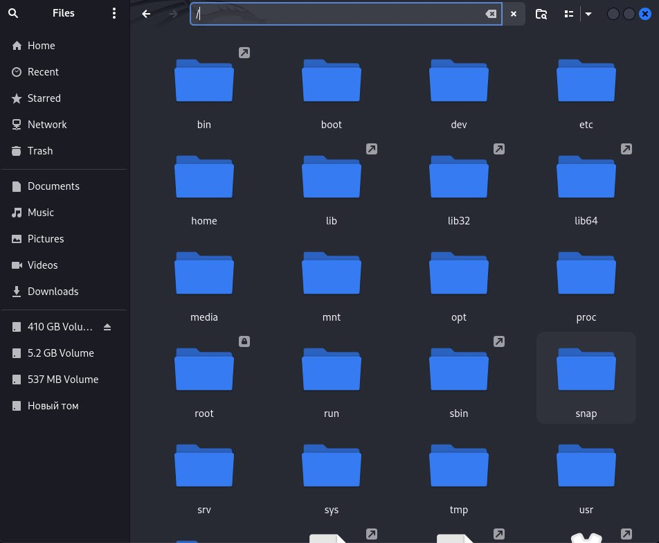

#### <p style="text-align: center;"> Directory structure in Debian Linux</p>

#### Case sensitivity:
In Windows, we cannot have `file` and `FILE` in the same folder at the same time. The Windows file system is not case-sensitive, so it treats similar names as the name of a single file.

In Kali Linux, the file system is case-sensitive. This means that we can have files named `file`, `File`, and `FILE` in the same folder. However, the files will differ in their content because Kali Linux treats uppercase and lowercase letters as different characters.

#### Slash vs. Backslash:
Windows, like DOS, uses backslashes. For example, the path to a user directory in Windows looks like this:
`C:\Users\Max`.

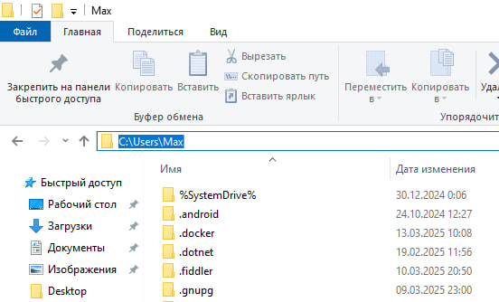

In Linux, the path to the user's home directory is:
`/home/mayaenjoer`.

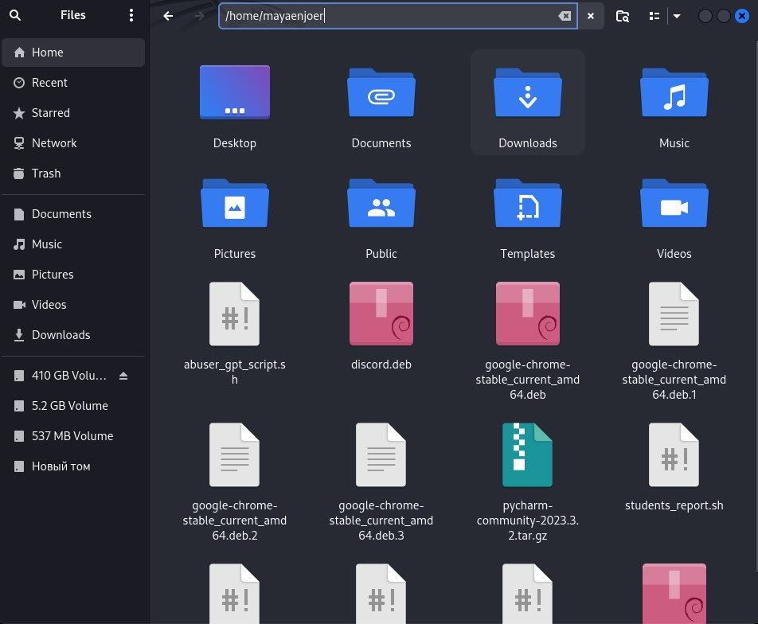

#### The `/` symbol instead of a drive letter:

Each partition or entire Windows drive is assigned a corresponding letter. Regardless of whether we have multiple hard drives, multiple partitions on a single hard drive, or connected removable devices, each file system is accessible under its own letter.

In Kali Linux, it's a little different: instead of letters, paths to different directories are used (this is also possible in Windows, but you need to configure it all additionally).

In Kali Linux, all files are located in `/` — the root directory. There are no files outside the root directory. When we connect a device to the computer, it is mounted (connected) in the `/media/` section. In this case, the contents of the directory will reflect the contents of the mounted section.
So if we have multiple hard drives or hard drive partitions, we can mount them anywhere in our file system. For example, we can put our home directories on a separate partition by mounting it at `/home` or any other directory, even `/myBackupDrive`.

#### Deleting or replacing open files:
In Kali Linux and other UNIX-like operating systems, programs usually do not block access to files the way Windows does. For example, let's say we are watching a movie through VLC media player in Windows. There are subtitles, we have stopped watching the movie and therefore try to delete it. The system will give an error message - ``you need to stop watching the file in VLC before you can delete the movie (rename it or do anything else with it)``.

In Linux, it is usually possible to delete or modify a video file while it is playing. And we will not see error messages saying that the file is currently in use by another program.

### What is FHS? And what standard is used in the context of file systems?
#### The FHS defines the structure and content/purpose of directories in Linux distributions. Thanks to this standard, the directory structure in all Linux distributions is (almost) the same.

#### <p style="text-align: center;"> Directory structure in Linux Linux</p>

| Directory | Usage                                                                                        |
|-----------|----------------------------------------------------------------------------------------------|
| `/`       | Root of the virtual directory, where normally, no files are placed.                          |
| `/bin`    | Binary directory, where many GNU user-level utilities are stored.                            |
| `/boot`   | Boot directory, where boot files are stored.                                                 |
| `/dev`    | Device directory, where Linux creates device nodes.                                          |
| `/etc`    | System configuration files directory.                                                        |
| `/home`   | Home directory, where Linux creates user directories.                                        |
| `/lib`    | Library directory, where system and application library files are stored.                    |
| `/media`  | Media directory, a common place for mount points used for removable media.                   |
| `/mnt`    | Mount directory, another common place for mount points used for removable media.             |
| `/opt`    | Optional directory, often used to store third-party software packages and data files.        |
| `/proc`   | Process directory, where current hardware and process information is stored.                 |
| `/root`   | Root home directory.                                                                         |
| `/sbin`   | System binary directory, where many GNU admin-level utilities are stored.                    |
| `/run`    | Run directory, where runtime data is held during system operation.                           |
| `/srv`    | Service directory, where local services store their files.                                   |
| `/sys`    | System directory, where system hardware information files are stored.                        |
| `/tmp`    | Temporary directory, where temporary work files can be created and destroyed.                |
| `/usr`    | User binary directory, where the bulk of GNU user-level utilities and data files are stored. |
| `/var`    | Variable directory, for files that change frequently, such as log files.                     |

Directory structure in Linux:
Linux is based on Unix, and therefore borrows its file system hierarchy from it. A similar directory structure can be found in Unix-like operating systems such as BSD and macOS.

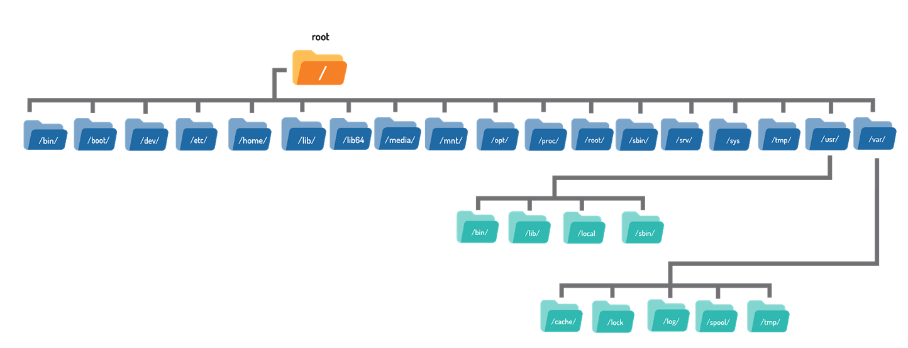

#### 🟣 / — root directory:
All files and directories in Linux are located in the `/` directory, which is called the root directory. If we look at the directory structure, we will notice that it resembles the root of a tree.
Since all other directories or files originate from the root, the absolute path to each of them starts from the root directory. For example, if we have a file in `/home/user/documents`, we can guess that the directory structure goes from `root->home->user->documents`.

#### 🟣 /bin — binaries:
The `/bin` directory contains the binaries of many of the basic programs and utilities (`ls`, `cp`, `cd`, etc.) that must be present when mounting a system in single-user mode. Programs such as `Firefox` are stored in `/usr/bin`, while important system programs and utilities such as the `bash` shell are located in `/bin`.

#### 🟣 /boot — boot files:
The `/boot` directory contains files needed to boot the system.

#### 🟣 /cdrom — historically established directory for CD-ROMs: 
The `/cdrom` directory is not part of the `FHS`, but we may still encounter it, for example, in Ubuntu or other Linux distributions. It is a temporary location for CDs. However, the standard location for temporary media is inside the `/media` directory.

#### 🟣 /dev — device files:
Various devices are perceived and displayed by the Linux system as files stored in the `/dev` directory. It is worth noting that these are not real files as we perceive them, but a special type (interface) used by the operating system to interact with devices. For example, if we take the file `/dev/sda`, which is the first SATA disk in the system. If we want to partition it, we can start a partition editor and ask it to edit the `/dev/sda` file. The `/dev/sr` file is a CD-ROM, and the `/dev/wlan` file corresponds to a wireless network interface. Also in this directory there may be special pseudo-device files that do not actually correspond to real hardware, for example:

- `/dev/null` is a special device that does not perform output and automatically discards all input data. When we transfer the output of any command to the `/dev/null` device, all this information will simply be discarded;

- `/dev/random` is a random number generator;

- `/dev/zero` is a source of an infinite sequence of zero bytes.

#### 🟣 /etc — configuration files:
The `/etc` directory contains the main system configuration files used by the system administrator and its services, such as the password file and network configuration files. These can usually be edited manually in a text editor. However, if we need to make changes to the system configuration (for example, change the hostname), this is where we should look for the necessary files. Keep in mind that the `/etc` directory contains system-wide configuration files.

#### 🟣 /usr — user binaries and program data:
The `/usr` directory contains executables, library files, and header files for most user programs. Therefore, almost all of them are read-only (for a regular user).

- `/usr/bin` — basic user utilities;

- `/usr/sbin` — additional utilities for system administration and configuration;

- `/usr/lib` — utility libraries from `/usr/bin` and `/usr/sbin`;

- `/usr/share` — contains documentation or data common to all libraries.

#### 🟣 /lib — shared library directory:
The `/lib` directory contains libraries required by the binaries in the `/bin` and `/sbin` directories.

#### 🟣 /sbin — system utilities:
The `/sbin` directory is similar to the `/bin` directory. It contains the main binary files of system administration utilities that are usually intended to be run by the root user (`ifconfig`, `dhclient`, `dmidecode`, `init`, etc.).

#### 🟣 /tmp — temporary files:
The `/tmp` directory stores temporary files of used programs.
But I want to draw your attention that when you reboot the system, the contents of the `/tmp` directories are deleted. Some Linux systems may automatically delete old files at any time, so do not store anything important here.

#### 🟣 /var — variable data files:
The `/var` directory is a writable analogue of the `/usr` directory. Log files, program caches, print queue information, and general information from the time the system was started are all written to the `/var` directory.
The files stored here are not automatically purged. For this reason, this directory is of great interest to system administrators looking for information about the behavior of their system.

#### 🟣 /proc — process files:
The `/proc` directory is similar to the `/dev` directory in that it does not contain regular files, but special files that provide information about running processes and the state of the kernel. The contents of the `/proc` directory are used by various utilities to obtain system information at the runtime stage.

#### 🟣 /opt — optional software:
The `/opt` directory contains subdirectories for additional software packages. It is typically used by proprietary software that does not follow the standard filesystem hierarchy, for example, a proprietary program may install its files in `/opt/application`.

#### 🟣 /root — the home directory of the root: 
The `/root` directory is the home directory of the root user. Instead of being located in `/home/root`, it is located in `/root`. This directory should be distinguished from the `/` directory, which is the root directory for the entire system.

#### 🟣 /media — mount point for removable media:
When you connect an external storage device, such as a USB drive, SD card, or DVD, a corresponding folder is automatically created for it in the `/media` directory. You can use this folder to access the contents of the removable storage device.

#### 🟣 /mnt — mount directory:
The `/mnt` directory is similar to the `/media` directory, but instead of automatically mounting removable media, `/mnt` is used by system administrators to manually mount various file systems.

#### 🟣 /srv — service data:
The `/srv` directory contains data about the services provided by the system. If we are using the Apache HTTP server to serve a website, then we are most likely storing our site files inside the `/srv` directory.

#### 🟣 /run — application state files:
The `/run` directory provides applications with a standard place to store temporary files and data that are needed by various processes since the system has started (sockets, process IDs, etc.). These files are not stored in `/tmp` because they can be deleted from `/tmp`.

#### 🟣 /home — personal user directories:
The `/home` directory is a repository for the home directories of system users, where they store their personal files, notes, utilities, etc. The home directory contains the user's data and configuration files.
When a new user is created in a Linux system, a corresponding home directory is usually created for him.

### Basic commands for working with files:

#### Basics of working with files and directories in Linux:

#### 1. Viewing files and directories:

- `ls` — lists files and directories.

- `pwd` — displays the current directory.

#### 2. Navigating the file system:

- `cd` — move to another directory.

- `cd ..` — move up one level.

- `cd ~` — move to the home directory.

#### 3. Creating files and directories:

- `touch filename` — creates a new empty file.

- `mkdir directory_name` — creates a new directory.

- `mkdir -p dir1/dir2` — creates subdirectories.

#### 4. Copying files and directories:

- `cp` — copies files or directories.

- `cp -r dir1 dir2` — copies a directory along with all its contents.

#### 5. Moving and renaming files: 

- `mv` — move or rename files.

- `mv filename /path/to/directory/` — moves a file to the specified directory.

#### 6. Deleting files and directories:

- `rm` — delete files and folders.

- `rm -r directory_name` — deletes a directory and all its files.

`rm -rf /path/to/directory` — forcefully deletes a directory and all its contents.

#### 7. Additional useful commands:

- `find /path -name filename` — searches for a file in the specified directory.

- `locate filename` — searches for a file on the system using the mlocate database.

---

### Next, let's work through all the command examples presented in the labs of the NDG Linux Essentials course (Labs 7-8):

| Command name                             | Purpose and functionality                                                                           |
|------------------------------------------|-----------------------------------------------------------------------------------------------------|
| `pwd`                                    | Determines the user's location in the file system, shows the current working directory.             |
| `cd Documents`                           | Go to the `Documents` directory, if it exists in the current directory.                             |
| `cd`                                     | Go to the user's home directory.                                                                    |
| `cd /home/sysadmin`                      | Go to the `/home/sysadmin` directory specified by the absolute path.                                |
| `cd /home/sysadmin/Documents/School/Art` | Go to the `Art` subdirectory.                                                                       |
| `cd ..`                                  | Go up one level in the file hierarchy.                                                              |
| `cd ../../Downloads`                     | Go to the `Downloads` directory, using two levels up in the hierarchy.                              |
| `ls`                                     | Lists the files and folders in the current directory.                                               |
| `ls /var`                                | List the files in the `/var` directory.                                                             |
| `type ls`                                | Determines the type of the `ls` command, whether it is an internal command, script, or binary file. |
| `\ls`                                    | Execute the `ls` command, ignoring any aliases set.                                                 |
| `ls -a`                                  | List all files in a directory, including hidden ones (`.` and `..`).                                |
| `ls -l /var/log/`                        | List the files in `/var/log/` in verbose form.                                                      |
| `ls -lh /var/log/lastlog`                | List the file `/var/log/lastlog` in a readable format (file size in a convenient format).           |
| `ls -d`                                  | List only directories without their contents.                                                       |
| `ls -ld`                                 | List information about the current directory.                                                       |
| `ls -R /etc/ppp`                         | Recursively list the contents of the `/etc/ppp` directory and all its subdirectories.               |
| `ls /etc/ssh`                            | List the files in the `/etc/ssh` directory.                                                         |
| `ls -lS /etc/ssh`                        | Sort files in `/etc/ssh` by size (largest to smallest).                                             |
| `ls -lSh /etc/ssh`                       | Similar to `ls -lS`, but the file sizes are in a human-readable format.                             |
| `ls -tl /etc/ssh`                        | List files in `/etc/ssh` sorted by modification date.                                               |
| `ls -t --full-time /etc/ssh`             | List detailed information about files in `/etc/ssh` with full modification times.                   |
| `ls -lrS /etc/ssh`                       | Sort files in `/etc/ssh` in reverse order by size.                                                  |
| `ls -lrt /etc/ssh`                       | Sort files in `/etc/ssh` in reverse order by modification time.                                     |
| `echo /etc/t*`                           | List all files starting with `t` in `/etc/`.                                                        |
| `echo /etc/*.d`                          | List all files ending with `.d` in `/etc/`.                                                         |
| `echo /etc/r*.conf`                      | List all files starting with `r` and ending with `.conf` in `/etc/`.                                |
| `echo /etc/t???????`                     | List all files starting with `t` and containing exactly 7 characters.                               |
| `echo /etc/[a-d]*`                       | List all files in `/etc/` that start with the letters `a-d`.                                        |
| `cp /etc/hosts ~`                        | Copies the file `/etc/hosts` to the home directory.                                                 |
| `cp -v /etc/hosts ~`                     | Copies a file with output about the copy.                                                           |
| `cp /etc/hostname example.txt`           | Copies the file `/etc/hostname` to `example.txt`.                                                   |
| `mv hosts Videos`                        | Moves the file `hosts` to the `Videos` directory.                                                   |
| `mv /etc/hosts .`                        | Moves the file `/etc/hosts` to the current directory.                                               |
| `mv example.txt Videos/newexample.txt`   | Moves a file to `Videos` and renames it to `newexample.txt`.                                        |
| `touch sample`                           | Creates an empty file `sample` if it does not exist.                                                |
| `rm sample`                              | Deletes the file `sample`.                                                                          |
| `rm -i *.txt`                            | Deletes all files with the `.txt` extension, asking for confirmation.                               |
| `rm Videos`                              | Deletes the file `Videos` (if it is a file, not a directory).                                       |
| `rm -r Videos`                           | Deletes the directory `Videos` and all files in it.                                                 |
| `rmdir Documents`                        | Deletes the empty directory `Documents`.                                                            |
| `mkdir test`                             | Creates the directory `test`.                                                                       |

---

### Next, let's work in the terminal and consolidate the studied material:

<h1 align="center">

    Practical tasks:
</h1>

#### 1) Determining the current working directory:
In order to determine the current working directory in the Kali Linux terminal, we need to use the following command: `pwd`.

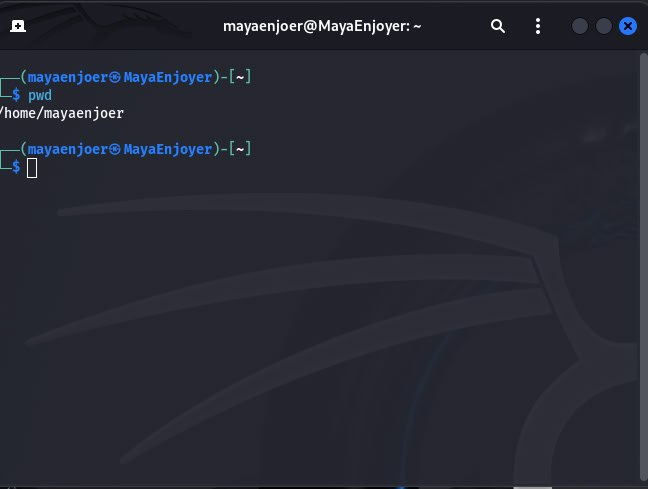

This command (print working directory) prints the path to the current directory we are currently in.

#### 2) To go to a specific directory and determine the current working directory:
In order to go to the root directory `/` and determine the current working directory, we need to use the following commands:
```
cd /
pwd
```
- `cd /` — the command changes the current working directory to the root `/`.
- `pwd` — displays the path to the current directory.

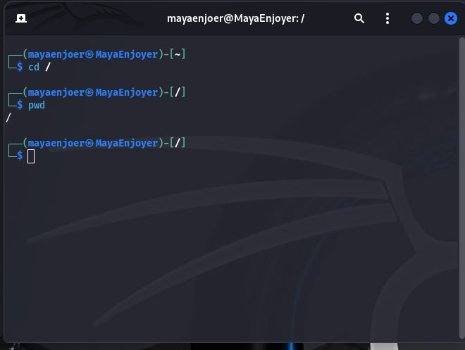

#### 3) View the contents of the current directory in long format:
To view the contents of the current directory in long format, we need to use the following command: `ls -l`.
``` 
ls — displays a list of files and directories in the current directory.
-l (long format) — displays detailed information about files, including permissions, owner, group, size, modification date, and name.
```
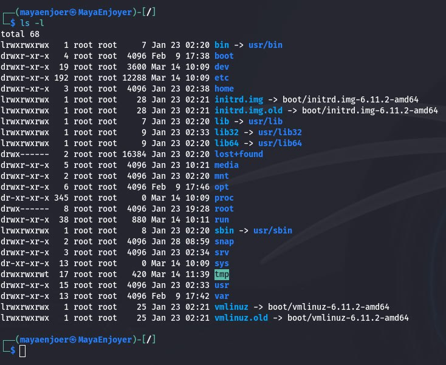

#### 4) Go to the `/usr/share` directory and determine the current working directory:
In order to go to the `/usr/share` directory and determine the current working directory, we need to use the following commands:
```
cd /usr/share
pwd
```
- `cd /usr/share` — changes the current directory to `/usr/share`.
- `pwd` — displays the path to the current working directory.

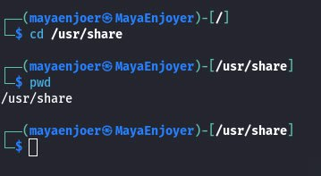

#### 5) View the contents of the current directory including hidden files:
To view the contents of the current directory, including hidden files, we need to use the following command: `ls -a`.

- `ls` — displays the contents of the directory.
- `-a` — displays all files, including hidden ones.

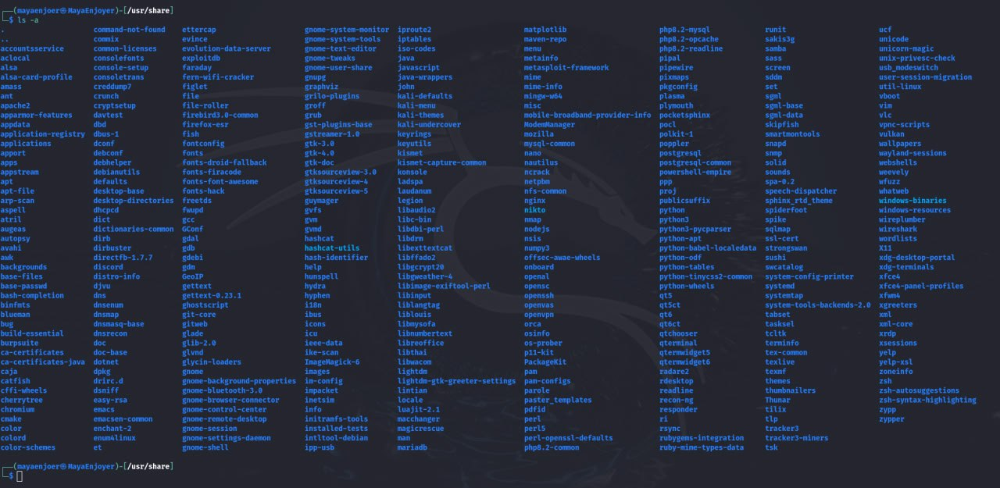

#### 6) Go to the `/etc` directory:
To go to the `/etc` directory, we need to use the following command: `cd /etc`.

- `cd` — changes the current working directory.
- `/etc` — the absolute path to the `/etc` directory, which contains the system configuration files.

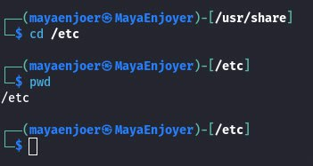

#### 7) View the contents of this directory to display only file names that begin with the letter `M`:
In order to view the contents of the `/etc` directory, displaying only files that start with the letter `M`, we need to use the following command: `ls /etc/M*`.

- `ls` is a command to list files in a directory.
- `/etc/M*` is a filter that displays only files that start with `M`.

🟣 But if the name starts with a lowercase letter, we will use the following command: `ls /etc/m*`.

🟣 If we want to display only those directories that start with our letter, we need to use the following command: `ls -d /etc/M*/`.

🟣 And also in order to view detailed information about such files, we need to use the following command: `ls -l /etc/M*`.

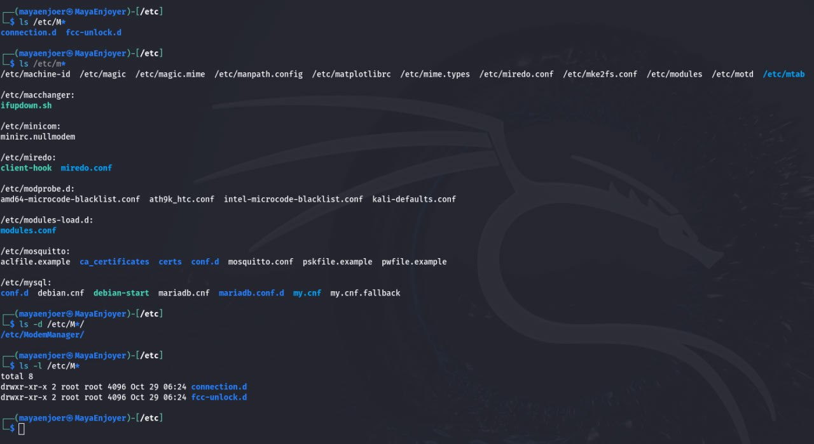

#### 8) View the contents of this directory to display only files whose names consist of 6 letters:
To view the contents of the `/etc` directory and list only files with 6-letter names, we need to use the following command: `ls /etc/??????`.

- `ls` is a command to list files in a directory.
- `/etc/??????` is a filter that uses `?` as a pattern for each letter in a file name.

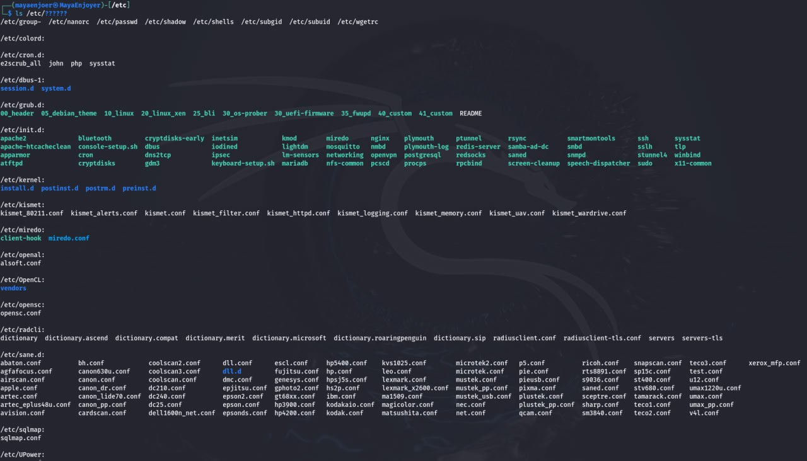

Additional commands:

🟣 To list only files (without directories), we need to use the following command: `ls -p /etc/?????? | grep -v /`.

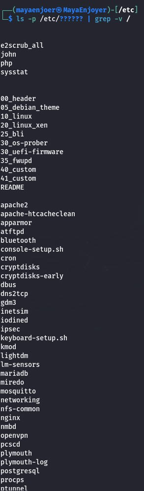

🟣 To list detailed information about files, we need to use the following command: `ls -l /etc/??????`.

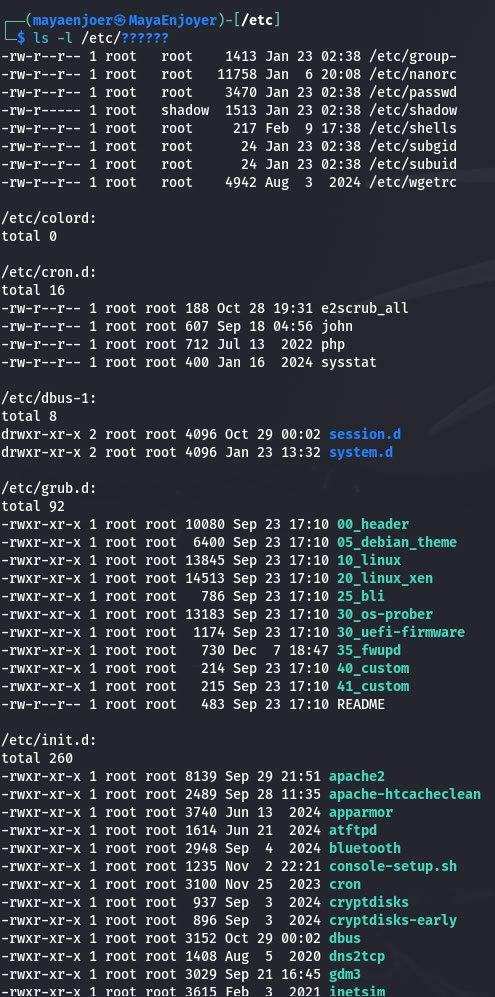

🟣 To list only directories with 6-letter names, we need to use the following command: `ls -d /etc/??????/`.

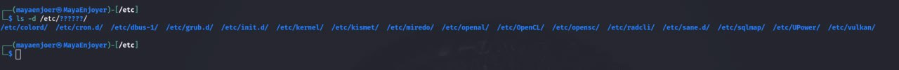

#### 9) Viewing the contents of a directory to only display files whose names end with the letters of your names:
To view the contents of the `/etc` directory and display only files whose names end with the letters of your `MayaEnjoyer` name, we need to use the following command:`ls /etc/*[m,a,y,a,e,n,j,o,y,e,r]`.

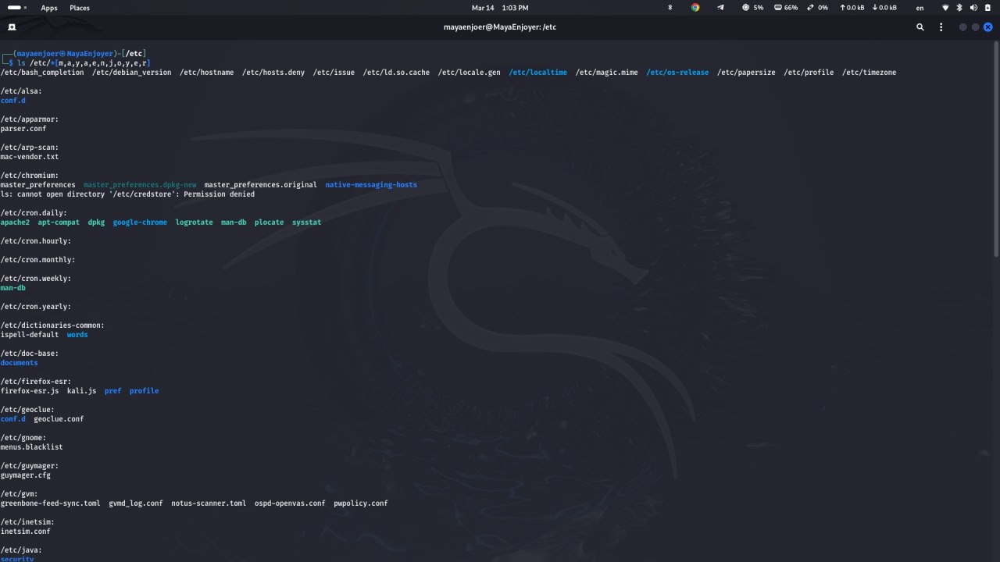

Additional commands:

🟣 To list only files (without directories), we need to use the following command: `ls -p /etc/*[m,a,y,a,e,n,j,o,y,e,r] | grep -v /`.

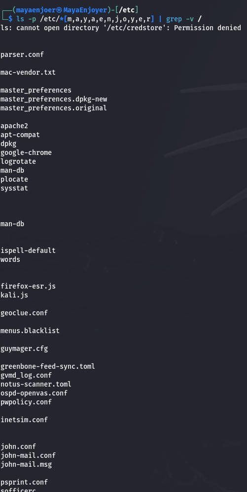

🟣 To list detailed information about files, we need to use the following command: `ls -l /etc/*[m,a,y,a,e,n,j,o,y,e,r]`.

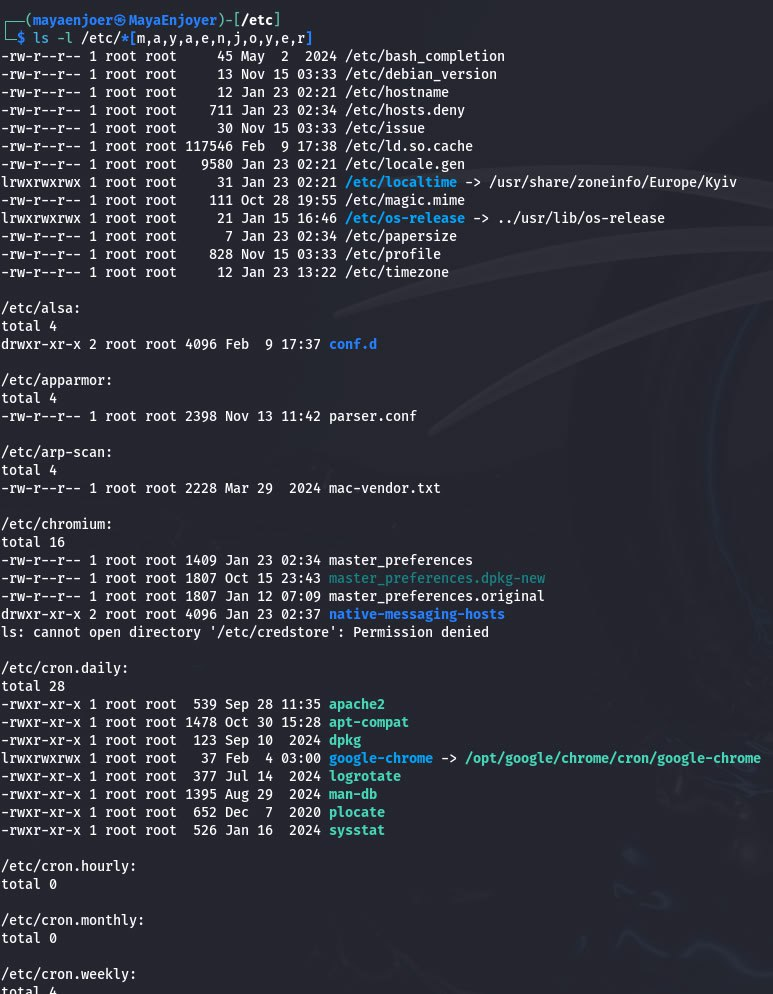

🟣 To list only directories with 6-letter names, we need to use the following command: `ls -d /etc/*[m,a,y,a,e,n,j,o,y,e,r]/`.

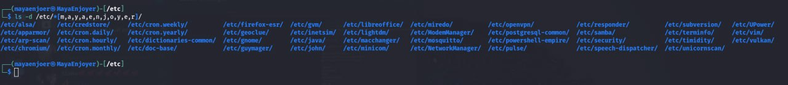

#### 10) To go to the current user's home directory and view its contents in a recursive format:
In order to go to the current user's home directory and view its contents in a recursive (reverse-alphabetical) format via the command pipeline, we need to use the following command: `cd ~ && ls -R | sort -r`.

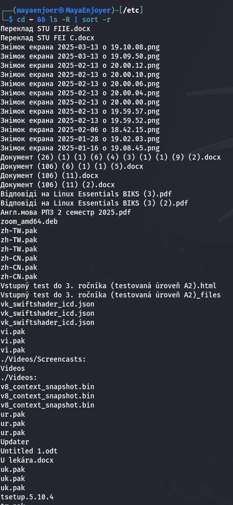

#### 11) Creating a directory with the group name:
In order to create a directory with the name of the РПЗ-23б group in the current directory, we need to use the following command: `mkdir "РПЗ-23б"`, and the following command to check: `ls -l | grep "РПЗ-23б"`.

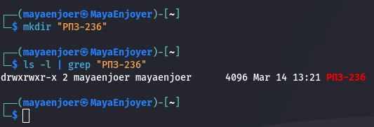

#### 12) View the main contents of the current user's home directory:
To view the updated contents of the current user's home directory, we need to use the `-r` switch, for this we need to use the following command: `ls -lr ~`.

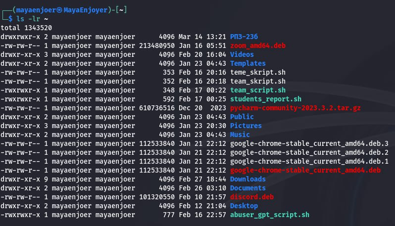

#### 13) Go to the created directory with the group name to create an empty file lab5 in it:
To go to the created directory РПЗ-23б and create an empty file lab5, we need to use the following command: `cd ~/РПЗ-23б`. After that, we need to use the following command to create the file lab5: `touch lab5`.

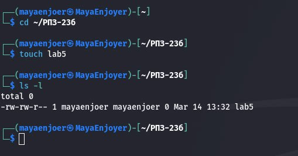

#### 14) Creating 3 directories in the directory with the names of the students on my team:
In order to create the following directory structure `РПЗ-23б → surname1, surname2, surname3`, we need to use the following commands:
```
cd ~/РПЗ-23б → Go to the РПЗ-23б directory;
mkdir Hubar1 Hubar2 Hubar3 → Create three directories;
ls -R ~/РПЗ-23б → Check the directory structure,
```

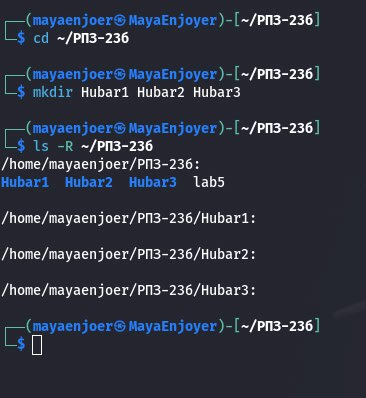

#### 15) Go to the first subdirectory surname1 and create an empty file with the name of the first student name1:
To go to the first subdirectory and create an empty file name1, we need to use the following command: `touch ~/РПЗ-23б/Hubar1/Maksym1`.

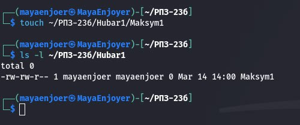

#### 16) Using the command `echo "Hello, my name is Name1" > name1`:
To enter data into the file name1 in the directory surname1, we need to execute the following command: `echo "Hello, my name is Maksym1, but you may know me by this name - MayaEnjoyer" > ~/РПЗ-23б/Hubar1/Maksym1`. And in order to make sure that the data is written to the file, we need to execute the following command: `cat ~/РПЗ-23б/Hubar1/Maksym1`.

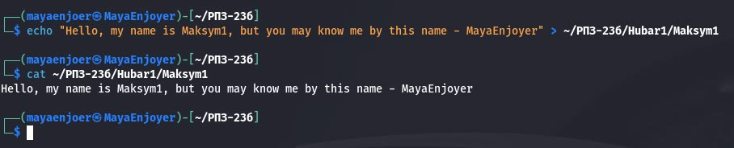

#### 17) Implementation of copying the first file name1 and renaming it to a file with the second student name name2:
To make a copy of the file name1 and rename it to name2, we need to execute the following commands:
```
mkdir -p ~/РПЗ-236/Hubar2
cp ~/РПЗ-236/Hubar1/Maksym1 ~/РПЗ-236/Hubar2/Maksym2
ls -l ~/РПЗ-236/Hubar2
cat ~/РПЗ-236/Hubar2/Maksym2
```

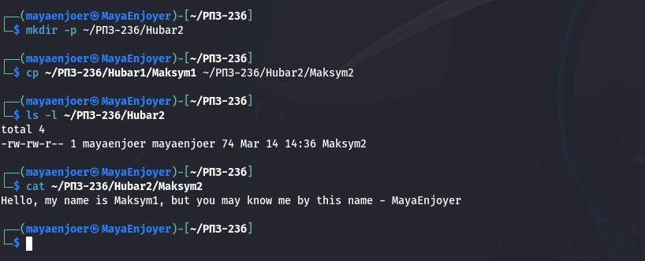

#### 18) Viewing directory contents:
```
ls -l ~/РПЗ-236/Hubar1
cat ~/РПЗ-236/Hubar1/Maksym1
ls -l ~/РПЗ-236/Hubar2
cat ~/РПЗ-236/Hubar2/Maksym2
```

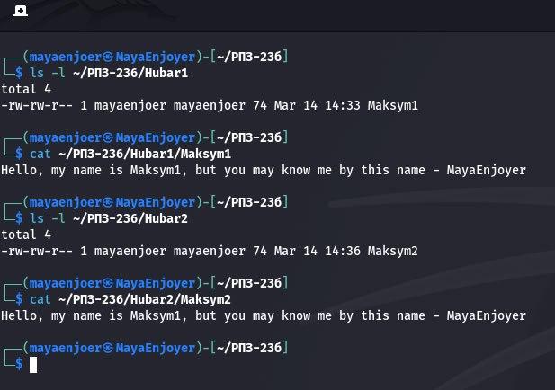

#### 19) View the contents of the second file:
To view the contents of the second file, we need to use the following command: `cat ~/РПЗ-236/Hubar2/Maksym2`.

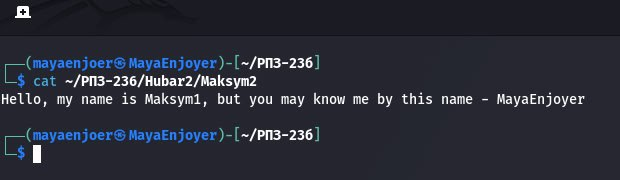

#### 20) Replacing the contents of the file name2 so that it contains the appropriate name:
To replace the contents of the Maksym2 file with the appropriate name, we need to use the following command: `echo "Hello, my name is Maksym2, but you may know me by this name - MayaEnjoyer" > ~/РПЗ-236/Hubar2/Maksym2`. And in order to view the contents of the second file, we need to use the following command: `cat ~/РПЗ-236/Hubar2/Maksym2`.

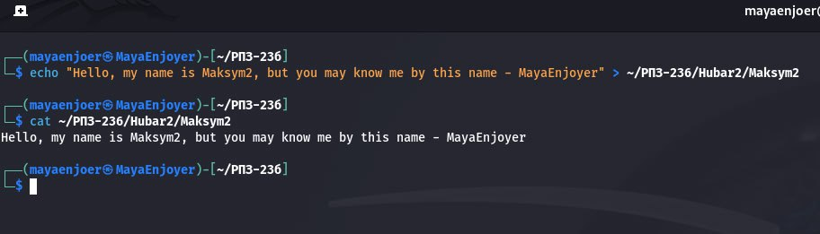

#### 21) Moving the file name2 into the directory surname2:
PS: I've already done this, but I'll duplicate the commands anyway for the sake of example.

In order to move the file name2 to the directory surname2, we need to use the following command: `mv ~/РПЗ-236/Hubar2/Maksym2 ~/РПЗ-236/Hubar2/`.

#### 22) Renaming the first file name1 to a file with the third student name of the team name3:
In order to make a copy of the file Maksym1 and rename it to Maksym3, we need to use the following commands:
```
cp ~/РПЗ-236/Hubar1/Maksym1 ~/РПЗ-236/Hubar1/Maksym3
ls -l ~/РПЗ-236/Hubar1
cat ~/РПЗ-236/Hubar1/Maksym3
```
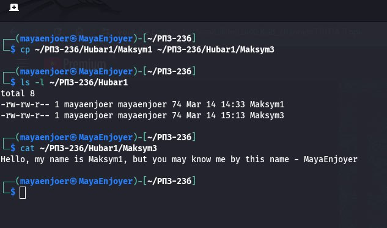

#### 23) Moving the file name 3 to the directory surname 3:
To move the Maksym3 file to the Hubar3 directory, we need to use the following code: `mv ~/РПЗ-236/Hubar1/Maksym3 ~/РПЗ-236/Hubar3/`.

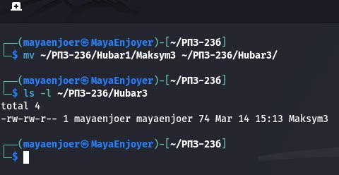

#### 24) Go to the surname 3 directory, view the contents of the third file, and change the contents of the file name3:
In order to go to the surname 3 directory, view the contents of the third file, and replace it with the corresponding name of the third student, we need to use the following commands:

```
cd ~/РПЗ-236/Hubar3
cat Maksym3
echo "Hello, my name is Maksym3, but you may know me by this name - MayaEnjoyer" > Maksym3
cat Maksym3
```

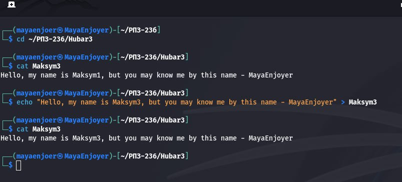

#### 25) Viewing the contents of a directory to display only the subdirectory with the group name and all its contents:
To view the contents of a directory so that only the subdirectories and files we need are displayed with color highlighting, we need to enter the following command in the terminal:`ls -R --color=auto ~/РПЗ-236/[Hh]ubar*`.

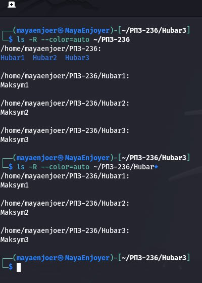

---

### Next, let's describe the actions performed by the commands for moving through the directory system:

| Command               | Description                                                                                                               |
|-----------------------|---------------------------------------------------------------------------------------------------------------------------|
| `cd /`                | Go to the root directory `/`. All other directories and files are subdirectories of it.                                   |
| `cd /home`            | Go to the directory `/home`, which contains the home directories of all users on the system.                              |
| `cd ~`                | Go to the current user's home directory (`/home/username`). Equivalent to `cd $HOME`.                                     |
| `cd` *(no arguments)* | Does the same as `cd ~`, returning the user to their home directory.                                                      |
| `cd ..`               | Go **up one level** in the directory hierarchy (to the parent directory).                                                 |
| `cd ../..`            | Go **up two levels** in the file system. Similarly, you can use multiple `../` to go up the appropriate number of levels. |
| `cd -`                | Return to **previous working directory**. Very useful when switching between two directories frequently.                  |


---

## Answers to the control questions:
### 1) How can I view the path to a user's home directory using the echo command?

In Linux, there are two ways to view the path to a user's home directory.
The first way is to use the `$HOME` variable, for the first method we will need to enter the following command in the terminal: `echo $HOME`.

The second way is to use the `~` tildes with the `echo` command, i.e. we will need to enter the following command in the terminal: `echo ~`.

#### Comparison table:

| Method   | Command      | Description                                                                            |
|----------|--------------|----------------------------------------------------------------------------------------|
| Method 1 | `echo $HOME` | Displays the path to the user's home directory using the `$HOME` environment variable. |
| Method 2 | `echo ~`     | Uses the tilde `~`, which is a shorthand for the current user's home directory.        |

From the table, we can conclude that both methods give the same result, but $HOME is an environment variable that can be used in scripts, and ~ is part of Bash syntax and only works on the command line.

### 2) Is it possible to view the contents of the root directory while in the user's home directory without going to the root directory?
While in the user's home directory, we can view the contents of the root directory without going into it, for this we need to use various `ls` commands with the appropriate parameters.

#### Commands that allow you to view the contents of the root directory:

| Command    | Description of execution                                                                                      |
|------------|---------------------------------------------------------------------------------------------------------------|
| `ls /`     | Lists the files and directories contained in the root directory.                                              |
| `ls -l /`  | Displays the contents of the root directory in a list format with details (access rights, owner, size, etc.). |
| `ls -a /`  | Shows all files in the root directory, including hidden ones (starting with `.`).                             |
| `ls -r /`  | Lists the files and directories in reverse alphabetical order.                                                |
| `ls -lh /` | Lists the files with detailed information in a human-readable format (human-sized format).                    |
| `ls -lt /` | Sorts the files in the root directory by last modified date.                                                  |


### 3) How can I add information to an empty file in the terminal?

#### Table of methods for writing text to a file

| Method                          | Command                                                     | Description                                                                                              |
|---------------------------------|-------------------------------------------------------------|----------------------------------------------------------------------------------------------------------|
| Using the `echo` command        | `echo "This text will be added to the file" > filename.txt` | Writes text to a file, creating it if it does not exist, or overwriting it if it already exists.         |
| Adding text without overwriting | `echo "New line" >> filename.txt`                           | Adds text to the end of the file without overwriting the previous contents.                              |
| Using the `cat` command         | `cat > filename.txt`                                        | Opens keyboard input mode, allowing you to enter text and terminate input with `Ctrl+D`.                 |
| Adding text via `cat`           | `cat >> filename.txt`                                       | Adds text to the end of the file without erasing the previous contents, terminating input with `Ctrl+D`. |
| Using the `nano` text editor    | `nano filename.txt`                                         | Opens a file in the `nano` text editor, after editing save with `Ctrl+O`, exit with `Ctrl+X`.            |
| Using the `printf` command      | `printf "First line\nSecond line\n" > filename.txt`         | Writes multiple lines to a file, using `\n` for a newline.                                               |
| Using the `>` operator          | `> filename.txt`                                            | Creates an empty file or clears an existing one if it already exists.                                    |

🟣 The `echo` command is the most convenient for quickly writing short text to a file. If `>` is used, the file is created or overwritten. If `>>` is used, the text is appended to the end of the file without overwriting its previous contents.

🟣 The `cat` command allows us to create a file and enter the contents directly from the keyboard. To complete the input, we need to press `Ctrl+D`. Also, using `>>` allows us to append text to the end of the file.

🟣 `nano` is a text editor that allows us to open and edit files in visual mode. After making changes, we need to press the key combination `Ctrl+O`, this is necessary to save the file, and `Ctrl+X` to exit.

🟣 `printf` is quite similar to `echo`, but allows you to format the output, for example, add newlines (`\n`).

🟣 Using `>` without specifying the contents creates a new empty file or clears an existing one.

### 4) How to copy and delete an existing directory?
#### In order to copy and delete an existing directory in Kali Linux, we can use the following commands: 
To copy a non-empty directory, we will use the `cp` command with the `-r` parameter to copy the directory along with its contents: `cp -r /path/to/directory /path/to/copy/`.
And to copy an empty directory, we can use the same command, since even an empty directory will be copied: `cp -r /path/to/directory /path/to/copy/`.

To delete an empty directory, we need to use the `rmdir` command: `rmdir /path/to/directory`.
And to delete a non-empty directory, we can use the `rm` command with the `-r` parameter: `rm -r /path/to/directory`.

### 5) In which of the following examples is a file being moved? renamed? both actions at the same time?
🟣 mv /work/tech/comp.png. /Desktop

🟣 mv /work/tech/comp.png. /work/tech/my_car.png

🟣 mv /work/tech/comp.png. /Desktop/computer.png


- `mv /work/tech/comp.png. /Desktop` — this example moves the file `comp.png` from the `/work/tech/` directory to the `/Desktop` directory. Since the new file name is not specified, the file keeps its name, but is moved to a new directory.

- `mv /work/tech/comp.png. /work/tech/my_car.png` — this example renames the file from `comp.png` to `my_car.png` in the same `/work/tech/` directory.

- `mv /work/tech/comp.png. /Desktop/computer.png` — and this example moves the file `comp.png` from the `/work/tech/` directory to `/Desktop`, but the file also gets a new name — `computer.png`.

---

#### Conclusions: So, I completed lab #5, during which we looked at file system navigation commands and managing files and directories. In this lab, we learned how to use commands to navigate the directory system, and we also looked at the basic commands for working with files and directories, and applied them in practice.

ND, AS ALWAYS IN MY TRADITION, I WANT TO SAY THAT IF I PHILOSOPHIZE ON THE TOPIC OF LOVE, I CAN SAY THAT LOVE IS A KIND OF MEANS OF SALVATION FOR HUMANITY AND THE SOUL OF PEOPLE, BECAUSE IF THERE IS NO LOVE LEFT IN A PERSON, THEN HE BECOMES A MONSTER WITHOUT A SOUL. SO I WISH EVERYONE SUCCESS IN LEARNING KALI LINUX. I LOVE YOU ALL AND SEE YOU AGAIN ;)

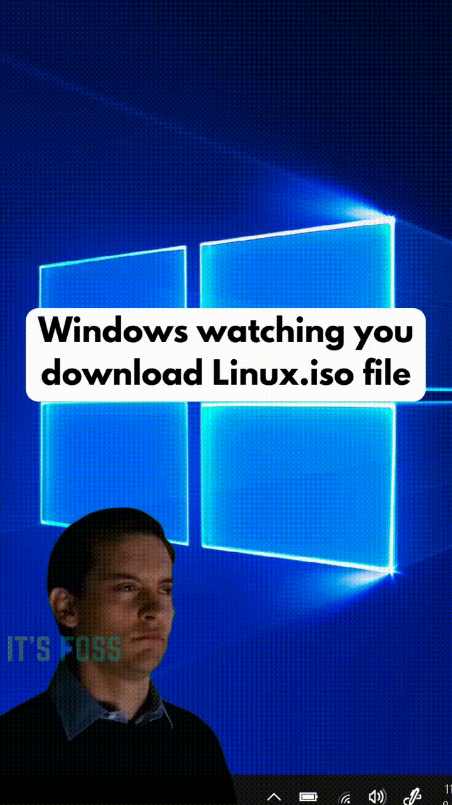


