<h1 align="center">
    
    <br />
    Laboratory work with Kali Linux №6
</h1>

#### In this work, I will do lab #6, applying knowledge of Kali Linux. This work is created for the purpose of educational content, as an assignment for the discipline Operating Systems of the Kyiv College of Communications.

Topic: “Linux commands for archiving and compressing data. Working with text”

Objectives:
1) Gain practical skills in working with the Bash shell.
2) Familiarity with basic commands for archiving and compressing data.
3) Familiarity with basic actions when working with text in the terminal.

---

#### In this article, I'm going to answer questions about the Kali Linux operating system and simply Linux.


## Before we begin, let's consider the following question:

### What is the purpose of the `tar`, `xz`, `zip`, `bzip`, `gzip` commands?

#### The `tar`, `xz`, `zip`, `bzip2`, and `gzip` utilities are used for archiving and compressing files. But each of them has its own features and options.

#### 1) `tar` is a utility used to combine multiple files into a single archive file without compression. This utility is usually used together with compression utilities such as `gzip` or `bzip2`.​

#### The `tar` utility has the following basic parameters:

- `-c` — create a new archive.
- `-x` — extract files from the archive.
- `-v` — list the files being processed.
- `-f` — specify the name of the archive file.
- `-z` — compress the archive using `gzip`.
- `-j` — compress the archive using `bzip2`.
- `-J` — compress the archive using `xz`.

#### Now let's look at examples of using the `tar` utility:
In order to create an archive using the `tar` utility, we need to use the following command: `tar -cvf archive.tar file1 file2`.

In order to create an archive with gzip compression, we need to use the following command: `tar -czvf archive.tar.gz file1 file2`.

And in order to unpack the archive, we need to use the following command:`tar -xvf archive.tar`.

Most Linux distributions have `tar` installed by default. But if this utility is not available, we can install it using these commands:
```
sudo apt update
sudo apt install tar
```

#### 2) `xz` is a utility that we use to compress files, which uses the LZMA2 algorithm, providing a high degree of compression. Like `gzip` and `bzip2`, it compresses only one file, so it is often used together with `tar`.

#### The `xz` utility has the following basic parameters:

- `-z` or no parameter — compress the file.
- `-d` — decompress the file.
- `-k` — save the original file after compression or decompression.
- `-v` — display detailed information about the process.

#### Now let's look at examples of using the `xz` utility:

To compress a file, we need to use the following command: `xz file`.

And to decompress a file, we need to use the following command: `xz -d file.xz`.

If this utility is not available, we can install it using these commands:
```
sudo apt update
sudo apt install xz-utils
```

#### 3) `zip` is a utility that we use to archive and compress files in ZIP format, which is the most popular in Windows environment. The main role is to combine several files into one archive with simultaneous compression.

#### The `zip` utility has the following basic parameters:

- `-r` — recursively add files from subdirectories.
- `-v` — display detailed information about the process.
- `-e` — encrypt the archive with a password.

#### Now let's look at examples of using the `zip` utility:

In order to create an archive using `zip`, we need to use the following command: `zip -r archive.zip directory`.

And in order to install this unit on our machine, we need to use the following commands in the terminal:
```
sudo apt update
sudo apt install zip
```
#### 4) `bzip2` is a utility used to compress files, this utility provides a better compression ratio than `gzip`, but it works slower. It compresses only one file, so it is used in combination with `tar` to archive multiple files.

#### The `bzip2` utility has the following basic parameters:

- `-d` — unpacks the file (analogous to the bunzip2 command).
- `-k` — keeps the original file when compressing or decompressing.
- `-v` — shows the compression process in the console.
- `-z` — explicitly indicates compression (optional, because it is the default).

#### Now let's look at examples of using the `bzip2` utility:
In order to compress a file, we need to use the following command: `bzip2 file.txt`.
And in order to unpack, we need to use the following command `bzip2 -d file.txt.bz2`.

If we do not have this utility installed, then we can do it using the following command: `sudo apt install bzip2`.

#### 4) `gzip` is a popular utility used for file compression on Linux systems. Unlike `zip`, it compresses only a single file (without archiving the directory structure).

#### The `gzip` utility has the following basic parameters:

- `-d` — unpack the file (analogous to gunzip).
- `-k` — preserve the original file.
- `-v` — show statistics during compression.
- `-r` — recursively compress all files in the directory.

#### Now let's look at examples of using the `gzip` utility:

In order to compress a file, we need to use the following command: `gzip file.txt`.

And in order to unpack, we need to use the following command `gzip -d file.txt.gz`.

If we do not have this utility installed, then we can do it using the following command: `sudo apt install gzip`.

### Three examples of implementing data archiving and compression using different commands:

#### 1) Archiving with `tar` + compression with `gzip`:
In order to create a compressed archive, we need to use the following command: `tar -czvf archive.tar.gz /home/mayaenjoer/Documents`.

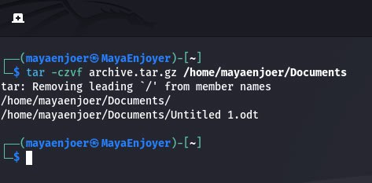

#### 2) Archiving with `tar` + compression with `bzip2`:
In order to create a compressed archive, we need to use the following command: `tar -cjvf archive.tar.bz2 ~/Pictures`.

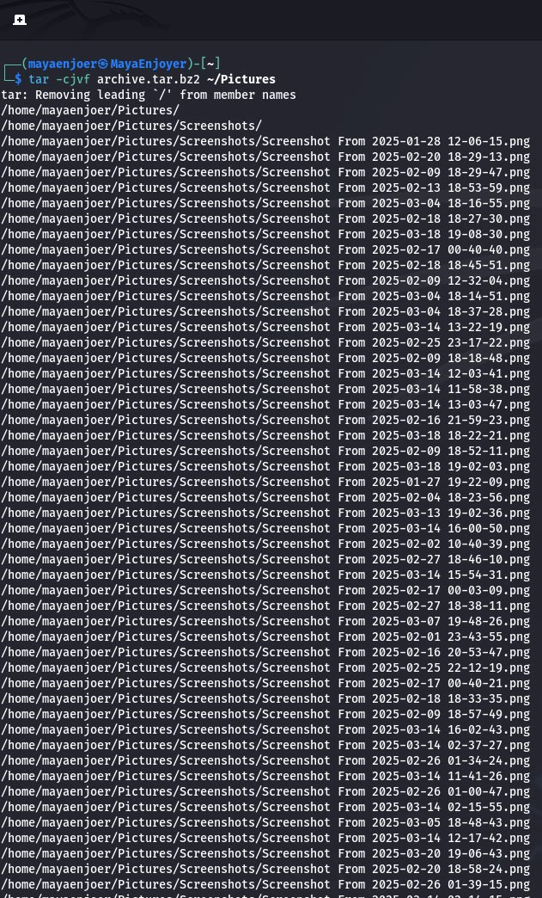

#### 3) Archiving with `zip`:
In order to make an archive using `zip`, we need to execute the following command: `zip -r lectures_on_cybersecurity.zip ~/Videos`.

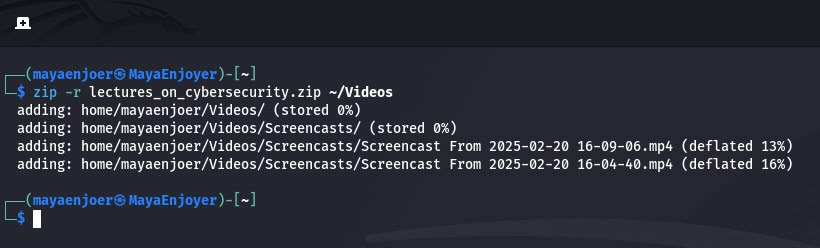

### What is the purpose of the `cat`, `less`, `more`, `head` and `tail` commands?

#### 1) `cat` is a command used to view, merge and create text files. In order to use this command, we need to enter the following command in the terminal: `cat filename.txt`, where the main parameters ⟶
```
-n – line numbering.
-b – numbering only non-empty lines.
-s – remove repeating empty lines.
> file.txt – create a new file.
>> file.txt – append to a file.
```
Example command:`cat -n file.txt`.

#### 2) `less`, this command is used to view large files page by page with the ability to scroll up/down.
In order to use this command, we need to enter the following command in the terminal: `less filename.txt`, where the main parameters ⟶
```
-N – shows line numbers.
/text – search for a word in the file.
g – go to the beginning of the file.
G – go to the end of the file.
```
Example command:`less -N file.txt`.

#### 3) `more`, this command is used to browse files page by page (similar to `less`, but without scrolling back).
In order to use this command, we need to enter the following command in the terminal: `more filename.txt`, where the main parameters ⟶
```
+N – starts displaying from the Nth line.
-d – displays management tips.
/text – search for a word in a file.
```
Example command:`more +5 file.txt`.

#### 4) `head`, this command is used to output the first lines of a file.
In order to use this command, we need to enter the following command in the terminal: `head filename.txt`, where the main parameters ⟶
```
-n N – output the first N lines.
-c N – output the first N bytes.
```
Example command:`head -n 12 file.txt`.

#### 5) `tail`, this command is used to output the last lines of a file.
In order to use this command, we need to enter the following command in the terminal: `tail filename.txt`, where the main parameters ⟶
```
-n N – output the last N lines.
-f – outputs new lines in real time, this is useful for viewing log files.
```
Example command:`tail -f /var/log/syslog`.

#### Usually, most Linux distributions include all these commands by default. But if they are suddenly missing, we can install them via the `coreutils` and `less` packages.

In order to install these commands, we need to install them via the packages, but a small note is that the commands for different distributions are slightly different.

For example, if we want to install these commands on Kali Linux/Debian/Ubuntu, we will need to use the following command:
```
sudo apt install coreutils less
```
If we need to install these commands on RHEL/CentOS, we need to use the following command:
```
sudo yum install coreutils less
```

And for Arch Linux, we need to use the following command:
```
sudo pacman -S coreutils less
```

### Principles of how the shell works with channels, streams, and filters:

#### In the Linux shell, pipes, streams, and filters play an important role. They allow you to process data efficiently, pass the output of one command to the input of another, and perform flexible text processing.

In Unix-like systems, all processes interact with three standard streams:

1) Standard input (stdout) is the stream through which a process receives input data. By default, stdin is connected to the keyboard, but can be redirected from a file or other data source.

2) Standard output (stdout) is the stream through which a process outputs data. By default, stdout is connected to the terminal, but can be redirected to a file or another stream.

3) Standard error (stderr) is the stream through which a process outputs error messages. By default, stderr is connected to the terminal, but can be redirected to a file or another stream.

#### Stream redirection symbols:
```
> – redirect standard output (stdout).
2> – redirect standard error (stderr).
< – redirect standard input (stdin).
| – a pipe for connecting the output of one command to the input of another.
```

#### Pipes allow you to pipe the output of one command to the input of another command. This is very useful for creating sequences of commands.
An example of a command that pipes the output of the `ls` command to the input of the `grep` command, which filters files with the `.txt` extension, would look like this: `ls | grep ".txt"`.

#### And filters are commands that process data in a pipeline (`|`), transforming or filtering it.

#### Basic filters: 

| Command   | Purpose                     | Example         |
|-----------|-----------------------------|-----------------|
| **grep**  | Search for lines by pattern | ls -l           | 
| **sort**  | Sort lines                  | cat file.txt    |
| **uniq**  | Remove duplicates           | cat file.txt    | 
| **cut**   | Select specific fields      | cat /etc/passwd | 
| **awk**   | Text stream processing      | ps aux          | 
| **sed**   | Text editing                | cat file.txt    |
| **tee**   | Display and save to file    | ls -l           | 

### Purpose of the `grep` command:
The `grep` command searches text files for a given pattern and displays all lines that contain the given pattern. The `grep` command is often used as a filter for information coming from another command (for example, to search inside the log file of certain processes).

---

### Next, let's work through all the command examples presented in the labs of the NDG Linux Essentials course (Labs 9-10):

| **Command Name**                                   | **Its Purpose and Functionality**                                                                                                                                                                                                                                                                                                                                                                                   |
|----------------------------------------------------|---------------------------------------------------------------------------------------------------------------------------------------------------------------------------------------------------------------------------------------------------------------------------------------------------------------------------------------------------------------------------------------------------------------------|
| `mkdir mybackups`                                  | Creates a new directory `mybackups` in the user's home directory.                                                                                                                                                                                                                                                                                                                                                   |
| `tar -cvf mybackups/udev.tar /etc/udev`            | The `tar` command is used to combine multiple files into a single archive. In this case, the contents of the `/etc/udev` directory will be saved to the `udev.tar` file located in the `mybackups` directory. The `-c` option tells the `tar` command to create an archive. The `-v` (`verbose`) option tells `tar` to show which files are being archived. The `-f` option specifies the name of the archive file. |
| `cd Documents`                                     | Changes to the `Documents` directory in the user's current location.                                                                                                                                                                                                                                                                                                                                                |
| `gzip longfile.txt`                                | Compresses the file `longfile.txt`, creating `longfile.txt.gz`. The file `longfile.txt` will be replaced with its compressed version.                                                                                                                                                                                                                                                                               |
| `gzip -l longfile.txt.gz`                          | Displays information about the compressed file `longfile.txt.gz`, including the original and compressed sizes.                                                                                                                                                                                                                                                                                                      |
| `gunzip longfile.txt.gz`                           | Unzips `longfile.txt.gz`, returning it to its original `longfile.txt` form.                                                                                                                                                                                                                                                                                                                                         |
| `tar -cf alpha_files.tar alpha*`                   | Creates an archive `alpha_files.tar` containing all files whose names begin with `alpha`.                                                                                                                                                                                                                                                                                                                           |
| `ls -l alpha_files.tar`                            | Displays detailed information about the archive `alpha_files.tar`, including its size, permissions, owner, etc.                                                                                                                                                                                                                                                                                                     |
| `tar -czf alpha_files.tar.gz alpha*`               | Creates a compressed archive `alpha_files.tar.gz` containing all files that begin with `alpha`. Compression is done using `gzip`.                                                                                                                                                                                                                                                                                   |
| `ls -l alpha_files.tar.gz`                         | Displays detailed information about the compressed archive `alpha_files.tar.gz`.                                                                                                                                                                                                                                                                                                                                    |
| `gzip -l alpha_files.tar.gz`                       | Displays the size and compression ratio of the `alpha_files.tar.gz` file.                                                                                                                                                                                                                                                                                                                                           |
| `tar -cjf folders.tbz School`                      | Creates an archive `folders.tbz` containing the `School` directory using the `bzip2` algorithm.                                                                                                                                                                                                                                                                                                                     |
| `tar -tjf folders.tbz`                             | Views the contents of the `folders.tbz` archive without unpacking it.                                                                                                                                                                                                                                                                                                                                               |
| `bunzip2 -c folders.tbz (vertical line) tar -t`    | Displays the contents of the `folders.tbz` archive, passing its unpacked contents to `tar` for viewing.                                                                                                                                                                                                                                                                                                             |
| `cp Documents/folders.tbz Downloads/folders.tbz`   | Copies the `folders.tbz` archive to the `Downloads` directory.                                                                                                                                                                                                                                                                                                                                                      |
| `cd Downloads`                                     | Goes to the `Downloads` directory.                                                                                                                                                                                                                                                                                                                                                                                  |
| `tar -xjf folders.tbz`                             | Unzips the `folders.tbz` archive, restoring its contents.                                                                                                                                                                                                                                                                                                                                                           |
| `zip alpha_files.zip alpha*`                       | Creates a zip archive `alpha_files.zip` that contains all files starting with `alpha`.                                                                                                                                                                                                                                                                                                                              |
| `unzip School.zip`                                 | Unzips the `School.zip` archive into the current directory.                                                                                                                                                                                                                                                                                                                                                         |
| `mkdir tmp`                                        | Creates a new `tmp` directory.                                                                                                                                                                                                                                                                                                                                                                                      |
| `cp School.zip tmp/School.zip`                     | Copies the `School.zip` archive to the `tmp` directory.                                                                                                                                                                                                                                                                                                                                                             |
| `cd tmp`                                           | Goes to the `tmp` directory.                                                                                                                                                                                                                                                                                                                                                                                        |
| `unzip School.zip`                                 | Extracts the contents of the `School.zip` archive.                                                                                                                                                                                                                                                                                                                                                                  |
| `cat food.txt`                                     | Displays the contents of the `food.txt` file.                                                                                                                                                                                                                                                                                                                                                                       |
| `less words`                                       | Opens the `words` file for page-by-page viewing in read-only mode.                                                                                                                                                                                                                                                                                                                                                  |
| `head /etc/sysctl.conf`                            | Displays the first 10 lines of the `/etc/sysctl.conf` file.                                                                                                                                                                                                                                                                                                                                                         |
| `tail -5 /etc/sysctl.conf`                         | Displays the last 5 lines of the `/etc/sysctl.conf` file.                                                                                                                                                                                                                                                                                                                                                           |
| `echo "Line 1" > example.txt`                      | Writes the line `"Line 1"` to the file `example.txt`, overwriting its contents.                                                                                                                                                                                                                                                                                                                                     |
| `echo "Another line" >> example.txt`               | Adds the line `"Another line"` to the end of `example.txt` without overwriting it.                                                                                                                                                                                                                                                                                                                                  |
| `ls /fake 2> error.txt`                            | Attempts to list files in `/fake`. Errors will be logged in `error.txt`.                                                                                                                                                                                                                                                                                                                                            |
| `grep bash /etc/passwd`                            | Searches for `bash` in `/etc/passwd`.                                                                                                                                                                                                                                                                                                                                                                               |
| `grep --color bash /etc/passwd`                    | Searches for `bash` in `/etc/passwd`, highlighting matches.                                                                                                                                                                                                                                                                                                                                                         |
| `grep -c bash /etc/passwd`                         | Counts the number of lines in `/etc/passwd` that contain `bash`.                                                                                                                                                                                                                                                                                                                                                    |
| `grep '[0-9]' profile.txt`                         | Displays all lines in `profile.txt` that contain at least one digit.                                                                                                                                                                                                                                                                                                                                                |
| `grep '^root' /etc/passwd`                         | Prints all lines in the `/etc/passwd` file that start with `root`.                                                                                                                                                                                                                                                                                                                                                  |
| `tr 'a-z' 'A-Z' < example.txt`                     | Converts all lowercase letters in the file `example.txt` to uppercase.                                                                                                                                                                                                                                                                                                                                              |
| `sort mypasswd`                                    | Sorts the contents of the file `mypasswd` alphabetically.                                                                                                                                                                                                                                                                                                                                                           |
| `wc /etc/passwd`                                   | Prints the number of lines, words, and characters in the file `/etc/passwd`.                                                                                                                                                                                                                                                                                                                                        |
| `cut -d: -f1,5-7 mypasswd`                         | Selects specific fields in the file `mypasswd`, using `:` as a delimiter.                                                                                                                                                                                                                                                                                                                                           |
| `ls -l (vertical line) cut -c1-11,50-`             | Selects specific columns from the output of the `ls -l` command.                                                                                                                                                                                                                                                                                                                                                    |
| `grep -E 'gray(vertical line)grey' spelling.txt`   | Searches for `gray` or `grey` in the file `spelling.txt`.                                                                                                                                                                                                                                                                                                                                                           |

---

### Next, let's work in the terminal and consolidate the studied material:

<h1 align="center">

    Practical tasks:
</h1>

#### 1) Creating a file with the `.tar` extension:

To create an archive file with the `.tar` extension, for example for our Documents directory, we need to execute the following command in the terminal: `tar -cvf mybackup.tar ~/Documents`.
This command creates the `mybackup.tar` file, which will contain the contents of the Documents directory.

To verify the created archive, we will use the following command: `ls -lh mybackup.tar`.

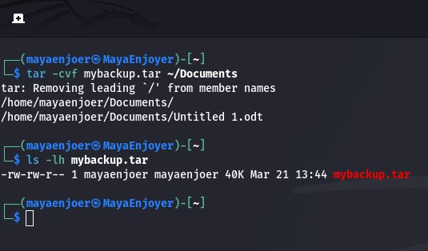

#### 2) Creating a file with the `.tar` extension, consisting of multiple files and directories at once:

In order to create an archive file with the `.tar` extension, which contains several files and directories at the same time, we need to execute the following command in the terminal: `tar -cvf backup.tar ~/Documents ~/Videos/Screencasts ~/Pictures/Screenshots`.
This command creates `backup.tar`, which will contain files from three directories: Documents, Screencasts, Screenshots.

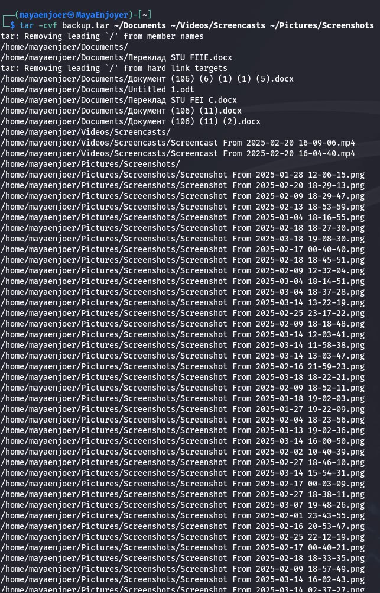

In order to verify the created archive, we will use the following command: `tar -tvf backup.tar`.

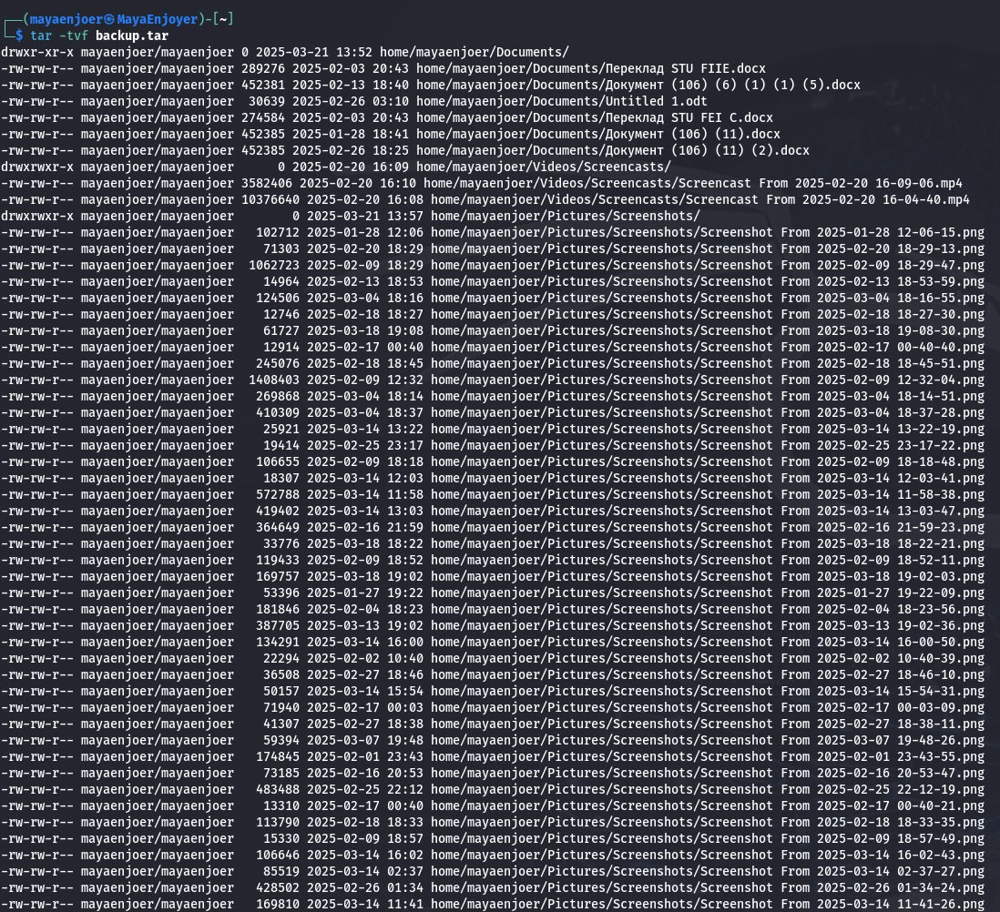

#### 3) View file contents:

To view the list of files in the `Screencasts` directory, we can use the following command: `ls -lh ~/Videos/Screencasts`. And if we need to view the contents of a text file, we can use the following commands:
```
cat filename.txt
less filename.txt
```


#### 4) Extract the contents of the tar file:
In order to extract the contents of a `.tar` file, we will need to use the `tar -xf` command.

For example, to extract all the files from `archive.tar` to the current directory, we will use the following command: `tar -xf archive.tar`. And in order to extract the files from the archive to the specified directory, we will need to use the following command: `tar -xf archive.tar -C ~/Documents/`.

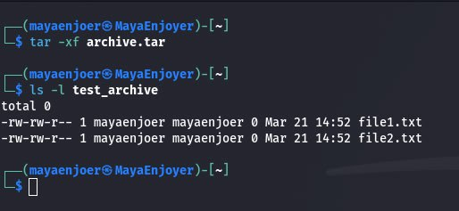
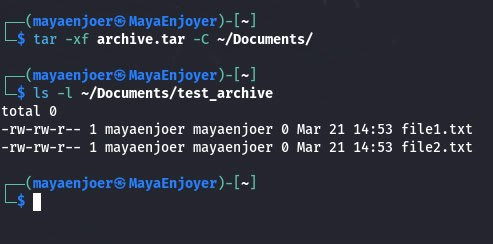

#### 5) Create a `tar` archive file, and compress it using bzip:

In order to create an archive, in my case for the Documents folder and compress it using `bzip2`, we will need to run the following command: `tar -cvjf documents_backup.tar.bz2 ~/Documents/`.

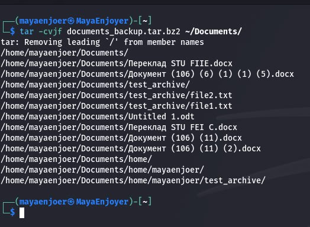

#### 6) Extract the contents of the `tar bzip` file:
In order to extract the contents of a tar bzip file, we need to use the following command: `tar -xvjf archive.tar.bz2`.

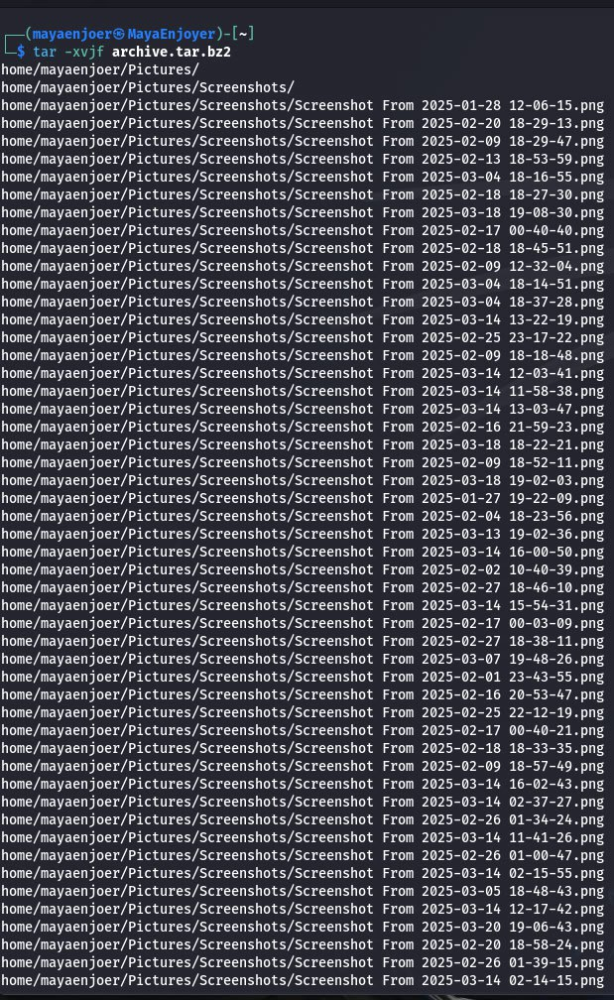

#### 7) Creating an archive `tar` file compressed with `gzip`:

To create a `tar` archive file compressed with `gzip`, in my case for the `~/Documents` directory, we can use the following command: `tar -cvzf documents_backup.tar.gz ~/Documents`.

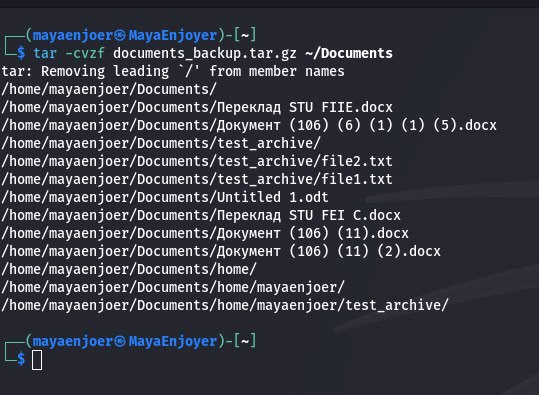

#### 8) Extract the contents of the `tar gzip` file:

In order to extract the contents of a `.tar.gz` archive (compressed with `gzip`), we need to use the following command: `tar -xvzf documents_backup.tar.gz`.

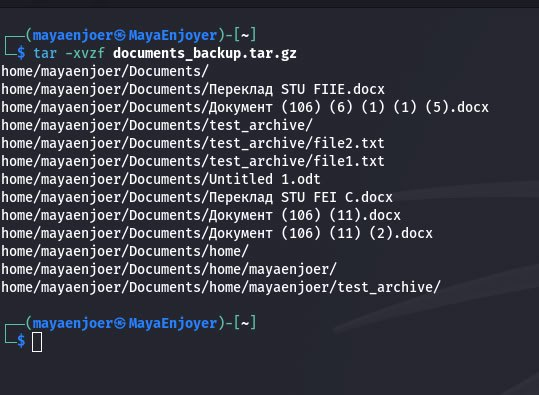

---

### Next, let's look at how input stream redirection will work in bash:

| **Command**                    | **Execution Description**                                                                                                                                  |
|--------------------------------|------------------------------------------------------------------------------------------------------------------------------------------------------------|
| `cmd 1> file`                  | Redirects the standard output (stdout, handle `1`) of the `cmd` command to the file `file`, overwriting its contents.                                      |
| `cmd > file`                   | Same as `cmd 1> file`: the standard output (stdout) of the `cmd` command is overwritten to the file `file`.                                                |
| `cmd 2> file`                  | Redirects the error stream (stderr, handle `2`) to the file `file`, overwriting its contents.                                                              |
| `cmd >> file`                  | Appends the standard output (stdout) of the `cmd` command to the end of the file `file`, without overwriting its contents.                                 |
| `cmd &> file`                  | Redirects both the standard output (stdout) and the error stream (stderr) to the file `file`, overwriting its contents.                                    |
| `cmd > file 2>&1`              | Redirects stdout to the file `file`, and then redirects stderr (`2>&1`) to the stdout already stored in `file`, i.e. both streams are written to the file. |
| `cmd >> file 2>&1`             | Appends stdout to the file `file`, and then redirects stderr (`2>&1`) to the stdout already stored in `file`.                                              |
| `cmd 2>&1 > /dev/null`         | First redirects stderr (`2>&1`) to stdout, then stdout is sent to `/dev/null`, leaving only stderr on the terminal.                                        |
| `cmd 2> /dev/null`             | Redirects stderr to `/dev/null`, discarding all errors.                                                                                                    |
| `cmd1(vertical line)cmd2`      | Pipes the stdout of `cmd1` to the stdin of `cmd2`, creating a pipeline.                                                                                    |
| `cmd1 2>&1(vertical line)cmd2` | Combines the stdout and stderr of `cmd1` (`2>&1`), then pipes them to the stdin of `cmd2`.                                                                 |

### Next, let's look at the following table:

| **Command (command container)**                             | **What does the command do?**                                                                                                                                                     | **What is the redirection flow?**                                                                                                             |
|-------------------------------------------------------------|-----------------------------------------------------------------------------------------------------------------------------------------------------------------------------------|-----------------------------------------------------------------------------------------------------------------------------------------------|
| `echo "It is a new story." > story`                         | Creates or overwrites the file `story`, writing the text `"It is a new story."` to it.                                                                                            | Redirects standard output (`stdout`) to a file.                                                                                               |
| `date > date.txt`                                           | Executes the command `date`, which prints the current date and time, and writes this output to the file `date.txt`.                                                               | Redirects standard output (`stdout`) to a file.                                                                                               |
| `cat file1 file2 file3 > bigfile`                           | Combines the contents of `file1`, `file2`, and `file3`, and writes it to the file `bigfile`, overwriting the previous contents.                                                   | Redirect standard output (`stdout`) to a file.                                                                                                |
| `ls -l >> directory`                                        | Executes the command `ls -l`, which prints a list of files with details, and appends this output to the file `directory`.                                                         | Appends standard output (`stdout`) to a file.                                                                                                 |
| `sort < file1 unsorted > file2 sorted`                      | Reads the contents of the file `file1` (`unsorted`), sorts it, and writes the result to `file2` (`sorted`).                                                                       | The input stream (`stdin`) is read from the file, the output (`stdout`) is written to the file.                                               |
| `find -name '*.txt' > file.txt 2> /dev/null`                | Searches for all files with the extension `.txt`, writes the result to `file.txt`. All errors are sent to `/dev/null`.                                                            | Redirect `stdout` to a file, `stderr` to `/dev/null`.                                                                                         |
| `cat file1 unsorted(vertical line)sort > file2 sorted`      | Prints the contents of `file1` (`unsorted`), pipes it through a pipeline (`(vertical line)`) to the `sort` command, which sorts the contents and writes it to `file2` (`sorted`). | The pipeline pipes the `stdout` of the first command to the `stdin` of the second, and the output of the second command is written to a file. |
| `cat myfile(vertical line)grep student(vertical line)wc -l` | Reads `myfile`, searches for the word `"student"` in it, and counts the number of lines containing that pattern.                                                                  | The pipeline pipes the `stdout` of the first command to the `stdin` of the second, then the third.                                            |

---

## Answers to the control questions:

### 1) Provide a comparative description of the compression and archiving processes in Kali Linux:

- Compression is the process of reducing the size of files using algorithms that eliminate redundant or duplicate data.
- Archiving is the process of combining multiple files or directories into a single file (archive), which simplifies their storage and transfer.

#### Comparison table:

| **Aspect**         | **Compression**                                                                            | **Archiving**                                                                  |
|--------------------|--------------------------------------------------------------------------------------------|--------------------------------------------------------------------------------|
| **Purpose**        | Reduce file size by removing redundant data                                                | Combine multiple files into a single archive file                              |
| **Result**         | Smaller file size (usually with `.gz`, `.bz2`, `.xz` extension)                            | Archive file containing multiple files or directories (`.tar`, `.zip`, `.rar`) |
| **Algorithms**     | `gzip`, `bzip2`, `xz` (lossless); `jpeg`, `mp3` (lossy)                                    | `tar`, `zip`, `rar`, `7z`                                                      |
| **Basic commands** | `gzip file.txt` → creates `file.txt.gz` <br> `bzip2 file.txt` → creates `file.txt.bz2`     | `tar -cvf archive.tar file1 file2` <br> `zip archive.zip file1 file2`          |
| **Recovery**       | Complete recovery with lossless compression (`gunzip file.txt.gz` will restore `file.txt`) | Recover all files and their structure from an archive (`tar -xvf archive.tar`) |
| **Use cases**      | Optimize disk space, speed up data transfer                                                | Create backups, combine files before transfer                                  |
| **Combination**    | Compression is often used together with archiving (`tar -czvf archive.tar.gz files/`)      | Archiving can be combined with compression (`tar -cjf archive.tar.bz2 files/`) |


#### Basic compression algorithms:

🟣 Gzip (`.gz`) – fast compression, widely used for compressing log files and text files.

🟣 Bzip2 (`.bz2`) – more efficient compression than `gzip`, but works slower.

🟣 XZ (`.xz`) – provides the maximum level of compression, but requires more time and resources.

🟣 ZIP (`.zip`) – universal format, supports both compression and archiving in a single file.

🟣 7z (`.7z`) – modern algorithm with a high level of compression, used for large files.

### 2) What programs can be used to compress and archive files and directories in Linux?

#### Alternative utilities for archiving and compression:

🟣 p7zip– A Linux version of `7-Zip` that provides high compression using the `.7z` format. Supports encryption and multi-volume archives.
Usage example: `7z a archive.7z folder/` – creates a `.7z` archive.

🟣 rar – A commercial archiver that supports the `.rar` format, can create multi-volume archives, and has better support for recovering corrupted data.
Usage example: `rar a archive.rar folder/` – creates a `.rar` archive.

🟣 unrar – Used to unpack `.rar` files. Available in most distributions.
Usage example:`unrar x archive.rar` – extracts files.

🟣 lrzip (Long Range ZIP)– Optimized for compressing large files, provides high speed and efficiency.
Usage example:`lrzip -z bigfile.iso` – compresses a disk image.

🟣 zstd (Zstandard) – A high-speed compression algorithm created by Facebook. Works faster than `gzip` and `bzip2` while maintaining a high degree of compression.
Usage example: `zstd file.txt` – creates a `.zst` file.

🟣 lz4– Very fast compression used in real time to reduce CPU load.
Usage example: `lz4 file.txt` – compresses a file.

🟣 tar + lzip – `lzip` provides efficient compression for backups and long-term storage.
Usage example: `tar --lzip -cf archive.tar.lz folder/` – creates an archive.

🟣 cabextract – Used to extract `.cab` archives, which are common in Windows.
Usage example: `cabextract archive.cab` – unpacks `.cab`.

🟣 xz + tar – `xz` is an efficient compression algorithm used to create `.tar.xz` archives.
Usage example: `tar -cJf archive.tar.xz folder/` – creates a `.tar.xz` archive.

🟣 dtrx (Do The Right Extraction) – Automatically detects the archive format and unpacks it, which is convenient when working with different types of compressed files.
Usage example: `dtrx archive.zip` – automatic extraction.

🟣 ace (Ace Archiver) – Used to work with `.ace` files, although this format is less popular now.
Usage example: `unace x archive.ace` – extracts a `.ace` archive.

🟣 gzip + tar (tgz) – `gzip` is good for compressing text files into `.tar.gz` (`.tgz`) archives.
Example usage: `tar -czf archive.tar.gz folder/` – create `.tgz`.

Some of these tools are already installed by default, but others require installation via the `apt` package manager.

### 3) Comparison of compression algorithms:

#### ## Comparison table of compression algorithms:
| **Algorithm**        | **Command**           | **Compression Rate**   | **Compression Level**   | **CPU Resources**     | **Primary Usage**                                           |
|----------------------|-----------------------|------------------------|-------------------------|-----------------------|-------------------------------------------------------------|
| **Deflate**          | `gzip`, `zip`         | High                   | Medium                  | Low                   | Log compression, text files, `.tar.gz` archives             |
| **bzip2**            | `bzip2`, `tar -j`     | Low                    | High                    | Medium                | `.tar.bz2` archives, backups, text files                    |
| **LZMA**             | `xz`, `tar -J`        | Very Low               | Very High               | High                  | Large backups, `.tar.xz`, disk images                       |
| **Zstandard (Zstd)** | `zstd`                | High                   | High                    | Medium                | Log compression, real-time archive work                     |
| **LZ4**              | `lz4`                 | Maximum high           | Low                     | Low                   | Used in real-time systems, databases, log compression       |
| **PPMd**             | `xz -9 --format=lzma` | Very low               | Maximum                 | Very high             | Archiving text files where maximum compression is important |
| **Lrzip**            | `lrzip`               | Medium                 | Very high               | High                  | Large file compression (ISO, video, backups)                |
| **7z (LZMA2)**       | `7z`                  | Very low               | Highest                 | High                  | `.7z` archives, storing large files, backing up             |

From this we can conclude that if we care about compression speed, then `LZ4` and `Zstd` are the best options. And if a high compression level is important, then it is worth using `7z (LZMA2)`, `PPMd`, or `LZMA (xz)`. And if we need a compromise between speed and compression level, then the best choice would be to use `Zstandard (Zstd)` or `gzip`. And for large files and backup archives, `Lrzip` and `xz` are suitable.
And `LZ4` and `Zstd` are best suited for real-time scenarios, as they provide fast compression and decompression with minimal CPU load.

### 4) Software tools for compression and archiving on a mobile phone:

My mobile operating system is Android 14 with the One UI 6.1 shell, which provides support for a wide range of mobile applications for working with archives and compressing files. Therefore, I have the opportunity to use both built-in tools and external applications from Google Play.

#### Built-in One UI capabilities:
The proprietary file manager of my OS already provides basic functions, such as:

🟣 Unpacking ZIP archives without installing third-party programs.

🟣 Viewing the contents of the archive before extracting.

🟣 The ability to create a ZIP archive by selecting files/folders and clicking "Compress".

However, One UI does not support unpacking archives in `RAR`, `7Z` formats, so for advanced features, third-party tools are required.

#### But for this OS, I still advised to use the following programs:

🟣 ZArchiver - supports over 30 formats: `ZIP`, `RAR`, `7Z`, `TAR`, `GZ`, `XZ`, `BZ2`, etc., has the ability to create, view, unpack archives, and supports archive encryption.

🟣 RAR for Android (from RARLAB) - has professional support for `RAR`, `ZIP`, `TAR`, `GZ`, `BZ2`, `7Z`, `XZ`. Supports creating multi-volume archives, and recovering damaged archives.

Also has encryption support (AES-128/256).

🟣 WinZip – Zip UnZip Tool - supports `ZIP`, `ZIPX`, `RAR`, `7Z` formats. Has password protection and encryption (AES), and integration with Google Drive, Dropbox, OneDrive.

🟣 X-plore File Manager - a two-panel file manager.
Supports `ZIP`, `RAR`, `7Z` unpacking, and has support for `FTP`, `SMB`, `Google Drive` and `WebDAV`.


### 5) Comparison of software tools for data compression and (de)archiving in Windows OS family:

In Windows operating systems, there is a wide range of tools for archiving and compressing data - both built-in and third-party. They differ in format support, encryption capabilities, compression level, interface and purpose.

#### Built-in ZIP archiver (File Explorer) - supports only the `.zip` format. You can archive and unpack files without additional programs, but the built-in archiver does not support complex archives, multi-volume archives or encryption.

In order to create an archive, we need to select the files, press RMB, then click Send to and Compressed (zipped) folder. And in order to unpack the archive, we need to RMB triple-click on the archive, then click Extract All.

#### Third-party archivers that I recommend the most:

| **Name**          | **Formats**                      | **Features**                                                                       |
|-------------------|----------------------------------|------------------------------------------------------------------------------------|
| **7-Zip**         | 7Z, ZIP, TAR, GZ, BZ2, XZ, WIM   | High compression ratio, encryption support (AES-256), built-in file manager. Free. |
| **WinRAR**        | RAR, ZIP, CAB, ARJ, TAR, ISO, 7Z | Multi-volume archive support, recovery, encryption. Shareware.                     |
| **PeaZip**        | 7Z, RAR, TAR, GZ, BZ2, ACE, ARC  | Open source, many formats, strong encryption, password generation.                 |
| **Bandizip**      | ZIP, RAR, 7Z, TAR, ISO, GZ       | Lightweight and fast, supports Unicode and encryption.                             |
| **PowerArchiver** | ZIP, ZIPX, RAR, 7Z, ISO, CAB     | Professional business functionality, cloud integrations, backup.                   |

#### Comparison by compression ratio:

| Format   | Compression   | Speed   | Support                            |
|----------|---------------|---------|------------------------------------|
| ZIP      | Medium        | High    | All OS                             |
| RAR      | High          | High    | WinRAR                             |
| 7Z       | Very High     | Medium  | 7-Zip, PeaZip                      |
| TAR.GZ   | High          | Medium  | Linux/Win via third-party programs |

### 6) Explanation of how data compression and archiving can be used for data backup:

Data compression and archiving are key processes in backup, ensuring efficient storage and protection of information. Data compression reduces file size, which saves disk space and speeds up data copying and transfer processes. Archiving combines multiple files or folders into a single archive file, preserving their structure and attributes, which simplifies data management and recovery if necessary. These methods are the basis for creating reliable backups that protect against data loss due to hardware failures, user errors, or malware ;)

#### System administration tasks that use compression and archiving:

| **Task**                             | **Explanation**                                                                                                      |
|--------------------------------------|----------------------------------------------------------------------------------------------------------------------|
| **System/data migration**            | Archives are convenient to use for moving applications and configurations to other servers.                          |
| **Backup automation (cron + tar)**   | Automatic backup creation with `cron` scheduler.                                                                     |
| **Log storage**                      | Old logs are archived and compressed (`logrotate`) to save space.                                                    |
| **Archive protection**               | Archives can be encrypted and password protected (for example, using `7z` or `gpg`).                                 |
| **Network file transfer**            | Archives are easier to transfer over the network: they take up less space and ensure the integrity of the structure. |
| **Integration into CI/CD processes** | In DevOps, archives are used to store artifacts or transfer environments.                                            |
| **System version/state storage**     | System administrators create archives of critical configurations before upgrades or changes.                         |

### 7) What is the purpose of the `/dev/null` file directory?

`/dev/null` is a special device (an empty device) that does not produce output and automatically discards all input. When you pipe the output of any command to `/dev/null`, all that information is simply discarded.

We can use `/dev/null` as a way to get rid of unnecessary output.
Suppose we need to find files in the `/sys` directory that are related to power settings: `grep -r power /sys/`.

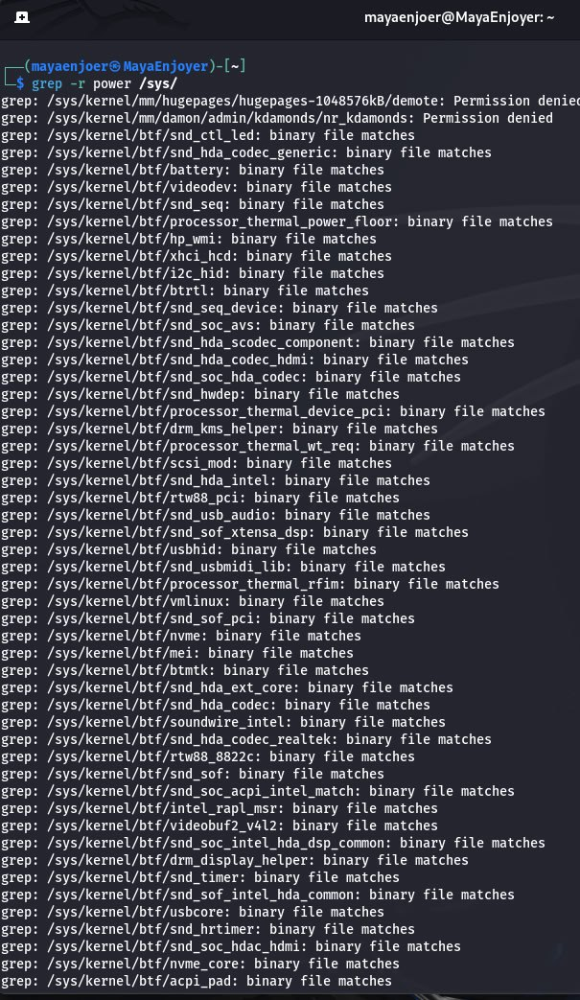

The output of the command will contain many files that a normal (non-root) user will not be able to read (we will get an “Access Denied” error message). These messages clutter up the terminal and make it difficult to search. Since “Access Denied” errors are part of stderr, we can redirect them to a “black hole,” i.e., use `/dev/null`: `grep -r power /sys/ 2>/dev/null`.

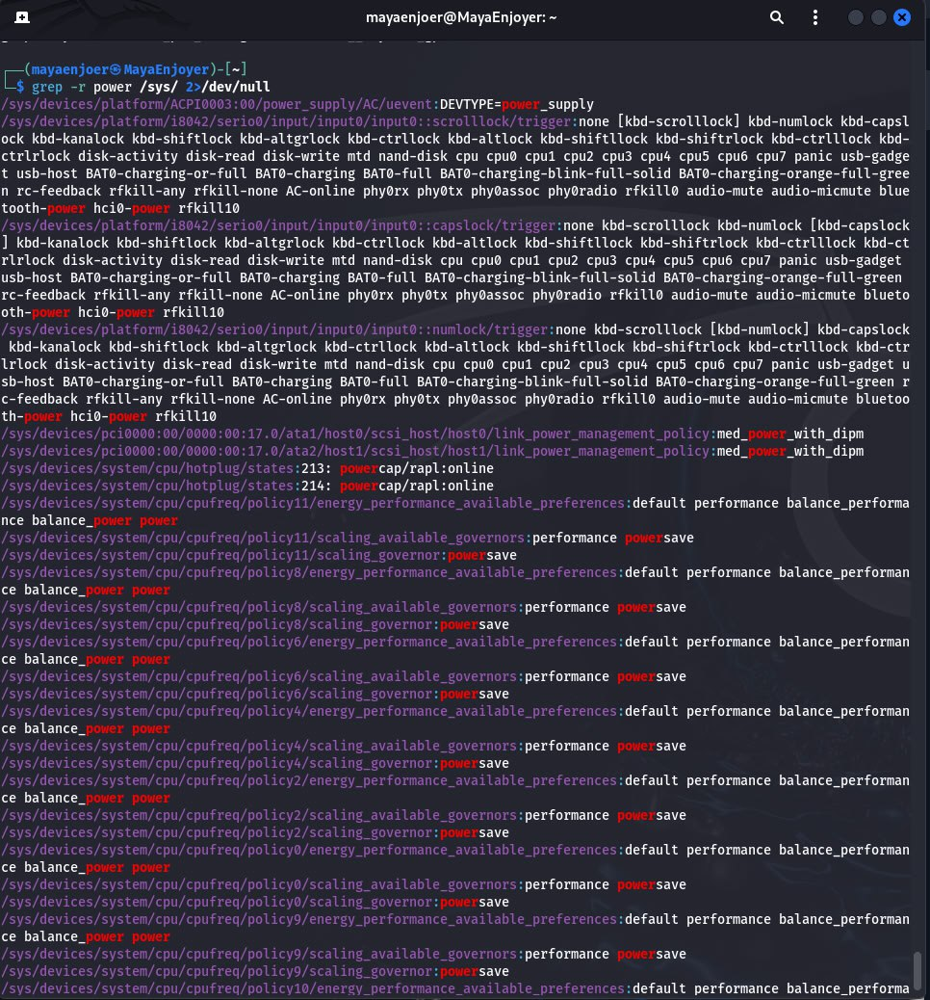

We can also redirect all output to `/dev/null`.

Sometimes it is useful to get rid of all output. There are two ways to do this: `grep -r power /sys/ >/dev/null 2>&1`. The `>/dev/null` part means “redirect data from `stdout` to `/dev/null`”, and the `2>&1` part means “redirect data from `stderr` to `stdout`”. This way we have redirected all output of the command to the void.

---

#### Conclusions: So, I completed laboratory work No. 6, during which we examined the commands Linux commands for archiving and compressing data and working with text. During the work, I got acquainted with the main utilities for archiving, such as `tar`, `zip`, `gzip`, `bzip2`, `xz`, as well as their keys for creating, unpacking and viewing archives. I learned to use file compression using `gzip`, `bzip2`, `xz`, and also combine them with the tar command to create `.tar.gz`, `.tar.bz2`, `.tar.xz` archives. I also practically used the `cat`, `less`, `more`, `head`, `tail`, `nl`, `sort`, `cut`, `grep`, `tr` commands for working with text files, analyzing them and filtering data.

AND, AS ALWAYS IN MY TRADITION, I WANT TO SAY THAT DON'T FORGET TO SMILE, BECAUSE IT IS AS IMPORTANT AS HEALTHY EATING, A USEFUL WAY OF LIFE, ETC. A SMILE ALWAYS GIVES A GREAT CHARGE OF ENERGY, BOTH TO YOU AND TO THE PEOPLE AROUND YOU, A SMILE HELPS YOU TO BE MORE CHEERFUL AND LIVE JOYFULLY. SO LEARN KALI LINUX WITH A SMILE AND EVERYTHING WILL BE WELL WITH YOU. I LOVE YOU ALL AND SEE YOU AGAIN ;)


