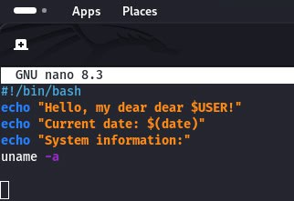
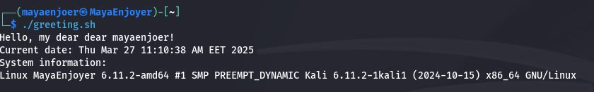
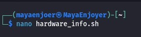
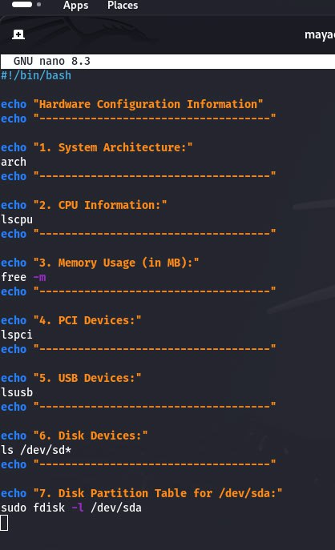
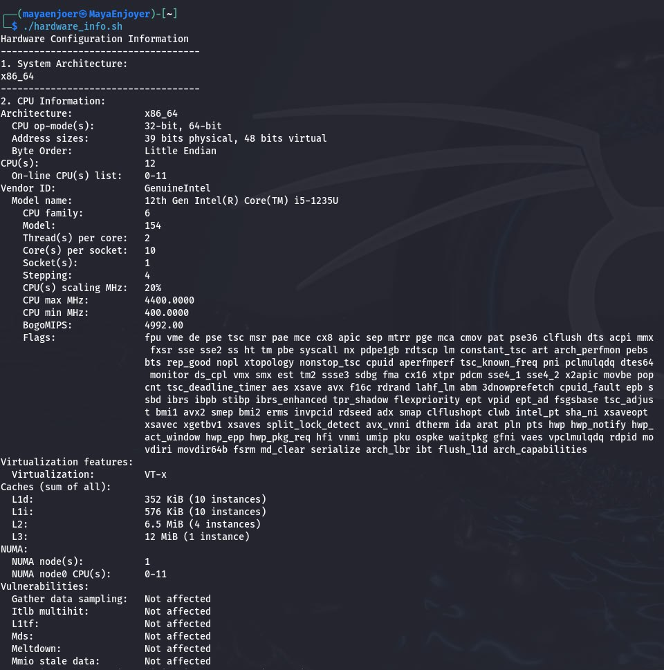
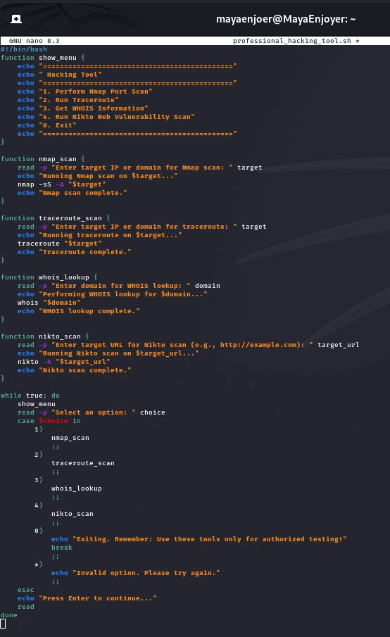
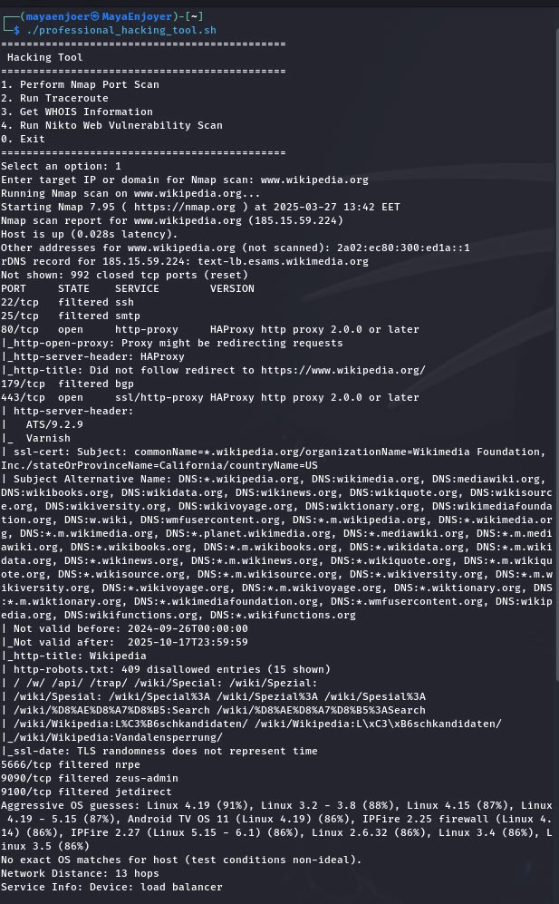
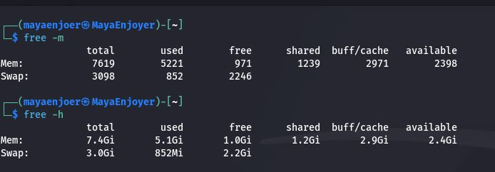

<h1 align="center">
    
    <br />
    Laboratory work with Kali Linux №7
</h1>

#### In this work, I will do lab #7, applying knowledge of Kali Linux. This work is created for the purpose of educational content, as an assignment for the discipline Operating Systems of the Kyiv College of Communications.

Topic: “Creating scenario scripts and determining system hardware configuration”

Objectives:
1) Gaining practical skills in working with the Bash shell.
2) Getting to know the basic steps in working with scripting.

---

#### In this article, I'm going to answer questions about the Kali Linux operating system and simply Linux.


## Before we begin, let's consider the following question:

### The concept of a script in a command shell:
A shell script is a command-line interface and scripting language that allows users to create sequences of commands to perform various tasks directly from the command line. From initial program startup to complex automated tasks, BASH scripts provide a powerful tool for managing a Linux system.

Flexibility and Efficiency: BASH scripts give users great flexibility in performing tasks. They allow you to automate routine operations, simplify file and directory processes, and allow you to create sequences of commands to perform complex tasks.

Scripting Applications:

🟣 Data Backup;

🟣 Bulk File Renaming/Copying;

🟣 Software Installation and Configuration;

🟣 System Status Monitoring;

🟣 Automatic Log Update or Cleanup.

### How are scripts created and edited?
To create a script, first we need to create a new text file with the `.sh` extension, this is of course not necessary, but it is recommended for convenience. For example, let's create such a file: `nano myKaliLinuxscript.sh`.

Next, in order to write a script in the file, we need to enter a sequence of commands. At the beginning of the file, we must specify the so-called shebang - a special line that tells the system which shell to use to execute the script, we can do this using the following command: `#!/bin/bash`.
After that, we have the commands themselves:
```
#!/bin/bash
echo "Hello, World from MayaEnjoyer!"
```
After writing the script in the editor, we need to save the file using the key combinations `Ctrl+O` and exit using `Ctrl+X` - for nano.

Next, in order for the script to be run as a program, we need to make it executable, we can do this with the following command: `chmod +x myKaliLinuxscript.sh`.

And in order to run the script, we can use one of these scripts, depending on our needs:
```
To run via relative or absolute path ⟶ ./myKaliLinuxscript.sh
Through the shell ⟶ bash myKaliLinuxscript.sh
Or ⟶ sh myKaliLinuxscript.sh

```

### Main components of the motherboard:

| №    | Component name                         | Purpose and functions                                                                                                                                                                                                                                                                                                                                                                                                                                                                                                                                                                                                                                                                                                                                                                                                                                                                                                                                                                                                                                                                                            |
|------|----------------------------------------|------------------------------------------------------------------------------------------------------------------------------------------------------------------------------------------------------------------------------------------------------------------------------------------------------------------------------------------------------------------------------------------------------------------------------------------------------------------------------------------------------------------------------------------------------------------------------------------------------------------------------------------------------------------------------------------------------------------------------------------------------------------------------------------------------------------------------------------------------------------------------------------------------------------------------------------------------------------------------------------------------------------------------------------------------------------------------------------------------------------|
| 1    | PS/2 connector                         | The primary purpose of PS/2 is to provide an interface for connecting a mouse and keyboard to a computer, and to provide a stable, low-latency connection that is essential for accurate and fast command transmission. The primary functions of PS/2 include transmitting signals from a keyboard or mouse to the motherboard for processing by the computer, supporting direct connection, allowing mice and keyboards to be used without additional drivers, and shielding against electrical interference. Due to its separate interface, PS/2 is less susceptible to electrical interference than USB devices.                                                                                                                                                                                                                                                                                                                                                                                                                                                                                              |
| 2    | Processor Connector (Socket)           | The main purpose of the socket is to mount the processor on the motherboard in such a way as to ensure stable contact between the processor contacts and the contact elements on the motherboard, as well as to facilitate the exchange of data between the processor and the system bus. The socket allows you to easily replace or upgrade the processor without changing the entire motherboard, which simplifies system upgrades. The functions of the socket include providing a reliable physical connection that holds the processor in the desired position using a mechanical latch. It also provides electrical contact between the processor contacts and the motherboard, allowing the processor to receive power and transmit data. In addition, the socket provides heat dissipation from the processor, as its design allows for the installation of cooling systems.                                                                                                                                                                                                                             |
| 3    | RAM connector                          | The primary purpose of the RAM connector is to provide a secure physical and electrical connection between the RAM modules and the motherboard, allowing the processor to quickly access data while storing it temporarily while the system is running. The functions of the RAM connector include providing a stable physical mount for the RAM modules, allowing them to be securely installed in the system. The connector provides electrical contact between the motherboard and the RAM modules, allowing for high-speed data transfer. It also supports memory expansion, allowing you to add additional RAM modules to increase system performance.                                                                                                                                                                                                                                                                                                                                                                                                                                                      |
| 4    | Northbridge                            | The Northbridge's primary purpose is to provide communication between the processor and other high-speed devices for optimal system performance. The Northbridge's functions include coordinating data exchange between the CPU and RAM, ensuring the processor's fast access to RAM, which is key to fast data processing and overall system performance. It also connects the processor to a graphics interface (such as AGP or PCI Express), allowing for fast graphics data to be transferred to and from the graphics card, which is important for visually intensive tasks such as gaming and video processing. The Northbridge coordinates data transfers with the Southbridge, which handles slower peripherals, ensuring the overall system runs smoothly. The type of Northbridge determines the supported RAM and graphics standards, and also affects the maximum bandwidth and performance of the system.                                                                                                                                                                                           |
| 5    | Power Connector                        | The main purpose of the power connector is to provide the motherboard with the necessary electrical power to operate all the components such as the processor, RAM, graphics card, and other peripherals. In addition, the power connector helps in voltage regulation to ensure stable operation of the motherboard components. The power connector provides a physical connection between the motherboard and the power supply, allowing the transfer of electrical power. It also distributes different voltage levels to power different components of the system.                                                                                                                                                                                                                                                                                                                                                                                                                                                                                                                                           |
| 6    | IDE Connector                          | The primary purpose of the IDE connector is to provide a secure physical and electrical connection between storage devices and the motherboard, allowing the computer to read and write information to these devices. The functions of the IDE connector include providing a stable physical mount for storage devices, allowing them to be securely installed in the system. The connector provides electrical contact between the motherboard and the storage devices, allowing data transfer at speeds up to 133 Mbps. In addition, the IDE connector supports connecting up to two devices on a single channel, which reduces the number of cables required and provides flexibility in system configuration.                                                                                                                                                                                                                                                                                                                                                                                                |
| 7    | SATA Connector                         | The primary purpose of the SATA connector is to provide a reliable physical and electrical connection that allows the processor to access data quickly, ensuring efficient system operation. The functions of the SATA connector include providing a stable physical connection for storage devices, allowing them to be securely installed in the system. The SATA connector provides electrical contact, allowing for high-speed data transfer rates of up to 6 Gbps. The SATA connector also supports hot-swappable functionality, allowing storage devices to be removed and installed without turning off the computer, which increases usability.                                                                                                                                                                                                                                                                                                                                                                                                                                                          |
| 8    | CMOS Battery                           | The main purpose of the CMOS battery is to provide power to the CMOS chip, which contains the BIOS and system settings, such as hardware configuration, boot options, and other system settings. The functions of the CMOS battery include storing BIOS settings as it powers the CMOS chip, which stores the BIOS settings, allowing the computer to remember the system configuration even when the power is off. The battery also provides power to the Real Time Clock (RTC), which allows the computer to maintain accurate time and date even when the computer is not running. With the CMOS battery, users do not lose their system settings, making the computer setup process more convenient and stable. When the computer is turned on, the BIOS reads the settings from the CMOS, allowing the system to boot correctly and operate according to the configuration specified by the user.                                                                                                                                                                                                           |
| 9    | Southbridge                            | The main purpose of the southbridge is to process and coordinate data transferred between system components that are not directly connected to the processor. The functions of the southbridge include controlling peripheral devices, as it is responsible for interacting with components such as hard drives, optical drives, USB ports, audio and network controllers, which ensures stable data transfer between the motherboard and connected devices. In addition, it coordinates data transfer between the processor and components connected to the system bus in such a way as to ensure optimal information exchange speed. The southbridge also plays a role in interacting with memory controllers, providing access to RAM and storing information about system settings.                                                                                                                                                                                                                                                                                                                          |
| 10   | Floppy Disk Connector                  | The primary purpose was to provide a secure connection between the floppy disk drive and the motherboard, allowing the computer to read and write data to the floppy disks. The functions of the floppy disk connector include data transfer, as the connector provides an electrical connection that allows data to be transferred between the floppy disk drive and the computer, allowing information to be read and written. The connector is also responsible for supplying electrical power to the floppy disk drive, which is necessary for its operation. In addition, the connector allows the computer to control the functions of the floppy disk drive, such as opening, closing, and formatting the floppy disks. The connector has standard specifications, allowing different models of floppy disk drives to be connected, ensuring their compatibility with the computer. In some cases, floppy disk slots may support "hot swapping" functionality, allowing you to remove and insert floppy disks without turning off the computer.                                                           |
| 11   | PCI slots                              | The main purpose of PCI slots is to provide flexibility and expandability of the functionality of a computer system. The functions of PCI slots include: 1) providing a physical and electrical connection for expansion cards, allowing the computer to interact with additional devices; 2) transferring data between expansion cards and the motherboard via the system bus, providing rapid information exchange; 3) supporting various standards and speeds, allowing the use of a wide range of cards, from old to new technologies; 4) hot-swappable (in newer versions), allowing components to be added or changed without turning off the computer; 5) improving system performance, as modern PCI slots (for example, PCI Express) provide higher bandwidth compared to older standards.                                                                                                                                                                                                                                                                                                              |
| 12   | BIOS                                   | The primary purpose of the BIOS is to test system components, load the operating system, and provide basic control functions for the interaction between hardware and software. BIOS functions include power-on self-test (POST) – after the computer is turned on, the BIOS performs a self-test to verify that all necessary components, such as the processor, RAM, and storage devices, are working properly; operating system boot – after POST is successfully completed, the BIOS loads the operating system from the hard drive or other bootable device, transferring control to the system; system configuration settings – the BIOS allows users to configure hardware parameters such as boot order, processor frequency, memory settings, and other settings; hardware component support – the BIOS provides basic drivers for various devices such as hard drives, keyboards, mice, and other peripherals; system configuration storage – the BIOS stores important system configuration information in CMOS memory, allowing the settings to be remembered even after the computer is turned off. |
| 13   | PCI-Express                            | The primary purpose of the PCI-Express slot is to provide a high-speed connection between computer components, allowing for efficient processing of large amounts of data required by graphics cards, SSDs, network cards, and other devices. The functions of the PCI-Express slot include providing high bandwidth for data transfer, allowing devices to operate at significantly higher speeds compared to previous interfaces such as PCI and AGP; supporting different numbers of lanes (x1, x4, x8, x16), allowing devices with different data transfer speed requirements to be connected; providing backward compatibility with previous PCIe versions, allowing newer devices to be used in older slots; allowing multiple devices to be connected to increase overall system performance; minimizing data transfer delays, which is especially important for high-performance applications such as gaming and video processing.                                                                                                                                                                       |
| 14   | Network Interface Card (LAN) Connector | The primary purpose of this connector is to provide a reliable connection between the computer and external network devices, allowing data to be exchanged with other computers and devices on the network. The functions of the network interface card connector include: providing an electrical and physical connection for network adapters, allowing the computer to connect to a network; transmitting data between the computer and the network adapter, allowing information to be exchanged over the network; supporting various Ethernet standards, ensuring compatibility with various network devices and technologies; providing hot-swappable capabilities, allowing network adapters to be connected or disconnected without turning off the computer; and implementing power management features, which can reduce energy consumption during system inactivity.                                                                                                                                                                                                                                  |
| 15   | USB Connectors                         | The main purpose of this connector is to provide a fast and convenient connection between a computer and external devices, facilitating data exchange and power supply. The functions of the USB connector include: providing fast data transfer between the computer and connected devices, supporting various transfer speeds, such as USB 2.0, 3.0 and 3.1, which allows processing large amounts of information; providing power for connected devices, allowing them to be powered without the need for additional adapters; supporting "hot swapping", allowing devices to be connected or disconnected without turning off the computer; providing a standard interface that allows a wide range of devices to be connected regardless of manufacturer; the ability to connect multiple devices through hubs, which expands the number of available ports.                                                                                                                                                                                                                                                |
| 16   | Integrated Sound Card Connector        | The primary purpose of these connectors is to provide high-quality audio output and input, allowing users to enjoy audio in games, music, and videos. The functions of the integrated sound card connectors include: providing a physical and electrical connection for various audio devices, allowing the transmission of audio signals; supporting multi-channel audio, enabling surround sound in home theater systems; allowing users to adjust audio settings through software, allowing users to optimize the sound quality according to their preferences; supporting standard audio formats, ensuring compatibility with various audio equipment and applications.                                                                                                                                                                                                                                                                                                                                                                                                                                      |
| 17   | Parallel Port                          | The primary purpose of these ports is to provide data transfer between a computer and connected devices using various communication methods. The functions of serial interface ports include transferring data one bit at a time, which allows for fewer wires needed for connection and reduces the complexity of the connection. Serial ports are often used to connect to devices that do not require high data transfer rates, such as mice or modems. Parallel ports, on the other hand, transfer multiple bits at a time, which provides a higher data transfer rate. This makes them ideal for connecting devices such as printers that require fast data transfer. Both types of ports support standard protocols, which ensures compatibility with different devices and their smooth operation. Although serial and parallel ports have become less popular in modern systems due to the proliferation of USB and other modern technologies, they are still used in many specialized or older devices.                                                                                                 |


### Devices that operate with the concepts of MBR and GPT:

#### 1) MBR is the traditional structure for managing disk partitions. Since it is compatible with most systems, it is still widely used. The master boot record is located in the first sector of the hard disk, or, more simply, at the very beginning. It contains the partition table - information about the organization of logical partitions on the hard disk.

The MBR also contains executable code that scans the partitions for an active OS and initiates the OS boot procedure.

An MBR disk allows only four primary partitions. If you need more, you can designate one of the partitions as an extended partition, and you can create more partitions or logical drives on it.

MBR uses 32 bits to record the partition length, expressed in sectors, so each partition is limited to a maximum size of 2 TB.

#### Advantages:
- Compatible with most systems.

#### Disadvantages:
- Allows only four partitions, with the ability to create additional partitions on one of the primary partitions.
- Limits partition size to two terabytes.
- Partition information is stored in only one place, the master boot record. If it is corrupted, the entire disk becomes unreadable.


#### 2) GPT is a newer standard for defining the partition structure on a disk. It uses globally unique identifiers (GUIDs) to define the structure.

It is part of the UEFI standard, meaning that a UEFI-based system can only be installed on a disk that uses GPT, such as the Windows 8 Secure Boot feature.

GPT allows for an unlimited number of partitions, although some operating systems may limit their number to 128 partitions. GPT also has virtually no partition size limit.

#### Advantages:
- Allows for an unlimited number of partitions. The limit is set by the operating system, for example, Windows allows no more than 128 partitions.
- Does not limit the size of the partition. It depends on the operating system. The limit on the maximum partition size is larger than the capacity of any disk currently available. For disks with 512-byte sectors, a maximum size of 9.4 ZB is supported (one zettabyte is 1,073,741,824 terabytes).
- GPT stores a copy of the partition and boot data and can recover data if the main GPT header is corrupted.
- GPT stores a cyclic redundancy check (CRC) checksum value to verify the integrity of its data (used to verify the integrity of the GPT header data). If corrupted, GPT can detect the problem and attempt to recover the corrupted data from another location on the disk.

#### Disadvantages:
- May be incompatible with older systems.

### The essence of the mount operation, and why it is needed:

The mounting operation is the process of connecting a file system (for example, from a USB drive, hard drive, CD/DVD, or network share) to the general file hierarchy of the operating system.
The essence of mounting is that all files and directories are part of a single directory tree, which starts at the root `/`. To make a file system available from another device, we need to connect it to a certain point in this hierarchy - this is mounting.

Mounting is needed in order to:

🟣 Have access to data, that is, after mounting, files from another device become available for viewing, editing, copying, etc.

🟣 Have a single directory structure, because regardless of the number of devices, Linux represents all data in a single tree.

🟣 Have control over the access point, that is, we can choose where exactly the contents of the external drive will be "attached" - for example, `/mnt/usb`, `/media/cdrom`, `/home/user/hdd`.

🟣 Have flexibility, because with flexibility we can even mount an ISO image, a network file system, or a temporary partition in RAM.

---

### Next, let's work through all the command examples presented in the labs of the NDG Linux Essentials course (Labs 11-12):

| **Command name**          | **Purpose and functionality**                                                                                                                                                |
|---------------------------|------------------------------------------------------------------------------------------------------------------------------------------------------------------------------|
| `echo "Hello, World!"`    | Outputs the specified text to the terminal. In this case, the message "Hello, World!". The command is used for testing, debugging scripts, or simply displaying information. |
| `sh test.sh`              | Runs the `test.sh` script using the `sh` shell interpreter. This allows shell scripts to be executed even if they do not have the executable flag set.                       |
| `./test.sh`               | Runs the script directly as an executable file in the current directory. Before doing so, the script must have execution permissions.                                        |
| `chmod +x ./test.sh`      | Gives the `test.sh` file execution permission. Without this, the script cannot be executed as a command.                                                                     |
| `#!/bin/sh`               | Shebang is an instruction in the first line of a script that indicates that the `sh` interpreter should be used to execute the script.                                       |
| `#!/bin/bash`             | Similar to the previous one, but the `bash` shell is used, which has advanced capabilities compared to `sh`.                                                                 |
| `test -f /dev/ttyS0`      | Checks whether the regular file `/dev/ttyS0` exists. Returns code 0 if the file exists, and 1 if it does not.                                                                |
| `test ! -f /dev/ttyS0`    | Checks whether the file `/dev/ttyS0` does not exist. Returns code 0 if the file does not exist.                                                                              |
| `test -d /tmp`            | Checks whether the `/tmp` directory exists. Used to check for the existence of directories in scripts.                                                                       |
| `test -x \\`which ls\\``  | First `which ls` is executed - find the path to the `ls` command, then `test -x` checks if the file is executable.                                                           |
| `test 1 -eq 1`            | Compares two numbers: whether they are equal. `-eq` means "equal". Returns 0 if the condition is true.                                                                       |
| `test ! 1 -eq 1`          | Checks for negation of equality. Returns 0 if 1 is not equal to 1 (i.e. the condition is false, the result will be 1).                                                       |
| `test 1 -ne 1`            | Checks that the numbers are not equal (`-ne` — not equal). Returns 1, since 1 is equal to 1.                                                                                 |
| `test "a" = "a"`          | Compares strings. Returns 0 if the strings are identical.                                                                                                                    |
| `test "a" != "a"`         | Checks that the strings are different. In this case, it will return 1.                                                                                                       |
| `test 1 -eq 1 -o 2 -eq 2` | Test using the logical OR operator (`-o`). Returns 0 if at least one condition is true.                                                                                      |
| `test 1 -eq 1 -a 2 -eq 2` | Test using the logical AND operator (`-a`). Returns 0 if both conditions are true.                                                                                           |
| `arch`                    | Displays the system architecture type, for example, `x86_64` or `arm64`. Used for diagnostics and software compatibility.                                                    |
| `lscpu`                   | Displays detailed information about the processor (number of cores, clock speed, architecture, cache, etc.).                                                                 |
| `free -m`                 | Displays statistics on RAM usage in megabytes. Helps analyze the load on RAM.                                                                                                |
| `lspci`                   | Displays information about all devices connected via the PCI interface (video cards, sound cards, etc.).                                                                     |
| `lsusb`                   | Displays a list of connected USB devices: flash drives, keyboards, cameras, etc.                                                                                             |
| `ls /dev/sd*`             | Shows all block devices (hard drives, SSDs) and partitions recognized by the system.                                                                                         |
| `fdisk -l /dev/sda`       | Shows the partition table for a specific device `/dev/sda`, including the file system type, size, and location.                                                              |

### Next, let's work in the terminal and consolidate the studied material:

<h1 align="center">

    Practical tasks:

</h1>

### Creating scripts that output text messages to users:

#### 1) The script should display a greeting to the current user indicating the current date and information about the current system.

The first thing we need to do is create a file that will store the script code, this can be done with the following command: `nano greeting.sh`, this will open the nano text editor, but in general you can also use other editors like `vi`, `gedit`, etc.


After opening our text editor, we need to paste the script code, but we must remember that the first line must always start with `#!/bin/bash`.
My script code will look like this (but it may differ, depending on the task):
```
#!/bin/bash
echo "Hello, my dear dear $USER!"
echo "Current date: $(date)"
echo "System information:"
uname -a
```



In order to save and exit the editor, we need to use the following key combinations:
```
Ctrl + O + Enter → To save the file
Ctrl + X → To exit the editor
```

After that, we need to grant the file execution rights, this is necessary so that we can run it as a program, so for this, we need to use the following command:`chmod +x greeting.sh`.


After granting access, all we have to do is run the script using the following command: `./greeting.sh`.



#### 2) A script that should output information about the hardware configuration of the current system.

The first thing we need to do is create a file that will store the script code, this can be done with the following command: `nano hardware_info.sh`, this will open the nano text editor, but in general you can also use other editors like `vi`, `gedit`, etc.



After opening our text editor, we need to paste the script code, but we must remember that the first line must always start with `#!/bin/bash`.

My script code will look like this (but it may vary depending on the task):
```
#!/bin/bash

echo "Hardware Configuration Information"
echo "------------------------------------"

echo "1. System Architecture:"
arch
echo "------------------------------------"

echo "2. CPU Information:"
lscpu
echo "------------------------------------"

echo "3. Memory Usage (in MB):"
free -m
echo "-----------------------------------"

echo "4. PCI Devices:"
lspci
echo "-----------------------------------"

echo "5. USB Devices:"
lsusb
echo "-----------------------------------"

echo "6. Disk Devices:"
ls /dev/sd*
echo "-----------------------------------"

echo "7. Disk Partition Table for /dev/sda:"
sudo fdisk -l /dev/sda
```



To save and exit the editor, we need to use the following keyboard shortcuts:
```
Ctrl + O + Enter → To save the file
Ctrl + X → To exit the editor
```

After that, we need to grant the file execution rights, this is necessary so that we can run it as a program, so for this, we need to use the following command:`chmod +x hardware_info.sh`.


After granting access, all we have to do is run the script using the following command: `./hardware_info.sh`.



#### 3) An example of my script scenario.

My script demonstrates a comprehensive approach to network analysis. The script will use tools such as `
nmap`, `traceroute`, `whois`, `nikto`, and let's implement an interactive menu that will allow us to select the desired operation.

As always, first we need to create a file in which the script code will be stored, I will do this with the following command: `nano professional_hacking_tool.sh`, this will open the nano text editor, but in general we can also use other editors, for example `vi`, `gedit`.


After opening our text editor, we need to write the script code, but we remember that the first line should always start with `#!/bin/bash`.

#### My script code will look like this:
```
#!/bin/bash
function show_menu { 
echo "====================================================" 
echo " Hacking Tool" 
echo "====================================================" 
echo "1. Perform Nmap Port Scan" 
echo "2. Run Traceroute" 
echo "3. Get WHOIS Information" 
echo "4. Run Nikto Web Vulnerability Scan" 
echo "0. Exit" 
echo "===================================================="
}

function nmap_scan { 
read -p "Enter target IP or domain for Nmap scan: " target 
echo "Running Nmap scan on $target..." 
nmap -sS -A "$target" 
echo "Nmap scan complete."
}

function traceroute_scan { 
read -p "Enter target IP or domain for traceroute: " target 
echo "Running traceroute on $target..." 
traceroute "$target" 
echo "Traceroute complete."
}

function whois_lookup { 
read -p "Enter domain for WHOIS lookup: " domain 
echo "Performing WHOIS lookup for $domain..." 
whois "$domain" 
echo "WHOIS lookup complete."
}

function nikto_scan { 
read -p "Enter target URL for Nikto scan (e.g., http://example.com): " target_url 
echo "Running Nikto scan on $target_url..." 
nikto -h "$target_url" 
echo "Nikto scan complete."
}

while true; do 
show_menu 
read -p "Select an option: " choice 
case $choice in 
1) 
nmap_scan 
;; 
2) 
traceroute_scan 
;; 
3) 
whois_lookup 
;; 
4) 
nikto_scan 
;; 
0) 
echo "Exiting. Remember: Use these tools only for authorized testing!" 
break 
;; 
*) 
echo "Invalid option. Please try again." 
;; 
esac 
echo "Press Enter to continue..." 
read
done
```



To save and exit the editor, we need to use the following keyboard shortcuts:
```
Ctrl + O + Enter → To save the file
Ctrl + X → To exit the editor
```

After that, we need to grant the file execution rights, this is necessary so that we can run it as a program, so for this, we need to use the following command: `chmod +x professional_hacking_tool.sh`.


After granting access, all that's left to do is run the script using the following command: `./professional_hacking_tool.sh`.



---

## Answers to the control questions:

### 1) What is the difference between the arch and lscpu commands?

#### Comparison table for `arch` and `lscpu` commands:

| Command   | Purpose                                                                                                                                                                 | Verbosity                                          | Usage Examples                                                                                                                                                                                            | Additional Notes                                                                                                                             |
|-----------|-------------------------------------------------------------------------------------------------------------------------------------------------------------------------|----------------------------------------------------|-----------------------------------------------------------------------------------------------------------------------------------------------------------------------------------------------------------|----------------------------------------------------------------------------------------------------------------------------------------------|
| `arch`    | Displays the base architecture of the system (e.g. `x86_64`).                                                                                                           | Minimal: Shows only the architecture type.         | A quick check to see if the system is running in 32-bit or 64-bit mode; used in scripts to select appropriate packages or programs.                                                                       | The output of the `arch` command is usually the same as `uname -m`. Good for getting started with the hardware platform.                     |
| `lscpu`   | Provides complete information about the processor, including model, number of cores, threads, clock speed, cache, architecture, byte order, and supported technologies. | High: Describes all CPU characteristics in detail. | Used for performance diagnostics, system optimization, and detailed hardware reporting; helps determine whether hardware virtualization or modern cryptographic instructions (e.g. AES-NI) are supported. | Useful for both experienced administrators and engineers, and for those who want to understand their processor's capabilities in more depth. |


### 2) What command can be used to get information about the RAM usage status of the current system?

To check the status of RAM usage, in Linux we can use the `free` command. For example, the `free -m` command displays information in megabytes, where we can see the total amount of memory, used memory, free memory and
additional data that helps to assess the real load on the system.

But for a more convenient viewing of the data, you can use the command: `free -h`. This command displays information in a more convenient and understandable format, where the amount of memory is displayed with automatic selection of units of measurement, which greatly facilitates the interpretation of the data.



### 3) How can scripts manipulate variables and create branching and cyclic scenarios?

In shell scripts (BASH), variables, conditional constructs, and loops are the basic logic elements that allow you to create dynamic, flexible, and efficient automation scenarios. These mechanisms provide user interaction, condition testing, and repetitive actions—just what you need for system administration.

- Variables allow you to store values for later use in a script. In Bash, you don't need to declare a variable type; it is created automatically when you assign a value.
To assign a value, we need to use the following command: `username="mayaenjoyer"`, and then to read the change, we need to use the following command: `echo "Hello, $username"`. And the user's output of the value is implemented using the following command: `read user_input`. Variables can contain both text and numeric information. For arithmetic operations, you need to use double parentheses `(( ))`.
- Branching allows you to perform different actions depending on the result of a condition check. For branching, we use operators such as: basic if, if-else, and elif (multiple branching).
We can also use the logical operators `-a` (AND), `-o` (OR), the `!` (NOT) operator, or the extended forms `[[ ]]` and `(( ))` for more complex conditions.
- Loops allow you to repeat actions a specified number of times or until a certain condition is met. This is convenient for processing files, arrays, or creating reports.
For loops, we use such loops as: `for`, `while`, and `until` loops.
Also, inside loops, we can use `break` (to exit the loop) or `continue` (to skip an iteration).

### 4) What commands can be used in the terminal to view the connection status of peripheral devices?

| **Command**                                | **Description and Purpose**                                                                                                                                                                                                                                                                                    |
|--------------------------------------------|----------------------------------------------------------------------------------------------------------------------------------------------------------------------------------------------------------------------------------------------------------------------------------------------------------------|
| `lsusb`                                    | Displays a detailed list of all USB devices connected to the system, including manufacturer information, device IDs, and device classification. This allows system administrators to perform compatibility analysis, debugging, and diagnostics on peripherals.                                                |
| `lspci`                                    | Provides information about all PCI devices, such as network, video, audio, and other internal components. The command provides extended data that helps in hardware monitoring, planning upgrades, and troubleshooting component compatibility issues in the system.                                           |
| `lsblk`                                    | Displays the hierarchical structure of block devices, including hard drives, SSDs, flash drives, and their partitions. This is useful for data storage management, partition analysis, and storage deployment, allowing you to clearly see how the physical devices in the system are organized.               |
| `df -h`                                    | Displays information about file system usage on connected drives in a user-friendly format with automatic selection of units of measurement (KB, MB, GB). This allows you to quickly assess the fullness of storage and identify possible space problems, which is critical for optimizing server performance. |
| `dmesg \| grep -i usb`                     | Displays kernel message logs filtered by the keyword "usb". This command is indispensable for analyzing the initialization process and interaction of USB devices with the system, allowing you to detect driver problems or hardware conflicts in real time.                                                  |
| `udevadm info --query=all --name=/dev/sdX` | Provides complete information about a specific block device (e.g. `/dev/sdX`), including attributes, models, serial numbers, and other specifications. This allows for in-depth analysis of hardware components for integration into device management and automated monitoring systems.                       |

### 5) What are the capabilities of gparted?
GParted is a partition management tool for Linux operating systems. It allows you to resize partitions, create new partitions, format partitions, move partitions, and more. GParted supports most file systems, including ext2/3/4, NTFS, FAT16/32, ReiserFS, XFS, JFS, and more.

With gparted you can do the following:

- Create, delete, and format partitions on disks;

- Resize and move existing partitions without losing data;

- Assign labels to partitions for better identification;

- Check file systems for errors;

- Copy and paste partitions;

- Work with partition tables (MBR and GPT);

- Enable/disable partition flags, such as `boot`, `hidden`, `lba`, etc.

GParted has a very user-friendly graphical interface, making it very suitable for beginners. It is also available as a LiveCD, which allows you to use it even without an installed OS.

---

#### Conclusions: So, I completed laboratory work No. 7, during which we learned to create simple Bash scripts and not only simple ones ;) We also learned to grant them execution rights, run them using various commands. We also explored logical constructs that allow us to implement branching and cyclic execution of commands in scripts. In addition, we got acquainted with basic commands for obtaining information about the hardware configuration of the computer, such as `arch`, `lscpu`, `lsusb`, `lspci`, `fdisk -l`, `free -m` and others.

AND, AS ALWAYS MY TRADITION, I WANT TO WISH YOU ALL A GOOD MOOD AND DON'T FORGET TO SMILE MORE OFTEN. SO I WISH YOU SUCCESS IN LEARNING KALI LINUX. I LOVE YOU ALL AND SEE YOU AGAIN ;)

~~


