<h1 align="center">
    
    <br />
    Laboratory work with Kali Linux №8
</h1>

#### In this work, I will do lab #8, applying knowledge of Kali Linux. This work is created for the purpose of educational content, as an assignment for the discipline Operating Systems of the Kyiv College of Communications.

Topic: "Saving system service data and its network configuration"

Objectives:
1) Gaining practical skills in working with the Bash command shell.
2) Introduction to basic structures for storing system data - processes, memory, log files, and kernel status messages.
3) Introduction to the FHS standard.
4) Familiarity with network setup steps.

---

#### In this article, I'm going to answer questions about the Kali Linux operating system and simply Linux.


## Before we begin, let's consider the following question:

### The concept of a "pseudo file system" and why the system needs it:
A pseudo-file system is a logical structure that represents data or system interfaces as files, but is not physically stored on disk. In Linux, it is used, among other things, to access the kernel, devices, and processes (/proc, /sys, /dev, etc.). For example, in Sprite, a pseudo-file system can be used to access network file servers (NFS) or version control systems via the Universal File Interface.

The need for pseudo-file systems arises from the need to provide a convenient and unified way to access various system resources, such as input/output devices, kernel configuration parameters, process information, etc. Thanks to pseudo-file systems, we can:

🟣 Dynamically access information without the need for separate utilities or APIs;

🟣 Provide a single interface for accessing system resources through the file model;

🟣 Get a tool for debugging, monitoring, and managing OS components in real time;

🟣 And integrate external services into the file hierarchy without physically storing data.

#### Main pseudo file systems in Linux:

| **Pseudo-file system**   | **Description and features**                                                                                                                                         | **Usage example**                                                 |
|--------------------------|----------------------------------------------------------------------------------------------------------------------------------------------------------------------|-------------------------------------------------------------------|
| **/proc**                | A virtual file system that provides access to information about processes and the kernel in real time. The data is not stored on disk, but is generated dynamically. | `cat /proc/cpuinfo` – view information about the CPU              |
| **/sys**                 | Interface to the internal structures of the kernel. Used to interact with devices, drivers and subsystems (for example, power management, kernel variables, etc.).   | `cat /sys/class/power_supply/BAT0/status` – view battery status   |
| **/dev**                 | Contains special device files. For example, `/dev/sda` – disk, `/dev/null`, `/dev/zero` – special devices.                                                           | `ls /dev` – view all devices                                      |
| **/run**                 | Contains information about running services and temporary runtime data available after system boot.                                                                  | `cat /run/utmp` – information about users in the system           |
| **/tmpfs**               | Temporary file system in RAM. Used to store temporary data that should not remain after reboot.                                                                      | `/dev/shm` – example of tmpfs used for interprocess communication |
| **debugfs**              | Used for kernel debugging. Not mounted by default. Available for developers and administrators.                                                                      | `mount -t debugfs none /sys/kernel/debug` – mount debugfs         |
| **configfs**             | Used to configure the kernel in user space by creating/deleting files.                                                                                               | `mount -t configfs none /sys/kernel/config` – mount configfs      |
| **securityfs**           | Interface for working with kernel security modules (e.g. SELinux, AppArmor).                                                                                         | `ls /sys/kernel/security/` – view security information            |
| **cgroupfs**             | Represents control groups for limiting process resources.                                                                                                            | `ls /sys/fs/cgroup/` – view active groups                         |

### Why don't users access the /proc directory directly so often and how can information be obtained from it?

`/proc` is rarely opened with `handles` because `/proc` has a low-level format, in which the data is presented in raw text, without explanations and signatures. For example, the `cat /proc/meminfo` command will return dozens of lines of the type MemFree: n-number of kB, which you need to be able to interpret.

`/proc` also has a complex structure, because the root of `/proc` contains hundreds of PID directories (one for each process) and dozens of service files, so it can easily confuse a beginner. Plus, there is no need to edit `/proc`, because `/proc` is used mainly "read-only". And it is better to change kernel parameters through `sysctl`, rather than directly `echo > /proc/`.

#### To get information from `/proc`, we can use the following commands:

```
/proc/cpuinfo ⟶ displays CPU parameters
/proc/meminfo ⟶ displays memory statistics
/proc/uptime ⟶ shows system uptime (seconds since boot)
/proc/partitions ⟶ lists currently-recognized disk partitions
/proc/version ⟶ prints kernel version and build info
/proc/<PID>/status ⟶ detailed status of a specific process (replace <PID>)
```

### Purpose of the files `/proc/cmdline`, `/proc/meminfo` and `/proc/modules`:

- `/proc/cmdline` shows the parameters passed to the kernel when it started. An example `/proc/cmdline` file looks like this: `ro root=/dev/VolGroup00/LogVol00 rhgb quiet 3`.
This tells us that the kernel is mounted read-only (signified by `(ro)`), located on the first logical volume (`LogVol00`) of the first volume group (`/dev/VolGroup00`). `LogVol00` is the equivalent of a disk partition in a non-LVM system (Logical Volume Management), just as `/dev/VolGroup00` is similar in concept to `/dev/hda1`, but much more extensible.
Next, `rhgb` signals that the `rhgb` package has been installed, and graphical booting is supported, assuming `/etc/inittab` shows a default runlevel set to `id:5:initdefault:`.
Finally, `quiet` indicates all verbose kernel messages are suppressed at boot time.

  
- ` /proc/meminfo` this is one of the more commonly used files in the /proc/ directory, as it reports a large amount of valuable information about the system's RAM usage.
Below is a breakdown of the output from a Kali Linux system, ~8 GiB RAM with a concise explanation of the key fields and a brief interpretation of the memory status.
```
MemTotal: 7802816 kB ⟶ ≈ 7.44 GiB of physical RAM (total)
MemFree: 3372504 kB ⟶ ≈ 3.22 GiB of completely free pages
MemAvailable: 5314944 kB ⟶ ≈ 5.07 GiB of real "reserve" memory that the system can give to applications
Buffers: 219404 kB ⟶ 214 MiB of buffer-cache of "raw" disk blocks
Cached: 2203076 kB ⟶ 2.10 GiB of disk page-cache (files, directories, libraries)
SwapTotal: 3173372 kB ⟶ ≈ 3.03 GiB allocated for swap
SwapFree: 3173372 kB # all swap is free → swap is not used
Active: 2699108 kB ⟶ 2.57 GiB hot memory — just or recently used
Inactive: 954352 kB ⟶ 931 MiB cold memory — candidate for release
AnonPages: 1254740 kB ⟶ 1.19 GiB anonymous pages (process heap/stack)
Shmem: 342492 kB ⟶ 334 MiB tmpfs / shared-memory
Slab: 305808 kB ⟶ 299 MiB kernel-cache data structures
KernelStack: 10976 kB ⟶ 10.7 MiB kernel stacks for all threads
PageTables: 22460 kB ⟶ 21.9 MiB user process page tables
CommitLimit: 7074780 kB ⟶ 6.75 GiB theoretical maximum memory that can be reserved
Committed_AS: 5230044 kB ⟶ 4.99 GiB already reserved by processes
```
Most of the information in /proc/meminfo is used by the free, top, and ps commands. In fact, the output of free is similar in appearance to the contents and structure of /proc/meminfo. However, /proc/meminfo itself has more details:

🟣 MemTotal — The total amount of available RAM in kibibytes: physical RAM minus reserved areas and kernel code.

🟣 MemFree — The amount of physical RAM that is not currently in use.

🟣 MemAvailable — An estimate of the amount of memory (RAM + page cache) that the system can free without switching to swap.

🟣 Buffers — Memory occupied by block I/O buffers (raw disk blocks).

🟣 Cached — The amount of RAM used by Page Cache (file data cache); used to speed up repeated file reads.

🟣 SwapTotal — Total swap space in kibibytes.

🟣 SwapFree — Free (unused) swap space.

🟣 Active — "Hot" memory pages (recently used); pushed to swap last.

🟣 Inactive — "Cold" pages that can be given to other needs or dumped to swap when memory is low.

🟣 AnonPages — The amount of anonymous pages (not associated with files) allocated to user processes.

🟣 Slab — Memory occupied by internal kernel data structures (slab allocator).

🟣 SReclaimable — Part of Slab that can be freed when memory pressure is high (e.g. inode-cache).

🟣 SUnreclaim — Part of Slab that cannot be freed without restarting the kernel.

🟣 KernelStack — Memory occupied by kernel stacks for all system threads.

🟣PageTables — The amount of RAM used for page tables (MMU structures) of all processes.

🟣 Dirty — Modified (dirty) file cache pages that have not yet been written to disk.

🟣 Writeback — Pages that have **already** been sent by the system to be written to disk in the background.

🟣 CommitLimit — The upper limit of the total amount of memory (RAM + swap) that can be allocated to processes, taking into account the overcommit policy.

🟣 Committed_AS — The total amount of memory already reserved by all processes (takes into account possible "lazy" page allocation).

🟣HugePages_Total / HugePages_Free — HugeTLB page statistics (2MB/large pages, if enabled).

🟣 DirectMap4k / DirectMap2M / DirectMap1G — Amount of memory mapped into kernel address space by 4 KiB, 2 MiB, and 1 GiB pages, respectively; useful for analyzing TLB efficiency.

- `/proc/modules` displays a list of all modules loaded into the kernel. Its contents depend on our system configuration and usage, but it should be organized similarly to this example `/proc/modules` file output:

```
nfs 170109 0 - Live 0x129b0000
lockd 51593 1 nfs, Live 0x128b0000
nls_utf8 1729 0 - Live 0x12830000
vfat 12097 0 - Live 0x12823000
fat 38881 1 vfat, Live 0x1287b000
autofs4 20293 2 - Live 0x1284f000
sunrpc 140453 3 nfs,lockd, Live 0x12954000
3c59x 33257 0 - Live 0x12871000
uhci_hcd 28377 0 - Live 0x12869000
md5 3777 1 - Live 0x1282c000
ipv6 211845 16 - Live 0x128de000
ext3 92585 2 - Live 0x12886000
jbd 65625 1 ext3, Live 0x12857000
dm_mod 46677 3 - Live 0x12833000
```

The first column contains the module name, the second column indicates the module's memory size in bytes, and the third column indicates how many instances of the module are currently loaded. A value of zero represents an unloaded module.
The fourth column indicates whether the module depends on another module to function, and lists those other modules.
The fifth column indicates what loading state the module is in: `Live`, `Loading`, or `Unloading` are the only possible values.
And the sixth column indicates the current kernel memory offset for the loaded module. This information can be useful for debugging or for profiling tools such as `oprofile`.

### Purpose of the `free` command:

The free command provides information about the total amount of physical and swap memory, as well as free and used memory.
When used without any option, the `free` command will display memory and swap information in kibibytes.

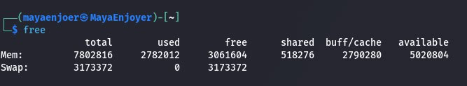

The meaning of each column:

🟣 total - This number represents the total amount of memory that can be used by applications.

🟣 used - Used memory. It is calculated as: `used = total - free - buffers - cache`.

🟣 free - Free / unused memory.

🟣 total - This column can be ignored as it has no meaning. It is here only for backward compatibility.

🟣 buff / cache - The combined memory used by kernel buffers, as well as page cache and blocks. This memory can be freed at any time if needed by applications. If you want buffers and cache to be shown in two separate columns, use the `-w` option.

🟣 available - An estimate of the amount of memory available to run new applications without swapping.

In order to display memory usage in a human-readable format we can use the following command: `free -h`, this command will produce the same result as the `free` command, only the information will be provided in a more convenient format, usually in megabytes and gigabytes.

### Log files and their application examples:

Log files are files that contain system information about the operation of a server or computer, which record certain user or program actions. Their purpose is to record operations performed on the machine for further analysis by the administrator. Regularly reviewing logs will allow you to identify errors in the operation of the system as a whole, a specific service or site (especially hidden errors that are not displayed when viewing in a browser), diagnose malicious activity, and collect statistics on site visits. In general, a log is invaluable information that any computer user can use to find out what happened on the site, in the system, or in the machine itself and at what point in time.

#### Examples of using log files:

🟣 Diagnose system errors — if the operating system does not start, the administrator can check the system logs (/var/log/syslog, /var/log/kern.log) to identify causes, such as a damaged driver or hardware failure.

🟣 Detect unauthorized access attempts — the authorization logs (/var/log/auth.log) store all logins to the system, including unsuccessful ones. This allows you to quickly detect brute-force attacks on SSH or unauthorized logins.

🟣 Monitor the launch and operation of services — the logs of services such as Apache, Nginx, MySQL, PostgreSQL allow you to detect errors in web servers or databases (/var/log/nginx/error.log, /var/log/mysql/error.log).

🟣 Track user activity — using log files, you can understand which users logged in to the system and when, what commands they executed (via bash_history, auditd or /var/log/wtmp, last).

🟣 Monitor server load — by analyzing resource logs or using monitoring systems (for example, sysstat, top, journalctl), you can identify peak load moments and optimize the system.

🟣 Conduct security event analysis (forensics) — after incidents, logs often serve as the only source of truth for reconstructing the attacker’s actions: IP addresses, sessions, attempts to download malicious code, etc.

🟣 Automate monitoring — tools like logwatch, logrotate, fail2ban, journalctl allow you to automatically analyze log files, notify about suspicious activity, and restrict access for violators.


#### Common logs in Linux systems:

| **File**                      | **Purpose**                                             |
|-------------------------------|---------------------------------------------------------|
| `/var/log/syslog`             | General system messages, kernel errors, process startup |
| `/var/log/auth.log`           | User login/logout log, authentication                   |
| `/var/log/dmesg`              | Output of kernel messages during system startup         |
| `/var/log/apache2/access.log` | All HTTP requests to the Apache site                    |
| `/var/log/mysql/error.log`    | MySQL database errors                                   |
| `/var/log/fail2ban.log`       | Blocked IP address log                                  |
| `journalctl`                  | Integrated log viewer in systemd systems                |

### Purpose of the `/var/log/dmesg` file:

The `/var/log/dmesg` file contains the Linux kernel message log, collected during system boot and during its operation. It is a copy of the so-called kernel ring buffer, which records diagnostic messages related to:

🟣 Kernel startup;

🟣 Hardware detection and initialization;

🟣 Driver loading;

🟣 Memory and system errors;

🟣 OOM-killer (a mechanism that forcibly terminates processes when there is insufficient memory);

🟣 Internal kernel messages about problems or important events.

The main features are limited size, because when the log is full, old messages are overwritten by new ones, this can be viewed using the following command: `dmesg -T`, where `-T` adds timestamps in the usual format.

You can also filter `dmesg` output by severity level using the following command: `dmesg --level=err,warn`. Similar information is available from `/proc/kmsg`, but only for root.

The `/var/log/dmesg` file is used to diagnose boot or driver problems, analyze hardware failures, find memory errors, and investigate OOM-killer incidents.

### What is the FHS designed for?

The FHS was developed to provide a single, consistent standard for the filesystem hierarchy for UNIX-based operating systems, including Linux. Its primary purpose is to provide compatibility across distributions and predictability in directory structures, allowing both software developers and system administrators to work in a consistent environment.

The FHS specifies clear rules for which types of files and data should be placed in specific directories. For example, system binaries are stored in `/bin` or `/sbin`, configuration files in `/etc`, libraries in `/lib`, and temporary data in `/tmp`. This structure allows for a logical organization of system resources, making backups, installation of new packages, system administration, and security easier.

The FHS also plays an important role in the interaction between software and the operating system, unifying the approach to the placement of logs, service scripts, variable data, and user resources. Thanks to the FHS, programmers can write portable code, and system administrators can quickly navigate the structure of different Linux distributions without having to learn the unique features of each of them.

### Basic Linux commands for viewing and configuring the network:

#### Linux network commands:

🟣 `ifconfig` — display all available network interfaces in the system;

🟣 `ifconfig -a` — display all active and inactive (hidden) network interfaces;

🟣 `ifconfig <interface>` — display data on the specified network interface;

🟣 `ifconfig <interface> <ip-address> netmask <subnet-mask>` — set the specified IP address and network mask to the specified network interface;

🟣 `ifconfig <interface> hw ether <MAC-address>` — change the MAC address of the specified network interface;

🟣 `ifconfig <interface> mtu <mtu>` — change the MTU value for the specified network interface;

🟣 `ip address` — show the IP addresses of all network interfaces;

🟣 `netstat -tulpn | grep—color:<port>` — check on a given network port;

🟣 `sudo netstat -ap | grep:902`— find a process on a network port;

🟣 `netstat -lt` — check all open ports;

🟣 `sudo ss -tulwn | grep LISTEN`—display a list of open network ports;

🟣 `fuser -k -n tcp 57621` — kill all processes on a given tcp port and close it;

🟣 `route -n`— display the routing table of network interfaces;

🟣 `arp` — display the ARP table (a table of all IP and MAC addresses);

🟣 `ifup <interface>` — enable a given network interface;

🟣 `ifdown <object>` — disable the specified network interface;

🟣 `iwconfig` — work with Wi-Fi (WLAN interface);

🟣 `ethtool ` — work with Ethernet (network card);

🟣 `dhclient -r` — get a new IP address;

🟣 `ping <host>` — check the connection to the specified electronic resource;

🟣 `ping -6 <host>` — perform a check using IPv6;

🟣 `ping -c 10 <host>` — test the Internet connection by sending 10 packets;

🟣 `traceroute <host>` — command for analyzing and checking nodes on the way to connecting to the electronic resource (tracing);

🟣 `mtr <host> `— check the connection to the electronic resource (combines the ping and traceroute methods);

🟣 `tcpdump -w <filename> -i <interface>`— capture all Internet packets (traffic) transmitted over the specified network interface and save them to a file;

🟣 `tcpdump -i <interface> src host <ip-address>` — capture traffic coming (source) from the specified IP address;

🟣 `tcpdump -i <interface> dst host <ip-address>` — capture traffic sent to the specified IP address;

🟣 `iptables -L `— display all iptables rules on the screen;

🟣 `iptables -F` — delete all iptables rules;

🟣 `iptables -A INPUT -p tcp -m state --state NEW -m tcp --dport <port> -j ACCEPT` — open access for incoming connections on the specified network port;

🟣 `systemctl restart iptables` — restart the iptables firewall;

🟣 `whois <host>` — get information from the WHOIS database for a given electronic resource;

🟣 `host <domain>` — show information on the domain, for example, the IP address, using the data provided by DNS;

🟣 `hostname` — show the computer name;

🟣 `dig <host>` — get DNS records for an electronic resource;

🟣 `nano /etc/resolv.conf` — open editing of the default DNS servers for the Internet connection;

🟣 `nano /etc/hosts` — a file for mapping (direction, binding) a domain to an IP address, with its help you can assign local addresses, as well as block Internet access to electronic resources;

🟣 `nano /etc/ntp.conf` — a file with NTP settings;

🟣 `/etc/init.d/dhcpdrestart` — restart the DHCP client;

🟣 `nslookup <host>` — check the DNS servers through which the Internet connection to a given resource is made;

🟣 `nslookup <ip-address>` — get a reverse rDNS (PTR) record;

🟣 `nslookup -query=mx <host>` — check MX records in the DNS of a given resource;

🟣 `nslookup -type=ns <host>` — check NS records in DNS of a given resource;

🟣 `nslookup -type=any <host>` — show all available records of the DNS zone of a given resource;

🟣 `sudo systemctl restart NetworkManager.service` — restart the network connection center (“Network Manager”);

🟣 `wget <url>` — download the resource at the specified URL;

🟣 `curl -O <url> ` — parse the resource at the specified URL;

🟣 `ssh-keygen` — generate SSH keys;

🟣 `ssh -p <port> -i <sshkey> <username>@<ip-address>` — connect to the server at the specified port, username, and IP address using the SSH access key;

🟣 `nano /etc/ssh/sshd_config` — open the SSH interface settings editor;

🟣 `sudo systemctl restart ssh.service` — restart the SSH service;

🟣 `nmap <host>` — analyze the network TCP/UDP ports of the specified resource;

🟣 `nmap -p- 127.0.0.1` — check local open ports;

🟣 `telnet <host>` — connect to a remote server using the telnet protocol;

🟣 `ftp <host>` — connect to a remote server using the ftp protocol;

🟣 `clear` — clear the command line.

--- 

### Next, let's work through all the command examples presented in the labs of the NDG Linux Essentials course (Labs 13-14):


| Command name                              | Its purpose and functionality                                                                                                                                                   |
|-------------------------------------------|---------------------------------------------------------------------------------------------------------------------------------------------------------------------------------|
| `su`                                      | Changes the current user to another, by default to root. After entering the password of the new user, you gain access with his rights.                                          |
| `ls /proc`                                | Displays a list of files and directories in the system directory `/proc`, which contains information about running processes and the kernel. Each PID has its own subdirectory. |
| `cat /proc/1/cmdline`                     | Displays the command from which the process with PID 1 was started (usually `systemd` or `init`). Useful for analyzing the system's startup parameters.                         |
| `echo`                                    | Displays text to the standard output stream. Often used for debugging, creating text messages, or writing to files.                                                             |
| `ps -p 1`                                 | Displays detailed information about the process with PID 1. Allows you to find out which service is the main one in the system.                                                 |
| `cat /proc/cmdline`                       | Shows the parameters with which the kernel was loaded during system startup. This helps in analyzing the kernel configuration.                                                  |
| `ping localhost > /dev/null`              | Performs a localhost availability check, while the output of the command is discarded (redirected to /dev/null).                                                                |
| `ping localhost > /dev/null &`            | Same command, but runs in the background. Returns the PID of the process.                                                                                                       |
| `jobs`                                    | Shows a list of background jobs running in the current terminal session.                                                                                                        |
| `fg %1`                                   | Brings background job number 1 to the foreground, allowing interaction with it.                                                                                                 |
| `bg %1`                                   | Resumes suspended job number 1 and runs it in the background.                                                                                                                   |
| `kill %3`                                 | Sends a kill signal to background job number 3. Often used to stop hung processes.                                                                                              |
| `killall ping`                            | Terminates all processes named `ping`. Convenient when mass-running similar tasks.                                                                                              |
| `top`                                     | Interactively shows running processes, CPU/RAM load, execution time, etc.                                                                                                       |
| `sleep 888888 &`                          | Runs the sleep command for a long time in the background. Simulates a long-running process.                                                                                     |
| `ps`                                      | Displays running processes owned by the user. Gives a general idea of ​​the system state.                                                                                       |
| `kill PID`                                | Sends a signal to the process with the specified PID to terminate it.                                                                                                           |
| `pkill -15 sleep`                         | Sends the `TERM` (-15) signal to all `sleep` processes. Soft termination.                                                                                                       |
| `ps -e`                                   | Displays a list of all running processes in the system regardless of the user.                                                                                                  |
| `ps -o pid,tty,time,%cpu,cmd`             | Displays detailed information about processes: PID, terminal, execution time, %CPU, command.                                                                                    |
| `ps -o pid,tty,time,%mem,cmd --sort %mem` | Sorts processes by memory usage, helps identify RAM-intensive processes.                                                                                                        |
| `free`                                    | Shows the amount of free and used memory in the system, including swap.                                                                                                         |
| `ls /var/log`                             | Browses a list of log files containing a history of system events, security, startups, etc.                                                                                     |
| `ssh localhost`                           | Establishes an SSH connection to the local host. Often used to test an SSH server.                                                                                              |
| `tail -5 /var/log/auth.log`               | Prints the last 5 lines from the authentication log. Useful for viewing login attempts.                                                                                         |
| `ifconfig`                                | Displays network interface settings (deprecated, replaced by `ip`).                                                                                                             |
| `route`                                   | Shows the routing table - which networks are accessible via which interfaces.                                                                                                   |
| `grep 127.0.0.1 /etc/hosts`               | Searches for a local entry in the hosts configuration file.                                                                                                                     |
| `ping -c4 localhost`                      | Sends 4 ICMP requests to localhost to check the network stack.                                                                                                                  |
| `cat /etc/resolv.conf`                    | Shows the DNS servers used by the system.                                                                                                                                       |
| `dig localhost.localdomain`               | DNS query to the domain `localhost.localdomain`, checking name resolution.                                                                                                      |
| `sudo /etc/init.d/bind9 restart`          | Restarts the BIND9 DNS server via the init script.                                                                                                                              |
| `dig cserver.example.com`                 | Performs a direct DNS query to the specified domain.                                                                                                                            |
| `dig -x 192.168.1.2`                      | Performs a reverse DNS query — IP ➝ domain name.                                                                                                                                |
| `netstat --help`                          | Displays help about the netstat utility.                                                                                                                                        |
| `netstat -tl`                             | Displays a list of TCP ports in listening mode.                                                                                                                                 |
| `netstat -tln`                            | Same as above, but without resolving domains and ports.                                                                                                                         |
| `start_webserver`                         | Simulates a local web server.                                                                                                                                                   |
| `ss`                                      | Shows active sockets and connections. Faster and more accurate alternative to netstat.                                                                                          |

### Next, let's work in the terminal and consolidate the studied material:

<h1 align="center">

    Practical tasks:

</h1>

### The `cat` command, its capabilities and purpose:

The `cat` command is considered the most popular when working in Linux operating systems. And all because it allows you to view files, create new ones, and also combine the output of several files into one stream. The `cat` command is actively used when analyzing system configurations, logs, configuration files and scripts.

In order to look up the host name of the system, we can quickly use the following command: `cat /etc/hostname`.

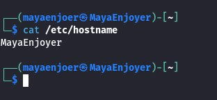

In order to analyze the kernel startup parameters, we can use the following formula: `cat /proc/cmdline`.

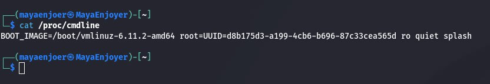

And in order to combine the contents of several files, we need to use the following command: `cat /etc/hostname /etc/hosts`.

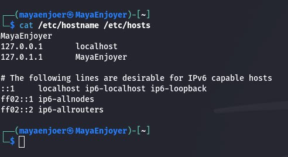

In order to create a new file using cat, we need to use the following command: `cat > mynote.txt`.
After entering this command, we can manually enter any text. And in order to save the file, we need to press `Ctrl + D`.

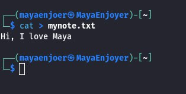

To view a file with line numbers, we can use the following command: `cat -n /etc/hosts`. This code adds line numbers to each of them, which is very useful if we are parsing long files or looking for a specific entry.

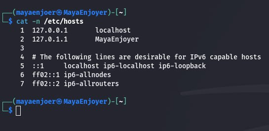

Also, if we need to change the output method, we can use these options:

- `-E `– the $ character will be displayed at the end of each line.
- `-n` – number all lines, even empty ones (without data).
- `-s` – empty repeating lines will be automatically removed.
- `-T` – tabulations will be marked with a combination of symbols ^I.
- `-h` – display reference information on the monitor screen.
- `-v` – will display the current version of the utility.

#### A general conclusion about the `cat` command:

`cat` is a general-purpose Linux command for working with text files. It is used to view configuration files, concatenate multiple files, create files, and output data in a `(|)` pipeline for further processing by `grep`, `less`, `awk`, etc.

### Examples of when the `cat` command is used to create a file, view the contents of a file, redirect information to another file, or concatenate multiple files into one:

In order to create a new file using cat, we need to use the following command: `cat > mynote.txt`.
After entering this command, we can manually enter any text. And in order to save the file, we need to press `Ctrl + D`.

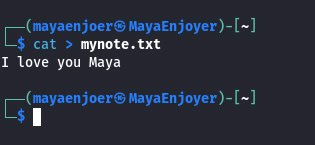

To view the contents of the file, we need to use the following command: `cat mynote.txt`. After creating the file, we can check what is stored in it.

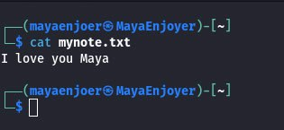

In order to redirect the contents of one file to another, we can use the following command: `cat mynote.txt > copy.txt`, this command creates the file `copy.txt` and copies the contents of `mynote.txt` into it. Thus, we redirect the text to a new file. And in order to view the resulting contents of `copy.txt`, we can use the following command: `cat copy.txt`.

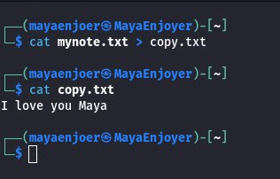

In order to merge several files into one, we need to use the following command: `cat mynote.txt copy.txt > merged.txt`, with this command the contents of both files will be merged into a new file `merged.txt`. And in order to view the correct merging of files, we can use the following command: `cat merged.txt`.

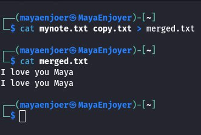

### What parameters should be used with the `cat` command to number the lines of a file, display non-printing characters, and remove blank lines?

To view a file with line numbers, we can use the following command: `cat -n mynote.txt`. This code adds line numbers to each of them, which is very useful if we are parsing long files or looking for a specific entry.


In order to display non-printable characters, we need to use the following command: `cat -v mynote.txt`.


To display the numbering of only non-empty lines, we can use the following command: `cat -b mynote.txt`.


### `dig` command capabilities and examples:

`dig` is a console utility for accessing the DNS system, allowing you to make various types of queries and query arbitrary servers.

#### Main features of `dig`:

| Capability                                 | Professional Description                                                                                                                                                         |
|--------------------------------------------|----------------------------------------------------------------------------------------------------------------------------------------------------------------------------------|
| **Get A/AAAA Records**                     | Queries a DNS server to obtain the IP address (IPv4 – A, IPv6 – AAAA) for a given domain name. This is a basic function when checking resource availability.                     |
| **Get MX/NS/CNAME/TXT Records**            | Allows you to check specific DNS records such as MX (mail servers), NS (authoritative servers), CNAME (canonical name), TXT (SPF, DKIM, etc.) - critical for email setup.        |
| **Reverse DNS (PTR)**                      | Allows you to resolve a domain name to an IP address via a PTR query type. This is often used to check for reverse DNS, which is important for email servers.                    |
| **Use an alternate DNS server**            | Allows you to query through a specified DNS server (e.g. 8.8.8.8 or 1.1.1.1), regardless of system settings. This is useful when diagnosing local DNS problems.                  |
| **Short Output Format (`+short`)**         | Formats the output to contain only the essential data (e.g. IP address), without meta information. Especially useful for scripts and automation.                                 |
| **Full DNS Query Trace (`+trace`)**        | Prints the path of a DNS query through root servers, top-level domain zones (TLDs), and authoritative servers. Extremely useful when investigating DNS delays or routing errors. |
| **DNS Authoritative Server (NS) Analysis** | Shows which servers serve a domain. This allows you to check domain delegation or make sure that the domain is managed by the correct servers.                                   |

#### Examples of `dig` usage:

For example, to get the IP address of a site, we can use the following command: `dig google.com`, this command will return the A records (IPv4 addresses) for the site google.com.

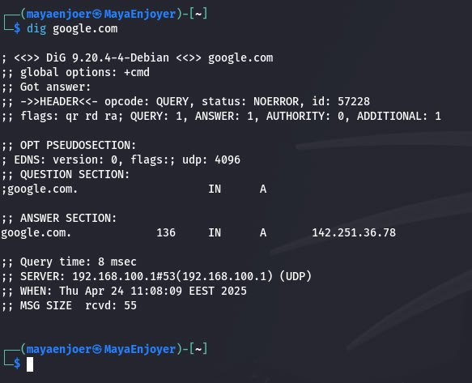

And in order to get MX records (mail servers), we can use the following command: `dig mx gmail.com`, this command shows the mail servers for the gmail.com domain.

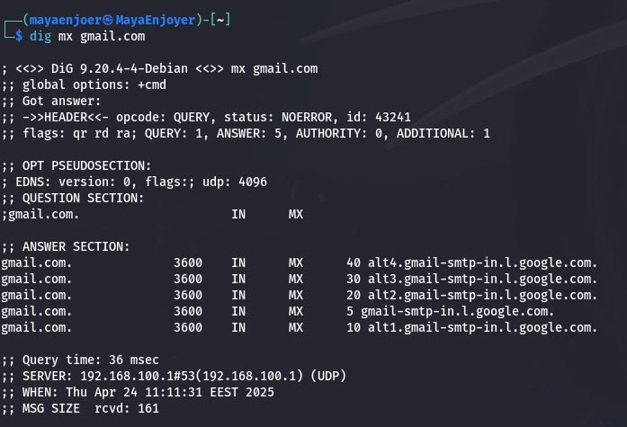

To get TXT records (e.g. SPF, DKIM), we can use the following command: `dig txt google.com`, this command is often used to check email security settings (SPF, DMARC, etc.).

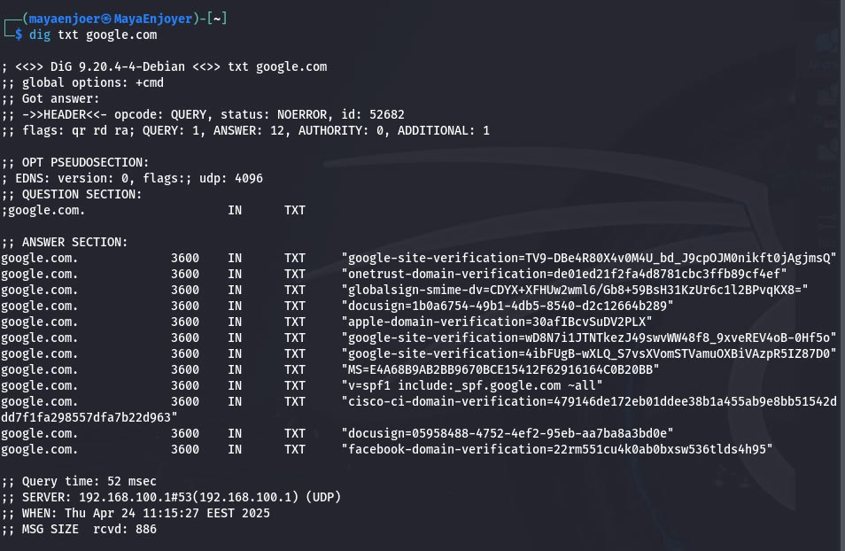

To make a reverse DNS query, we can use the following command: `dig -x 8.8.8.8`, this command determines the domain name associated with the IP (typically a PTR record).

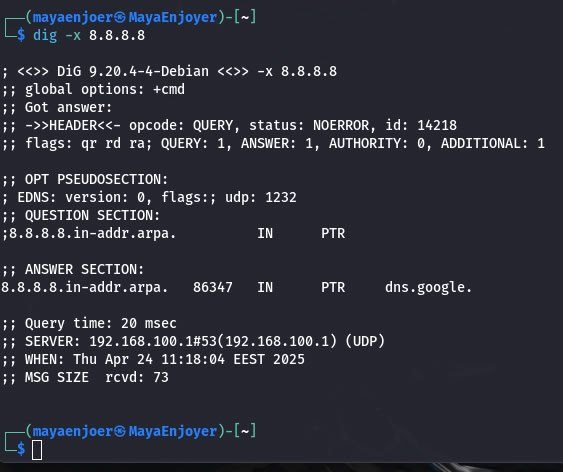

To add a query to a specific DNS server, we can use the following command: `dig @8.8.8.8 google.com`, this command queries google.com through Google's public DNS (8.8.8.8).

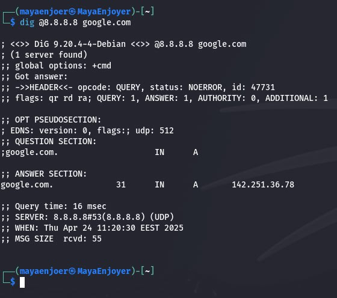

To display a short format of the result, we can use the following command: `dig google.com +short`, this command displays only the IP address, without unnecessary headers.

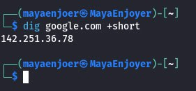

To return a trace of a DNS query, we can use the following command: `dig google.com +trace`, this command shows the query's path through root servers, TLD servers, and authoritative servers, which is useful for diagnosing complex DNS issues.

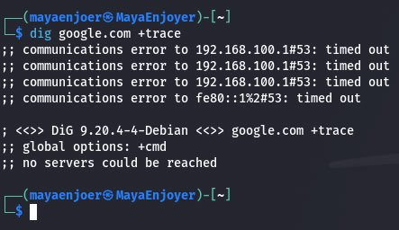

### `netstat` command capabilities and its examples:

`netstat` is a powerful Linux command-line utility for displaying network connections, routing tables, interface statistics, masquerade connections, and more. It’s essential for network diagnostics, monitoring, and security analysis.

#### Main features of `netstat`:

| Capability                               | Professional Description                                                                                                                                                                       |
|------------------------------------------|------------------------------------------------------------------------------------------------------------------------------------------------------------------------------------------------|
| **Display active TCP connections**       | Shows all established TCP connections with local and remote IP addresses, ports, and connection states. This is useful for tracking active communications and identifying suspicious sessions. |
| **List listening TCP/UDP ports**         | Displays ports on which the system is actively waiting for incoming TCP or UDP connections. This helps in auditing open services and ensuring only necessary ports are exposed.                |
| **Show all sockets with numeric output** | Disables DNS resolution of IP addresses and port names, providing faster and more script-friendly numeric-only output. Helpful when accurate IP/port matching is required.                     |
| **Display routing table**                | Outputs the kernel's IP routing table, showing how the system routes network traffic. Used to verify gateway configurations and detect incorrect route entries.                                |
| **Interface traffic statistics**         | Lists network interfaces with the number of packets/bytes sent and received, as well as error statistics. Useful for diagnosing throughput problems and link failures.                         |
| **Show socket ownership by PID/process** | Displays the PID and name of the process using a specific network socket. This allows administrators to track which applications are using which ports.                                        |
| **Combined view of TCP/UDP with PIDs**   | Provides a comprehensive snapshot of all open ports and connections (TCP and UDP) along with the associated process IDs, combining listening and active socket data.                           |

#### Examples of `netstat` usage:

To view all active TCP connections, we can use the following command: `netstat -t`, this command displays all established TCP sessions, including IP addresses, ports, and current connection status. It is used to monitor connections to services (e.g. ssh, apache, ftp).

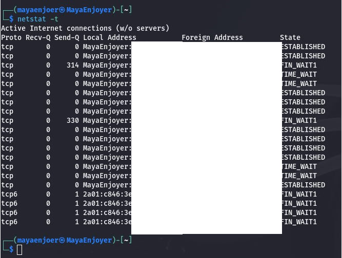

To view all ports that are listening to TCP services, we can use the following command: `netstat -tl`, this command displays open TCP ports in "waiting for connection" mode (LISTEN).

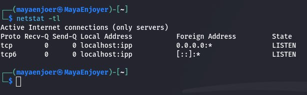

To see all open TCP/UDP ports in numeric format, we can use the following command: `netstat -tuln`, this output is often used in scripts and when processing logs.

Parameters:
- `-t` — TCP;
- `-u` — UDP;
- `-l` — only listening ports;
- `-n` — numeric format without DNS.

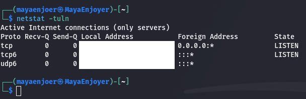

To view the routing table, we can use the following command: `netstat -r`, this command allows us to analyze the default route, the presence of static routes, and the correctness of the configuration.

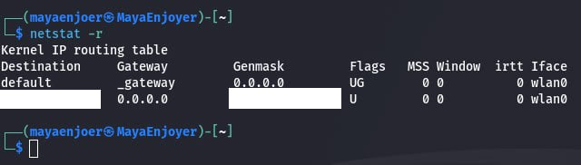

To get statistics on network interfaces, we can use the following command: `netstat -i`, this command displays information about the number of packets sent/received, losses, errors — which is critical when debugging an unstable network.

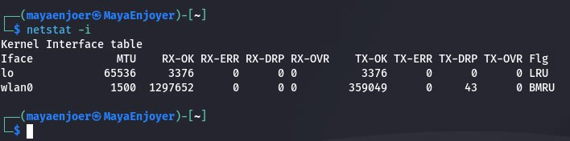

And to see which process is using the port, we can use the following command: `netstat -tunlp`, this is one of the most powerful uses of netstat, which shows the protocol, IP address, port, PID, and name of the process that owns the socket.

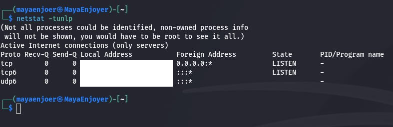

---

## Answers to the control questions:

### 1) How are the `cat` and `tac` commands related?

The `cat` and `tac` commands are basic text utilities in UNIX-like systems that allow you to read and print the contents of files. Their functionality overlaps in many ways, but the main difference is in the order in which the lines are printed. The `cat` command prints the contents of one or more files in the normal order (top to bottom), while the `tac` command prints the contents of one or more files in reverse order (bottom to top). The name `tac` is the word `cat`, but in reverse.

Both commands work with text files, have the same syntax (`cat [options] path/to/file, tac [options] path/to/file`), can work with multiple files at once, support `(>, >>)` output redirection to new files, and a streaming mode — they can be used as part of `(|)` pipelines.

Using `cat` is useful for viewing file contents, numbering lines, concatenating, or copying files. Instead, `tac` is convenient to use for viewing logs in reverse order or when you need to process data starting from the last line.

Examples of using `cat` and `tac`:

| Feature                            | Description                                                                                          |
|------------------------------------|------------------------------------------------------------------------------------------------------|
| **Simple File View**               | `cat ./python_files/test.txt` — displays the contents of a text file.                                |
| **Line Numbering**                 | `cat -n ./python_files/cities_facts.py` — adds numbers before each line.                             |
| **Copying Content**                | `cat test.txt > copy.txt` — copies the contents of one file to another.                              |
| **Appending Content**              | `cat A.txt >> B.txt` — adds the contents of A.txt to the end of B.txt.                               |
| **Merging Files**                  | `cat file1 file2 > merged.txt` — merges multiple files into a new one.                               |
| **Reverse Line View**              | `tac ./python_files/result_cat.txt` — displays the contents of a file in reverse order of the lines. |
| **Merging Files in Reverse Order** | `tac file1 file2 > reversed.txt` — merges files in reverse line order.                               |

### 2) What does the `ss` command do?

The `ss` command is a tool used to display network statistics in a manner similar to that of the `netstat` command. However, ss does this more simply and quickly than netstat. In addition, `ss` provides more detailed information about TCP connections and connection states than most other tools. In particular, `ss` can display data about such entities as PACKET, TCP, UDP, DCCP, RAW, and Unix domain sockets. The `ss` command is simpler than `netstat`. To see this, just compare the `man` pages of these two tools. With `ss`, you can get very detailed information about how a machine running Linux communicates with other computers. All this opens up possibilities for diagnosing and troubleshooting various network errors.

### 3) What is the difference between `ps --forest` and `pstree` commands?

The `ps --forest` and `pstree` commands are used to visualize the hierarchy of processes, differing in the way they are presented, the level of detail and the scope of stagnation. The `ps --forest` command is an extension of the classic `ps` utility, which allows you to view the list of running processes. The `--forest` switch adds a tree view, where, behind additional pseudographic symbols, it is shown which processes generated each other. This saves a table format with complete information: PID, UID, father’s PID (PPID), startup hour, resource selection and command line. Therefore, `ps --forest` is suitable for deep analysis, system auditing and logging. Also supported is the formatting and filtering of output, for example, by the PID command.

The name `pstree` is a utility that specializes primarily in visualizing the process tree. It shows the structure of launching processes in the form of a compact ASCII graph, where father's processes are displayed on top, and daughter processes are moved down. Behind `pstree` you can display only the names of processes, with the parameters `-p` or `-a` you can add PID or the next command line. The view is even more basic and allows you to understand at a glance what services are running by the system (systemd, sshd, bash, Xorg, gnome-shell, etc.) and what processes are associated with them. pstree is especially useful for quick analysis of the structure of the launch or review of processes generated by the song server (for example, `pstree` `username`).

The main difference between these commands lies in the detail and meaning. `ps --forest` is an analytical tool that is suitable for scripts, logging and deep analysis of the system. And `pstree` is a visual tool that provides an intuitive process tree and is easy to monitor in real time. The two commands do not conflict, but complement one another: `ps --forest` - for precise analysis with numbers and launch arguments, and `pstree` - for a visual understanding of the hierarchy.

### 4) In which directories are system settings stored?

#### The main directories in which system settings are saved:

`/etc` - This is the main system configuration directory, all the most important configuration files and subdirectories for setting up services, daemons, edge parameters, initialization, etc. save here.

Attach important files to `/etc`:

🟣 `/etc/fstab` - file system installation table;

🟣 `/etc/passwd` — profile records of correspondents;

🟣 `/etc/shadow` - encrypted passwords of the clients;

🟣 `/etc/hostname` — name of the computer (host);

🟣 `/etc/hosts` - local IP-type names;

🟣 `/etc/resolv.conf` — DNS servers for resolving names;

🟣 `/etc/network/interfaces` — setting up the boundaries;

🟣 `/etc/systemd/` — configurations of the systemd system manager;

🟣 `/etc/ssh/` — parameters of the ssh server/client;

🟣 `/etc/crontab, /etc/cron.*/` - planner.

The `/etc` directory is mounted in read-only mode on Live systems, as it is a critical part of the system.

Also, one of the important directories in which system settings are stored is `/usr/share`. This directory contains global resources and templates used by programs. Configuration files here are of an auxiliary nature, for example, localization templates, system defaults.

🟣 `/usr/share/defaults/` — default program settings;

🟣 `/usr/share/X11/` — X11 graphical server settings.

The next important directory that stores system settings is `/var`. The `/var` directory stores variable data, including logs, caches, temporary files, but also some dynamically changing configuration files:

🟣 `/var/log/` — system event logs (auth.log, syslog, etc.);

🟣 `/var/spool/cron/` — personal crontab files of users;

🟣 `/var/lib/` — variable data of services (e.g. dpkg, systemd, mysql).

The next important directories that store system settings are `/lib/systemd/` and `/etc/systemd/`. These directories are used to store `systemd` unit files — that is, startup files, dependencies, and service settings.

🟣 `/etc/systemd/system/` — settings created or modified by the user.

🟣 `/lib/systemd/system/` — system units installed by packages.

### 5) In which directories can you find programs installed on the system and available to the user?

#### Main directories where installed programs are stored:

`/bin` contains basic system utilities that are needed for the system to work at the early stage of boot. These programs are available to all users and are often used in scripts or during a system crash.

🟣 `ls`, `cp`, `mv`, `cat`, `bash` are basic command line tools.

`/usr/bin` is the main directory where standard user programs installed through system package managers (`apt`, `yum`, `pacman`, etc.) are stored. Most executable files that are run from the terminal are located here.

🟣 `python3`, `nano`, `vim`, `firefox`, `gcc`, `htop` are widely used applications.

`/usr/local/bin` is a directory for manually installing programs. Programs in this directory are not monitored by the system package manager and have higher priority in $PATH.

🟣 User utilities installed manually or for testing purposes, without affecting system binaries.

`/sbin` and `/usr/sbin` are for system and administrative utilities that require superuser privileges. They are only accessible via `sudo` or from the root account.

🟣 `mount`, `umount`, `iptables`, `systemctl`, `reboot`, `ifconfig` are critical for system management.

`/opt` is a directory for third-party applications that have their own structure and do not integrate into `/usr/bin`. Such applications may include a complete internal organization: binaries, libraries, configurations, etc.

🟣 `/opt/google/chrome/`, `/opt/vscode/`, `/opt/zoom/` are typical examples of locations.

`~/bin` is a user's personal directory for storing their own scripts or programs. If this directory exists, it is automatically added to the $PATH variable, allowing you to run programs without specifying the full path.

🟣 It is intended for scripts, CLI utilities, and local applications without root privileges.

### 6) In which directories can you find installed system programs and programs intended to be executed by the superuser?

System programs and utilities that are intended for execution by the superuser (root) are stored in specialized directories:

🟣 `/sbin` — basic system utilities used for administration: reboot, fsck, ifconfig, mount. Available only to root or via sudo.

🟣 `/usr/sbin` — advanced administrative programs and system services: systemctl, sshd, useradd, iptables.

🟣 `/bin` — basic tools for all users (bash, cp, ls), but they are also used by root processes at system startup.

🟣 `/lib`, `/usr/lib`, `/libexec` — system libraries and auxiliary executable files for working with sbin and bin utilities.

These directories are included in the standard $PATH environment for root, and it is from them that key commands for managing the system are called. Normal users can only run programs from `/bin`, and can access `sbin` via `sudo`.

### 7) Purpose of `ping`, `ifconfig`, `traceroute` commands:

The `ping` command is a basic tool for checking the availability of a network node. It works using the ICMP protocol, sending special packets (Echo request) to a specified IP address or domain name and waiting for a response (Echo reply). Using `ping`, you can determine whether a host is active, measure latency in milliseconds, and estimate packet loss. This allows you to quickly identify network problems, especially when diagnosing an Internet connection or checking an internal network.

The `ifconfig` command is used to view and configure network interfaces. It allows you to find out the current IP address of the interface, MAC address, connection status, number of packets transmitted/received, and also manually change network parameters - for example, assign an IP address or activate an interface. Despite the fact that in modern Linux distributions `ifconfig` is considered obsolete and has been replaced by the `ip a` command.

The `traceroute` command allows us to determine the route that network packets take to a specified node. It shows a list of all intermediate routers (hops) that the packets pass through, as well as the delay time to each of them. This is especially useful for diagnosing complex network problems, such as identifying where a connection loss or significant delays occur. With `traceroute`, we can understand the structure of the route to the server, which allows us to localize problems in the infrastructure of the provider or the global network.

### 8) What are network interfaces called in Linux?

Network interfaces are logical names that the system assigns to physical or virtual network devices to identify and manage them. Interfaces were given names such as `eth0`, `eth1` for Ethernet adapters or `wlan0`, `wlan1` for wireless devices. However, this scheme was unpredictable, as the order in which devices were discovered could change after a system reboot, leading to conflicts in network settings.​

To solve this problem, a system of predictable naming of network interfaces (Predictable Network Interface Names) was introduced in modern distributions. This approach is based on the physical parameters of the device, such as the location on the PCI bus, expansion slot, or MAC address. In addition to physical interfaces, virtual interfaces are also widely used in Linux: `lo` (local loopback), `tun0` and `tap0` (for VPN), `br0` (network bridges), `docker0` (virtual container networks), and others. Each interface — regardless of its type — acts as a full-fledged object in the system, which can be worked with using utilities such as `ip`, `ip link`, `ifconfig`, `ethtool`, `nmcli`, etc.

### 8) How to use the `ifconfig` command to display the parameters of only one network interface, not all?

In order to display the parameters of only one specific network interface (for example, `eth1`) using the `ifconfig` command, we only need to specify the name of this interface as an argument to the command, so our command will look like this: `ifconfig eth1`. But my system does not have the `eth1` interface, this is done for greater security, so I will use the following command: `ifconfig wlan0`.

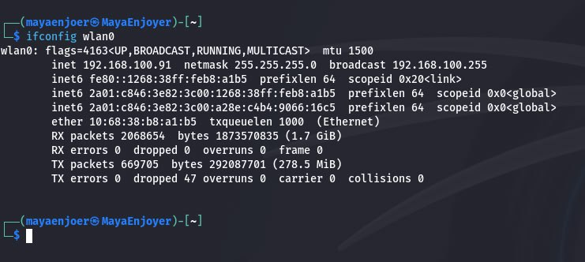

---

#### Conclusions: While completing lab #8, I gained practical skills in working with the Bash shell in the Kali Linux environment. In particular, I learned to use the `cat`, `tac`, `ps`, `free`, `ping`, `ifconfig`, `dig`, `netstat`, `ss`, `traceroute`, `ip`, `ls /proc`, and many others — not only to view the system configuration, but also to analyze its current state and diagnose the network. I paid special attention to working with virtual file systems, such as `/proc` and `/sys`, which allow you to obtain dynamic information about the kernel, processes, memory, and modules. I learned to read the contents of the `/proc/meminfo`, `/proc/cmdline`, `/proc/modules` files, understand the kernel startup parameters, the structure of memory consumption, and the purpose of loaded modules. I also learned how to analyze log files stored in the `/var/log` directory and how to use them to detect errors, attack traces, and user behavior.

AND, AS ALWAYS MY TRADITION, I WANT TO WISH YOU ALL A POSITIVE MOOD, BECAUSE IN OUR SITUATION IT IS VERY NECESSARY. I ALSO WISH YOU SUCCESS IN LEARNING KALI LINUX. I LOVE YOU ALL AND SEE YOU AGAIN ;)


