<h1 align="center">
    
    <br />
    Laboratory work with Kali Linux №9
</h1>

#### In this work, I will do lab #9, applying knowledge of Kali Linux. This work is created for the purpose of educational content, as an assignment for the discipline Operating Systems of the Kyiv College of Communications.

Topic: "Securing the system and users in Linux. Creating users and groups"

Objectives:
1) Gaining practical skills in working with the Bash command shell.
2) Familiarity with basic steps when creating new users and new user groups.

---

#### In this article, I'm going to answer questions about the Kali Linux operating system and simply Linux.


## Before we begin, let's consider the following question:

### The concept of UPG, and when it is appropriate to use them:

User private groups (UPGs) are a system configuration idiom that allows multiple users of a system to collaborate on files without any permission hassle.

It requires no action on the part of the end-user to work as expected. Files and directories within a group directory can be created, modified, and deleted, and (for the most part) have their permissions modified as usual, whilst being shared with other group members and protected from non-members.

Access is controlled by Unix groups to which userids can be added or removed.

#### Main features of UPG:

🟣 One group - one user: each group contains only one member - the corresponding user.

🟣 Simplification of access rights management: access rights can be assigned not to the user directly, but through his personal group.

🟣 Increased security: allows you to more easily control access rights to files and directories without the risk of accidentally granting access to other users.

UPG is useful in multi-user systems to simplify file sharing, where it is important to provide both flexible access and security control.

#### The main situations in which UPG is the optimal choice are:

🟣 When several users need to jointly edit, create and delete files in shared directories without the need to constantly manually change access rights. Each participant is added to the appropriate project group, and files are automatically configured for sharing thanks to the setgid bits on the directories.

🟣 Standard personal user files are created with a group binding to their own private group, which allows you to safely assign group rights without the risk of access from other users of the system.

🟣 To automatically set more lenient `umask` settings (for example, `002` instead of the standard `022`), which makes newly created files accessible to group rights without violating the integrity of the system.

🟣 Directories with the `setgid` flag ensure that all new files in them inherit the directory group, rather than the user's primary group, allowing all participants to collaborate effectively without confusion over permissions.

🟣 For organizing shared code repositories, accessing shared documents, and working on shared resources across departments or teams.

🟣 Places where a large number of users need to have delimited but shared access to certain resources — for example, in educational or corporate environments.

### What commands can be used to create user groups?

The most common command to create a new group is the command: `sudo groupadd <group_name>`. The `groupadd` option can include `-g <GID>` to specify a custom numeric group identifier (GID), and `-r` to create a system group (for service processes).

In Debian/Ubuntu we will use `addgroup`, because this command is a more "human" wrapper over `groupadd`, and automates the creation of groups with secure parameters. Therefore, our command will look like this: `sudo addgroup <group_name>`. The features of `addgroup` are the automatic creation of all necessary directories and performs additional settings for system service groups.

To create a group at the same time as creating a user, we need to use the following command: `sudo adduser newuser`, this command will automatically create the user `newuser` and the group `newuser`. And in order to create a user and add it to a specific existing group, we can use the following command: `sudo useradd -G developers mayaenjoyer`, this command creates the user `mayaenjoyer` and adds it to the `developers` group.

### What commands can be used to change user group settings?

To change the properties of a group, we can use the following command: `sudo groupmod [options] <group_name>`, this command allows us to change the name of a group or its numeric identifier (GID). For example, to change the name of a group, we can use the following command: `sudo groupmod -n ilovemaya mayaenjoyer `, this command renames the group `mayaenjoyer` to `ilovemaya`. And to change the GID of a group, we can use the following command: `sudo groupmod -g 1050 mayaenjoyer`, this command assigns the group `mayaenjoyer` a new identifier `1050`.

To change the group membership of a user, we can use the following command: `sudo usermod [options] <user_name>`, this command allows us to assign a primary or additional group to a user. For example, to change the primary group of a user, we can use the following command: `sudo usermod -g ilovemaya mayaenjoyer`, with this command the primary group of the user `mayaenjoyer` will become `ilovemaya`. And in order to add a user to multiple groups, we can use the following command: `sudo usermod -G sudo,adm mayaenjoyer`, this command adds the user `mayaenjoyer` to the `sudo` and `adm` groups.

In order to manage the members of a group, we can use the following command: `sudo gpasswd [options] <group>`, this command allows you to add or remove users from groups. In order to add a user to a group, we will use the following command: `sudo gpasswd -a mayaenjoyer ilovemaya`, this command adds the user `mayaenjoyer` to the `ilovemaya` group. And to remove a user from a group, we will use the following command with the following parameter: `sudo gpasswd -d mayaenjoyer ilovemaya`, this command removes the user `mayaenjoyer` from the group `ilovemaya`.

#### Additional commands:

🟣 `vigr` — provides secure editing of the `/etc/group` file, which stores information about all groups in the system, and also allows you to manually change group names, add or remove users from groups.

🟣 `vipw` — also provides secure editing of the `/etc/passwd` file, which contains user accounts, and allows you to change the user's primary group by editing the UID and GID record directly.

🟣 `newgrp` — is responsible for changing the active (current) user group in a session without logging out, and allows, for example, to create new files on behalf of another group.

🟣 `chgrp` — is responsible for changing the group of the owner of a file or directory, and is used to configure access to resources by changing the group membership of objects.

--- 

### Next, let's work through all the command examples presented in the labs of the NDG Linux Essentials course (Labs 15-16):

| **Command**                                         | **Professional explanation**                                                                                                           |
|:----------------------------------------------------|:---------------------------------------------------------------------------------------------------------------------------------------|
| `su -`                                              | Switches to another user and loads their environment (loads environment variables as if fully logged in).                              |
| `id`                                                | Prints the user ID: UID, primary and secondary groups, which determines the access rights on the system.                               |
| `exit`                                              | Terminates the current session or shell; returns the user to the previous environment or terminates the terminal.                      |
| `head /etc/shadow`                                  | Displays the first lines of the /etc/shadow file, which stores hashed user passwords (only for root or via sudo).                      |
| `sudo head /etc/shadow`                             | Runs the head command with root privileges, which allows you to view the contents of /etc/shadow.                                      |
| `head /etc/passwd`                                  | Displays the first 3 entries of the /etc/passwd file, which stores user information (names, UIDs, GIDs, home directories, shells).     |
| `grep sysadmin /etc/passwd`                         | Searches for information about the `sysadmin` user in the system users file.                                                           |
| `head -3 /etc/shadow`                               | Displays only the first 3 entries of the /etc/shadow file for a quick look at users and their passwords (hashes).                      |
| `ls -l /etc/shadow`                                 | Displays the permissions, owner, and group for the /etc/shadow file, which is important for system security.                           |
| `sudo head -3 /etc/shadow`                          | Access the first 3 lines of /etc/shadow with administrator privileges (sudo).                                                          |
| `getent passwd sysadmin`                            | Gets information about the `sysadmin` user from a single NSS (Name Service Switch) database that integrates local and network sources. |
| `man 5 passwd`                                      | Opens section 5 (file format) of the /etc/passwd file manual, explaining its structure and fields.                                     |
| `id root`                                           | Displays the UID, GID, and groups for the root user, which is important for verifying administrator access rights.                     |
| `who`                                               | Lists all users currently logged in, with terminal and login time.                                                                     |
| `w`                                                 | Displays active users, their commands, processes, and system boot times in real time.                                                  |
| `last`                                              | Displays a history of user logins, showing when and from which IP address they were logged in.                                         |
| `groupadd -r research`                              | Creates a system group `research` (with a GID below 1000) for special or service purposes.                                             |
| `getent group research`                             | Gets information about the `research` group, including local and network databases.                                                    |
| `grep sales /etc/group`                             | Searches for the specified group (`sales`) in the all groups file, to analyze or verify its existence.                                 |
| `groupmod -n clerks sales`                          | Renames the group `sales` to `clerks`, changing only its name without changing the user composition.                                   |
| `groupmod -g 10003 clerks`                          | Changes the GID of the group `clerks` to 10003, which may be needed for synchronization with other systems.                            |
| `grep clerks /etc/group`                            | Checks whether the group `clerks` exists after changing its name or ID.                                                                |
| `groupdel clerks`                                   | Deletes the group `clerks`, provided that it is no longer used as the primary group by any user.                                       |
| `useradd -D`                                        | Displays the current default settings for creating new users (e.g. group, shell, home directory).                                      |
| `useradd -D -f 30`                                  | Sets the account lockout period to 30 days after the password expires.                                                                 |
| `nano /etc/default/useradd`                         | Opens the user creation settings configuration file for manual modification of template parameters.                                    |
| `useradd -G research -c 'Linux Student' -m student` | Creates the user `student` with addition to the `research` group, creation of a home directory, and addition of a description.         |
| `grep student /etc/passwd`                          | Searches for the `student` user entry in the password file to verify the success of the account creation.                              |
| `grep student /etc/group`                           | Checks the group membership of the `student` user in system groups.                                                                    |
| `usermod -aG research sysadmin`                     | Adds the `sysadmin` user to the `research` group without removing it from other groups (`-aG` option).                                 |
| `getent group research`                             | Checks the current membership of the `research` group via the NSS subsystem.                                                           |
| `getent group student`                              | Search for group information or check if `student` is a member of a specific group.                                                    |
| `getent passwd student`                             | Retrieve `student` account information from the system database.                                                                       |
| `getent shadow student`                             | Get information from the `/etc/shadow` shadow file for `student` (password hash, date changed).                                        |
| `passwd student`                                    | Change or set a new password for `student`.                                                                                            |
| `getent shadow student`                             | Check if the information in the `/etc/shadow` file has changed after a password update.                                                |
| `last student`                                      | Shows the login history of `student`, when and from where he connected.                                                                |
| `userdel -r student`                                | Deletes `student` along with his home directory and files.                                                                             |


### Next, let's work in the terminal and consolidate the studied material:

<h1 align="center">

    Practical tasks:

</h1>

### Displaying information about the current user in various ways:

In order to display information about the current user, we can use the following command: `id`, this command will display the UID (User ID), GID (Group ID) and a list of groups to which the user belongs.

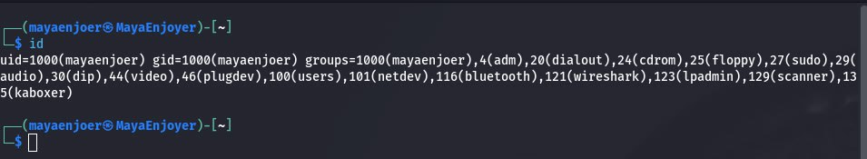

Also, to display information about the current user, we can use another command: `grep $(whoami) /etc/passwd`, this command will display a line with information about the current user, namely: login, UID, GID, home directory and standard shell (`bash`, `zsh`, etc.).

_etc_passwd.png)

### Practice with `last`, `w` and `who` commands:

The `last` command displays the history of user logins to the system, namely:

🟣 Username;

🟣 Terminal name (`tty`);

🟣 IP address or host from which the connection was made;

🟣 Start time and duration of the session;

🟣 Ta indicates whether the session is finished or still active (`still logged in`).

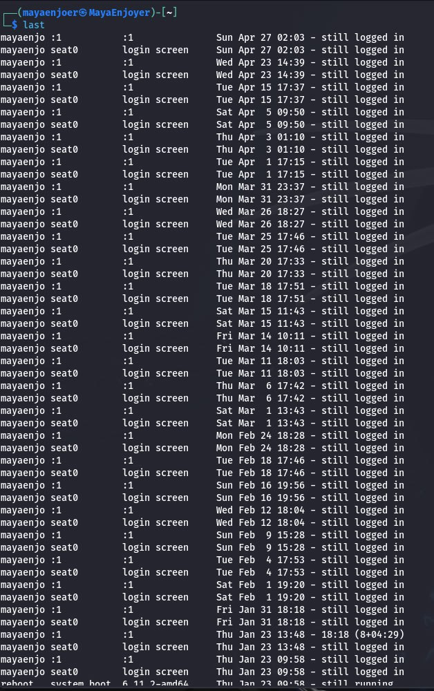

The `w` command displays information about current users on the system and their activity, including:

🟣 Username;

🟣 Remote host/IP;

🟣 Login time;

🟣 Idle time (inactivity);

🟣 CPU usage for the process and for the entire user;

🟣 The command being executed.

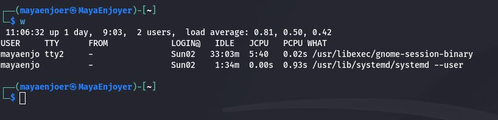

The `who` command displays brief information about currently active users, including:

🟣 Username;

🟣 Terminal;

🟣 Login time;

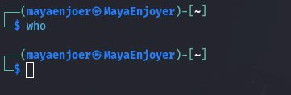

As you can see, the `who` command does not output anything, this is due to the fact that the `who` command only shows those users who are physically or via a terminal connected to the system (i.e. via `tty`, `pts`, or `SSH` sessions. Therefore, if no one but me is connected, and I myself did not log in via `tty` or a separate `SSH` session, then the command simply does not output anything.

Comparing the results of commands:

| **Command**   | **What it shows**                                                                                                                                | **What it doesn't show compared to others**                                              |
|:--------------|:-------------------------------------------------------------------------------------------------------------------------------------------------|:-----------------------------------------------------------------------------------------|
| `last`        | History of user logins to the system, including connection time, session length, IP address or host. Shows even terminated or inactive sessions. | Does not show currently active processes, system load, idle time.                        |
| `w`           | Active users on the system, login time, idle time, CPU load, current user commands.                                                              | Does not show users who have already logged out; does not show the entire login history. |
| `who`         | List of active users, indicating their terminal, login time and, if possible, remote address.                                                    | Does not show which commands users are running, idle time, CPU load or session history.  |

### Creating two new user groups:

In order to create 3 new user groups, we need to enter the following commands in the terminal:

```
sudo groupadd super_admins
sudo groupadd noob_users
sudo groupadd good_students
```
These commands will create the corresponding entries in `/etc/group`.

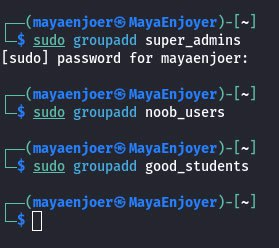

And in order to find out the group identifiers (GID - Group ID), we need to use the `getent` command, namely:

```
getent group super_admins
getent group noob_users
getent group good_students
```

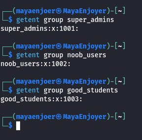

Or we can display all the information using the following command: `grep -E 'super_admins|noob_users|good_students' /etc/group`.

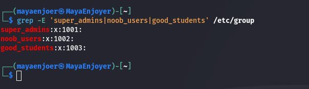

### Creating new users for the team and assigning them a password:

And in order to create three new users, we need to use the following commands in the terminal:

```
sudo useradd -m Hubar_Maksym_1
sudo useradd -m Hubar_Maksym_2
sudo useradd -m Hubar_Maksym_3
```

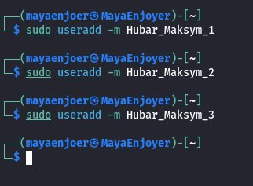

After that, we need to set a password, we can do this using the following commands:
```
sudo passwd Hubar_Maksym_1
sudo passwd Hubar_Maksym_2
sudo passwd Hubar_Maksym_3
```

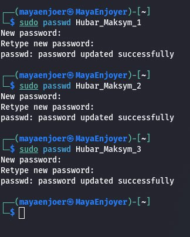

Each of these commands will ask you to enter a new password for the corresponding user twice, after which, to make sure that the users have been created, we can use the following command: `grep -E 'Hubar_Maksym_1|Hubar_Maksym_2|Hubar_Maksym_3' /etc/passwd`.

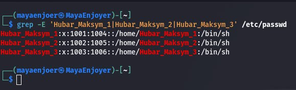

### Adding new users to newly created groups:

In order to add users to the `super_admins` group, we need to use the following commands:
```
sudo usermod -aG super_admins Hubar_Maksym_1
sudo usermod -aG super_admins Hubar_Maksym_2
```

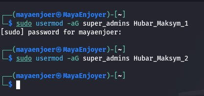

In order to add users to the `noob_users` group, we need to use the following commands in the terminal:
```
sudo usermod -aG noob_users Hubar_Maksym_2
sudo usermod -aG noob_users Hubar_Maksym_3
```

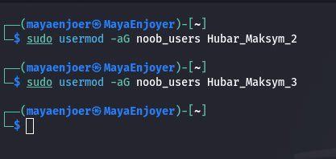

And in order to add users to the `noob_users` group, we need to use the following commands:
```
sudo usermod -aG good_students Hubar_Maksym_1
sudo usermod -aG good_students Hubar_Maksym_2
sudo usermod -aG good_students Hubar_Maksym_3
```

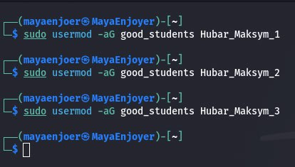

After that, we need to check for the presence of all users in all three groups, for this we can use the following command: `getent group super_admins && getent group noob_users && getent group good_students`.

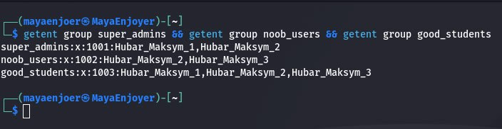

### View information about groups and which users are members of them:

As I already mentioned, we can use this command to display information about groups and which users are members of them: `getent group super_admins && getent group noob_users && getent group good_students`.

From the output that I noted in the previous task, we can see that:
```
The super_admins group has GID (Group ID) 1001, and the users Hubar_Maksym_1 and Hubar_Maksym_2 are in this group.

The noob_users group has GID 1002, and the users Hubar_Maksym_2 and Hubar_Maksym_3 are in this group.

The good_students group has GID 1003, and all three created users are members of this group.
```

The format of our output is as follows: `group_name:x:GID:user1,user2,user3`, where:

🟣 `group_name` is the name of the group.

🟣 `x` is the symbol that indicates that the group password is stored in the `/etc/gshadow` file.

🟣 `GID` is the unique identifier of the group.

🟣 `user1`, `user2`, `user3` are the list of users who are members of this group.

### Deleting the first created user and checking the correctness of the task completion:

In order to delete the user we need from the home directory, we need to use the following command: `sudo userdel -r Hubar_Maksym_1`, this command will delete the account, home directory and user mail files.

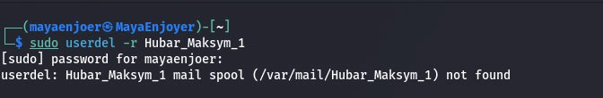

After that, we need to check the correctness of the deletion, for this we can use the following command: `getent group super_admins && getent group noob_users && getent group good_students`.

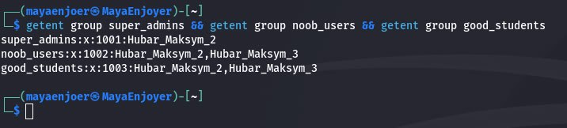

### Deleting the second created user and checking the correctness of the task completion:

In order to remove the second user from the home directories, we need to use the following command: `sudo userdel -r Hubar_Maksym_2`, this command will delete the account, home directory and mail files of the user.

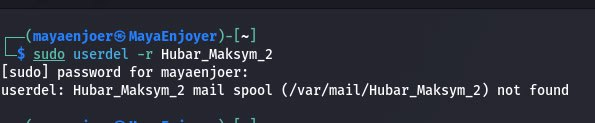

After that, we need to check the correctness of the deletion, for this we can use the following command: `getent group super_admins && getent group noob_users && getent group good_students`.

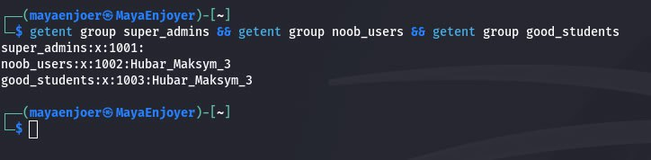

### Deleting the third created user and checking the correctness of the task completion:

In order to remove the third user from the home directories, we need to use the following command: `sudo userdel -r Hubar_Maksym_3`, this command will delete the account, home directory and mail files of the user.

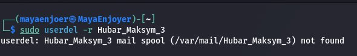

After that, we need to verify the correctness of the deletion, for this we can use the following command: `getent group super_admins && getent group noob_users && getent group good_students`.

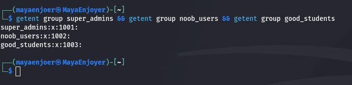

### View information about existing user groups:

In order to view information about all existing user groups in the system, we can use the following commands:
```
getent group
OR
cat /etc/group
```
These commands will display all groups registered in the system, with information in the following format: `group_name:x:GID:members`, where:

🟣 `group_name` is the name of the group.

🟣 `x` is the password (hidden).

🟣 `GID` is the unique numeric identifier of the group.

🟣 `members` is the list of users who are members of this group.


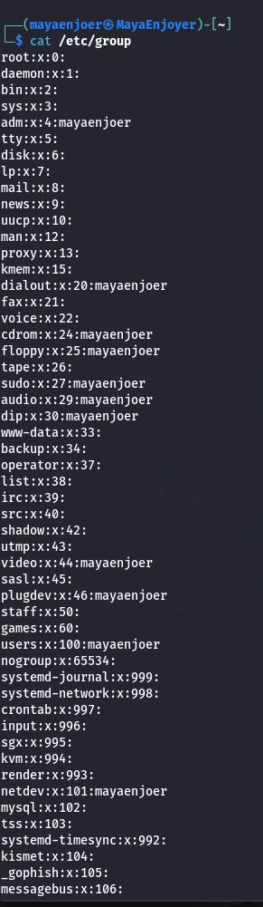

### Output of user groups I created:

To view all the groups I have created in the system, we can use the following command: `awk -F: '$3 >= 1000 {print $1, $3}' /etc/group`, this command will list groups that have group identifiers (GIDs) of 1000 and above. This is how user groups differ from system groups in Linux.

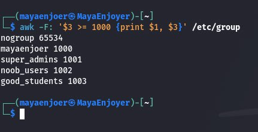

In order to view the information of existing user groups in the system, we can use the following commands:
```
getent group
OR
cat /etc/group
```


---

## Answers to the control questions:

### 1) Why aren't passwords stored explicitly in configuration files?

The main reasons why passwords are not stored in plain text are, firstly, protection against system compromise, because if passwords are stored in plain text, an attacker, having gained access to the system or only to the configuration file, will be able to immediately read the credentials of all users. This will lead to a complete compromise of the entire system.

Secondly, this use of hashing is a security standard in Linux in which passwords are stored in the `/etc/shadow` file as hashes - the results of one-way mathematical functions (SHA-512, bcrypt, or others). And this means that we have no way to directly "decrypt" the hash, because even the administrator does not have data about the user's passwords.

Therefore, attacks can only be carried out by the selection method (`brute-force` or `dictionary attack`).

### 2) Why is it not recommended to perform everyday operations using the root account?

Using the root account for everyday operations is strongly discouraged, as it poses a high risk to security, system stability, and unintentional damage.

Because high privilege equals high risk, since the root account has unlimited authority on the system, it can modify any file, destroy data, stop services, uninstall the kernel, change the system configuration, or run malicious code — and without any confirmation.

### 3) What is the difference between the mechanisms for obtaining special privileges `su` and `sudo`?

`su` and `sudo` are two different ways to gain superuser (root) privileges, which have maximum rights and the ability to do anything with the system. In Windows, such an account is called "Administrator". Normal (non-privileged) users in Linux are very limited in similar rights: they do not have the ability to write to system directories, control system processes, etc. Therefore, to do something that requires higher privileges, the `su` and `sudo` commands are used.

The main difference between them is that `su` requires the password of the target account (for example, the root user) and switches us to it, while `sudo` requires the password of the current user and runs only one (or several) commands on his behalf, which require root user rights to execute. Therefore, it is much safer to use `sudo`, since the use of this command does not involve the exchange of confidential information.

Additionally, I recommend using `sudo` for tasks that require root privileges. This gives the current user the privileges for that command only. On the other hand, `su` completely switches to root, putting the entire system at risk of accidentally changing or removing some vital component.

### 4) Why is the root user's home directory not located in the `/home` directory?

This was done for isolation and security reasons, as placing the root home directory in a separate location (/root) allows us to isolate the most privileged user from the rest of the home directories, protect the root directory from accidental actions by users who have access to `/home`, and reduce the risk of accessing or overwriting critical root files if `/home` is mounted with less strict permissions.

Also, on many Linux systems, the `/home` directory is mounted from a separate partition or even a network drive (e.g. NFS), so it may be inaccessible during system boot or in emergency situations. If the root user's home directory were located in `/home/root`, this could lead to the inability to boot a full root environment and limit recovery operations that are performed through root access. To avoid such problems, the /root directory is always located on the root partition `(/)`, which ensures its availability even in recovery mode.

### 5) What is the `getent` command used for?

The `getent` command is used to retrieve records from databases supported by the Name Service Switch (NSS) libraries — a special mechanism that allows the system to search for information in several sources: local files (for example, `/etc/passwd`, `/etc/group`), network services (LDAP, NIS), DNS, etc. These sources are configured through the `/etc/nsswitch.conf` file, which specifies the order in which information is searched.

When the `getent` command is run with a database name (for example, `passwd`, `group`, `hosts`) and an additional key (user or group name), it displays only those records that match the search key. For example, `getent passwd user1` will return only information about the user `user1`. If the key is not specified, `getent` will display all available records from the selected database — but only if such a database supports enumeration.

This command is a universal tool for system administrators, as it allows you to work with databases as the system sees them, regardless of where the information comes from - from local files or external sources. With `getent`, you can check the correctness of the configuration of integrations with network services, test the availability of records, and even use it in scripts to automate the processing of users, groups, DNS, etc.

### 6) How can I change a user's password?

In order to change our own password (as the current user), we can use the following command: `passwd`, this command will launch the interface for changing our own password, after which the system will ask us to enter the current password, enter a new password and confirm the new password.

And in order to change the password of another user (as the administrator/root), we can use the following command: `sudo passwd username`, after which the system will immediately ask us to enter a new password for the user, without asking for the old one.

We can also change the password without interactive mode (for example, in scripts), and for this we need to use the following command: `echo 'username:newpassword' | sudo chpasswd`, this option is usually used in automation (for example, when creating users in bulk, etc.).

### 7) How can I delete existing user groups? Will their information remain somewhere in the system?

To delete existing user groups, we can use the following command: `sudo groupdel group_name`, this command completely deletes the group entry from the system database `/etc/group` (and also from `/etc/gshadow`).

After deleting a group using the `groupdel` command, in most cases, information about it is completely deleted from the system databases, in particular from the `/etc/group` file. However, there are some exceptions. If files or directories in the file system had access rights set that were tied to this group (i.e., were created using its GID), then after deleting the group itself, only the numeric GID will be displayed instead of its name. This usually does not affect the functionality of the files or directories themselves, but identifying the group by its name will no longer be possible - only the numeric identifier will remain. In addition, in scripts, configuration files, or automated systems that contain explicit references to this group, such information is not automatically deleted. It remains in the form of dead links that must be updated manually.

### 8) What is the purpose of the `chage` command?

The `chage` command is used to manage a user's password expiration policy. It allows the administrator to change the password "aging" settings, i.e. how long a password remains valid before the user is prompted to change it, and other restrictions.

#### The main purpose of `chage`:

🟣 Limit the password expiration time;

🟣 Force the user to change their password at the next login;

🟣 Ensure compliance with security policies, such as in corporate environments;

🟣 Check the current password expiration settings.

#### Examples of `chage` usage:

| Command                     | Description                                                                                     |
|-----------------------------|-------------------------------------------------------------------------------------------------|
| `sudo chage -l username`    | Shows the current password expiration settings for a user (creation dates, restrictions, etc.). |
| `sudo chage -M 90 username` | Sets the maximum password expiration to 90 days.                                                |
| `sudo chage -m 7 username`  | Sets the minimum interval between password changes to 7 days.                                   |
| `sudo chage -W 10 username` | The user will receive a warning 10 days before the password expires.                            |
| `sudo chage -I 5 username`  | Locks the account 5 days after the password expires.                                            |
| `sudo chage -d 0 username`  | Forces the user to change their password at the next login.                                     |


### 9) What are the most commonly used `usermod` command options?

#### The most common options for the `usermod` command:

| Parameter   | Purpose                                                                                | Usage example                       |
|-------------|----------------------------------------------------------------------------------------|-------------------------------------|
| `-aG`       | Adds a user to a secondary group without removing them from the previous ones.         | `usermod -aG sudo user1`            |
| `-G`        | Sets a list of secondary groups (replaces the previous list if `-a` is not specified). | `usermod -G audio,video user1`      |
| `-g`        | Sets the user's primary group.                                                         | `usermod -g staff user1`            |
| `-d`        | Changes the user's home directory.                                                     | `usermod -d /home/newhome user1`    |
| `-m`        | Moves the contents of the old home directory to the new one (along with `-d`).         | `usermod -d /home/newhome -m user1` |
| `-l`        | Changes the user's name (login).                                                       | `usermod -l newname oldname`        |
| `-s`        | Sets a new shell for the user (e.g. `/bin/bash`, `/bin/zsh`).                          | `usermod -s /bin/zsh user1`         |
| `-L`        | Locks the account, preventing login.                                                   | `usermod -L user1`                  |
| `-U`        | Unlocks the account if it has been locked.                                             | `usermod -U user1`                  |
| `-e`        | Sets the date after which the account will be deactivated.                             | `usermod -e 2025-12-31 user1`       |
| `-f`        | The number of days after the password expires before the account will be locked.       | `usermod -f 5 user1`                |

---

#### Conclusions: While completing laboratory work #9, I gained practical experience in administering user and group accounts in Kali Linux through the Bash shell. I learned to securely create new users and user groups using tools such as `useradd`, `adduser`, `groupadd`, and to modify their properties via `usermod`, `groupmod`, and `gpasswd`. I practiced password management with `passwd` and `chage`, ensuring compliance with password aging policies. Additionally, I performed comprehensive group management: assigning users to multiple groups, inspecting memberships, and validating deletions. 

AND, AS ALWAYS MY TRADITION, I WANT TO WISH YOU ALL A POSITIVE MOOD, AND ALSO I WISH YOU SUCCESS IN LEARNING KALI LINUX. I LOVE YOU ALL AND SEE YOU AGAIN ;)


