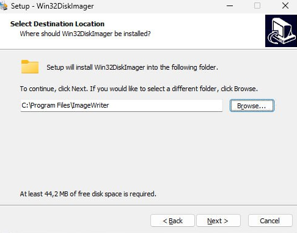
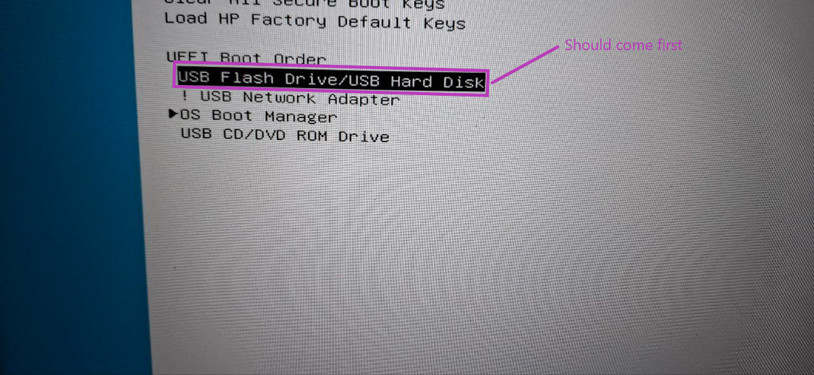

<h1 align="center">
    
    <br />
    Laboratory work with Kali Linux №1
</h1>

#### In this work, I will do lab #1, applying knowledge of Kali Linux. This work is created for the purpose of educational content, as an assignment for the discipline Operating Systems of the Kyiv College of Communications.

Topic of the work: “Introduction to the working environment of virtual machines and features of the Linux operating system”

Objectives:
1. Introduction to various types of hypervisors, virtualization when working with operating systems.
2. Introduction to the main types of modern OSes, a brief overview of their capabilities.

---


#### In this article, I'm going to answer questions about the Kali Linux operating system and simply Linux.

## Before we get started, let's consider such a question as a hypervisor, and what are their types?
A hypervisor is a critical piece of software that makes virtualization possible. It abstracts guest machines and the operating system they run on from the actual hardware. Hypervisors create a layer of virtualization that separates the CPUs, RAM, and other physical resources from the virtual machines you create.

The machine on which we install the hypervisor is called the host machine, as opposed to the guest virtual machines that run on top of it. Hypervisors emulate the available resources so that guest machines can use them. No matter what operating system you load with the virtual machine, it will think that the actual physical hardware is at its disposal.

From the perspective of the virtual machine, there is no difference between the physical and virtualized environments. The guest machines are unaware that the hypervisor created them in a virtual environment, that they are sharing the available computing power. VMs perform actions simultaneously with the hardware on which they run and are therefore completely dependent on its stable operation.


### What are the types of hypervisors?
#### There are basically two main types of hypervisors, but there are also hybrid hypervisors that combine the features of both types.
#### 1) The first type of hypervisor:

Type 1 hypervisors are also called microkernels, thin hypervisors, or standalone hypervisors running on bare metal. Type 1 hypervisors are best thought of as a compact operating system with specific functions that is installed directly on a bare metal server and has the main features of an OS:

- Provides an abstract set of resources for applications instead of an unordered set of hardware;

- Manages a pool of resources, distributing processor time, memory, and input/output devices among programs requesting use of the computer's resources.

Security is one of the main requirements for hypervisors, since they gain full control over the hardware resources on which virtualization is performed. Accordingly, the task of the hypervisor is to safely run machine code, preventing the guest OS from executing commands directly on the host machine or changing resources reserved for other virtual machines.

Type 1 hypervisors include Xen, VMware ESXi, Hyper-V, KVM, and other hypervisors.

#### 2) The second type of hypervisor:
Type 2 hypervisors are also called hosted hypervisors. This type of hypervisor is an additional software layer that sits above the host OS.

These hypervisors run as one of the processes executed by the host OS, most often Linux. In this case, the hypervisor's rights are significantly limited. It manages guest operating systems, while emulation and physical resource management are handled by the host OS.

Oracle VM VirtualBox, VMware Workstation are the most popular type 2 hypervisors.

---

### Now let's review the main components and capabilities of the KVM hypervisor:

KVM is a hypervisor created in October 2006. It was quickly integrated into the mainline Linux kernel 2.6.20. Later, KVM was adopted as a core module in FreeBSD. KVM is completely open source thanks to the GNU GPL and GNU LGPL licenses, so KVM QEMU was used to build SIM-Cloud. Using open source software allows us to modify the hypervisor as needed and remain vendor independent.

| **Component/Capability**             | **Description**                                                                                     |
|--------------------------------------|-----------------------------------------------------------------------------------------------------|
| **Linux kernel**                     | KVM is built into the Linux kernel, it runs as a module (`kvm.ko`).                                 |
| **Hardware virtualization**          | KVM requires Intel VT-x or AMD-V support.                                                           |
| **QEMU**                             | This is an emulator used to run virtual machines.                                                   |
| **libvirt**                          | This is a tool that was created to manage KVM via CLI (`virsh`) or GUI (`virt-manager`).            |
| **VirtIO**                           | These are virtual drivers responsible for increasing the performance of disks, networks, GPUs, etc. |
| **Full virtualization**              | Responsible for launching any guest OS (Windows, Linux, BSD, QNX, etc.).                            |
| **Flexible resource management**     | Allows us to allocate CPU, RAM, network interfaces, and GPU.                                        |
| **Live Migration**                   | Responsible for moving VMs between hosts without stopping their operation.                          |
| **Snapshot and Clone**               | Used to save VM state and quick restore.                                                            |
| **Security**                         | Uses SELinux, AppArmor, sVirt to protect VMs.                                                       |
| **Container support**                | Works with LXC, Docker, Kubernetes.                                                                 |
| **Working in cloud infrastructures** | KVM is used in OpenStack, Proxmox, oVirt.                                                           |

---

## Next, the question I want to answer is the steps for deploying the operating system, namely Kali Linux.
#### PS: I already answered this question in [WORK-CASE 2](https://github.com/MayaEnjoyer/-_WORK-CASE_2/blob/master/guide.md), but I'll repeat the information here anyway.

#### The first thing we need to do is download the Kali Linux installation file.
##### To do this, we need to open the browser and type [kali.org](https://www.kali.org/).


##### Once we get to the official [kali.org](https://www.kali.org/) website, we need to click the Download button. After that, we will be redirected to another page where we need to click on the image of the installer to download the Kali Linux installer image.


##### After we click, we will be redirected here, where we can see the Kali Linux 2024.1 changelog and 64-bit installer.


##### Now we need to check if our PC is 32-bit or 64-bit. And to do this we need to just go to the search bar and search for "system information". And we should see under the system type x64-based PC. If your PC is 32-bit, then you will see this information.


##### Now we know that our PC is 64-bit, and we can click on the 64-bit installer to download. And you can see that the size of this file is about 4.0 gigabytes.


##### The next step that we need to do is to download Win32 Disk Imager and this is what we will use to create the bootable media for the installation.
You can do it by following this link <https://sourceforge.net/projects/win32diskimager/>

##### Clicking on the link will take us to Sourceforge. Then we need to click the "Download" button and the download should start.


##### After downloading the Kali Linux installation file and Win32 Disk Imager, we can close the browser and open the download's folder. So, we have Win32 Disk Imager, and we also have the Kali Linux installation file, now for this installation we will need to take a flash drive, at least 8 gigabytes (I took 128 gigabytes). We will use the flash drive as a boot disk to install Kali Linux. To do this, we need to go back to the downloads folder and install Win32 Disk Imager. We will need to accept the terms for the next installation.

## Conditions to be accepted:
#### 1) We need to agree to the terms of use by selecting the button "I accept the agreement".


#### 2) Next we need to select the download path, and then click the Next button.


#### 3) Then we have a stage with installing a shortcut, I advise you not to change anything and just click the "Next" button.


#### 4) After which we are offered additional tasks that the installation program can perform, since we do not need to create a shortcut on the desktop, we remove the check mark from "Create a desktop shortcut" and click the "Next" button.


#### 5) After that we can proceed to installation by clicking the "Install" button.


#### 6) Finally, after downloading, we need to uncheck the "View README.txt" button and click the "Finish" button.


---

## Launching and Configuring Win32 Disk Imager:
##### After we clicked the Finish button, Win 32 Disk Imager will start. The first thing we need to do is select the ISO file by clicking the Browse icon.


##### By clicking on the "Browse" icon, we need to find a folder for our download, as you can see our Kali Linux installer file is not displayed, in order to see it we need to click on these parameters, which are shown in the photo. After that we need to select the "Points" parameter, after which all our files should be displayed.


##### After these combinations, we can select the Kali Linux installer file we downloaded by clicking the "Open" button.


##### Then we need to select the "Device" that we want to use to create the boot disk. So make sure you select the correct flash drive. You can see that my 128GB flash drive is the E drive, so make sure you select it correctly.


##### Now we can click on the Burn button and then yes, all the data on this flash drive will be erased, and then it will be converted into a bootable disk for Kali Linux. It should take some time to write the necessary data, so be prepared to wait for a while. Once it is successfully written, you need to click OK and close Win32 Disk Imager.


---

## Disk partition:
##### Now we need to partition the disk into sections where we want to install Kali Linux. To do this, we need to go to the search line and find the "Disk Management" section and left-click. Then we need to click on “Create and format hard disk partitions”. After that we can see a list of all the hard disks on our PC, if you look closely you will see Disk Zero and Disk One. These two different disks are combined into one disk, which if I check it on my PC, I can see a backup of almost 400 GB, which is two disks of almost 200 GB each.


##### Now we can decide to partition Kali Linux next to Windows 10 right here by right-clicking and selecting Shrink Volume and then specifying the amount of storage we want to shrink and which we will use for the installation. In your case, you may have more than 500 gigabytes that you can allocate for Kali Linux. But I recommend allocating at least 50-60 GB, in my turn I saw 100 GB.


---

## BIOS Setup and Kali Linux Installation from Flash Drive:
##### After all our operations have been completed, we need to restart the computer and during the system restart press F10 or F11, it all depends on the system you are using, for me it was the F10 key combination.
After completing this action, we get into the BIOS, where we need to go to the "Boot Options" section, in which we need to put USB Flash Drive/USB Hard Disk boot in first place



##### After completing all the steps correctly, you will need to press F10 to save everything and reboot the system. Attention, if you do not have a flash drive connected during this process, then you will not succeed!!!! If you did everything according to the instructions, then you will see a Kali Linux window in which you can set up your personal account, these settings will include setting up personal data, connecting Wi-Fi and installing graphical desktops such as GNOME and others. After this, you will already fully log into the Kali Linux system in which you can already customize everything for yourself, design, programs, music, video, everything of your choice.

## The next question I want to answer is, are there any hardware limitations when installing 32- and 64-bit OSes?

We all know that the chip is the most important component of a computer. It is a kind of brains of the PC. The processor operates on data that needs to be processed, controls external devices, sends them commands, receives data and interacts with memory. All addresses and instructions during processor execution need to be stored somewhere, but not in RAM, since addresses in RAM also need to be stored somewhere.

A processor chip is needed to solve problems. In 32-bit processors, the cell size is 32 bits. In 64-bit architecture chips, the size is 64. The larger the cell, the more data it can hold.

Chips on 32-bit architecture are limited in that they can only receive addresses within the 2^32 power. A larger address simply will not fit into a cell. You will feel this feature especially acutely with regard to RAM. Since only 2^32 bits or 4 GB of memory are within these limits, and if it is higher, then the chip without special emulation from the OS will not be able to cope with the task.

A chip with a register size of 64 bits is already oriented to work with addresses within 2^64. If we translate this value into the usual format for us, we will see that this is 1 billion GB. An interesting fact is that no modern OS is able to support such an amount of RAM. Even the popular Linux is not designed for this.

But these are not all the differences. During one process, a chip with a x32 bit system can process 32 bits or 4 bytes of data, 1 byte is equal to 8 bits. If the data size exceeds 4 bytes, the chip will have to simultaneously execute several cycles to process it. If the chip is 64-bit, the size of the data to be processed will double and will be equal to 8 bytes. And this despite the fact that this size will be larger than 8 bytes. The chip will need to spend less time on solving the task - data processing.

From this we can see that the 64-bit and 32-bit architectures are very different from each other, and primarily in that 64-bit is more optimized, designed for the latest equipment, multitasking, productive and productive work. Today, all chips work in 64-bit mode, but support 32-bit for compatibility in emulation mode.

---

## The next question I want to cover is what are the main steps in installing a Kali Linux in text mode?
#### To install Kali Linux in text mode, we need to follow the same basic steps as in the graphical version, but the implementation will be done through a text-based interface.

### Basic steps to install Kali Linux in text mode:

#### 1) The first thing we need to do is download the Kali Linux image, this can be done from their main website [kali.org](https://www.kali.org/get-kali/#kali-platforms).

#### 2) The second thing we need to do is create a bootable media.

To do this, we need to burn the image to a USB drive using the following methods:
- [Rufus (Windows)](https://rufus.ie/en/).
- [balenaEtcher](https://etcher.balena.io/).
- dd (Linux, via terminal)

For the latter method, we will need to use the following command: `sudo dd if=kali-linux.iso of=/dev/sdX bs=4M status=progress`, where sdX is our USB drive.

#### 3) The next thing we need to do is boot from USB/ISO.
After we have booted the system from the flash drive, we need to select it in BIOS/UEFI or via Boot Menu, and then select "Install" (not "Graphical Install") from the boot menu.

#### 4) Next we need to select the keyboard language.

#### 5) After we have selected the correct languages, we need to configure the network.

To do this, we need to specify the hostname, for example, mine is mayaenjoyer. Also, if we have a proxy server, we need to enter it, or leave the field empty.

#### 6) Next we need to set up an account.
To do this we need to specify the root password.

#### 7) The next thing we need to do is to partition the disks.

- We can use **Guided - use entire disk** it will automatically create partitions on the disk.
- We can also use **Manual** it is needed to manually configure the partitions (`/`, `/home`, `swap`, etc.).

#### 8) Next, we have the installation of the base system:

We need to wait until the system installs all the basic components, after which we will have to choose a mirror server to update the packages.

#### 9) Next, we need to install the GRUB bootloader.

To do this, we need to select `Yes` to install GRUB to the master boot record (`/dev/sda`).
If you are using UEFI, the system may install GRUB-EFI automatically.


#### 10) After all the manipulations, we are left with the installation and reboot.

To do this, we need to remove the USB drive and reboot the system using the command: `reboot`, after which we only have to boot into the Kali Linux system.

---

## The next question I want to address is how to install graphical shells, namely Gnome and KDE, for Kali Linux.

#### Before installing any graphical shell, we need to update the list of all available packages, this can be done using the command: `sudo apt update && sudo apt upgrade -y`.

To install the GNOME interface, we need to use the following command: `sudo apt install -y kali-desktop-gnome`.

After installing the GNOME interface, we need to reboot the system using the following command: `reboot`.

If after rebooting the system does not start the graphical interface, then we do not need to execute the following commands:
```
sudo systemctl set-default graphical.target
sudo systemctl reboot
```

To install the KDE Plasma interface, we need to use the following command: `sudo apt install -y kali-desktop-kde`.
After installing the KDE Plasma interface, we also need to reboot the system using the command: `reboot`.
If it turns out that our system boots in text mode, then we need to enable the default graphical mode using the following commands:
```
sudo systemctl set-default graphical.target
sudo reboot
```
---

## Next, let's look at the characteristics of the two graphical interfaces, KDE and Fluxbox:

- KDE is one of the most powerful desktop environments on Linux, featuring special visual effects and a host of other handy features. KDE can often seem a bit confusing to beginners, but the various ways to customize its appearance and the number of different customization options make it one of the coolest and most beautiful desktop environments.


- Fluxbox is a lightweight and fast Linux GUI environment. It is based on Blackbox and is known for its minimalist design and high performance. Fluxbox is ideal for older or weak machines, as it consumes minimal resources. Its configuration is done through text files, giving users flexibility in customizing the interface and menus.

#### Comparative characteristics of KDE and Fluxbox:

| **Characteristic**                            | **KDE**                                                      | **Fluxbox**                                       | 
|-----------------------------------------------|--------------------------------------------------------------|---------------------------------------------------|
| **Environment type**                          | A full-fledged desktop environment                           | Minimalist window manager                         | 
| **Main feature**                              | The presence of many functions, effects, beautiful animation | Light, fast, minimalistic                         | 
| **Resource usage**                            | Requires more RAM and CPU                                    | Suitable for weak PCs                             | 
| **Flexibility of settings**                   | Has a lot of GUI settings                                    | Settings are made via text files                  | 
| **Ease of use**                               | Intuitive, but can be overwhelming for beginners             | Easy to use, but requires manual setup            |
| **Graphic effects**                           | Has a powerful, effective design                             | Has a minimal set of effects                      | 
| **Speed of work**                             | Usually the speed depends on the iron                        | Usually very fast                                 | 
| **Compatibility with other programs**         | Supports many KDE applications                               | Supports any X11 applications                     |
| **Ideal type of use**                         | For productive work, users who love a beautiful interface    | For weak PCs, minimalists, hackers and developers |


---

### Answers to the control questions:

#### 1) Comparison of type 1 and type 2 hypervisors, what is the difference between them and their scope of application?

As we already know from the previous tasks, a hypervisor is a software shell that allows for the redistribution of hardware resources, management of virtual machines, their isolation and provides virtualization technology. Basically, it isolates the hardware resources of our computer, mainframe or server and isolates virtual machines from each other.
So, let's look at the second type of hypervisor - this is a hypervisor that is installed on top of an existing operating system. This existing operating system is called a host operating system. It is important to note that the interaction occurs directly through our host operating system. This requires additional performance resources, and, accordingly, the overall performance of such a system and such a hypervisor is somewhat lower than that of the first type of hypervisor, when our virtual machine or virtual machine monitor is installed on the physical server itself and acts as an operating system.

The second type of hypervisor supports the operation of virtual machines, interaction with the central processor, storage media, storage devices, i.e. with RAM and the network interface controller via the host operating system.

It is important to know that the guest operating system never has to know what type of hypervisor is used, since the host operating system is inaccessible to it in principle. It interacts with the hypervisor, but has no idea what virtualization architecture is used in this case. As we already know, the hypervisor interacts via the host operating system with the components of our hardware. It also virtualizes machines, creating, for example, three virtual machines. Each of them has its own guest operating system, which does not suspect that it is working within a virtual machine, and has no idea what type of hypervisor is used here.
Classic examples of the second type of hypervisors are VirtualBox, VMware Workstation and others.

Now let's talk about the first type of hypervisor, as we already know, the first type of hypervisor is a hypervisor that is installed on top of the hardware as an independent operating system kernel. Why is it called "kernel"? Because in essence, the monitor will be an operating system, although not as large, not as full-fledged as Windows, FreeBSD or Solaris. It is simply a nano-kernel - a small operating system kernel with the necessary components that allow interaction with hardware, such as drivers.

The first type of hypervisor requires a console to configure the work. You can interact with virtual machines using a web interface, various technologies or through the console.
Examples of the first type of hypervisors are Microsoft Hyper-V, VMware ESXi, Xen and KVM, which is a modification of the Linux operating system kernel.
The advantage of the first type of hypervisor is the fact that it is used much more often mainly due to better performance and the lack of need for a host operating system.

Now let's look at the advantages of the second hypervisor. The advantages of type two hypervisors include their low cost, availability and convenience. That is, the user can launch the second type hypervisor on virtually any computer and immediately emulate a virtual machine, start working, testing software or training.
But such hypervisors are not used in practice for serious tasks. In real infrastructures, it is the first type hypervisors that are used, since they are more productive, do not require a host operating system and are easier to maintain.

---

#### 2) What is the "GNU GPL" and what is its basic concept?
The General Public License (GPL) is one of the most popular and well-known open source software licenses. It was developed by the Free Software Foundation and is designed to protect users' rights to freely use, distribute, and modify software.

The main terms of the GNU GPL are:

- Freedom to use. Users are free to use the software for any purpose, including commercial use.

- Freedom to distribute. Users are free to distribute the software in any form, including source code and binaries, provided that copies of the GNU GPL are included with all copies of the software.

- Freedom to modify. Users are free to modify the software and distribute modified versions, provided that copies of the GNU GPL are included with all copies of the software and that all derivative works are released under the same license.

- Control of changes. Any changes to the software must be released under the same GNU GPL.

- Disclaimer. The GNU GPL is provided "as is", without any warranties or obligations on the part of the authors of the software.

- Source code requirement. If the software is distributed as a binary file, users must be able to access the source code of the software.

The GNU GPL protects the rights of users to freely use, modify, and distribute software. The license also allows the user to use the software commercially, provided that he complies with the terms of the license. However, due to its strictness, the GNU GPL may not be suitable for all projects and business models.

I can also say that the GNU GPL uses the concept of copyleft. This means that any derivative software that uses code licensed under the GNU GPL must also be distributed under the same license. That is, even if a company or developer changes the code, they are required to provide users with access to its source codes under the same terms.

GNU GPL versions:

- GPLv1 (1989)

- GPLv2 (1991)

- GPLv3 (2007)

---

#### 3) The essence of open source software:

Open source software is software whose code is available to all users. This means that any user can view and modify the code of such a program.
The process of creating open source software can differ from traditional software, which is created in compliance with the principles of confidentiality.

Open source software has many advantages. Among them is the possibility of collaborative work on the code of such software products. This means that such programs can be improved by making changes to the source code as a result of collective work. Thanks to this approach, this can lead to faster development of the program and improvement of its functionality. An additional advantage of such applications is their flexibility, which is also achieved due to the possibility of changes in such applications. One of the main advantages of open source software is that they are usually of high quality and reliability.

Another advantage of open source software is security. Thanks to the open code, these programs can be checked for potential security issues that can be used by attackers to invade the system. Once vulnerabilities are found, they can be quickly fixed and the application’s security improved.

In addition, open source applications are usually free, making them accessible to anyone.

---

#### 4) What is a distribution?
In the context of Linux and other open source operating systems, the term "distribution" is used to refer to a specific version or distribution of the Linux operating system, which consists of the Linux kernel, operating system components including the file system, a desktop environment, utilities, and additional software.

A Linux distribution includes software packages that are assembled, configured, and organized together to form a functional operating system. Each distribution may have its own unique features, such as the choice of default desktop environment (e.g., GNOME, KDE, Xfce), package management methods, system configuration, and other details.

---

#### 5) What system administration tasks can be implemented using Linux OS?
Linux-based system administration covers a fairly wide range of tasks aimed at ensuring stable and secure system operation.

The main ones include:

- System installation and configuration: Choosing a suitable Linux distribution, installing the operating system on a server or workstation, configuring network settings, installing necessary updates and software.

- User and access rights management: Creating and administering user and group accounts, setting access rights to files and directories, ensuring system security by restricting access to critical resources.

- Monitoring and logging: Tracking system status, monitoring resource usage (processor, memory, disk space), analyzing system logs to identify and eliminate potential problems.

- Data backup and recovery: Planning and performing regular backups of important data, using backup tools such as rsync, tar, dd, and testing recovery procedures to ensure data integrity.

- Software Package Management: Use package managers such as apt, yum, or dnf to install, update, and remove software, and ensure that installed packages are up-to-date and secure.

- Task Automation: Set up automatic execution of regular tasks using task schedulers such as cron or at, and create scripts to automate routine processes.

- System Security: Set up a firewall to protect against unauthorized access, install and configure security monitoring tools such as fail2ban or logwatch, and set up secure access to the system via SSH.

- Network Management: Configure network interfaces, configure DNS and DHCP clients, diagnose network problems, and ensure stable network connectivity.

- File System and Disk Space Management: Create and mount file systems, manage disk partitions, set disk space quotas for users, and monitor disk health.

- Installation and configuration of server services: Deployment and configuration of web servers (e.g. Apache or Nginx), databases (MySQL, PostgreSQL), mail servers (Postfix), and other services according to the needs of the organization.

#### 6) How are Android and Linux OS related?
There is really only one argument in favor of classifying Android as Linux: every smartphone or tablet running Android contains the Linux kernel. We can even see which version of the kernel is installed on our device.
However, Android is not just a Linux kernel; it is a fully functional operating system that contains additional libraries, a graphical interface, applications, and much more.

#### Android vs Linux comparison.
#### Main differences:

|                           | Android                                                                                                                                                | Linux                                                                                                                                                                                     |
|---------------------------|--------------------------------------------------------------------------------------------------------------------------------------------------------|-------------------------------------------------------------------------------------------------------------------------------------------------------------------------------------------|
| **Software Type**         | Operating System.                                                                                                                                      | Kernel.                                                                                                                                                                                   |
| **Data Channel**          | Optimized for mobile networks.                                                                                                                         | Optimized for Ethernet and Wi-Fi.                                                                                                                                                         |
| **Reasons for Creation**  | Make mobile devices "smart", competition with iOS.                                                                                                     | Research goals in the field of software development, as well as the desire to create free open source software.                                                                           |
| **Monetization Method**   | Promotion of Google products, monthly payment for services and commissions from the sale of applications/movies/books and other things on Google Play. | Most distributions are supported by the community and non-profit organizations. The main source of income for commercial organizations is paid technical support for corporate customers. |
| **License Type**          | Apache License.                                                                                                                                        | GNU GPL v2.0.                                                                                                                                                                             |
| **Main device type**      | Smartphones, tablets.                                                                                                                                  | Personal computers and servers.                                                                                                                                                           |
| **Ease of use**           | Easy to use.                                                                                                                                           | Difficulty varies depending on the chosen distribution. But it is worth noting that the initial difficulty is many times greater than the difficulty of using Android.                    |
| **Developer and support** | Google.                                                                                                                                                | Commercial and non-commercial companies and organizations, communities of developer enthusiasts around the world.                                                                         |


#### Now let's look at the technical differences between Android and Linux:

|                                 | Android                                                                            | Linux                                                                                         |
|---------------------------------|------------------------------------------------------------------------------------|-----------------------------------------------------------------------------------------------|
| **Processor Architecture**      | ARM.                                                                               | x86 and x64.                                                                                  |
| **Userspace**                   | Android Runtime (modified Java Runtime Environment) and Core libraries.            | Mostly GNU and X Window System.                                                               |
| **Kernel Optimization**         | Optimized for low power consumption.                                               | Balance between performance and power consumption.                                            |
| **Terminal Access (shell)**     | Usually blocked, root access is required to be able to interact with the terminal. | Out of the box access, as the terminal is an extremely important part of Linux distributions. |
| **GUI Framework**               | Google SurfaceFlinger on top of OpenGL.                                            | Most distributions use a GUI based on the X Window System.                                    |
| **Main architectural elements** | Only the kernel, HAL and a non-GNU userspace and its own desktop environment.      | Kernel, HAL, GNU user space (applications), and user interface layer (desktop environment).   |
| **Hardware drivers**            | Almost all drivers are proprietary.                                                | Most drivers are provided as open source.                                                     |
| **Bootloader**                  | A simple bootloader that does the bare minimum and passes control to the kernel.   | Standardized bootloaders, similar to GRUB2, with customization options.                       |
| **BIOS/EFI**                    | Not available on ARM devices.                                                      | Standard for all x86/x64 motherboards.                                                        |
| **C library**                   | A lightweight version of the standard library, Bionic.                             | GNU C library (glibc).                                                                        |

So we can say that if we define a “Linux distribution” as an operating system that includes the Linux kernel and meets one or more additional criteria, then Android is a completely different OS. While every Android smartphone and tablet includes the Linux kernel, Android does not fully meet any of the other characteristics typically associated with Linux distributions. For example, Android is clearly a product of a single company, it is incompatible with common Linux applications, and, although the AOSP source code is open, the version of Android that is installed on commercial devices seems much more closed than one would expect from a Linux distribution, due to the inclusion of a large amount of proprietary code.

However, if we look at it from the other side, that a Linux distribution is an operating system that is based on the Linux kernel, then Android is a Linux distribution. It may be an unusual, highly specialized distribution, but it is the same distribution as Ubuntu, Fedora, Debian, and any other operating system that is based on the Linux kernel.

---

#### 7) What are the main features and scope of use of Embedded Linux?
Embedded is a technology that allows you to create software systems that are built into other devices, such as industrial equipment, cars, smartphones, drones, etc.

The key idea is that a computer system is inside another device and controls its operation. A kind of perfect fusion and interaction between hard and soft. This can be a simple controller that can perform basic calculations and function for a year on a single battery, or large integrated systems that can accommodate several computers, operating systems and SoC (System on Chip), specially designed to perform tasks in a particular industry.

Gaming fans are well familiar with embedded technologies. For example, virtual reality (VR) gadgets contain motion sensors and special software that immerses users in a virtual world and allows them to interact with it. PlayStation VR or Oculus Rift use built-in motion sensors and a camera to track the user's movements and position in space.
The use of embedded developments is not limited to the sphere of entertainment and leisure. They can also (and should) be used as part of an automated production system in various industries.
The following markets come to mind first of all: food industry, automobiles, municipal infrastructure, agriculture, mechanical engineering, data exchange devices, medicine and pharmaceuticals. Let's consider some of them in more detail:

- Food industry. The food production process consists of many not very simple stages. At each of them, the enterprise needs to monitor product quality, comply with sanitary norms, legislative and industry standards. This is where embedded developments come into play.

- Municipal infrastructure. Smart parking is a vivid example of embedded development. Thanks to sensors, computer vision and data analysis functions, it is possible to provide multifunctional monitoring of car traffic in parking lots, as well as control over free parking spaces.

- Agriculture. Embedded developments have been used by farmers and agrarians for many years. Thanks to sensors in the soil and equipment connected to the Internet of Things, it is possible to measure soil moisture, temperature, the amount of light and other parameters necessary for the effective cultivation of crops.

- Medicine. Embedded systems are increasingly used in the medical industry, in particular in medical technology. Microcontrollers and microprocessors are used in medical devices such as electrocardiographs, ventilators, insulin pumps, medical scanners and others.

---

#### 8) How can I change the way Linux boots: text mode or graphical? What is the difference between CLI and GUI modes?
In Linux, we can change the boot type between text mode (CLI) and graphical mode (GUI), we can do this by changing `target` (for systemd) or `runlevel` (for older systems).

1) Temporary change (for the current session):
This change is only valid until the system is rebooted, to switch to text mode (CLI), we need to use the following commands:
```
sudo systemctl set-default multi-user.target
sudo reboot
```

2) Permanent change (after reboot):
To change the boot mode permanently, we need to change the default `target`, to set text mode as the default we need to use the following command:`sudo systemctl set-default multi-user.target`, this will force the system to boot without a graphical interface. After that, we need to set the graphical mode as the default, we will do this using the following command: `sudo systemctl set-default graphical.target`, after which our system will boot with the default GUI.

3) For old systems without systemd (SysVinit, Upstart):
To change the mode, you need to edit the `/etc/inittab` file and change the following line:
```
id:3:initdefault: (CLI mode)
id:5:initdefault: (GUI mode)
```
After that, we only have to save the file and reboot the system.

4) Booting in the desired mode via GRUB:
If we need to change the mode only once during boot, then we need to press `Shift` or `Esc` when starting the system to enter the GRUB menu, after which we need to select the preferred Linux kernel and press `e` to edit the parameters. Next, we need to find the line that starts with `linux` or `linuxefi` and add to the end:
- `3` (for text mode)
- `5` (for graphical mode)
After which we just have to press Ctrl + X or F10 to boot.


#### CLI and GUI comparison:

| BASIS                     | COMMAND LINE INTERFACE (CLI)                                                    | GRAPHIC USER INTERFACE (GUI)                                              |
|---------------------------|---------------------------------------------------------------------------------|---------------------------------------------------------------------------|
| **Definition**            | Interaction is by typing commands                                               | Interaction with devices is by graphics and visual components and icons   |
| **Understanding**         | Commands need to be memorized                                                   | Visual indicators and icons are easy to understand                        |
| **Memory**                | Less memory is required for storage                                             | More memory is required as visual components are involved                 |
| **Working Speed**         | Use of keyboard for commands makes CLI quicker                                  | Use of mouse for interaction makes it slow                                |
| **Resources used**        | Only keyboard                                                                   | Mouse and keyboard both can be used                                       |
| **Accuracy**              | High                                                                            | Comparatively low                                                         |
| **Flexibility**           | Command line interface does not change, remains same over time                  | Structure and design can change with updates                              |
| **Learning Curve**        | Steeper, requires knowledge of commands and syntax                              | Easier for beginners due to visual representation                         |
| **Efficiency**            | More efficient for complex tasks and automation                                 | Less efficient for repetitive tasks without automation                    |
| **Use Cases**             | System administration, programming, automation                                  | General user tasks, document editing, web browsing, multimedia            |

THIS IS WHERE THE LAB WORK ENDS, SO I WISH YOU SUCCESS IN LEARNING LINUX, DON'T FORGET TO ENJOY THE LITTLE THINGS AND REMEMBER THAT LOVE WILL HELP YOU OVERCOME ALL DIFFICULTIES!!!


